# Road Rules 2014

[2014-758]

# Status Information

# Currency of version

Current version for 9 May 2025 to date (accessed 7 August 2025 at 15:18)

Legislation on this site is usually updated within 3 working days after a change to the legislation.

# Provisions in force

The provisions displayed in this version of the legislation have all commenced.

# Notes—

Does not include amendments by   
Rule 262–15 of these Rules (Rule 262–15 repeals Part 15–1 and the Dictionary, definitions of electric   
scooter and share scheme on 23.1.2026)

• See also Road Rules Amendment (Helmets — Sikh Exemption) Bill 2024 [Non-government Bill — Ms C M Faehrmann, MLC] Road Transport Legislation Amendment (Post-Crash Drug and Alcohol Testing) Bill 2025 Statute Law (Miscellaneous Provisions) Bill 2025

# Authorisation

This version of the legislation is compiled and maintained in a database of legislation by the Parliamentary Counsel's Office and published on the NSW legislation website, and is certified as the form of that legislation that is correct under section 45C of the Interpretation Act 1987.

File last modified 9 May 2025

# Road Rules 2014

# Contents

Part 1 Introductory.. .23

Division 1 General. 23

1 Name of Rules .23

2 Commencement . . 23

3 Objects of these Rules . 23

# Division 2 Some features of these Rules. .23

4 Definitions—the Dictionary etc . . 23   
5 Diagrams .... . 24   
6 Examples . . 24   
7 Australian Road Rule not reproduced . 24   
8 Notes ... . 25   
9 Australian Road Rule not reproduced . 25   
10 Australian Road Rule not reproduced . . 25   
10–1 NSW rule: determination of criminal responsibility . . 25   
10–2 NSW rule: penalties and disqualifications for speeding offences . . 26

Part 2 Application of these Rules . .29

# Division 1 Roads and road related areas . 29

11 Rules apply to vehicles and road users on roads and road related areas . 29

12 What is a road . .29

13 What is a road related area . .30

# Division 2 Road users and vehicles . . 30

14 Road users.. .30   
15 What is a vehicle . .31   
16 Who is a driver . . 31   
17 Who is a rider . . 31   
18 Who is a pedestrian. . 32   
19 References to driver includes rider etc.. . 32

# Part 3 Speed limits. . 32

20 Obeying the speed limit . 32   
21 Speed limit where a speed limit sign applies. .33   
21–1 NSW rule: school bus stop zone sign is speed limit sign . . 35   
22 Speed limit in a speed limited area .. . 36   
23 Speed limit in a school zone . . 37   
24 Speed limit in a shared zone . . 38   
24–1 NSW rule: speed limits for learner and provisional licence holders.. .39   
24–2 NSW rule: speed limit on Lord Howe Island.. .... 40   
24–3 NSW rule: speed limit when bus displaying when lights flash speed limit sign.. ...40   
24–4 NSW rule: speed limits for small motor bikes during periods of darkness . .41   
25 Speed limit elsewhere . . 42   
25–1 NSW rule: drivers to which Part does not apply . .43

# Part 4 Making turns .43

# Division 1 Left turns . .43

26 Application of Division to roundabouts, road related areas and adjacent land. ..43   
27 Starting a left turn from a road (except a multi-lane road) . . 44   
28 Starting a left turn from a multi-lane road . . 45   
29 Making a left turn as indicated by a turn line . 48

# Division 2 Right turns. . 50

30 Application of Division to certain right turns .... . 50   
31 Starting a right turn from a road (except a multi-lane road). . 51   
32 Starting a right turn from a multi-lane road. . 52   
33 Making a right turn . . 55

# Division 3 Hook turns at intersections .57

34 Making a hook turn at a hook turn only sign . . 57   
35 Optional hook turn by a bicycle rider.. . 58   
36 Bicycle rider making a hook turn contrary to no hook turn by bicycles sign .60

# Division 4 U-turns . 61

# Note.. . 61

37 Beginning a U-turn . . 61   
38 Giving way when making a U-turn.... .61   
39 Making a U-turn contrary to a no U-turn sign . . 62   
40 Making a U-turn at an intersection with traffic lights. . 63   
41 Making a U-turn at an intersection without traffic lights. . 63   
42 Starting a U-turn at an intersection . . 64   
43 Making a U-turn at certain crossings . . 64   
43A Making a U-turn on a road related area with traffic lights . .. 65

# Part 5 Change of direction and stop signals .65

# Division 1 Change of direction signals . 65

44 Division does not apply to entering or leaving a roundabout, lane filtering or repositioning...........65   
45 What is changing direction .... ..... 65   
46 Giving a left change of direction signal . . 67   
47 How to give a left change of direction signal. . 68   
48 Giving a right change of direction signal .. . 68   
49 How to give a right change of direction signal . . 68   
50 How to give a right change of direction signal by giving a hand signal. .69   
51 When use of direction indicator lights permitted. . 69

# Division 2 Stop signals. . 69

52 Division does not apply to bicycle riders or certain tram drivers.. 69   
53 Giving a stop signal . 70   
54 How to give a stop signal . 70   
55 How to give a stop signal by giving a hand signal. 70

# Part 6 Traffic lights, traffic arrows and twin red lights.. .71

# Division 1 Obeying traffic lights and traffic arrows . .71

Note 1.. .... 71   
Note 2...... ..... 71   
Note 3.. .... 71   
56 Stopping for a red traffic light or arrow . . 71   
57 Stopping for a yellow traffic light or arrow.. . 73   
58 Exceptions to stopping for a red or yellow traffic light . ... 75   
59 Proceeding through a red traffic light ... .. 75   
60 Proceeding through a red traffic arrow . . 76   
60A Proceeding through a bicycle storage area before a red traffic light or arrow.. ..76   
61 Proceeding when traffic lights or arrows at an intersection change to yellow or red. ..77

# Division 2 Giving way at traffic lights and traffic arrows. .78

# Note. 78

62 Giving way when turning at an intersection with traffic lights.. . 78   
63 Giving way at an intersection with traffic lights not operating or only partly operating. ..80   
64 Giving way at a flashing yellow traffic arrow at an intersection . .. 81   
65 Giving way at a marked foot crossing (except at an intersection) with a flashing yellow traffic light   
82

# Division 3 Twin red lights (except at level crossings) .83

66 Stopping for twin red lights (except at level crossings) .83

Part 7 Giving way . .83

Note 1. . 83

Note 2.. . 84

# Division 1 Giving way at a stop sign, stop line, give way sign or give way line applying to the driver

. 84

Note.. . 84

67 Stopping and giving way at a stop sign or stop line at an intersection without traffic lights. ...84   
68 Stopping and giving way at a stop sign or stop line at other places... .86   
69 Giving way at a give way sign or give way line at an intersection (except a roundabout) . .88   
70 Giving way at a give way sign at a bridge or length of narrow road.. .90

71 Giving way at a give way sign or give way line at other places. .91

# Division 2 Giving way at an intersection without traffic lights or a stop sign, stop line, give way sign or give way line applying to the driver

92

Note.. . 92

72 Giving way at an intersection (except a T-intersection or roundabout) . .92   
73 Giving way at a T-intersection . .96

# Division 3 Entering or leaving road related areas and adjacent land......100

74 Giving way when entering a road from a road related area or adjacent land. ..100   
75 Giving way when entering a road related area or adjacent land from a road. .101

# Division 4 Keeping clear of and giving way to particular vehicles.............103

76 Keeping clear of trams travelling in tram lanes etc . .103   
77 Giving way to buses .. . 104   
78 Keeping clear of police and emergency vehicles .. .105   
78–1 NSW rule: Approaching or passing stationary emergency response vehicles . .105   
79 Giving way to police and emergency vehicles.. .107   
79–1 NSW rule: interfering or interrupting funeral cortege or authorised procession . .107   
79–2 NSW rule: precedence at ferries, punts, bridges or railway crossings.. .108

# Division 5 Crossings and shared zones. .109

80 Stopping at a children’s crossing..... .109   
81 Giving way at a pedestrian crossing. .111   
82 Overtaking or passing a vehicle at a children’s crossing or pedestrian crossing. .113   
83 Giving way to pedestrians in a shared zone . .114

# Division 6 Other give way rules. .114

84 Giving way when driving through a break in a dividing strip..... .114   
85 Giving way on a painted island.. . 116   
86 Giving way in median turning bays . . 117   
87 Giving way when moving from a side of a road or a median strip parking area. .118

Part 8 Traffic signs and road markings. 119

Note 1. . 119

Note 2. 120   
Note 3.. . 120

# Division 1 Traffic signs and road markings at intersections and other places

# 120

Note. 120   
88 Left turn signs.... . 120   
89 Right turn signs .. . 121   
90 No turns signs. . 121   
91 No left turn and no right turn signs . . 122   
92 Traffic lane arrows . . 123

# Division 2 Traffic signs and road markings generally . 124

93 No overtaking or passing signs.. . 124   
94 No overtaking on bridge signs. . 125   
95 Emergency stopping lane only signs .. .. 126   
96 Keep clear markings .. . 127   
97 Road access signs . . 127   
98 One-way signs . . 129   
99 Keep left and keep right signs .. ... 130   
100 No entry signs ..... . 131   
101 Hand-held stop signs ... .. 131   
101A Safety ramp and arrester bed signs .132

# Division 3 Signs for trucks, buses and other large vehicles. .132

102 Clearance and low clearance signs.. .132   
103 Load limit signs.. . 133   
104 No trucks signs . . 134   
105 Trucks must enter signs. . 135   
106 No buses signs . . 135   
107 Buses must enter signs . . 136   
108 Trucks and buses low gear signs . . 136

# Part 9 Roundabouts 137

# 109 What is a roundabout . .137

110 Meaning of halfway around a roundabout . .138

111 Entering a roundabout from a multi-lane road or a road with 2 or more lines of traffic travelling in the same direction

112 Giving a left change of direction signal when entering a roundabout . .143

113 Giving a right change of direction signal when entering a roundabout .. .143

114 Giving way when entering or driving in a roundabout. .144

116 Obeying traffic lane arrows when driving in or leaving a roundabout . .145

17 Giving a change of direction signal when changing marked lanes or lines of traffic in a roundabout

118 Giving a left change of direction signal when leaving a roundabout .. ..146   
119 Giving way by the rider of a bicycle or animal to a vehicle leaving a roundabout. ..147

# Part 10 Level crossings.. 147

120 What is a level crossing . . 147   
121 Stopping and giving way at a stop sign at a level crossing .. .148   
122 Giving way at a give way sign or give way line at a level crossing.. .148   
123 Entering a level crossing when a train or tram is approaching etc. .149   
124 Leaving a level crossing . . 149

# Part 11 Keeping left, overtaking and other driving rules . .150

# Division 1 General. .150

125 Unreasonably obstructing drivers or pedestrians . .150   
126 Keeping a safe distance behind vehicles . .150   
127 Keeping a minimum distance between long vehicles . .150   
128 Entering blocked intersections . . 151   
128A Entering blocked crossings.. . 151

# Division 2 Keeping to the left . .152

129 Keeping to the far left side of a road . .152   
130 Keeping to the left on a multi-lane road . .. 152   
131 Keeping to the left of oncoming vehicles.. .155   
132 Keeping to the left of the centre of a road or the dividing line . .156   
133 Exceptions to keeping to the left of the centre of a road. .159   
134 Exceptions to keeping to the left of a dividing line. .160   
135 Keeping to the left of a median strip . .163   
136 Driving on a one-way service road . .164   
137 Keeping off a dividing strip.. . 165   
138 Keeping off a painted island . . 166   
139 Exceptions for avoiding obstructions on a road. .167

# Division 3 Overtaking . .168

140 No overtaking unless safe to do so. .168   
141 No overtaking etc to the left of a vehicle.. .169   
142 No overtaking to the right of a vehicle turning right etc .170   
143 Passing or overtaking a vehicle displaying a do not overtake turning vehicle sign ..170   
144 Keeping a safe distance when overtaking . .172   
144–1 NSW rule: keeping a safe distance when passing bicycle rider.. .172   
144–2 NSW rule: exceptions for passing bicycle rider . .173   
145 Driver being overtaken not to increase speed. .174

# Division 4 Driving in marked lanes or lines of traffic. .174

146 Driving within a single marked lane or line of traffic . .174   
147 Moving from one marked lane to another marked lane across a continuous line separating the lanes . 175   
148 Giving way when moving from one marked lane or line of traffic to another marked lane or line of traffic .... 176   
148A Giving way when moving within a single marked lane. .178   
149 Giving way when lines of traffic merge into a single line of traffic . ..178   
150 Driving on or across a continuous white edge line . .179   
151 Riding a motor bike or bicycle alongside more than 1 other rider .. .180   
151A Lane filtering between vehicles on a motor bike. .181

# Division 5 Obeying overhead lane control devices applying to marked lanes

# 183

152 Complying with overhead lane control devices . .183

# Division 6 Driving in marked lanes designated for special purposes.......184

153 Bicycle lanes.. . 184   
154 Bus lanes . . 185   
154A Bus only lanes . . 186   
155 Tram lanes ... . 188   
155A Tramways ... . 190   
156 Transit lanes . . 192   
157 Truck lanes . . 193   
157–1 NSW rule: T-Way lanes . . 194   
158 Exceptions to driving in special purpose lanes etc . .195   
159 Marked lanes required to be used by particular kinds of vehicles . .197

# Division 7 Passing trams and safety zones. 199

# Note.. 199

160 Passing or overtaking a tram that is not at or near the left side of a road ..199   
161 Passing or overtaking a tram at or near the left side of a road.. .199   
162 Driving past a safety zone.. . 200   
163 Driving past the rear of a stopped tram at a tram stop... .200   
164 Stopping beside a stopped tram at a tram stop . .201   
164A Staying stopped if a tram comes from behind a stopped driver and stops .. .202

# Part 12 Restrictions on stopping and parking . .203

# Division 1 General. .203

Note 1. . 203

Note 2.. . 203

165 Stopping in an emergency etc or to comply with another rule. .203

166 Application of Part to bicycles.. .204

# Division 2 No stopping and no parking signs and road markings . ...204

Note 1. . 204   
Note 2.. . 204   
167 No stopping signs . . 204   
167–1 NSW rule: taxis stopping in Central Sydney Taxi Zone.. .205   
168 No parking signs. . 206   
168–1 NSW rule: restricted parking areas . .207   
169 No stopping on a road with a yellow edge line . .208

# Division 3 Stopping at intersections and crossings. .208

Note 1. . 208   
Note 2. . 208   
170 Stopping in or near an intersection . .208   
171 Stopping on or near a children’s crossing.. .210   
172 Stopping on or near a pedestrian crossing (except at an intersection) . .211   
173 Stopping on or near a marked foot crossing (except at an intersection) . .212   
174 Stopping on or near a bicycle crossing (except at an intersection) .. .213   
175 Stopping on or near a level crossing .214

# Division 4 Stopping on clearways and freeways and in emergency stopping lanes

. 215   
Note 1.. . 215   
Note 2.. . 215   
176 Stopping on a clearway . . 215   
176–1 NSW rule: stopping next to clearway (no stopping) line . .217   
177 Stopping on a freeway.. . 217   
178 Stopping in an emergency stopping lane .. .219

# Division 5 Stopping in zones for particular vehicles. .219

Note 1.. . 219   
Note 2.. . 219   
Note 3.. . 219   
179 Stopping in a loading zone . . 219   
179–1 NSW rule: stopping in controlled loading zone... .221   
180 Stopping in a truck zone.. . 223   
181 Stopping in a works zone.. . 224   
182 Stopping in a taxi zone... .. 225   
183 Stopping in a bus zone ...... . 225   
184 Stopping in a minibus zone . . 226   
185 Australian Road Rule not reproduced .227

# 186 Stopping in a mail zone . . 227

# Division 6 Other places where stopping is restricted.. .227

Note 1.... . 227   
Note 2.. . 227   
187 Stopping in a bicycle lane, bus lane, bus only lane, tram lane, tramway, transit lane, truck lane or on   
tram tracks   
227   
188 Stopping in a shared zone .. . 229   
189 Double parking . . 229   
190 Stopping in or near a safety zone. . 231   
191 Stopping near an obstruction . . 232   
192 Stopping on a bridge or in a tunnel etc . .. 232   
193 Stopping on a crest or curve outside a built-up area. .. 233   
194 Stopping near a fire hydrant etc.. .. 234   
195 Stopping at or near a bus stop .. . 235   
196 Stopping at or near a tram stop ... . 236   
197 Stopping on a path, dividing strip, nature strip, painted island or traffic island .236   
198 Obstructing access to and from a footpath, driveway etc . .237   
199 Stopping near a postbox.. . 238   
200 Stopping on roads—heavy and long vehicles .. .239   
201 Stopping on a road with bicycle parking sign .. ... 240   
202 Stopping on a road with motor bike parking sign . .. 241   
203 Stopping in a parking area for people with disabilities .. ... 241   
203A Stopping in a slip lane . .. 242   
203B Stopping in a parking area for electric-powered vehicles. .. 243   
203C Stopping in a parking area for the charging of electric-powered vehicles.. .243

# Division 7 Permissive parking signs and parking fees. .244

Note 1. . 244   
Note 2... . 244   
204 Meaning of certain information on or with permissive parking signs.. ..245   
205 Parking for longer than indicated . . 246   
205A Parking outside times indicated . . 247   
205A–1 NSW rule: parking in special event parking areas.. .247   
206 Time extension for people with disabilities. .249   
207 Parking where fees are payable.. . 250   
207–1–207–6 (Repealed) . . 251   
207–7 NSW rule: parking in temporarily closed pay parking areas and spaces.. .251   
207–8, 207–9 (Repealed). . 252

# Division 8 Parallel parking. . 252

Note 1. . 252

# Note 2.. . 252

208 Parallel parking on a road (except in a median strip parking area) . ..252   
208A Parallel parking in a road related area (except in a median strip parking area) . ..254   
209 Parallel parking in a median strip parking area . .. 255

# Division 9 Angle parking. . 255

Note 1. . 255   
Note 2.. . 256   
210 Angle parking . . 256

# Division 10 Other parking related rules .259

Note 1. . 259   
Note 2.. . 259   
211 Parking in parking bays . . 260   
212 Entering and leaving a median strip parking area.. .260   
213 Making a motor vehicle secure. . 261   
213–1 NSW rule: exemption orders for rule 213.. .262

# Part 13 Lights and warning devices. .263

# Division 1 Lights on vehicles (except bicycles, animals and animaldrawn vehicles)

214 Division does not apply to riders of bicycles, animals or animal-drawn vehicles.. .263   
214–1 NSW rule: interpretation . 263   
215 Australian Road Rule not reproduced . .. 264   
215–1 NSW rule: using lights when driving in dark.. .. 264   
216 Towing a vehicle at night or in hazardous weather conditions. .264   
217 Australian Road Rule not reproduced .265   
218 Using headlights on high-beam . . 265   
218–1 NSW rule: using lights on vehicles generally .. .. 266   
219 Lights not to be used to dazzle other road users.. .. 268   
220 Australian Road Rule not reproduced . .. 268   
220–1 NSW rule: using lights on stationary vehicles . .. 268   
221 Australian Road Rule not reproduced . .269   
221–1 NSW rule: using crimson flashing warning lights on certain local council vehicles . ..269   
221–2 NSW rule: using flashing warning lights on street vending vehicles .. ..270   
222 Australian Road Rule not reproduced . .. 270   
222–1 NSW rule: using four-way flashers on school buses . .. 270   
222–2 NSW rule: using warning systems for buses carrying school children.. .271

# Division 2 Lights on animal-drawn vehicles . .272

223 Using lights when riding an animal-drawn vehicle at night or in hazardous weather conditions

# ........................... ........................ ..... 272

Division 3 Horns and radar detectors .273

224 Using horns and similar warning devices .273

224-1 NSW rule: using sirens.. . 273

225 Australian Road Rule not reproduced ..274

# Division 4 Portable warning triangles for heavy vehicles. .274

226 Heavy vehicles to be equipped with portable warning triangles .274   
227 Using portable warning triangles. ..275

Part 14 Rules for pedestrians . .277

Division 1 General. . 277

Note 1. . 277   
Note 2.. . 277   
228–1 NSW Rule: pedestrians on electric skateboards . .277   
228 No pedestrians signs . . 278   
229 Pedestrians on a road with a road access sign . .278   
229–1 NSW Rule: exemption from prohibition on pedestrians being on a road with a road access sign   
. 278   
230 Crossing a road—general. .. 279   
231 Crossing a road at pedestrian lights . .. 280   
232 Crossing a road at traffic lights.. . 281   
233 Crossing a road to or from a tram . .. 282   
234 Crossing a road on or near a crossing for pedestrians.. .. 283   
235 Crossing a level crossing . .. 285   
235A Crossing a pedestrian level crossing that has a red pedestrian light . ..286   
236 Pedestrians not to cause a traffic hazard or obstruction . .287   
237 Getting on or into a moving vehicle . .. 288   
238 Pedestrians travelling along a road (except in or on a wheeled recreational device or toy)........288   
239 Pedestrians on a bicycle path or separated footpath .. ..289

# Division 2 Rules for persons travelling in or on wheeled recreational devices and wheeled toys

. 292   
Note 1. . 292   
Note 2.. . 292   
240A No wheeled recreational devices or toys sign . .. 292   
240 Wheeled recreational devices and toys not to be used on certain roads.. ...292   
241 Travelling in or on a wheeled recreational device or toy on a road.. ..294   
242 Travelling in or on a wheeled recreational device or toy on a footpath or shared path . ..294   
243 Travelling on rollerblades etc on a bicycle path or separated footpath . ..296   
244 Wheeled recreational devices or wheeled toys being towed etc .. ... 296   
244A Australian Road Rule not reproduced . .. 297   
244B Australian Road Rule not reproduced . .. 297   
244C Australian Road Rule not reproduced . .297

# Part 15 Additional rules for bicycle riders. .297

Note 1. . 297   
Note 2.. . 297   
245 Riding a bicycle . . 298   
245–1 NSW rule: riding a bicycle negligently, furiously or recklessly . .298   
246 Carrying people on a bicycle . . 298   
247 Riding in a bicycle lane on a road.. . 299   
247A Entering a bicycle storage area. . 299   
247B Giving way while entering or in a bicycle storage area .. .299   
248 No riding across a road on a crossing. .300   
249 Riding on a separated footpath . . 301   
250 Riding on a footpath or shared path. .. 301   
250–1 NSW rule: children under 16 years not to ride on certain footpaths . .303   
251 Riding to the left of oncoming bicycle riders on a path . .. 303   
252 No bicycles signs and markings.. . 304   
253 Bicycle riders not to cause a traffic hazard. .305   
254 Bicycles being towed etc . . 305   
255 Riding too close to the rear of a motor vehicle. .305   
256 Bicycle helmets . . 305   
257 Riding with a person on a bicycle trailer.. .. 306   
258 Equipment on a bicycle . .. 306   
259 Riding at night ... .. 307   
260 Stopping for a red bicycle crossing light.. .. 307   
261 Stopping for a yellow bicycle crossing light.. .308   
262 Proceeding when bicycle crossing at an intersection or another place on road ..309   
262A (Repealed). . 310

# Part 15–1 Additional rules for electric scooter riders. .310

Note 1. . 310   
Note 2. . 310

# Division 1 General prohibition on electric scooters. .310

262–1 NSW rule: Electric scooter use on roads prohibited . .310   
262–2 NSW rule: Exemption to prohibition . .311

Division 2 Use of electric scooters. 311

# Note.. 311

262–3 NSW rule: Application of Rules to electric scooters. .311   
262–4 NSW rule: Riding on footpaths prohibited . .312   
262–5 NSW rule: Electric scooters not to be used on certain roads.. .312   
262–6 NSW rule: Electric scooter must ride single-file on roads.. .313   
262–7 NSW rule: Riding electric scooters on bicycle paths, separated footpaths and shared paths ..313   
262–8 NSW rule: Speed limits. . 314   
262–9 NSW rule: Wearing of bicycle helmets .314   
262–10 NSW rule: Minimum age of electric scooter riders . .314   
262–11 NSW rule: Carrying people or animals prohibited . .314   
262–12 NSW rule: Equipment on an electric scooter.. .315   
262–13 NSW rule: No sharp protrusions .. .315   
262–14 NSW rule: Disapplied or modified provisions .315   
262–15 NSW rule: Repeal of trial provisions . .315

# Part 16 Rules for persons travelling in or on vehicles . .316

263 Application of Part to persons in or on trams... ... 316   
264 Wearing of seatbelts by drivers .. . 316   
264–1 NSW rule: drivers must ensure passengers comply with seatbelt requirements . ..317   
264–2 NSW rule: medical exemption—passenger less than 16 years of age... ..318   
265 Wearing of seatbelts by passengers 16 years old or older .. .319   
266 Wearing of seatbelts by passengers under 16 years old .. .. 320   
267 Exemptions from wearing seatbelts . .. 328   
267–1 NSW rule: restraint of drivers who are holders of learner licences or provisional P1 or P2 licences an   
their passengers

# . 331

# 267–2 (Repealed) .333

268 How persons must travel in or on a motor vehicle . .333   
268–1 NSW rule: exemptions from rule 268 .336   
268–2 NSW rule: persons must not travel in or on boots.. .336   
268–3 NSW rule: how persons must travel in or on trailers.. .. 337   
269 Opening doors and getting out of a vehicle etc.. .338   
270 Wearing motor bike helmets.. .338

# 271 Riding on motor bikes. . 339

271–1 NSW rule: passengers on motor bikes not permitted unless rider holds licence for at least 12 month

271–2 NSW rule: children under 16 years travelling in or on car-based motor tricycles.. ..342   
272 Interfering with the driver’s control of the vehicle etc. .342

# Part 17 Additional rules for drivers of trams, tram recovery vehicles and public buses

# Note 1. . 343

Note 2.. . 343

# Division 1 Trams. . 343

# Note.. 343

273 Division applies to tram recovery vehicles and public buses travelling along tram tracks where B lights do not apply

# 343

274 Stopping for a red T light. . 343

275 Stopping for a yellow T light.. . 344   
276 Exception to stopping for a red or yellow T light .. .. 344   
277 Proceeding after stopping for a red or yellow T light ... .. 344   
278 Proceeding when a red traffic light and a white T light or white traffic arrow is showing . ...344   
279 Proceeding when a white T light or white traffic arrow is no longer showing . .345

# Division 2 Public buses . . 346

# Note. 346

280 Application of Division .. . 346   
281 Stopping for a red B light.. . 347   
282 Stopping for a yellow B light.. . 347   
283 Exception to stopping for a red or yellow B light . .348   
284 Proceeding after stopping for a red or yellow B light.. .348   
285 Proceeding when a red traffic light and a white B light or white traffic arrow is showing. .348   
286 Proceeding when a white B light or white traffic arrow is no longer showing . .349

Part 18 Miscellaneous road rules .350

# Division 1 Miscellaneous rules for drivers. .350

287 Duties of a driver involved in a crash . .350   
288 Driving on a path.. . 351   
289 Driving on a nature strip... . 353   
290 Driving on a traffic island . . 355   
291 Making unnecessary noise or smoke . .355   
291–1 NSW rule: engine of stationary vehicle to be switched off to prevent noise . .356   
291–2 NSW rule: use of vehicle that drops waste oil or grease . .356   
291–3 (Repealed) . 356

# 292 Insecure or overhanging load . .356

292A Australian Road Rule not reproduced . .. 357   
293 Removing fallen etc things from the road. .357   
294 Keeping control of a vehicle being towed. .358   
294–1 NSW rule: number of vehicles that may be towed together . .358   
294–2 NSW rule: towing by vehicles under 4.5 tonnes. .360   
294–3 NSW rule: towing restrictions generally ... .. 361   
294–4 NSW rule: special provisions relating to boat trailers.. .363   
295 Australian Road Rule not reproduced . .. 364   
296 Driving a vehicle in reverse . .. 364   
297 Driver to have proper control of a vehicle etc ... .. 364   
298 Driving with a person in a trailer . . 365   
298–1 NSW rule: drinking while driving . .365   
299 Television receivers and visual display units in vehicles. .. 366   
300 Use of mobile phones . .. 367

300–1 NSW rule: use of mobile phones by drivers who are holders of learner or provisional P1 or P2 licenc

300–2 NSW rule: carriage of dangerous goods in prohibited areas .. .371   
300–3 NSW rule: driving lengthy vehicles in central Sydney and on certain other roads. ..373   
300–4 NSW rule: school bus signs for school buses . .376   
300–5 NSW rule: driver to carry licence while driving motor vehicle. .377   
300A Australian Road Rule not reproduced . .378

# Division 2 Rules for people in charge of animals .378

301 Leading an animal while in or on a vehicle. .378   
302 Rider of an animal on a footpath or nature strip to give way to pedestrians.. ..379   
303 Riding an animal alongside more than 1 other rider . .379

Division 3 Obeying directions. .380

304 Direction by a police officer or authorised person 380

Part 19 Exemptions. . 380

305 Exemption for drivers of police vehicles . .380

306 Exemption for drivers of emergency vehicles.. 381

307 Stopping and parking exemption for police and emergency vehicles and authorised persons ...381

307–1 NSW rule: exemption for drivers conducting traffic enforcement operations. .381   
307–2 NSW rule: exemption for drivers of motor breakdown service vehicles or tow trucks ..382   
307–3 NSW rule: Exemption for relevant government officer.. .383   
307–4 NSW rule: exemption for Surf Rescue drivers .. .385   
308 Exemption for police officers and emergency workers on foot .. .386   
308–1 NSW rule: exemption for officer of National Heavy Vehicle Regulator . ..387   
309 Exemption for drivers of trams etc . .387   
310 Exemption for road workers etc.. . 388   
311 Exemption for oversize vehicles . . 390   
312 Exemption for tow truck drivers . . 392   
313 Exemption for postal vehicles.. .. 393   
313–1 NSW rule: exemptions for cash in transit vehicle drivers and escort vehicle drivers .... ...393   
313–2 (Repealed) . . 396   
313A Exemption for garbage truck drivers etc .. .. 396   
313B Australian Road Rule not reproduced . .397

# Part 20 Traffic control devices and traffic-related items .397

# Division 1 General. .397

314 Diagrams of traffic control devices, traffic-related items and symbols.. ..397   
315 Legal effect of traffic control devices mentioned in these Rules. .. 398   
316 When do traffic control devices comply substantially with these Rules.... ....398   
316–1 NSW rule: minimum sizes for do not overtake turning vehicle signs and give way to buses signs   
. 401   
316–2 NSW rule: do not overtake turning vehicle signs to be used only on vehicles 7.5 metres long or longe   
. 401   
317 Information on or with traffic control devices . .401   
318 Limited effect of certain traffic control devices . .403   
319 Legal effect of traffic-related items mentioned in these Rules . .. 404   
320 When do traffic-related items comply substantially with these Rules.. ..405   
321 Meaning of information on or with traffic control devices and traffic-related items . ..405   
322 References to traffic control devices and traffic-related items on a road etc . ..405   
323 References to lights that are traffic signals . .. 407   
323A Audible lines. . 407

# Division 2 Application of traffic control devices to lengths of roads and areas

# . 407

# Note.. 407

324 Purpose of Division .. .. 408   
325 References to traffic control devices—application to lengths of road and areas .... ....408   
326 When do traffic control devices apply to a length of road or area—the basic rules. ..408   
327 Length of road to which a traffic sign (except a parking control sign) applies. ..409   
328 References to a traffic control device applying to a length of road . ..409   
329 Traffic control devices applying to a marked lane.. ... 409   
330 Traffic control devices applying to a slip lane ... .. 410   
331 Traffic control devices applying to an intersection.. ... 410   
332 Parking control signs applying to a length of road. .411   
333 Parking control signs applying to a length of road in an area to which another parking control sign   
applies etc   
334 How parking control signs apply to a length of road .412   
335 Traffic control devices applying to an area . .413   
336 How separated footpath signs and separated footpath road markings apply . .415

# Division 3 Application of traffic control devices to persons .415

# Note... 415

337 Purpose of Division ... . 415   
338 References to traffic control devices—application to persons .. ... 415   
339 When do traffic control devices apply to a person—the basic rules . .416   
340 Traffic control devices (except road markings and parking control signs) . .416   
341 Road markings.. . 417   
342 Traffic signs (except parking control signs) applying to a length of road.. .417   
343 Traffic signs (except parking control signs) applying to an area.. .. 417   
344 Traffic control devices applying to a driver in a marked lane .. .. 418   
345 Traffic control devices applying to a driver in a slip lane ... ... 418   
346 Parking control signs . . 418

# Part 21 General .419

347 Meaning of abbreviations and symbols . .419

348 References to a driver doing something etc. .419   
349 References to certain kinds of roads . .419   
350 References to stopping or parking on a length of road etc. .420   
351 References to left and right . . 420   
352 References to stopping as near as practicable to a place . .421   
353 References to pedestrians crossing a road . .421   
353–1 NSW rule: amendment, repeal etc of approvals and other matters under these Rules. .421   
353–2 NSW rule: repeal of Road Rules 2008. .421   
353–3 NSW rule: savings ... . 421

# Schedule 1 Abbreviations and symbols .422

Schedule 3 Non-standard traffic signs used in NSW . .434

Schedule 4 Symbols and traffic-related items . .443

# Dictionary . .445

# Road Rules 2014

# Part 1 Introductory

# Division 1 General

# 1 Name of Rules

These Rules are the Road Rules 2014.

# 2 Commencement

These Rules commence on 1 December 2014.

# 3 Objects of these Rules

The objects of these Rules are—

(a) to consolidate in a single instrument the road rules that are applicable in New South Wales, and   
(b) to provide for road rules that are based on the Australian Road Rules so as to ensure that the road rules applicable in this State are substantially uniform with road rules applicable elsewhere in Australia, and   
(c) to provide for other road rules to be observed in this State in relation to matters that are not otherwise dealt with in the Australian Road Rules.

# Note.

This rule is not uniform with the corresponding rule 3 of the Australian Road Rules.

# Division 2 Some features of these Rules

# 4 Definitions—the Dictionary etc

(1) The Dictionary at the end of these Rules defines certain words and expressions, and includes references to certain words and expressions defined elsewhere in these Rules (signpost definitions).

Example.

The signpost definition “road related area—see rule ${ \tt 1 3 ^ { \prime \prime } }$ means that the expression road related area is defined in rule 13 of these Rules.

# Note.

The Dictionary only includes a signpost definition for a word or expression if the word or expression is used in 2 or more rules of these Rules.

(2) The Dictionary is part of these Rules.

(3) A definition in these Rules applies to each use of the word or expression in these Rules, unless the contrary intention appears.

(3–1) If a word or expression used in a provision of these Rules is defined in the Act, it has the same meaning as in the Act, unless the word or expression is defined in these Rules for the purposes of the provision or these Rules generally.

# Note 1.

The Act is defined in the Dictionary. A number of words or expressions used in these Rules are also defined in the Act.

# Note 2.

This subrule is an additional NSW subrule. There is no corresponding subrule in rule 4 of the Australian Road Rules.

# 5 Diagrams

A diagram in these Rules is part of these Rules.

# Note 1.

If a diagram of a traffic control device, traffic-related item or symbol is in black and white in a rule of these Rules, the diagram may be a black and white version of the device, item or symbol—see rule 314. If so, the colour version of the device, item or symbol will be in Schedule 2, 3 or 4.

# Note 2.

A diagram may be an example—see rule 6(1).

# 6 Examples

(1) An example (whether or not in the form of a diagram) in these Rules is part of these Rules.

(2) If these Rules include an example of the operation of a provision of these Rules—

(a) the example is not exhaustive, and

(b) the example does not limit, but may extend, the meaning of the provision.

# 7 Australian Road Rule not reproduced

\* \* \* \* \*

# Note.

Rule 7 (Headings) of the Australian Road Rules has not been reproduced in these Rules because section 35 of the Interpretation Act 1987 makes provision for the status of headings in legislation of this jurisdiction.

# 8 Notes

A note in these Rules is explanatory and is not part of these Rules.

# 9 Australian Road Rule not reproduced

\* \* \* \* \*

# Note.

Rule 9 (Reader’s Guide) of the Australian Road Rules has not been reproduced in these Rules because the Reader’s Guide to which that rule refers has not been included in these Rules. This rule has been left blank in order to preserve uniformity of numbering with the Australian Road Rules.

# 10 Australian Road Rule not reproduced

\* \* \* \* \*

Note 1.

Rule 10 (Offences) of the Australian Road Rules has not been reproduced in these Rules because it is unnecessary. This rule has been left blank in order to preserve uniformity of numbering with the Australian Road Rules.

# Note 2.

These Rules indicate whether a contravention of a rule is an offence by the use of the words “penalty” or “maximum penalty” as appropriate—see rule 10–1(4) and sections 17 (Penalty units) and 18 (Interpretation of provisions imposing penalties) of the Crimes (Sentencing Procedure) Act 1999.

10–1 NSW rule: determination of criminal responsibility (1) Application of Commonwealth Criminal Code Subject to this rule, Chapter 2 of the Criminal Code set out in the Schedule to the Criminal Code Act 1995 of the Commonwealth (the Commonwealth Criminal Code) applies to an offence against these Rules as if the Chapter were in force as a law of New South Wales.

# Note.

Chapter 2 of the Commonwealth Criminal Code codifies the general principles of criminal responsibility.

(2) Offences are strict liability offences An offence against these Rules is a strict liability offence for the purposes of Chapter 2 of the Commonwealth Criminal Code (as applied by subrule (1)), except where these Rules expressly provide otherwise.

(3) General defence of accident or reasonable effort Without limiting any defence under Chapter 2 of the Commonwealth Criminal Code (as applied by subrule (1)), a person is not liable to a penalty for any offence under these Rules if the person proves to the satisfaction of the court dealing with the case that the offence—

(a) was the result of an accident, or

(b) could not have been avoided by any reasonable efforts on the person’s part.

(4) Operation of Crimes (Sentencing Procedure) Act 1999 not affected Nothing in these Rules affects the application of the Crimes (Sentencing Procedure) Act 1999 in relation to these Rules (particularly, Divisions 4 and 5 of Part 2 of that Act).

# Note 1.

Divisions 4 and 5 of Part 2 of the Crimes (Sentencing Procedure) Act 1999 contain provisions relating to how offence provisions are to be interpreted. For instance, section 17 of that Act defines the amount of a penalty unit. Similarly, section 18 of that Act sets out rules for interpreting provisions in legislation that impose penalties.

# Note 2.

This rule is an additional NSW road rule. There is no corresponding rule in the Australian Road Rules. However, it is intended that each Australian jurisdiction that adopts the Australian Road Rules is to apply the provisions of the Commonwealth Criminal Code to offences against the uniform rules.

10–2 NSW rule: penalties and disqualifications for speeding offences

(1) Definitions In this rule—

# heavy motor vehicle means—

(a) a motor vehicle with a GVM over 12 tonnes, or

(b) a motor vehicle and trailer combination with a GCM over 12 tonnes.

# large motor vehicle means—

(a) a coach, or

(b) a motor vehicle with a GVM over 4.5 tonnes, or

(c) a motor vehicle and trailer combination with a GCM over 4.5 tonnes.

speed limit, in relation to a speeding offence, means the speed limit that was contravened in committing the offence.

speeding offence means an offence under Part 3 (Speed limits).

# Note.

Motor vehicle, combination and trailer are defined in the Dictionary, and coach, GCM and GVM are defined in the Act.

(2) Penalties and disqualifications for speeding offence A driver who commits a speeding offence in any of the circumstances referred to in subrule (3), (5) or (6) is—

(a) liable to the maximum penalty specified in this rule for an offence committed in those circumstances, and

(b) disqualified from holding a driver licence for the period specified in this rule for an offence committed in those circumstances.

# Note.

Driver licence is defined in the Act.

(3) Exceeding speed limit by more than 45 kilometres per hour A driver who commits a speeding offence by exceeding a speed limit by more than 45 kilometres per hour— (a) is liable to a maximum penalty of 50 penalty units (in the case of a heavy motor vehicle or coach) or 30 penalty units (in any other case), and

(b) is disqualified from holding a driver licence by a conviction for the offence (and without any specific order) for 6 months or, if the court on the conviction thinks fit to order a different period of disqualification determined in accordance with subrule (4), is disqualified for the period specified in the order.

# Note.

Coach is defined in the Act.

(4) Court-ordered disqualification periods under subrule (3) In determining a different period of disqualification under subrule (3) for a driver who commits a speeding offence, the court may specify a period that is—

(a) more than 6 months, or (b) less than 6 months, but only if—

(i) the person’s driver licence or authority to drive in New South Wales has been suspended for a period (the suspension period) under Division 4 of Part 7.4 of the Act for that offence, and

(ii) the specified disqualification period when added to the suspension period results in a total period of no less than 6 months.

(5) Exceeding speed limit by more than 30 kilometres per hour A driver who commits a speeding offence by exceeding a speed limit by more than 30 kilometres per hour— (a) is liable to a maximum penalty of 20 penalty units, and (b) is disqualified from holding a driver licence by a conviction for the offence (and without any specific order) for 3 months or, if the court on the conviction thinks fit to order a different period of disqualification determined in accordance with subrule (5A), is disqualified for the period specified in the order.

(5A) Court-ordered disqualification periods under subrule (5) In determining a different period of disqualification under subrule (5) for a driver who commits a speeding offence, the court may specify a period that is—

(a) more than 3 months, or (b) less than 3 months, but only if—

(i) the person’s driver licence or authority to drive in New South Wales has been suspended for a period (the suspension period) under Division 4 of Part 7.4 of the Act for that offence, and   
(ii) the specified disqualification period when added to the suspension period results in a total period of no less than 3 months.

(6) Exceeding speed limit on road by 30 kilometres per hour or less A driver who commits a speeding offence by exceeding a speed limit by 30 kilometres per hour or less is liable to a maximum penalty of 20 penalty units.

(7) Alternative verdicts in prosecutions for speeding by more than 45 kilometres per hour If a driver is prosecuted under subrule (3) for a speeding offence in circumstances where the court—

(a) is satisfied that the person exceeded the relevant speed limit, but (b) is not satisfied that it was exceeded by more than 45 kilometres per hour, the court may instead convict the driver of an offence in accordance with subrule (5) if satisfied that the speed limit was exceeded by more than 30 kilometres per hour, or in accordance with subrule (6) if satisfied that the speed limit was exceeded by 30 kilometres per hour or less.

(8) Alternative verdicts in prosecutions for speeding by more than 30 kilometres per hour If a driver is prosecuted under subrule (5) for a speeding offence in circumstances where the court—

(a) is satisfied that the person exceeded the relevant speed limit, but (b) is not satisfied that the speed limit was exceeded by more than 30 kilometres per hour, the court may instead convict the driver of an offence in accordance with subrule (6).

(9) Disqualification period commences on date of conviction A period of disqualification imposed by or under this rule commences on the date of conviction for the offence to which it relates.

# Note.

This rule is an additional NSW road rule. There is no corresponding rule in the Australian Road Rules. However, the Australian Road Rules allow another law of this jurisdiction to make provision for penalties.

# Part 2 Application of these Rules

# Division 1 Roads and road related areas

11 Rules apply to vehicles and road users on roads and road related areas

(1) These Rules apply to vehicles and road users on roads and road related areas.   
Note.

Road is defined in rule 12, road related area is defined in rule 13, road user is defined in rule 14, and vehicle is defined in rule 15.

(2) Each reference in these Rules (except in this Division) to a road includes a reference to a road related area, unless otherwise expressly stated in these Rules.

# Examples for subrule (2).

1 A reference in rule 146 (which deals with driving within a single marked lane or line of traffic) to the road includes a reference to the road related area of the road.   
2 A reference in rule 200(1) (which deals with certain heavy or long vehicles stopping on roads) to a length of road includes a reference to the road related area of the length of road.   
3 A reference in rule 31 (which deals with starting a right turn from a road, except a multi-lane road) to a road does not include a reference to a road related area, because of the definition in subrule (5) of that rule.

# 12 What is a road

(1) A road is an area that is open to or used by the public and is developed for, or has as one of its main uses, the driving or riding of motor vehicles.

# Note.

Motor vehicle is defined in the Dictionary.

(2) However, unless the contrary intention appears, a reference in these Rules (except in this Division) to a road does not include a reference to—

(a) an area so far as the area is declared, under another law of this jurisdiction, not to be a road for these Rules, or

(b) any shoulder of the road.

# Note.

The Minister administering the Act may, by order under section 18 of that Act, declare that provisions of the road transport legislation do not apply to a road or do apply to a specified area of the State that is open to or used by the public. The road transport legislation includes these Rules.

(3) The shoulder of the road includes any part of the road that is not designed to be used by motor vehicles in travelling along the road, and includes—

(a) for a kerbed road—any part of the kerb, and

(b) for a sealed road—any unsealed part of the road, and any sealed part of the road outside an edge line on the road,

but does not include a bicycle path, footpath or shared path.

# Note.

Bicycle path is defined in rule 239, edge line and footpath are defined in the Dictionary, and shared path is defined in rule 242.

# 13 What is a road related area

(1) A road related area is any of the following—

(a) an area that divides a road,   
(b) a footpath or nature strip adjacent to a road,   
(c) an area that is not a road and that is open to the public and designated for use by cyclists or animals,   
(d) an area that is not a road and that is open to or used by the public for driving, riding or parking vehicles.

# Note.

Vehicle is defined in rule 15.

(2) However, unless the contrary intention appears, a reference in these Rules (except in this Division) to a road related area includes a reference to—

(a) an area so far as the area is declared, under another law of this jurisdiction, to be a road related area for these Rules, or   
(b) any shoulder of a road, or   
(c) any other area that is a footpath or nature strip as defined in the Dictionary,

but does not include a reference to an area so far as the area is declared, under another law of this jurisdiction, not to be a road related area for these Rules.

# Note 1.

Shoulder is defined in rule 12.

# Note 2.

The Minister administering the Act may, by order under section 18 of that Act, declare that provisions of the road transport legislation do not apply to a road or do apply to a specified area of the State that is open to or used by the public. The road transport legislation includes these Rules.

# Division 2 Road users and vehicles

# 14 Road users

A road user is a driver, rider, passenger or pedestrian.   
Note.

Driver is defined in rule 16, pedestrian is defined in rule 18, and rider is defined in rule 17.

# 15 What is a vehicle

A vehicle includes—

(a) a motor vehicle, trailer and tram, and

(b) a bicycle, and

(c) an animal-drawn vehicle, and an animal that is being ridden or drawing a vehicle, and

(d) a combination, and

(e) a motorised wheelchair that can travel at over 10 kilometres per hour (on level ground), and

(f) an electric skateboard, unless a person is driving the electric skateboard in the circumstances set out in rule 228–1,

but does not include another kind of wheelchair, a train, or a wheeled recreational device or wheeled toy.

Note 1.   
Various terms mentioned in this rule are defined in the Dictionary.

# Note 2—

This rule is not uniform with the corresponding rule 15 of the Australian Road Rules.

# 16 Who is a driver

(1) A driver is the person who is driving a vehicle (except a motor bike, bicycle, animal or animal-drawn vehicle).

Note 1.

Bicycle and motor bike are defined in the Dictionary, and vehicle is defined in rule 15.

# Note 2.

Drive includes be in control of—see the definition in the Dictionary.

(2) However, a driver does not include a person pushing a motorised wheelchair.   
Note.

Wheelchair is defined in the Dictionary.

# 17 Who is a rider

(1) A rider is the person who is riding a motor bike, bicycle, animal or animal-drawn vehicle.

Note 1.

Bicycle and motor bike are defined in the Dictionary.

# Note 2.

Ride, for the rider of a motor bike or animal-drawn vehicle, includes be in control of—see the definition in the Dictionary.

(2) A rider does not include— (a) a passenger, or (b) a person walking beside and pushing a bicycle.

18 Who is a pedestrian

A pedestrian includes—

(a) a person driving a motorised wheelchair that cannot travel at over 10 kilometres per hour (on level ground), and   
(b) a person in a non-motorised wheelchair, and   
(c) a person pushing a motorised or non-motorised wheelchair, and   
(d) a person in or on a wheeled recreational device or wheeled toy, and   
(e) a person driving an electric skateboard, in the circumstances set out in rule 228–1.

# Note 1.

Electric skateboard, wheelchair, wheeled recreational device and wheeled toy are defined in the Dictionary.

# Note 2—

This rule is not uniform with the corresponding rule 18 of the Australian Road Rules.

# 19 References to driver includes rider etc

Unless otherwise expressly stated in these Rules, each reference in these Rules (except in this Division) to a driver includes a reference to a rider, and each reference in these Rules (except in this Division) to driving includes a reference to riding.

# Part 3 Speed limits

# 20 Obeying the speed limit

A driver must not drive at a speed over the speed limit applying to the driver for the length of road where the driver is driving.

Penalty and disqualification: a driver who contravenes this rule is guilty of an offence and is liable to a maximum penalty and a period of disqualification (if any) determined in accordance with rule 10–2.

# Note 1.

The rules about speed limits are as follows—

• rule 21—speed limit where a speed limit sign applies   
• rule 21–1—NSW rule: school bus stop zone sign is speed limit sign   
• rule 22—speed limit in a speed limited area   
• rule 23—speed limit in a school zone   
• rule 24—speed limit in a shared zone   
• rule 24–1—NSW rule: speed limits for learner and provisional licence holders   
• rule 24–2—NSW rule: speed limit on Lord Howe Island   
• rule 24–3—NSW rule: speed limit when bus displaying when lights flash speed limit sign • rule 24–4—NSW rule: speed limits for small motor bikes during periods of darkness • rule 25—speed limit elsewhere.

# Note 2.

Road includes a road related area—see rule 11(2).

# Note 3.

Length of road includes a marked lane, a part of a marked lane, or another part of a length of road—see the definition in the Dictionary.

# Note 4.

Part 20, Division 2 deals with the way in which a traffic sign applies to a length of road. Part 20, Division 3 deals with the way in which the traffic sign applies to drivers driving on the length of road.

# Note 5.

Division 3 of Part 5.3 of the Act provides that a person bringing proceedings or issuing a penalty notice in which it is alleged that the driver of a vehicle committed a speeding offence may rely on the average speed at which the vehicle travelled between different points on a road as evidence of the offence.

If there is more than one speed limit applicable to the driver between the different points, Division 3 of Part 5.3 of the Act provides that for the purposes of such proceedings the speed limit that applied to the driver between those points is taken to be the average speed limit calculated in accordance with that Division.

# 21 Speed limit where a speed limit sign applies

(1) The speed limit applying to a driver for a length of road to which a speed limit sign applies is the number of kilometres per hour indicated by the number on the sign. Note.

Length of road is defined in the Dictionary.

(2) However, if the number on the speed limit sign is over 100 and the driver is driving a

vehicle with a GVM over 4.5 tonnes or a vehicle and trailer combination with a GCM over 4.5 tonnes, the speed limit applying to the driver for the length of road is 100 kilometres per hour.

# Note 1.

Combination and trailer are defined in the Dictionary, vehicle is defined in rule 15, and GCM and GVM are defined in the Act.

# Note 2.

This subrule is not uniform with the corresponding subrule in rule 21 of the Australian Road Rules. Different rules may apply in other Australian jurisdictions.

(3) A speed limit sign on a road applies to the length of road beginning at the sign and ending at the nearest of the following—

(a) a speed limit sign on the road with a different number on the sign, (b) an end speed limit sign or speed derestriction sign on the road, (c) if the road ends at a T-intersection or dead end—the end of the road.

# Note 1.

T-intersection is defined in the Dictionary.

# Note 2.

Rule 322(1) and (2) deal with the meaning of a traffic sign on a road.

Speed limit signs

# Speed limit sign (Standard sign)

Speed limit sign (Variable illuminated message sign)

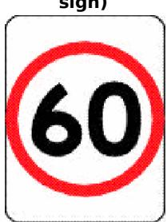

# Other signs

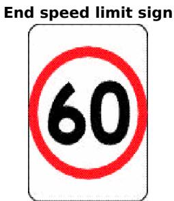

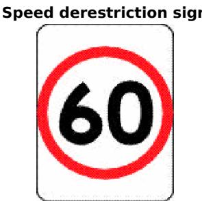

# Note 1 for diagrams.

There are a number of other permitted versions of the speed limit sign and the end speed limit sign—see the diagrams in Schedule 3.

# Note 2 for diagrams.

A speed limit sign or end speed limit sign may have a different number on the sign—see rule 316(4).

21–1 NSW rule: school bus stop zone sign is speed limit sign (1) For the purposes of rule 21—

(a) a school bus stop zone sign is a speed limit sign, and   
(b) an end school bus stop zone sign is an end speed limit sign in respect of a school bus stop zone sign.

(2) For the purposes of the application of this Part with respect to a length of road to which a school bus stop zone sign applies, the speed limit indicated by the sign applies to a driver only while the warning system of a bus is activated along that length of road.

# Note.

Length of road is defined in the Dictionary.

(3) In this rule—

warning system of a bus means the warning system referred to in the Road Transport (General) Regulation 2021, section 18.

# School bus stop zone sign

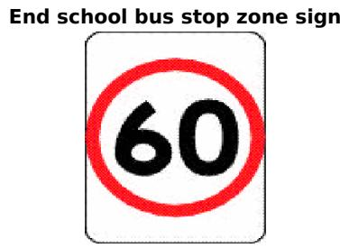

# Note for diagrams.

A school bus stop zone sign may have a different number on the sign—see rule 316(4).

# Note.

This rule is an additional NSW road rule. There is no corresponding rule in the Australian Road Rules. Different speed limit signs may apply to drivers in other Australian jurisdictions.

# 22 Speed limit in a speed limited area

(1) The speed limit applying to a driver for any length of road in a speed limited area is the number of kilometres per hour indicated by the number on the area speed limit sign on a road into the area, unless another speed limit applies to the driver for the length of road under another rule of this Part.

# Example of another speed limit.

Although an area speed limit sign on a road into a speed limited area may indicate a speed limit of 60 kilometres per hour, a particular length of road in the area may have a school zone sign indicating a 40 kilometres per hour speed limit for that length of road.

# Note.

Length of road is defined in the Dictionary.

(2) A speed limited area is the network of roads in an area with—

(a) an area speed limit sign on each road into the area, indicating the same number, and   
(b) an end area speed limit sign on each road out of the area.

(3) In subrule (2)(a) and (b)—

road does not include a road related area.

# Note.

Road related area is defined in rule 13.

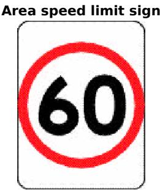

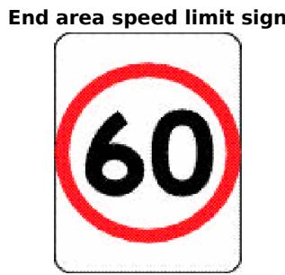

# Note 1 for diagrams.

There are a number of other permitted versions of each of these signs—see the diagrams in Schedule 3.

# Note 2 for diagrams.

An area speed limit sign or end area speed limit sign may have a different number on the sign—see rule 316(4).

# 23 Speed limit in a school zone

(1) The speed limit applying to a driver for any length of road in a school zone is the number of kilometres per hour indicated by the number on the school zone sign on a road, or the road, into the zone.

Note 1.

Length of road is defined in the Dictionary.

# Note 2.

A school zone sign may indicate that it applies only at certain times, on certain days or in certain circumstances—see rules 317 and 318.

# Note 3.

This subrule applies to road related areas in the school zone—see rule 11(2).

(2) A school zone is—

(a) if there is a school zone sign and an end school zone sign, or a speed limit sign with a different number on the sign, on a road and there is no intersection on the length of road between the signs—that length of road, or   
(b) if there is a school zone sign on a road that ends in a dead end and there is no intersection, nor a sign mentioned in paragraph (a), on the length of road beginning at the sign and ending at the dead end—that length of road, or   
(c) in any other case—the network of roads in an area with— (i) a school zone sign on each road into the area, indicating the same number, and

(ii) an end school zone sign, or a speed limit sign indicating a different number, on each road out of the area.

# Note.

Intersection is defined in the Dictionary.

(3) In subrule (2)(c)(i) and (ii)—

road does not include a road related area.

Note.

Road related area is defined in rule 13.

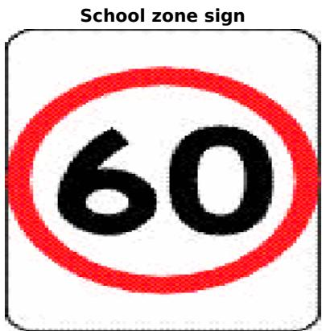

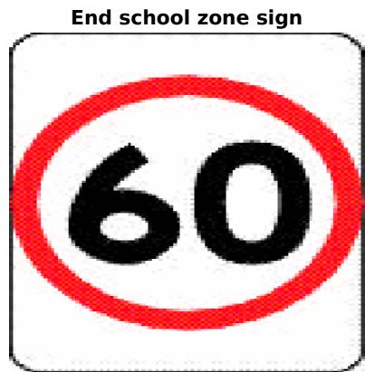

# Note 1 for diagrams.

There are other permitted versions of the school zone sign—see the diagrams in Schedule 3.

# Note 2 for diagrams.

A school zone sign or end school zone sign may have a different number on the sign—see rule 316(4).

# Note 3 for diagrams.

School days are any days other than a Saturday or Sunday, a day that is a public holiday or a day publicly notified as a school holiday for government schools—see rule 318(3–1).

# 24 Speed limit in a shared zone

(1) The speed limit applying to a driver for any length of road in a shared zone is the number of kilometres per hour indicated by the number on the shared zone sign on a road, or the road, into the zone.

# Note.

A driver driving in a shared zone must give way to any pedestrian in the zone—see rule 83.

(2) A shared zone is—

(a) if there is a shared zone sign and an end shared zone sign on a road and there is no intersection on the length of road between the signs—that length of road, or

(b) if there is a shared zone sign on a road that ends in a dead end and there is no intersection on the length of road beginning at the sign and ending at the dead end—that length of road, or

(c) a network of roads in an area with—

(i) a shared zone sign on each road into the area, indicating the same number, and

(ii) an end shared zone sign on each road out of the area, or

(d) a road related area that is between a shared zone sign that relates to the area and an end shared zone sign that relates to the area.

Note.

Intersection is defined in the Dictionary.

(3) In subrule (2)(c)(i) and (ii)—

road does not include a road related area.

Note.

Road related area is defined in rule 13.

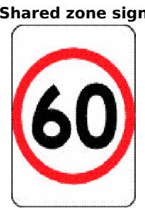

# 24–1 NSW rule: speed limits for learner and provisional licence holders

(1) Speed limit applying to learner drivers The speed limit applying for any length of road to a driver who is the holder of a learner licence issued in New South Wales is 90 kilometres per hour, unless another lesser speed limit applies to the driver for the length of road under another rule of this Part.

# Note.

Length of road is defined in the Dictionary, and learner licence is defined in the Act.

(2) Speed limit applying to P1 provisional drivers The speed limit applying for any length of road to a driver who is the holder of a provisional P1 licence is 90 kilometres per hour,

unless another lesser speed limit applies to the driver for the length of road under another rule of this Part.

# Note.

Provisional P1 licence is defined in the Dictionary.

(3) Speed limit applying to P2 provisional drivers The speed limit applying for any length of road to a driver who is the holder of a provisional P2 licence is 100 kilometres per hour, unless another lesser speed limit applies to the driver for the length of road under another rule of this Part.

# Note.

Provisional P2 licence is defined in the Dictionary.

(4) Rule applies despite greater speed limits This rule has effect despite any other rule in this Part that specifies a speed limit applying to a driver for a length of road that is greater than the speed limit applying to the driver under this rule.

# Note.

This rule is an additional NSW road rule. There is no corresponding rule in the Australian Road Rules.

# 24–2 NSW rule: speed limit on Lord Howe Island

(1) The speed limit applying to a driver for any length of road on Lord Howe Island is 25 kilometres per hour.

# Note.

Length of road is defined in the Dictionary.

(2) This rule has effect despite any other rule in this Part specifying the speed limit applying to a driver for a length of road.

# Note.

This rule is an additional NSW road rule. There is no corresponding rule in the Australian Road Rules.

24–3 NSW rule: speed limit when bus displaying when lights flash speed limit sign

(1) This rule applies to a driver if—

(a) the vehicle being driven by the driver is approaching from the rear of a bus (whether stationary or in motion) that displays a when lights flash speed limit sign, and   
(b) the bus is fitted with a warning system, and   
(c) the warning system is activated.

# Note.

Bus is defined in the Dictionary.

(2) The speed limit applying to a driver to whom this rule applies for any length of road while overtaking or passing the bus is 40 kilometres per hour, unless another lesser speed limit applies to the driver for the length of road under another rule of this Part.

# Note.

Length of road and overtake are defined in the Dictionary.

(3) This rule does not apply to a driver in relation to a length of road to which a sign referred to in rule 21–1 applies.

(4) This rule has effect despite any other rule in this Part that specifies a speed limit applying to a driver for a length of road that is greater than the speed limit applying to the driver under this rule.

(5) In this rule—

warning system of a bus means the warning system referred to in the Road Transport (General) Regulation 2021, section 18.

# Note.

This rule is an additional NSW road rule. There is no corresponding rule in the Australian Road Rules.

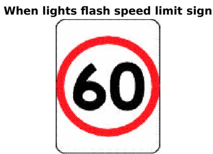

# Note for diagram.

This sign is displayed on buses.

# 24–4 NSW rule: speed limits for small motor bikes during periods of darkness

(1) The speed limit applying to the rider of a motor bike on any length of road during a period of darkness is—

(a) if the engine capacity of the bike does not exceed 100 millilitres—40 kilometres per hour, or   
(b) if the engine capacity of the bike exceeds 100 millilitres but does not exceed 200 millilitres—50 kilometres per hour,

unless another lesser speed limit applies to the rider for the length of road under another rule of this Part.

# Note.

Length of road and motor bike are defined in the Dictionary.

(2) This rule does not apply to any motor bike that is fitted with a headlight having an effective range of at least 50 metres.

(3) This rule has effect despite any other rule in this Part that specifies a speed limit applying to a driver for a length of road that is greater than the speed limit applying to the driver under this rule.

(4) In this rule—

headlight has the same meaning as in Division 1 of Part 13.

period of darkness has the same meaning as in Division 1 of Part 13.

# Note.

This rule is an additional NSW road rule. There is no corresponding rule in the Australian Road Rules.

# 25 Speed limit elsewhere

(1) If a speed limit sign does not apply to a length of road and the length of road is not in a speed limited area, school zone or shared zone, the speed limit applying to a driver for the length of road is the default speed limit.

# Note.

Length of road is defined in the Dictionary, school zone is defined in rule 23, shared zone is defined in rule 24, and speed limited area is defined in rule 22.

(2) The default speed limit applying to a driver for a length of road in a built-up area is 50 kilometres per hour.

# Note.

Built-up area is defined in the Dictionary.

(3) The default speed limit applying to a driver for any other length of road is—

(a) for a driver driving a vehicle with a GVM over 4.5 tonnes or a vehicle and trailer combination with a GCM over 4.5 tonnes—100 kilometres per hour, or   
(b) for any other driver—100 kilometres per hour or as otherwise provided under another law of this jurisdiction.

# Note 1.

Combination and trailer are defined in the Dictionary, vehicle is defined in rule 15, and GCM and GVM are defined in the Act.

# Note 2.

Subrule (3)(a) is not uniform with the corresponding paragraph in rule 25 of the Australian Road Rules.

Different rules may apply in other Australian jurisdictions.

# 25–1 NSW rule: drivers to which Part does not apply

(1) The provisions of this Part (other than this rule) do not apply to a driver who is taking part in a race, an attempt to break a vehicle speed record, a trial of speed or any competitive trial as referred to in section 115(1) of the Act in accordance with an approval given, and any conditions imposed by the Commissioner of Police, under section 115(2) of the Act.

(2) Nothing in this Part is to be construed so as to justify the driving of any vehicle on a length of road at a speed that—

(a) having regard to all the circumstances of the case, is dangerous to the public, or (b) exceeds any maximum speed applicable to the vehicle that is fixed by or under any Act or statutory rule or that is stated in any notice applicable to the vehicle and displayed in accordance with any law on the road or in a position where it is visible from the road.

(3) In subrule (2)(a), the circumstances of the case include the following—

(a) the nature, condition and use of the road,   
(b) the amount of traffic that actually is at the relevant time, or that might reasonably be expected to be, on that road,   
(c) the proximity of any intersection or grades or curves in the road.

# Note.

This rule is an additional NSW road rule. There is no corresponding rule in the Australian Road Rules.

# Part 4 Making turns

# Division 1 Left turns

26 Application of Division to roundabouts, road related areas and adjacent land

(1) This Division does not apply to a driver entering or leaving a roundabout.

Note 1.

Roundabout is defined in rule 109.

# Note 2.

Part 9 deals with entering and leaving a roundabout.

(2) This Division applies to a driver turning left from a road into a road related area or adjacent land, or from a road related area into a road, as if the driver were turning left at an intersection.

# Note 1.

Adjacent land and intersection are defined in the Dictionary and road related area is defined in rule 13. Adjacent land or a road related area can include a driveway, service station or shopping centre—see the definitions.

# Note 2.

Rule 74 deals with the give way rules applying to a driver entering a road from a road related area or adjacent land, and rule 75 deals with the give way rules applying to a driver entering a road related area or adjacent land from a road. Rule 212 deals with a driver entering and leaving a median strip parking area.

# Note 3.

For the meaning of left, see rule 351(1).

(3) In this rule—

road does not include a road related area.

# Note.

A road related area includes the shoulder of a road—see rule 13.

# 27 Starting a left turn from a road (except a multi-lane road)

(1) A driver turning left at an intersection from a road (except a multi-lane road) must approach and enter the intersection from as near as practicable to the far left side of the road.

Maximum penalty—20 penalty units.

(1A) Subrule (1) also applies to a rider of a bicycle who approaches and enters an intersection from a bicycle storage area.

# Note.

Bicycle storage area is defined in the Dictionary.

(1B) Despite subrule (1), if there is space in a bicycle storage area for 2 riders of bicycles to be next to each other, the rider on the right may approach and enter the intersection as near as practicable to the right side of the other rider, but only if that other rider approaches and enters the intersection in accordance with this rule.

(2) In this rule—

road does not include a road related area.

# Note 1.

Intersection and multi-lane road are defined in the Dictionary.

# Note 2.

Road related area includes any shoulder of a road—see rule 13.

# Example.

Starting a left turn from a road (except a multi-lane road)

# 28 Starting a left turn from a multi-lane road

(1) A driver turning left at an intersection from a multi-lane road must approach and enter the intersection from within the left lane unless—

(a) the driver is required or permitted to approach and enter the intersection from within another marked lane under rule 88(1), 92 or 159, or   
(b) the driver is turning, at B lights or traffic arrows, in accordance with Division 2 of Part 17, or   
(c) subrule (1A) or (2) applies to the driver, or   
(d) the lane is a bus only lane.

Maximum penalty—20 penalty units.

# Note 1.

B lights, intersection, marked lane, multi-lane road, public bus and traffic arrows are defined in the Dictionary, left lane is defined in subrule (3) and bus only lane is defined in rule 154A.

# Note 2.

Rule 88(1) deals with left turn only signs, rule 92 deals with traffic lane arrows, and rule 159 deals with traffic signs requiring particular kinds of vehicles to drive in an indicated marked lane.

# Note 3.

Division 2 of Part 17 provides for priority to be given to public buses at intersections with B lights or a white traffic arrow.

# Example for subrule (1)(a).

Starting a left turn on a multi-lane road with traffic lane arrows as required or permitted under rule 92

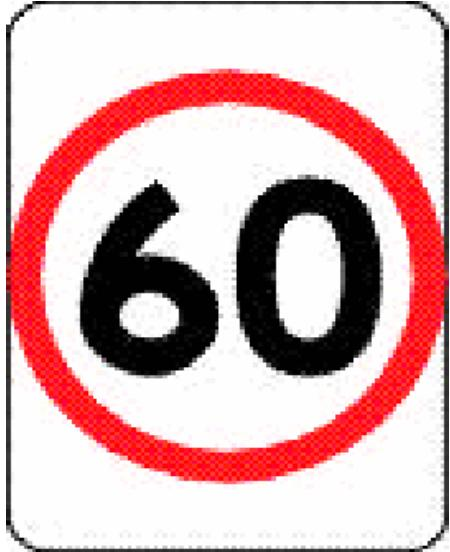

(1A) A driver turning left at an intersection from a multi-lane road that has a slip lane must approach and enter the intersection—

(a) from within the slip lane, or   
(b) if there is an obstruction that prevents the driver from entering the intersection from within the slip lane—from within the left lane.

Maximum penalty—20 penalty units.

# Note.

Obstruction and slip lane are defined in the Dictionary.

(2) A driver may approach and enter the intersection from the marked lane next to the left lane as well as, or instead of, the left lane if—

(a) the driver’s vehicle, together with any load or projection, is 7.5 metres long, or longer, and   
(b) the vehicle displays a do not overtake turning vehicle sign, and   
(c) any part of the vehicle is within 50 metres of the nearest point of the intersection, and   
(d) it is not practicable for the driver to turn left from within the left lane, and   
(e) the driver can safely occupy the next marked lane and can safely turn left at the intersection by occupying the next marked lane, or both lanes.

# Note 1.

Driver’s vehicle is defined in the Dictionary.

# Note 2.

Vehicle includes a combination—see rule 15(d).

# Note 3.

Rule 316–2 makes it an offence for a do not overtake turning vehicle sign to be displayed on the rear of a motor vehicle or a trailer attached to a motor vehicle unless the vehicle is, or the vehicle and trailer together are, 7.5 metres or more in length.

# Example.

Long vehicle turning left from the left lane and next marked lane (2A) If there is a bicycle storage area before an intersection that extends across one or more marked lanes of a multi-lane road, a rider of a bicycle turning left must approach and enter the intersection from within the part of the bicycle storage area that is directly in front of the left marked lane or of a bicycle lane that is on the left side of the road.

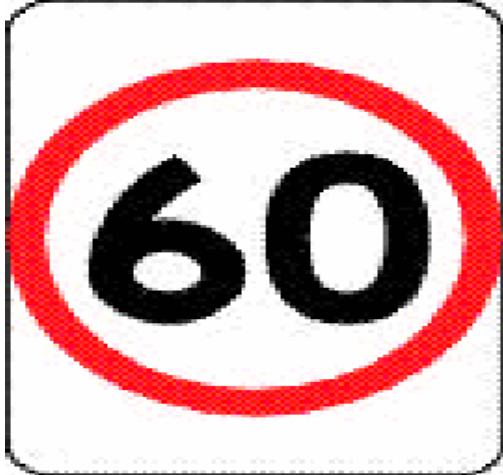

Maximum penalty—20 penalty units.

# Note.

Bicycle storage area is defined in the Dictionary.

(3) In this rule—

left lane means—

(a) the marked lane nearest to the far left side of the road, or (b) if there is an obstruction (for example, a parked car or roadworks) in that marked lane—the marked lane nearest to that marked lane that is not obstructed.

marked lane, for a driver, does not include a special purpose lane in which the driver

is not permitted to drive.

Note 1.

Special purpose lane is defined in the Dictionary.

# Note 2.

Rule 95 deals with driving in an emergency stopping lane and Part 11, Division 6 deals with driving in other special purpose lanes.

Do not overtake turning vehicle signs

# Note 1 for diagrams.

These signs are displayed on certain long vehicles.

# Note 2 for diagrams.

These signs must comply with the size requirements set out in rule 316–1.

# 29 Making a left turn as indicated by a turn line

(1) If a driver is turning left at an intersection and there is a turn line indicating how the turn is required to be made, the driver must make the turn as indicated by the turn line unless—

(a) the driver is turning, at B lights or traffic arrows, in accordance with Division 2 of Part 17, or   
(b) subrule (2) applies to the driver.

Maximum penalty—20 penalty units.

# Note.

B lights, intersection, traffic arrows and turn line are defined in the Dictionary.

Example.

  
Making a left turn as indicated by a turn line

(2) A driver may turn left at an intersection other than as indicated by a turn line if— (a) the driver’s vehicle, together with any load or projection, is 7.5 metres long, or longer, and (b) the vehicle displays a do not overtake turning vehicle sign, and (c) it is not practicable for the driver to turn left as indicated by the turn line, and (d) the driver can safely turn left other than as indicated by the turn line.

# Note 1.

Driver’s vehicle is defined in the Dictionary.

# Note 2.

Vehicle includes a combination—see rule 15(d).

# Note 3.

Rule 316–2 makes it an offence for a do not overtake turning vehicle sign to be displayed on the rear of a motor vehicle or a trailer attached to a motor vehicle unless the vehicle is, or the vehicle and trailer together are, 7.5 metres or more in length.

# Do not overtake turning vehicle signs

# Note 1 for diagrams.

These signs are displayed on certain long vehicles.

# Note 2 for diagrams.

These signs must comply with the size requirements set out in rule 316–1.

# Division 2 Right turns

# 30 Application of Division to certain right turns

(1) This Division does not apply to—

(a) a driver turning right at an intersection where there is a hook turn only sign, or (b) the rider of a bicycle making a hook turn under Division 3, or   
(c) a driver making a U-turn, or   
(d) a driver entering or leaving a roundabout.

# Note 1.

Bicycle, intersection and $\pmb { U }$ -turn are defined in the Dictionary and roundabout is defined in rule 109.

Note 2. Division 3 of this Part deals with hook turns, Division 4 deals with U-turns and Part 9 deals with entering and leaving a roundabout.

Note 3. For the meaning of right, see rule 351(2).

(2) This Division applies to a driver turning right from a road into a road related area or adjacent land, or from a road related area into a road, as if the driver were turning right at an intersection.

# Note 1.

Adjacent land is defined in the Dictionary and road related area is defined in rule 13. Adjacent land or a road related area can include a driveway, service station or shopping centre—see the definitions.

# Note 2.

Rule 74 deals with the give way rules applying to a driver entering a road from a road related area or adjacent land, and rule 75 deals with the give way rules applying to a driver entering a road related area or adjacent land from a road. Rule 212 deals with a driver entering and leaving a median strip parking area.

(3) In this rule—

road does not include a road related area.

# Note.

A road related area includes the shoulder of a road—see rule 13.

# 31 Starting a right turn from a road (except a multi-lane road)

(1) A driver turning right at an intersection from a road (except a multi-lane road) must approach and enter the intersection in accordance with this rule. Maximum penalty—20 penalty units.

# Note.

Intersection and multi-lane road are defined in the Dictionary.

(2) If the road has a dividing line or median strip, the driver must approach and enter the intersection from the left of, parallel to, and as near as practicable to, the dividing line or median strip.

# Note.

Dividing line and median strip are defined in the Dictionary.

(3) If the road does not have a dividing line or median strip and is not a one-way road, the driver must approach and enter the intersection from the left of, parallel to, and as near as practicable to, the centre of the road.

# Note.

Centre of the road and one-way road are defined in the Dictionary.

(4) If the road is a one-way road, the driver must approach and enter the intersection from as near as practicable to the far right side of the road.

(4A) Subrules (2), (3) and (4) also apply to a rider of a bicycle who approaches and enters an intersection from a bicycle storage area.

# Note.

Bicycle storage area is defined in the Dictionary.

(4B) Despite subrules (2), (3) and (4), if there is space in a bicycle storage area for 2 riders of bicycles to be next to each other, the rider on the left may approach and enter the intersection as near as practicable to the left side of the other rider, but only if that other rider approaches and enters the intersection in accordance with this rule.

(5) In this rule—

road does not include a road related area.

Note.

Road related area includes any shoulder of a road—see rule 13.

Examples.

Example 1 Starting a right turn from a road with a dividing line

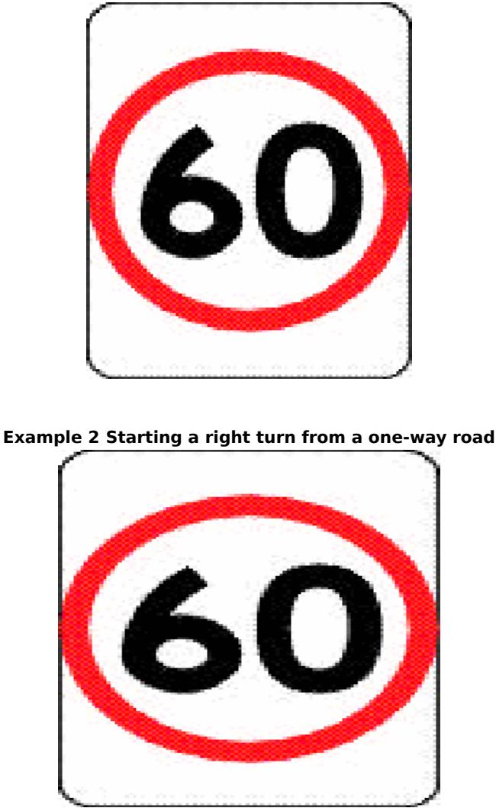

# 32 Starting a right turn from a multi-lane road

(1) A driver turning right at an intersection from a multi-lane road must approach and enter the intersection from within the right lane unless— (a) the driver is required or permitted to approach and enter the intersection from within another marked lane in accordance with rule 89(1), 92 or 159, or

(b) the driver is turning, at B lights or traffic arrows, in accordance with Division 2 of Part 17, or   
(c) subrule (2) applies to the driver, or   
(d) the lane is a bus only lane.   
Maximum penalty—20 penalty units.

# Note 1.

B lights, intersection, marked lane, multi-lane road, public bus and traffic arrows are defined in the Dictionary, right lane is defined in subrule (3) and bus only lane is defined in rule 154A.

# Note 2.

Rule 89(1) deals with right turn only signs, rule 92 deals with traffic lane arrows, and rule 159 deals with traffic signs requiring particular kinds of vehicles to drive in an indicated marked lane.

# Note 3.

Division 2 of Part 17 provides for priority to be given to public buses at intersections with B lights or a white traffic arrow.

Example for subrule (1)(a).

Starting a right turn on a multi-lane road with traffic lane arrows as required or permitted under rule 92

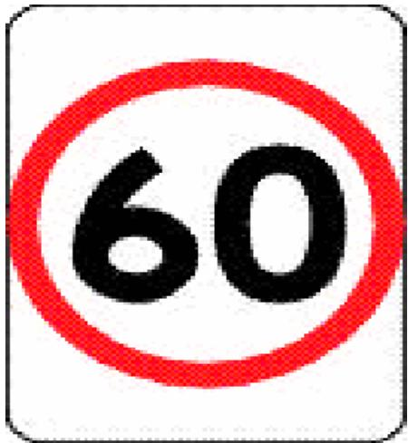

(2) A driver may approach and enter the intersection from the marked lane next to the right lane as well as, or instead of, the right lane if—

(a) the driver’s vehicle, together with any load or projection, is 7.5 metres long, or longer, and (b) the vehicle displays a do not overtake turning vehicle sign, and

(c) any part of the vehicle is within 50 metres of the nearest point of the intersection, and   
(d) it is not practicable for the driver to turn right from within the right lane, and   
(e) the driver can safely occupy the next marked lane and can safely turn right at the intersection by occupying the next marked lane, or both lanes.

# Note 1.

Driver’s vehicle is defined in the Dictionary.

# Note 2.

Vehicle includes a combination—see rule 15(d).

# Note 3.

Rule 316–2 makes it an offence for a do not overtake turning vehicle sign to be displayed on the rear of a motor vehicle or a trailer attached to a motor vehicle unless the vehicle is, or the vehicle and trailer together are, 7.5 metres or more in length.

(2A) If there is a bicycle storage area before an intersection that extends across one or more marked lanes of a multi-lane road, a rider of a bicycle turning right (but not making a hook turn) must approach and enter the intersection from within the part of the bicycle storage area that is directly in front of the right marked lane or of a bicycle lane that is on the right side of the road.

Maximum penalty—20 penalty units.

# Note.

Bicycle storage area is defined in the Dictionary.

(3) In this rule—

marked lane, for a driver, does not include a special purpose lane in which the driver is not permitted to drive.

# right lane means—

(a) the marked lane nearest to the dividing line or median strip on the road, or (b) if there is an obstruction (for example, a parked car or roadworks) in that marked lane—the marked lane nearest to that marked lane that is not obstructed.

# Note 1.

Dividing line, median strip, obstruction and special purpose lane are defined in the Dictionary.

# Note 2.

Rule 95 deals with driving in an emergency stopping lane and Part 11, Division 6 deals with driving in other

special purpose lanes.

# Do not overtake turning vehicle signs

# Note 1 for diagrams.

These signs are displayed on certain long vehicles.

# Note 2 for diagrams.

These signs must comply with the size requirements set out in rule 316–1.

# 33 Making a right turn

(1) A driver turning right at an intersection must make the turn in accordance with this rule unless—

(a) the driver is turning, at B lights or traffic arrows, in accordance with Division 2 of Part 17, or

(b) subrule (4) applies to the driver.

Maximum penalty—20 penalty units.

# Note.

B lights, intersection and traffic arrows are defined in the Dictionary.

(2) If there is a turn line indicating how the turn is required to be made, the driver must make the turn as indicated by the turn line.

# Note.

Turn line is defined in the Dictionary.

(3) If there is no turn line indicating how the turn is required to be made, the driver must make the turn so the driver—

(a) passes as near as practicable to the right of the centre of the intersection, and (b) turns into the left of the centre of the road the driver is entering, unless the driver is entering a one-way road.

# Note.

Centre of the road is defined in the Dictionary.

# Examples.

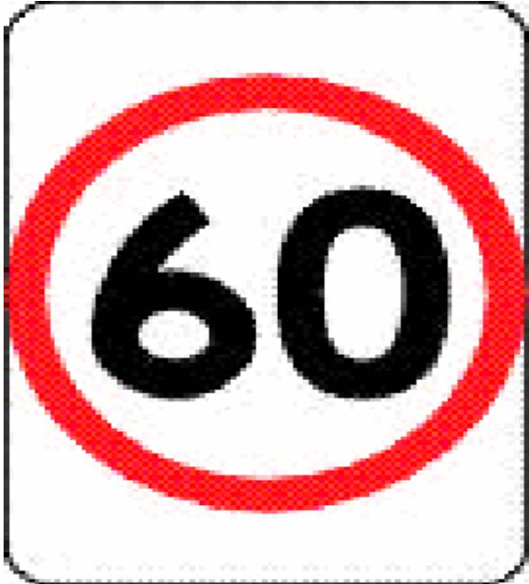  
Example 1 Making a right turn as indicated by turn lines

Example 2 Making a right turn from a road with no turn lines indicating how to make the turn

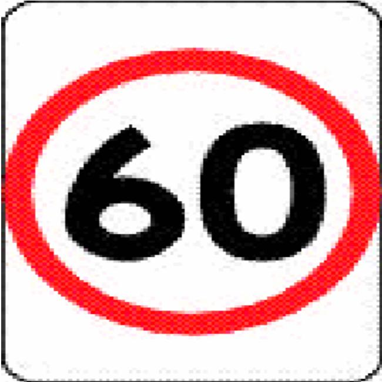

(4) A driver may turn right other than as indicated by a turn line if—

(a) the driver’s vehicle, together with any load or projection, is 7.5 metres long, or longer, and

(b) the vehicle displays a do not overtake turning vehicle sign, and (c) it is not practicable for the driver to turn right as indicated by the turn line, and (d) the driver can safely make the turn other than as indicated by the turn line.

# Note 1.

Driver’s vehicle is defined in the Dictionary.

# Note 2.

Vehicle includes a combination—see rule 15(d).

# Note 3.

Rule 316–2 makes it an offence for a do not overtake turning vehicle sign to be displayed on the rear of a motor vehicle or a trailer attached to a motor vehicle unless the vehicle is, or the vehicle and trailer together are, 7.5 metres or more in length.

Do not overtake turning vehicle signs

# Note 1 for diagrams.

These signs are displayed on certain long vehicles.

# Note 2 for diagrams.

These signs must comply with the size requirements set out in rule 316–1.

# Division 3 Hook turns at intersections

34 Making a hook turn at a hook turn only sign

(1) A driver turning right at an intersection with traffic lights and a hook turn only sign must turn right by making a hook turn in accordance with this rule.

Maximum penalty—20 penalty units.

# Note.

Intersection and traffic lights are defined in the Dictionary.

(2) To make a hook turn, the driver must take, in sequence, each of the following steps—

1 Approach and enter the intersection from as near as practicable to the far left side of the road that the driver is leaving.

2 Move forward, keeping as near as practicable to the left of the intersection and clear of any marked foot crossing, until the driver is as near as practicable to the far side of the road that the driver is entering.

3 Remain at the position reached under step 2 until the traffic lights on the road that the driver is entering change to green.

4 Turn right into that road.

# Note.

Marked foot crossing is defined in the Dictionary.

(3) In this rule—

road does not include a road related area.

# Note.

Road related area is defined in rule 13.

Example.

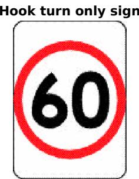

Making a hook turn at a hook turn only sign

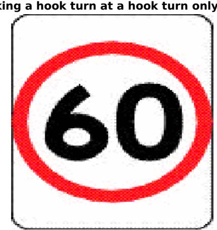

# 35 Optional hook turn by a bicycle rider

(1) The rider of a bicycle turning right at an intersection without a hook turn only sign, or a no hook turn by bicycles sign, may turn right at the intersection by making a right turn under Division 2 or a hook turn under this rule.

# Note.

Bicycle and intersection are defined in the Dictionary.

(2) The rider must make a hook turn under this rule in accordance with subrule (3).

Maximum penalty—20 penalty units.

(3) To make a hook turn under this rule, the rider must take, in sequence, each of the following steps—

1 Approach and enter the intersection from as near as practicable to the far left side of the road that the rider is leaving.

2 Move forward—

(a) keeping as near as practicable to the far left side of the intersection, and

(b) keeping clear of any marked foot crossing, and

(c) keeping clear, as far as practicable, of any driver turning left from the left of the intersection,

until the rider is as near as practicable to the far side of the road that the rider is entering.

3 If there are traffic lights at the intersection, remain at the position reached under step 2 until the traffic lights on the road that the rider is entering change to green.

4 If there are no traffic lights at the intersection, remain at the position reached under step 2 until the rider has given way to approaching drivers on the road that the rider is leaving.

5 Turn right into the road that the rider is entering.

# Note.

Approaching and marked foot crossing are defined in the Dictionary.

(4) To make a hook turn under this rule at an intersection that has a bicycle hook turn storage area on the left side of the intersection as the rider approaches the intersection, the rider must take the following initial 2 steps instead of the initial 2 steps listed in subrule (3)—

1 Approach the intersection from the far left side of the road the rider is leaving and enter the intersection by moving into the bicycle hook turn storage area, keeping clear of any marked foot crossing.

2 Move forward in the bicycle hook turn storage area until the rider is as near as practicable to the far side of the road that the rider is entering.

# Note.

Bicycle hook turn storage area is defined in the Dictionary.

Example.

# Example.

Bicycle rider making a hook turn at an intersection without traffic light

# 36 Bicycle rider making a hook turn contrary to no hook turn by bicycles sign

The rider of a bicycle must not make a hook turn at an intersection that has a no hook turn by bicycles sign.

Maximum penalty—20 penalty units.

# Note.

Bicycle and intersection are defined in the Dictionary.

# No hook turn by bicycles sign

# Division 4 U-turns

Note.

U-turn is defined in the Dictionary.

# 37 Beginning a U-turn

A driver must not begin a U-turn unless—

(a) the driver has a clear view of any approaching traffic, and   
(b) the driver can safely make the U-turn without unreasonably obstructing the free movement of traffic.

Maximum penalty—20 penalty units.

Note 1.   
Approaching traffic means traffic approaching from any direction—see the definition in the Dictionary. Note 2.   
Traffic is defined in the Dictionary.

# 38 Giving way when making a U-turn

(1) A driver making a U-turn must give way to all vehicles and pedestrians.

Maximum penalty—20 penalty units.

# Note—

For this rule, give way means the driver must slow down and, if necessary, stop to avoid a collision—see the definition in the Dictionary.

(2) Despite subrule (1), a driver does not have to give way to a driver entering the road from a road related area or adjacent land.

Note—

Adjacent land is defined in the Dictionary and road related area is defined in rule 13.

(3) In this rule—

road does not include a road related area. Note— A road related area includes any shoulder of a road—see rule 13.

# 39 Making a U-turn contrary to a no U-turn sign

(1) A driver must not make a U-turn at a break in a dividing strip on a road if there is a no U-turn sign at the break in the dividing strip. Maximum penalty—20 penalty units.

Note 1. Dividing strip is defined in the Dictionary.

# Note 2.

Rule 322(5) and (6) deal with the meaning of a traffic sign at a break in a dividing strip.

(2) A driver must not make a U-turn on a length of road to which a no U-turn sign applies. Maximum penalty—20 penalty units.

# Note.

Length of road is defined in the Dictionary.

(3) A no U-turn sign on a road (except a no U-turn sign at an intersection or at a break in a dividing strip) applies to the length of road beginning at the sign and ending at the nearer of the following—

(a) the next intersection on the road, (b) if the road ends at a T-intersection or dead end—the end of the road.

# Note 1.

Intersection and T-intersection are defined in the Dictionary.

# Note 2.

Rule 322(1) and (2) deal with the meaning of a traffic sign on a road.

# No U-turn signs

# No U-turn sign (Standard sign)

No U-turn sign (Variable illuminated message sign)

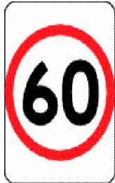

# 40 Making a U-turn at an intersection with traffic lights

A driver must not make a U-turn at an intersection with traffic lights unless there is a Uturn permitted sign at the intersection.

Maximum penalty—20 penalty units.

# Note.

Intersection and traffic lights are defined in the Dictionary.

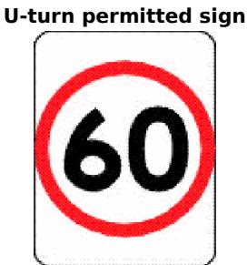

# 41 Making a U-turn at an intersection without traffic lights

A driver must not make a U-turn at an intersection without traffic lights if there is a no Uturn sign at the intersection.

Maximum penalty—20 penalty units.

Note 1.

Intersection and traffic lights are defined in the Dictionary.

# Note 2.

U-turns are permitted at intersections without traffic lights unless there is a no U-turn sign, even though traffic lane arrows indicate that the driver must or may turn right—see rule 92.

# 42 Starting a U-turn at an intersection

A driver making a U-turn at an intersection must start the U-turn—

(a) if the road where the driver is turning has a dividing line or median strip—from the marked lane nearest, or as near as practicable, to the dividing line or median strip, or (b) in any other case—from the left of the centre of the road.

Maximum penalty—20 penalty units.

# Note.

Centre of the road, dividing line, intersection, marked lane and median strip are defined in the Dictionary.

# Example.

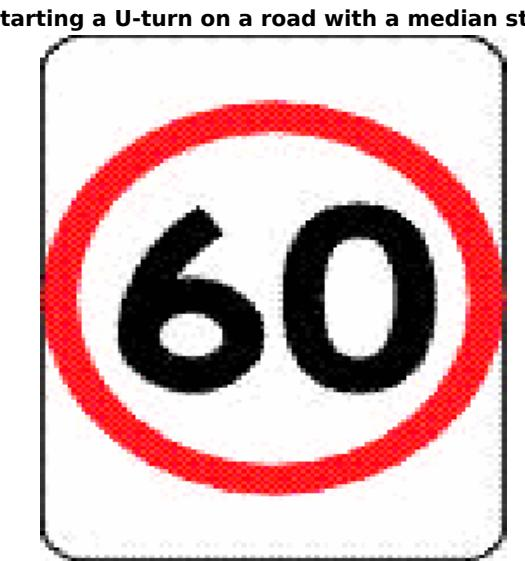

# 43 Making a U-turn at certain crossings

A driver must not make a U-turn at any of the following crossings, with or without traffic lights, unless there is a $U$ -turn permitted sign at the crossing—

(a) children’s crossing, (b) level crossing, (c) marked foot crossing, (d) pedestrian crossing.

Maximum penalty—20 penalty units.

Note—

Children’s crossing is defined in rule 80, level crossing is defined in rule 120, pedestrian crossing is defined in rule 81 and marked foot crossing and traffic lights are defined in the Dictionary.

# 43A Making a U-turn on a road related area with traffic lights

A driver must not make a U-turn at a place with traffic lights where a road and road related area intersect unless there is a U-turn permitted sign at the place.

Maximum penalty—20 penalty units.

Note 1—

Road includes a road related area—see rule 11(2).

Note 2—

Traffic lights is defined in the Dictionary and road related area is defined in rule 13.

# Part 5 Change of direction and stop signals

# Division 1 Change of direction signals

44 Division does not apply to entering or leaving a roundabout, lane filtering or repositioning

This Division does not apply to—

(a) a driver entering, in or leaving a roundabout, or   
(b) the rider of a motor bike while lane filtering in accordance with rule 151A, or   
(c) the rider of a motor bike while repositioning the motor bike within the same lane in order to avoid a hazard or reduce the risk of a crash. Note 1.   
Part 9 deals with giving change of direction signals when entering or leaving a roundabout. Note 2.   
Lane filtering is defined in rule 151A.

# 45 What is changing direction

(1) A driver changes direction if the driver changes direction to the left or the driver changes direction to the right.

(2) A driver changes direction to the left by doing any of the following— (a) turning left, (b) changing marked lanes to the left,

(c) diverging to the left,   
(d) entering a marked lane, or a line of traffic, to the left,   
(e) moving to the left to, or from, a stationary position,   
(f) turning left into a marked lane, or a line of traffic, from a median strip parking area,   
(g) at a T-intersection where the continuing road curves to the right—leaving the continuing road to proceed straight ahead onto the terminating road.

# Note 1.

Marked lane and median strip parking area are defined in the Dictionary.

Note 2. For the meaning of left, see rule 351(1).

(3) A driver changes direction to the right by doing any of the following—

(a) turning right,   
(b) changing marked lanes to the right,   
(c) diverging to the right,   
(d) entering a marked lane, or a line of traffic, to the right,   
(e) moving to the right to, or from, a stationary position,   
(f) turning right into a marked lane, or a line of traffic, from a median strip parking area,   
(g) making a U-turn,   
(h) at a T-intersection where the continuing road curves to the left—leaving the continuing road to proceed straight ahead onto the terminating road.

# Note 1.

U-turn is defined in the Dictionary.

# Note 2.

For the meaning of right, see rule 351(2).

Examples for subrules (2)(g) and (3)(h).

Example 1 Driver indicating change of direction at a T-intersection where the continuing road curves to the right and the driver is proceeding straight ahead onto the terminating road

Example 2 Driver indicating change of direction at a T-intersection where the continuing road curves to the left and the driver is proceeding straight ahead

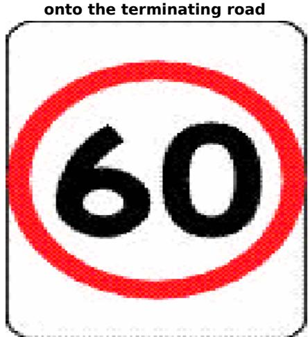

# 46 Giving a left change of direction signal

(1) Before a driver changes direction to the left, the driver must give a left change of direction signal in accordance with rule 47 for long enough to comply with subrule (2) and, if subrule (3) applies to the driver, that subrule.

Maximum penalty—20 penalty units.

# Note.

Changes direction to the left is defined in rule 45(2).

(2) The driver must give the change of direction signal for long enough to give sufficient warning to other drivers and pedestrians.

(3) If the driver is about to change direction by moving from a stationary position at the side of the road or in a median strip parking area, the driver must give the change of direction signal for at least 5 seconds before the driver changes direction.

# Note.

Median strip parking area is defined in the Dictionary.

(4) The driver must stop giving the change of direction signal as soon as the driver completes the change of direction. Maximum penalty—20 penalty units.

(5) This rule does not apply to a driver if the driver’s vehicle is not fitted with direction indicator lights.

# Note.

Driver’s vehicle is defined in the Dictionary.

# 47 How to give a left change of direction signal

The driver of a vehicle must give a left change of direction signal by operating the vehicle’s left direction indicator lights.

# 48 Giving a right change of direction signal

(1) Before a driver changes direction to the right, the driver must give a right change of direction signal in accordance with rule 49 for long enough to comply with subrule (2) and, if subrule (3) applies to the driver, that subrule.

Maximum penalty—20 penalty units.

# Note.

Changes direction to the right is defined in rule 45(3).

(2) The driver must give the change of direction signal for long enough to give sufficient warning to other drivers and pedestrians.

(3) If the driver is about to change direction by moving from a stationary position at the side of the road or in a median strip parking area, the driver must give the change of direction signal for at least 5 seconds before the driver changes direction.

# Note.

Median strip parking area is defined in the Dictionary.

(3A) Subrule (3) does not apply to the rider of a bicycle that is stopped in traffic but not parked.

(4) The driver must stop giving the change of direction signal as soon as the driver completes the change of direction. Maximum penalty—20 penalty units.

(5) This rule does not apply to—

(a) the driver of a tram that is not fitted with direction indicator lights, or (b) the rider of a bicycle making a hook turn.

# Note 1.

Bicycle and tram are defined in the Dictionary.

# Note 2.

Rules 34 and 35 deal with bicycles making hook turns.

# 49 How to give a right change of direction signal

(1) The driver of a vehicle must give a right change of direction signal by operating the

vehicle’s right direction indicator lights.

(2) However, if the vehicle’s direction indicator lights are not in working order or are not clearly visible, or the vehicle is not fitted with direction indicator lights, the driver must give the change of direction signal by giving a hand signal in accordance with rule 50, or using a mechanical signalling device fitted to the vehicle.

# Note.

Mechanical signalling device is defined in the Dictionary.

# 50 How to give a right change of direction signal by giving a hand signal

To give a hand signal for changing direction to the right, the driver must extend the right arm and hand horizontally and at right angles from the right side of the vehicle, with the hand open and the palm facing the direction of travel.

Example.

Giving a hand signal for changing direction to the right

# 51 When use of direction indicator lights permitted

The driver of a vehicle must not operate a direction indicator light except—

(a) to give a change of direction signal when the driver is required to give the signal under these Rules, or   
(b) as part of the vehicle’s hazard warning lights.

Maximum penalty—20 penalty units.

# Division 2 Stop signals

# 52 Division does not apply to bicycle riders or certain tram drivers

This Division does not apply to the rider of a bicycle, or the driver of a tram that is not fitted with brake lights.

Note.

Bicycle and tram are defined in the Dictionary.

# 53 Giving a stop signal

(1) A driver must give a stop signal in accordance with rule 54 before stopping or when suddenly slowing. Maximum penalty—20 penalty units.   
(2) If the driver is stopping, the driver must give the stop signal for long enough to give sufficient warning to other road users. Maximum penalty—20 penalty units.   
(3) If the driver is slowing suddenly, the driver must give the stop signal while slowing. Maximum penalty—20 penalty units.

# 54 How to give a stop signal

(1) The driver of a vehicle must give a stop signal by means of the vehicle’s brake lights.

(2) However, if the vehicle’s brake lights are not in working order or are not clearly visible, or the vehicle is not fitted with brake lights, the driver must give the stop signal by giving a hand signal in accordance with rule 55, or using a mechanical signalling device fitted to the vehicle.

# Note.

Mechanical signalling device is defined in the Dictionary.

# 55 How to give a stop signal by giving a hand signal

(1) To give a hand signal for stopping or suddenly slowing, the driver must extend the right arm and hand at right angles from the right side of the vehicle, with the upper arm horizontal and the forearm and hand pointing upwards, and with the hand open and the palm facing the direction of travel.

(2) However, the rider of a motor bike may give the hand signal by extending the left arm and hand at right angles from the left side of the motor bike, with the upper arm horizontal and the forearm and hand pointing upwards, and with the hand open and the palm facing the direction of travel.

# Note.

Motor bike is defined in the Dictionary.

Example.

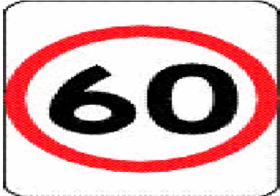  
Giving a hand signal for stopping or suddenly slowing

# Part 6 Traffic lights, traffic arrows and twin red lights

# Division 1 Obeying traffic lights and traffic arrows

Note 1.

Traffic arrows and traffic lights are defined in the Dictionary. Traffic arrows are a traffic control device designed to show a traffic arrow, or 2 or more traffic arrows at different times—see the definition in the Dictionary.

# Note 2.

A reference in a rule of this Part to a green, yellow or red traffic light or traffic arrow is a reference to a steady green, yellow or red traffic light or traffic arrow, unless otherwise stated in the rule—see rule 323.

# Note 3.

The rules dealing with T lights and B lights, which apply to drivers of trams and public buses, are in Part 17.

# 56 Stopping for a red traffic light or arrow

(1) A driver approaching or at traffic lights showing a red traffic light must stop—

(a) if there is a stop line at or near the traffic lights—as near as practicable to, but before reaching, the stop line, or   
(b) if there is a stop here on red signal sign at or near the traffic lights, but no stop line—as near as practicable to, but before reaching, the sign, or   
(c) if there is no stop line or stop here on red signal sign at or near the traffic lights—as near as practicable to, but before reaching, the nearest or only traffic lights,

and must not proceed past the stop line, stop here on red signal sign or nearest or only traffic lights (as the case may be) until the traffic lights show a green or flashing yellow traffic light or no traffic light.

Maximum penalty—20 penalty units.

# Note.

Red traffic light and stop line are defined in the Dictionary.

Example for subrule (1)(b).

Stopping at a stop here on red signal sign on a road the driver is entering

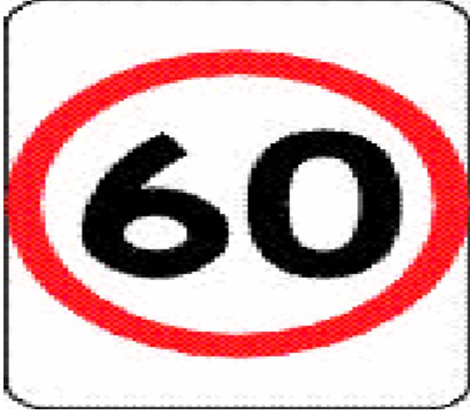

In this example the driver may go straight ahead, or turn right or left, if there is a green traffic light showing at 1. However, the driver must not go beyond the stop here on red signal sign at 2 if there is a red traffic light showing on the road the driver is entering (see 2 and 3).

(1A) However, if the traffic lights are at an intersection with a left turn on red after stopping sign and the driver is turning left at the intersection, the driver may turn left after stopping.

# Note.

Rule 62 deals with the give way rules applying to a driver turning left at an intersection after stopping at a left turn on red after stopping sign.

(2) A driver approaching or at traffic arrows showing a red traffic arrow who is turning in the direction indicated by the arrow must stop—

(a) if there is a stop line at or near the traffic arrows—as near as practicable to, but before reaching, the stop line, or   
(b) if there is a stop here on red arrow sign at or near the traffic arrows, but no stop line—as near as practicable to, but before reaching, the sign, or   
(c) if there is no stop line or stop here on red arrow sign at or near the traffic arrows—as near as practicable to, but before reaching, the nearest or only traffic arrows,

and must not proceed past the stop line, stop here on red arrow sign or nearest or only traffic arrows (as the case may be) until the traffic arrows show a green or

flashing yellow traffic arrow or no traffic arrow.

Maximum penalty—20 penalty units.

# Note 1.

Red traffic arrow is defined in the Dictionary.

# Note 2.

This rule only applies to a driver turning left using a slip lane if the red traffic light or red traffic arrow applies to the slip lane—see Part 20, Divisions 2 and 3, especially rules 330 and 345.

# Note 3.

Rule 58 deals with when a driver does not have to stop for a red traffic light.

# Note 4.

The driver of a tram or a public bus does not have to stop at traffic lights showing a red traffic light if a white T light (for trams) or a white B light (for public buses) is also showing, or a white traffic arrow is showing and the driver is turning in the direction indicated by the arrow—see rules 278 and 285.

Stop here on red signal sign

Stop here on red arrow sign

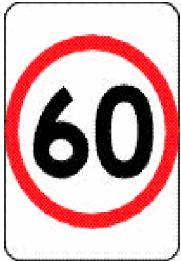

(3) If there is a bicycle storage area before any traffic lights referred to in subrule (1) or (2), a reference to the stop line in subrule (1)(a) or (2)(a)—

(a) in the case of a driver of a motor vehicle, is a reference to the first stop line that the driver comes, or came, to in approaching the lights, and   
(b) in the case of a rider of a bicycle, is a reference to the stop line that is nearest to the intersection.

# Note.

Bicycle storage area is defined in the Dictionary.

# 57 Stopping for a yellow traffic light or arrow

(1) A driver approaching or at traffic lights showing a yellow traffic light must stop— (a) if there is a stop line at or near the traffic lights and the driver can stop safely before reaching the stop line—as near as practicable to, but before reaching, the

stop line, or

(b) if there is no stop line at or near the traffic lights and the driver can stop safely before reaching the traffic lights—as near as practicable to, but before reaching, the nearest or only traffic lights, or   
(c) if the traffic lights are at an intersection and the driver cannot stop safely in accordance with paragraph (a) or (b), but can stop safely before entering the intersection—before entering the intersection,

and must not proceed past the stop line or nearest or only traffic lights, or into the intersection (as the case may be), until the traffic lights show a green or flashing yellow traffic light or no traffic light.

Maximum penalty—20 penalty units.

# Note.

Enter, intersection, stop line and yellow traffic light are defined in the Dictionary.

(2) A driver approaching or at traffic arrows showing a yellow traffic arrow who is turning in the direction indicated by the arrow must stop— (a) if there is a stop line at or near the traffic arrows and the driver can stop safely before reaching the stop line—as near as practicable to, but before reaching, the stop line, or (b) if there is no stop line at or near the traffic arrows and the driver can stop safely before reaching the traffic arrows—as near as practicable to, but before reaching, the nearest or only traffic arrows, or (c) if the traffic arrows are at an intersection and the driver cannot stop safely in accordance with paragraph (a) or (b), but can stop safely before entering the intersection—before entering the intersection,

and must not proceed past the stop line or nearest or only traffic arrows, or into the intersection (as the case may be), until the traffic arrows show a green or flashing yellow traffic arrow or no traffic arrow.

Maximum penalty—20 penalty units.

# Note.

Enter, intersection, stop line and yellow traffic arrow are defined in the Dictionary.

(3) If the traffic lights or traffic arrows (as the case may be) are at an intersection and the driver is not able to stop safely under subrule (1) or (2) (as the case may be) and enters the intersection, the driver must leave the intersection as soon as the driver can do so safely.

Maximum penalty—20 penalty units.

# Note 1.

Intersection does not include a road related area—see the definition in the Dictionary.

# Note 2.

This rule applies to a driver turning left using a slip lane only if the yellow traffic light or yellow traffic arrow (as the case may be) applies to the slip lane—see Part 20, Divisions 2 and 3, especially rules 330 and 345.

# Note 3.

Rule 58 deals with when a driver does not have to stop at a yellow traffic light.

(4) If there is a bicycle storage area before any traffic lights referred to in subrule (1) or (2), a reference to the stop line in subrule (1)(a) or (2)(a)— (a) in the case of a driver of a motor vehicle, is a reference to the first stop line that the driver comes, or came, to in approaching the lights, and (b) in the case of a rider of a bicycle, is a reference to the stop line that is nearest to the intersection.

# Note.

Bicycle storage area is defined in the Dictionary.

# 58 Exceptions to stopping for a red or yellow traffic light

(1) A driver approaching or at traffic lights showing a red or yellow traffic light does not have to stop if a green traffic arrow is also showing and the driver is turning in the direction indicated by the arrow.

Note.

Green traffic arrow, red traffic light and yellow traffic light are defined in the Dictionary.

(2) A driver turning at an intersection with traffic lights who approaches or is at a red traffic light on the road that the driver is entering does not have to stop for that traffic light if there is no stop line or stop here on red signal sign at or near the traffic light.

# Note.

Intersection and stop line are defined in the Dictionary.

# 59 Proceeding through a red traffic light

(1) If traffic lights at an intersection or marked foot crossing are showing a red traffic light, a driver must not enter the intersection or marked foot crossing. Maximum penalty—20 penalty units.

# Note 1.

Enter, intersection, marked foot crossing and red traffic light are defined in the Dictionary.

# Note 2.

Rules 56 and 57 deal with stopping for a red or yellow traffic light, and proceeding while the light remains red or yellow. Rule 60 deals with proceeding through a red traffic arrow.

(2) However, if the traffic lights are at an intersection with a left turn on red after stopping sign and the driver is turning left at the intersection, the driver may turn left after stopping.

# Note.

Rule 62 deals with the give way rules applying to a driver turning left at an intersection after stopping at a left turn on red after stopping sign.

(3) Also, subrule (1) does not apply to a driver if rule 58(1) applies to the driver.

Rule 58 deals with when a driver does not have to stop for a red traffic light.

Left turn on red after stopping sign

# 60 Proceeding through a red traffic arrow

If traffic arrows at an intersection or marked foot crossing are showing a red traffic arrow, and a driver is turning in the direction indicated by the arrow, the driver must not enter the intersection or marked foot crossing.

Maximum penalty—20 penalty units.

Note 1.

Enter, intersection, marked foot crossing and red traffic arrow are defined in the Dictionary.

# Note 2.

Rules 56 and 57 deal with stopping for a red or yellow traffic arrow.

60A Proceeding through a bicycle storage area before a red traffic light or arrow

(1) If there is a bicycle storage area before traffic lights that are showing a red traffic light, a driver of a motor vehicle must not allow any part of the vehicle to enter the bicycle storage area.

Maximum penalty—20 penalty units.

# Note.

Bicycle storage area, red traffic light and motor vehicle are defined in the Dictionary.

(2) If there is a bicycle storage area before traffic arrows that are showing a red traffic arrow, and a driver of a motor vehicle is turning in the direction indicated by the arrow, the driver must not allow any part of the vehicle to enter the bicycle storage area.

Maximum penalty—20 penalty units.

# Note.

Red traffic arrow is defined in the Dictionary.

61 Proceeding when traffic lights or arrows at an intersection change to yellow or red

(1) This rule applies to—

(a) a driver at an intersection with traffic lights showing a green traffic light who has stopped after the stop line, stop here on red signal sign, or nearest or only traffic lights, at the intersection and is not making a hook turn at the intersection, or   
(b) a driver at an intersection with traffic arrows showing a green traffic arrow who is turning in the direction indicated by the arrow and has stopped after the stop line, stop here on red arrow sign, or nearest or only traffic arrows, at the intersection.

# Example.

A driver may stop after the stop line at an intersection with traffic lights showing a green traffic light, and not proceed through the intersection, because traffic is congested.

# Note 1.

Green traffic arrow, green traffic light, intersection and stop line are defined in the Dictionary.

# Note 2.

Hook turns are dealt with in rules 34 and 35.

(2) If the traffic lights or traffic arrows (as the case may be) change to yellow or red while the driver is stopped and the driver has not entered the intersection, the driver must not enter the intersection. Maximum penalty—20 penalty units.

# Note.

Enter is defined in the Dictionary.

(3) However, if the traffic lights are at an intersection with a left turn on red after

stopping sign and the driver is turning left at the intersection, the driver may turn left after stopping.

# Note.

Rule 62 deals with the give way rules applying to a driver turning left at an intersection after stopping at a left turn on red after stopping sign.

(4) Also, subrule (2) does not apply to a driver if rule 58(1) applies to the driver.   
Note.

Rule 58 deals with when a driver does not have to stop for a red traffic light.

(5) If the traffic lights or traffic arrows (as the case may be) change to yellow or red while the driver is stopped and the driver has entered the intersection, the driver must leave the intersection as soon as the driver can do so safely. Maximum penalty—20 penalty units.

# Note.

Intersection does not include a road related area—see the definition in the Dictionary.

# Division 2 Giving way at traffic lights and traffic arrows

Note.

Traffic lights are defined in the Dictionary.

62 Giving way when turning at an intersection with traffic lights (1) A driver turning at an intersection with traffic lights must give way to—

(a) any pedestrian at or near the intersection who is crossing the road the driver is entering, and   
(b) if the driver is turning left at a left turn on red after stopping sign at the intersection— (i) any vehicle approaching from the right, turning right at the intersection into the road the driver is entering or making a U-turn, and (ii) any pedestrian at or near the intersection who is on the road the driver is leaving, and

(c) if the driver is turning right—any oncoming vehicle that is going straight ahead or turning left at the intersection (except a vehicle turning left using a slip lane).

Maximum penalty—20 penalty units.

# Note 1.

Intersection, oncoming vehicle, slip lane, straight ahead and U-turn are defined in the Dictionary.

# Note 2.

For this rule, give way means the driver must remain stationary until it is safe to proceed—see the definition in the Dictionary.

# Note 3.

Rule 322(3) and (4) deal with the meaning of a traffic sign at an intersection.

# Note 4.

A driver turning left at a left turn on red after stopping sign, at an intersection with traffic lights showing a red traffic light, must stop in accordance with rule 56(1) before making the turn.

# Note 5.

In relation to paragraph (a), rule 353(1) specifies that a driver is not required to give way to a pedestrian who is crossing the road that the driver is leaving, and rule 353(2) provides that a pedestrian who is only crossing a part of a road is considered to be crossing the road.

(2) However, a driver who is turning at an intersection with traffic arrows showing a green traffic arrow need not give way to an oncoming vehicle if the driver is turning in the direction indicated by the green traffic arrow.

Note.

Green traffic arrow is defined in the Dictionary.

Examples.

Example 1 Giving way to a pedestrian on the road the driver is entering

Example 2 Driver turning right giving way to an oncoming vehicle going straight ahead

Example 3 Driver turning right does not have to give way to an oncoming vehicle that is turning left into the road the driver is entering using a slip lane

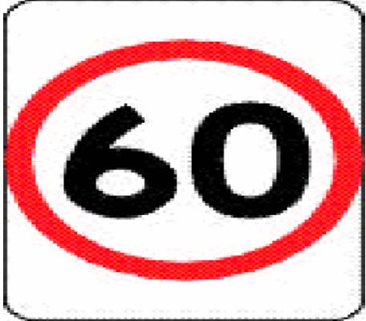

In example 1, the vehicle must give way to the pedestrian.

In examples 2 and 3, vehicle B must give way to vehicle A.

63 Giving way at an intersection with traffic lights not operating or only partly operating

(1) This rule applies to a driver at an intersection if traffic lights at the intersection are not operating, or the traffic lights are showing only a flashing yellow traffic light. Note.

Intersection and yellow traffic light are defined in the Dictionary.

(2) If there is a traffic light-stop sign at the intersection, the driver must comply with rule 67 as if the sign were a stop sign at an intersection without traffic lights.

Maximum penalty—20 penalty units.

# Note 1.

Rule 322(3) and (4) deal with the meaning of a traffic sign at an intersection.

# Note 2.

Rule 67 deals with stopping and giving way at a stop sign or stop line at an intersection without traffic lights.

# Note 3.

There is no requirement under Division 1 of this Part for a driver to stop for a flashing yellow traffic light or traffic lights that are not operating.

(3) If there is no traffic light-stop sign at the intersection, the driver must give way to vehicles and pedestrians at or near the intersection in accordance with rule 72 or 73 as if the intersection were an intersection without traffic lights, or a stop sign, stop line, give way sign or give way line.

Maximum penalty—20 penalty units.

# Note 1.

Give way line and stop line are defined in the Dictionary.

# Note 2.

Rules 72 and 73 deal with giving way at an intersection (except a roundabout) without traffic lights, or a stop sign, stop line, give way sign or give way line applying to the driver.

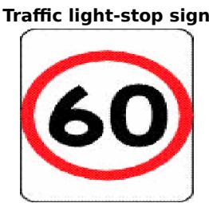

(4) Subrule (3) does not apply if the intersection is a roundabout.

Note 1.

Roundabout is defined in the Dictionary.

# Note 2.

Rule 114 requires a driver entering a roundabout to give way to any vehicle in the roundabout and to any tram that is entering or approaching the roundabout.

# 64 Giving way at a flashing yellow traffic arrow at an intersection

A driver turning in the direction indicated by a flashing yellow traffic arrow at an intersection with traffic lights must give way to—

(a) any vehicle travelling on the road the driver is entering, and   
(b) any pedestrian at or near the intersection who is crossing the road the driver is entering, and   
(c) if the driver is turning right—any oncoming vehicle that is going straight ahead or turning left at the intersection (except a vehicle turning left using a slip lane).

Maximum penalty—20 penalty units.

# Note 1.

Intersection, oncoming vehicle, slip lane, straight ahead and yellow traffic arrow are defined in the Dictionary.

# Note 2.

For this rule, give way means the driver must slow down and, if necessary, stop to avoid a collision—see the definition in the Dictionary.

# Note 3.

There is no requirement under Division 1 of this Part for a driver to stop for a flashing yellow traffic arrow.

# Note 4.

In relation to paragraph (b), rule 353(1) specifies that a driver is not required to give way to a pedestrian who is crossing the road that the driver is leaving, and rule 353(2) provides that a pedestrian who is only crossing a part of a road is considered to be crossing the road.

65 Giving way at a marked foot crossing (except at an intersection) with a flashing yellow traffic light

(1) This rule applies to a driver approaching or at a marked foot crossing (except at or near an intersection) with a flashing yellow traffic light at the crossing.

Note.

Intersection, marked foot crossing and yellow traffic light are defined in the Dictionary.

(2) The driver must—

(a) give way to any pedestrian on or entering the crossing, and (b) not obstruct any pedestrian on the crossing, and (c) not overtake or pass a vehicle that is travelling in the same direction as the driver and is stopping, or has stopped, to give way at the crossing.

Maximum penalty—20 penalty units.

# Note 1.

Overtake is defined in the Dictionary.

# Note 2.

For subrule (2), give way means the driver must slow down and, if necessary, stop to avoid a collision—see the definition in the Dictionary.

# Note 3.

This subrule is not uniform with the corresponding subrule in rule 65 of the Australian Road Rules. Different rules may apply in other Australian jurisdictions.

(3) If there is no pedestrian on the crossing, and no other vehicle travelling in the same direction as the driver that is stopping, or has stopped, to give way at the crossing, the driver may proceed through the crossing.

# Note.

This subrule is not uniform with the corresponding subrule in rule 65 of the Australian Road Rules. Different rules may apply in other Australian jurisdictions.

# Division 3 Twin red lights (except at level crossings)

# 66 Stopping for twin red lights (except at level crossings)

(1) A driver approaching or at twin red lights on a road (except at a level crossing) must stop in accordance with subrules (2) and (3).

Maximum penalty—20 penalty units.

# Note 1.

Level crossing is defined in rule 120, and twin red lights is defined in the Dictionary.

# Note 2.

Rule 322(1) and (2) deal with the meaning of a traffic control device on a road.

# Note 3.

Twin red lights are generally erected at bridges, ambulance stations, fire stations or level crossings. The rules about stopping at level crossings are in Part 10.

(2) If there is a stop line at or near the lights and the driver can stop safely before reaching the stop line, the driver must stop as near as practicable to, but before reaching, the stop line.

# Note.

Stop line is defined in the Dictionary.

(3) If there is no stop line at or near the lights and the driver can stop safely before reaching the lights, the driver must stop as near as practicable to, but before reaching, the lights.

(4) If the driver stops for the lights, the driver must not proceed until the lights are not showing.

Maximum penalty—20 penalty units.

# Part 7 Giving way

# Note 1.

The rules in this Part deal with giving way in most situations. In addition, other rules requiring a driver to give way include—

• making a U-turn—rule 38   
• turning at traffic lights at an intersection—rule 62   
• at an intersection with traffic lights that are not operating or only partly operating—rule 63   
• turning at a flashing yellow traffic arrow at an intersection—rule 64   
• at a marked foot crossing with a flashing yellow traffic light—rule 65   
• entering and driving in a roundabout—rule 114   
• by the rider of a bicycle or animal to a vehicle leaving a roundabout—rule 119   
• at a stop sign at a level crossing—rule 121   
• at a give way sign or give way line at a level crossing—rule 122   
• moving from one marked lane to another marked lane, or from one line of traffic to another line of traffic—rule 148   
• when lines of traffic merge into a single line of traffic—rule 149   
• for pedestrians crossing the road near a stopped tram—rules 163, 164 and 164A.

# Note 2.

For the meaning of left and right, see rule 351(1) and (2).

# Division 1 Giving way at a stop sign, stop line, give way sign or give way line applying to the driver

# Note.

For a driver, a reference in a rule in this Division to a traffic sign or road marking is a reference to a traffic sign or road marking applying to the driver—see rules 338 to 341.

67 Stopping and giving way at a stop sign or stop line at an intersection without traffic lights

(1) A driver at an intersection with a stop sign or stop line, but without traffic lights, must stop and give way in accordance with this rule. Maximum penalty—20 penalty units.

# Note 1.

Intersection and stop line are defined in the Dictionary. This rule applies also to T-intersections—see the definition of intersection.

Note 2. For this rule, give way means the driver must remain stationary until it is safe for the driver to proceed—see the definition in the Dictionary.

# Note 3.

Part 6 deals with stopping and giving way at an intersection with traffic lights.

# Note 4.

This rule only applies to a driver turning left using a slip lane if the stop sign or stop line applies to the slip lane—see Part 20, Divisions 2 and 3, especially rules 330 and 345.

(2) The driver must stop as near as practicable to, but before reaching—

(a) the stop line, or (b) if there is no stop line—the intersection.

(3) The driver must give way to a vehicle in, entering or approaching the intersection except—

(a) an oncoming vehicle turning right at the intersection if a stop sign, stop line, give way sign or give way line applies to the driver of the oncoming vehicle, or

(b) a vehicle turning left at the intersection using a slip lane, or

# Note.

Enter, give way line, oncoming vehicle, slip lane and U-turn are defined in the Dictionary.

(4) If the driver is turning left or right or making a U-turn, the driver must also give way to any pedestrian at or near the intersection who is crossing the road, or part of the road, the driver is entering.

# Note.

Rule 353(1) specifies that a driver is not required to give way to a pedestrian who is crossing the road that the driver is leaving, and rule 353(2) provides that a pedestrian who is only crossing a part of a road is considered to be crossing the road.

(5) For this rule, an oncoming vehicle travelling through a T-intersection on the continuing road is taken not to be turning.

# Examples.

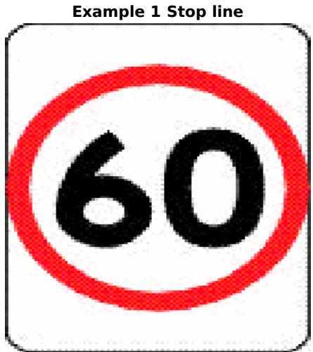

Example 2 Stopping and giving way at a stop sign to vehicles on the left and right

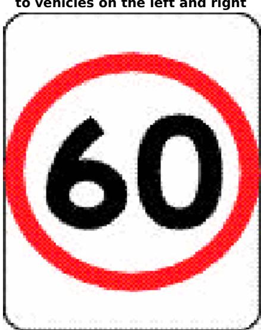

In example 2, vehicle B must stop and give way to each vehicle A.

Example 3 Stopping and giving way at a stop sign to an oncoming vehicle at a stop sign

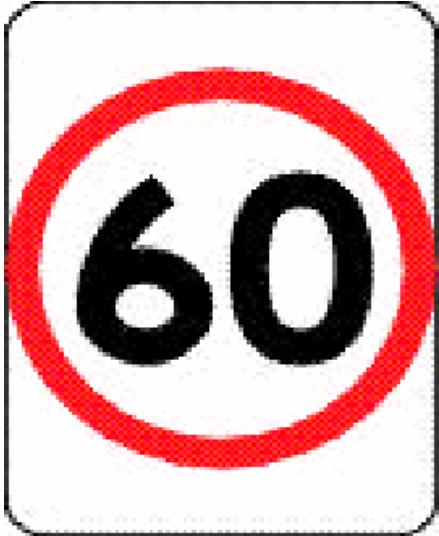

Example 4 Stopping and giving way at a stop sign to an oncoming vehicle that is not at a stop sign or

In examples 3 and 4, vehicle B must stop and give way to vehicle A.

# 68 Stopping and giving way at a stop sign or stop line at other places

(1) A driver approaching or at a place with a stop sign or stop line must stop and give way in accordance with this rule, unless the place is—

(a) an intersection, or

(b) a children’s crossing, or   
(c) an area of a road that is not a children’s crossing only because it does not have— (i) children crossing flags, or (ii) children’s crossing signs and twin yellow lights, or   
(d) a level crossing, or   
(e) a place with twin red lights.   
Maximum penalty—20 penalty units.

# Examples.

1 A stop sign at a break in a dividing strip dividing the part of the road used by the main body of moving vehicles from a service road.   
2 A stop sign on an exit from a carpark where the exit joins the road.

# Note 1.

Children’s crossing is defined in rule 80, intersection, stop line and twin red lights are defined in the Dictionary, and level crossing is defined in rule 120.

# Note 2.

For this rule, give way means the driver must remain stationary until it is safe for the driver to proceed—see the definition in the Dictionary.

# Note 3.

For the stopping and giving way rules applying to a driver at an intersection or level crossing with a stop sign or stop line, see rule 67 (intersections) and rule 121 (level crossings). Rule 80 deals with stopping at a stop line at a children’s crossing.

(2) The driver must stop as near as practicable to, but before reaching—

(a) the stop line, or (b) if there is no stop line—the stop sign.

(3) The driver must give way to any vehicle or pedestrian at or near the stop line or stop sign.

# Examples.

Example 1 Stopping and giving way at a stop sign at a break in a dividing strip

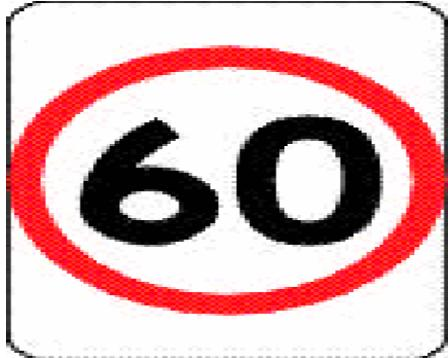

Example 2 Stopping and giving way at a stop sign where a carpark exit joins a road

In each example, vehicle B must stop and give way to vehicle A.

69 Giving way at a give way sign or give way line at an intersection (except a roundabout)

(1) A driver at an intersection (except a roundabout) with a give way sign or give way line must give way in accordance with this rule. Maximum penalty—20 penalty units.

# Note 1.

Give way line and intersection are defined in the Dictionary, and roundabout is defined in rule 109. This rule also applies to T-intersections—see the definition of intersection.

Note 2. For this rule, give way means the driver must slow down and, if necessary, stop to avoid a collision—see the definition in the Dictionary.

(2) Unless the driver is turning left using a slip lane, the driver must give way to a vehicle in, entering or approaching the intersection except—

(a) an oncoming vehicle turning right at the intersection if a stop sign, stop line, give way sign or give way line applies to the driver of the oncoming vehicle, or

(b) a vehicle turning left at the intersection using a slip lane, or

# Note.

Enter, oncoming vehicle, slip lane, stop line and U-turn are defined in the Dictionary.

(2A) If the driver is turning left using a slip lane, the driver must give way to—

(a) any vehicle on the road the driver is entering, or turning right at the intersection into the road the driver is entering (except a vehicle making a U-turn at the intersection), and

(b) any other vehicle or pedestrian on the slip lane.

(3) If the driver is turning left or right or making a U-turn, the driver must also give way to any pedestrian at or near the intersection who is crossing the road, or part of the road, the driver is entering.

# Note.

Rule 353(1) specifies that a driver is not required to give way to a pedestrian who is crossing the road that the driver is leaving, and rule 353(2) provides that a pedestrian who is only crossing a part of a road is considered to be crossing the road.

(4) For this rule, an oncoming vehicle travelling through a T-intersection on the continuing road is taken not to be turning.

# Examples.

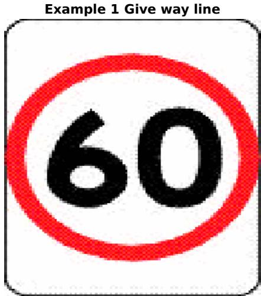

Example 2 Giving way at a give way sign to vehicles on the left and right

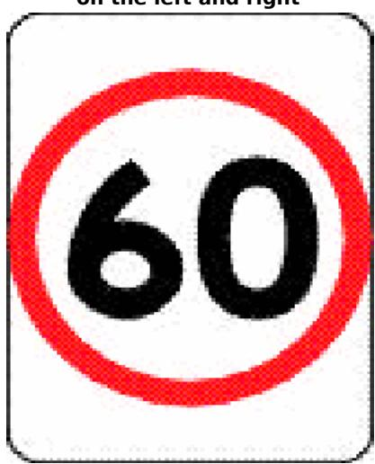

In example 2, vehicle B must give way to each vehicle A.

Example 3 Giving way at a give way sign to an oncoming vehicle at a give way sign

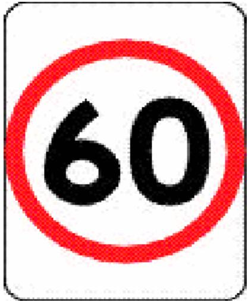

Example 4 Giving way at a give way sign to an oncoming vehicle that is not at a stop sign or give

In examples 3 and 4, vehicle B must give way to vehicle A.

Example 5 Driver turning right at a give way line does not have to give way to a vehicle turning left using a slip lane

In example 5, vehicle B must give way to vehicle A.

# 70 Giving way at a give way sign at a bridge or length of narrow road

A driver approaching a bridge or length of narrow road with a give way sign must give way to any oncoming vehicle that is on, or approaching, the bridge or length of road when the driver reaches the sign.

Maximum penalty—20 penalty units.

Note 1.

Oncoming vehicle is defined in the Dictionary.

# Note 2.

For this rule, give way means the driver must slow down and, if necessary, stop to avoid a collision—see the definition in the Dictionary.

# Examples.

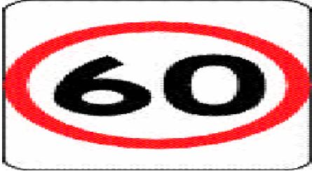  
Example 1 Giving way at a bridge

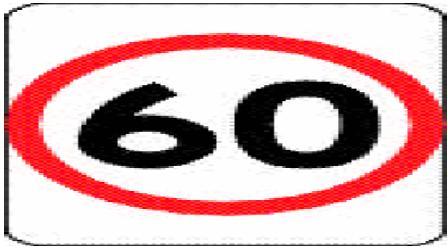  
Example 2 Giving way at a length of narrow road

In each example, vehicle B must give way to vehicle A.

# 71 Giving way at a give way sign or give way line at other places

(1) A driver approaching or at a place (except an intersection, bridge or length of narrow road, level crossing, or a place with twin red lights) with a give way sign or give way line must give way in accordance with this rule.

Maximum penalty—20 penalty units.

# Examples.

1 A give way sign at a break in a dividing strip dividing the part of the road used by the main body of moving vehicles from a service road. 2 A give way sign on a road at a place where a bicycle path meets the road.

# Note 1.

Give way line, intersection and twin red lights are defined in the Dictionary, and level crossing is defined in rule 120.

# Note 2.

For this rule, give way means the driver must slow down and, if necessary, stop to avoid a collision—see the definition in the Dictionary.

# Note 3.

For the give way rules applying to a driver at an intersection, bridge or length of narrow road, or level crossing, with a give way sign or give way line, see rule 69 (intersections), rule 70 (bridges and lengths of narrow road) and rule 122 (level crossings).

(2) The driver must give way to any vehicle or pedestrian at or near the give way sign or give way line.

# Examples.

Example 1 Giving way at a give way sign at a break in a dividing strip

Example 2 Giving way at a give way sign where a

In example 1, vehicle B must give way to vehicle A.

In example 2, the motor vehicle must give way to the bicycle.

# Division 2 Giving way at an intersection without traffic lights or a stop sign, stop line, give way sign or give way line applying to the driver

# Note.

For a driver, a reference in a rule in this Division to a traffic sign or road marking is a reference to a traffic sign or road marking applying to the driver—see rules 338 to 341.

# 72 Giving way at an intersection (except a T-intersection or roundabout)

(1) A driver at an intersection (except a T-intersection or roundabout) without traffic lights or a stop sign, stop line, give way sign or give way line, must give way in accordance with this rule.

Maximum penalty—20 penalty units.

# Note 1.

Give way line, intersection, stop line, T-intersection and traffic lights are defined in the Dictionary, and roundabout is defined in rule 109.

# Note 2.

For this rule, give way means the driver must slow down and, if necessary, stop to avoid a collision—see the definition in the Dictionary.

(2) If the driver is going straight ahead, the driver must give way to any vehicle approaching from the right, unless a stop sign, stop line, give way sign or give way line applies to the driver of the approaching vehicle.

# Examples.

Example 1 Driver going straight ahead giving way to a vehicle on the right that is going

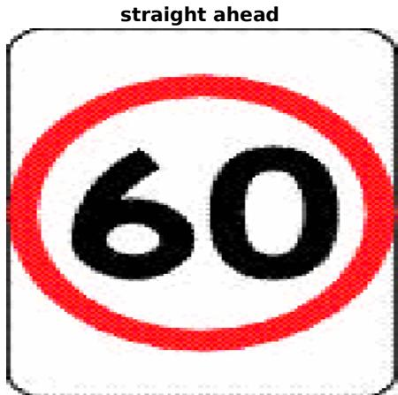

Example 2 Driver going straight ahead giving way to a vehicle on the right that is turning right

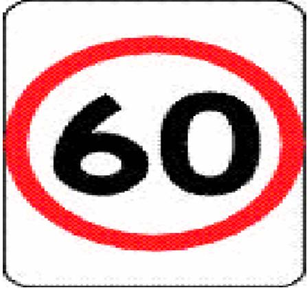

In each example, vehicle B must give way to vehicle A.

# Note.

Straight ahead is defined in the Dictionary.

(3) If the driver is turning left (except if the driver is using a slip lane), the driver must give way to—

(a) any vehicle approaching from the right, unless a stop sign, stop line, give way sign or give way line applies to the driver of the approaching vehicle, and   
(b) any pedestrian at or near the intersection who is crossing the road the driver is entering.

# Examples.

Example 3 Driver turning left giving way to a vehicle on the right that is going straight

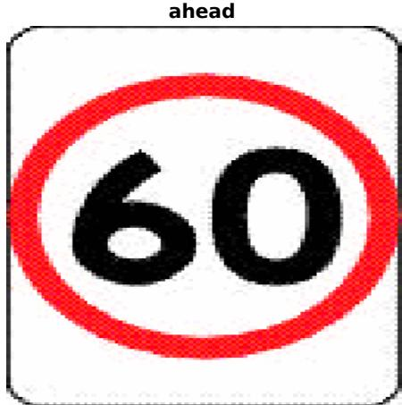

Example 4 Driver turning left giving way to a pedestrian on the road the driver is entering

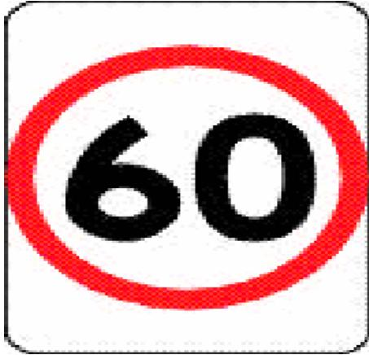

In example 3, vehicle B must give way to vehicle A.

In example 4, the vehicle must give way to the pedestrian.

# Note 1.

Slip lane is defined in the Dictionary.

# Note 2.

In relation to paragraph (b), rule 353(1) specifies that a driver is not required to give way to a pedestrian who is crossing the road that the driver is leaving, and rule 353(2) provides that a pedestrian who is only crossing a part of a road is considered to be crossing the road.

(4) If the driver is turning left using a slip lane, the driver must give way to—

(a) any vehicle approaching from the right or turning right at the intersection into the road the driver is entering (except a vehicle making a U-turn at the intersection), and

(b) any pedestrian on the slip lane.

# Note.

This subrule is not uniform with the corresponding subrule in rule 72 of the Australian Road Rules. However, the corresponding rule in the Australian Road Rules allows another jurisdiction to provide for drivers to be exempted from this rule. Different rules may apply in other Australian jurisdictions.

# Example.

Example 5 Driver turning left using a slip lane giving way to a vehicle that is turning right into the road the driver is entering

In this example, vehicle B must give way to vehicle A.

(5) If the driver is turning right, the driver must give way to—

(a) any vehicle approaching from the right, unless a stop sign, stop line, give way sign or give way line applies to the driver of the approaching vehicle, and

(b) any oncoming vehicle that is going straight ahead or turning left at the intersection, unless—

(i) a stop sign, stop line, give way sign or give way line applies to the driver of the oncoming vehicle, or (ii) the oncoming vehicle is turning left using a slip lane, and

(c) any pedestrian at or near the intersection who is crossing the road the driver is entering.

# Note 1.

Oncoming vehicle is defined in the Dictionary.

# Note 2.

In relation to paragraph (c), rule 353(1) specifies that a driver is not required to give way to a pedestrian who is crossing the road that the driver is leaving, and rule 353(2) provides that a pedestrian who is only crossing a part of a road is considered to be crossing the road.

# Examples.

Example 6 Driver turning right giving way to Example 7 Driver turning right giving way to an a vehicle on the right that is turning right into oncoming vehicle that is going straight ahead on

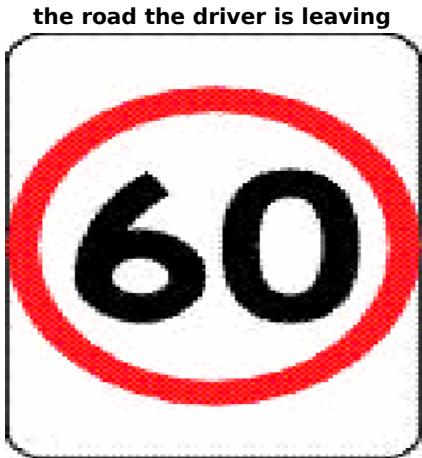

In examples 6 and 7, vehicle B must give way to vehicle A.

Example 8 Driver turning right giving way to an oncoming vehicle that is turning left into

Example 9 Driver turning right giving way to a pedestrian on the road the driver is entering

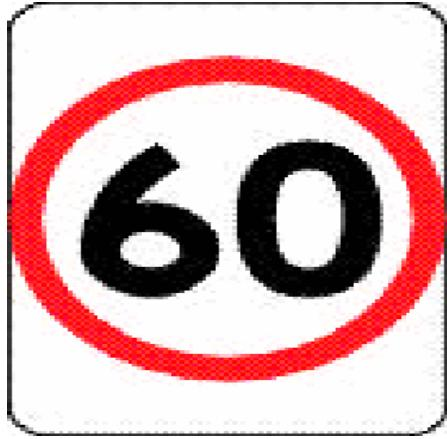

In example 8, vehicle B must give way to vehicle A.

In example 9, the vehicle must give way to the pedestrian.

# 73 Giving way at a T-intersection

(1) A driver at a T-intersection without traffic lights or a stop sign, stop line, give way sign or give way line, must give way in accordance with this rule. Maximum penalty—20 penalty units.

# Note 1.

Give way line, stop line, T-intersection and traffic lights are defined in the Dictionary.

# Note 2.

For this rule, give way means the driver must slow down and, if necessary, stop to avoid a collision—see the definition in the Dictionary.

# Note 3.

Rule 75(1)(d) requires a driver at a T-intersection to give way when crossing the continuing road to enter a road related area or adjacent land.

(2) If the driver is turning left (except if the driver is using a slip lane) or right from the terminating road into the continuing road, the driver must give way to—

(a) any vehicle travelling on the continuing road (except a vehicle making a U-turn on the continuing road at the T-intersection), and (b) any pedestrian who is crossing the continuing road at or near the intersection.

# Note 1.

Continuing road, slip lane and terminating road are defined in the Dictionary.

# Note 2.

In relation to paragraph (b), rule 353(1) specifies that a driver is not required to give way to a pedestrian who is crossing the terminating road, and rule 353(2) provides that a pedestrian who is only crossing a part of a road is considered to be crossing the road.

# Examples.

Example 1 Driver turning right from the terminating road giving way to a vehicle on

Example 2 Driver turning left (except if the driver is using a slip lane) from the terminating road giving way to a pedestrian on the continuing road

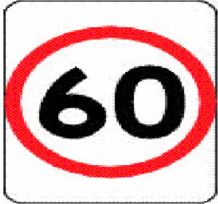

In example 1, vehicle B must give way to vehicle A.

In example 2, the vehicle must give way to the pedestrian.

(3) If the driver is turning left from the terminating road into the continuing road using a slip lane, the driver must give way to—

(a) any vehicle travelling on the continuing road (except a vehicle making a U-turn on the continuing road at the T-intersection), and   
(b) any pedestrian on the slip lane.

(4) If the driver is turning left (except if the driver is using a slip lane) from the continuing road into the terminating road, the driver must give way to any pedestrian who is crossing the terminating road at or near the intersection.

Example.

Example 3 Driver turning left (except if the driver is using a slip lane) from the continuing road giving way to a pedestrian on the terminating road

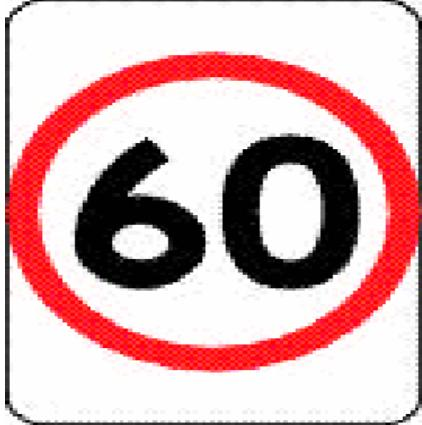

In this example, the vehicle must give way to the pedestrian.

# Note.

Rule 353(1) specifies that a driver is not required to give way to a pedestrian who is crossing the continuing road, and rule 353(2) provides that a pedestrian who is only crossing a part of a road is considered to be crossing the road.

(5) If the driver is turning from the continuing road into the terminating road using a slip lane, the driver must give way to—

(a) any vehicle approaching from the right (except a vehicle making a U-turn from the terminating road at the T-intersection), and

(b) any pedestrian on the slip lane.

# Note.

This subrule is not uniform with the corresponding subrule in rule 73 of the Australian Road Rules. However, the corresponding rule in the Australian Road Rules allows another jurisdiction to provide for drivers to be exempted from this rule. Different rules may apply in other Australian jurisdictions.

(6) If the driver is turning right from the continuing road into the terminating road, the driver must give way to—

(a) any oncoming vehicle that is travelling through the intersection on the continuing road or turning left at the intersection, and

(b) any pedestrian who is crossing the terminating road at or near the intersection.

# Note 1.

Oncoming vehicle is defined in the Dictionary.

# Note 2.

In relation to paragraph (b), rule 353(1) specifies that a driver is not required to give way to a pedestrian

who is crossing the continuing road, and rule 353(2) provides that a pedestrian who is only crossing a part of a road is considered to be crossing the road.

(7) In this rule—

turning left from the continuing road into the terminating road, for a driver, includes, where the continuing road curves to the right at a T-intersection, leaving the continuing road to proceed straight ahead onto the terminating road.

turning right from the continuing road into the terminating road, for a driver, includes, where the continuing road curves to the left at a T-intersection, leaving the continuing road to proceed straight ahead onto the terminating road.

# Note.

Straight ahead is defined in the Dictionary.

Examples.

Example 4 Driver turning right from the continuing road giving way to an oncoming vehicle travelling through the intersection on

Example 5 Driver leaving the continuing road to proceed straight ahead on the terminating road giving way to a vehicle travelling through the

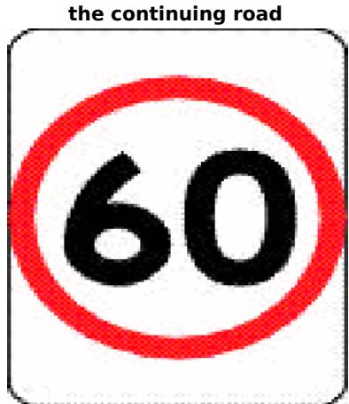

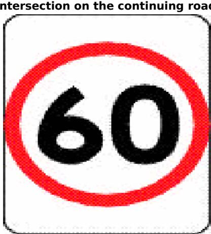

Example 5 shows a T-intersection where the continuing road (which is marked with broken white lines) goes around a corner. Vehicle B is leaving the continuing road to enter the terminating road. In examples 4 and 5, vehicle B must give way to vehicle A.

Example 6 Driver turning right from the continuing road giving way to an oncoming vehicle turning left from the continuing road

Example 7 Driver turning right from the continuing road giving way to a pedestrian on the

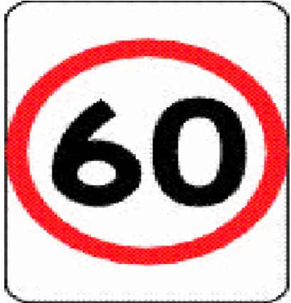

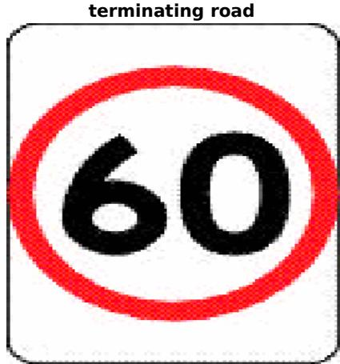

In example 6, vehicle B must give way to vehicle A.

In example 7, the vehicle must give way to the pedestrian.

# Division 3 Entering or leaving road related areas and adjacent land

74 Giving way when entering a road from a road related area or adjacent land (1) A driver entering a road from a road related area, or adjacent land, without traffic lights or a stop sign, stop line, give way sign or give way line must give way to—

(a) any vehicle travelling on the road or turning into the road (except a vehicle turning right into the road from a road related area or adjacent land), and   
(aa) a driver making a U-turn on the road, and   
(b) any pedestrian on the road, and   
(c) any vehicle or pedestrian on any road related area that the driver crosses to enter the road, and   
(d) for a driver entering the road from a road related area— (i) any pedestrian on the road related area, and (ii) any other vehicle ahead of the driver’s vehicle or approaching from the left or right.

Maximum penalty—20 penalty units.

# Note 1.

Adjacent land, give way line, stop line, traffic lights and U-turn are defined in the Dictionary, and road related area is defined in rule 13.

# Note 2.

Adjacent land or a road related area can include a driveway, service station or shopping centre—see the definitions of adjacent land and road related area. Some shopping centres may include roads—see the definition of road in rule 12.

# Note 3.

Part 6 applies to the driver if there are traffic lights. Rule 68 applies to the driver if there is a stop sign or stop line, and rule 71 applies to the driver if there is a give way sign or give way line.

# Note 4.

For this rule, give way means the driver must slow down and, if necessary, stop to avoid a collision—see the definition in the Dictionary.

(2) In this rule—

road does not include a road related area.

# Note.

A road related area includes any shoulder of a road—see rule 13.

Example.

Driver entering a road from a road related area giving way to a pedestrian on the footpath and a vehicle on the road

In this example, vehicle B must give way to the pedestrian on the footpath and to vehicle A.

# 75 Giving way when entering a road related area or adjacent land from a road

(1) A driver entering a road related area or adjacent land from a place on a road without traffic lights or a stop sign, stop line, give way sign or give way line must give way to— (a) any pedestrian on the road, and

(b) any vehicle or pedestrian on any road related area that the driver crosses or enters, and   
(c) if the driver is turning right from the road—any oncoming vehicle on the road that is going straight ahead or turning left, and   
(d) if the road the driver is leaving ends at a T-intersection opposite the road related area or adjacent land and the driver is crossing the continuing road—any vehicle on the continuing road.

Maximum penalty—20 penalty units.

# Note 1.

Adjacent land, continuing road, give way line, oncoming vehicle, stop line, straight ahead, Tintersection and traffic lights are defined in the Dictionary, and road related area is defined in rule 13

# Note 2.

Adjacent land or a road related area can include a driveway, service station or shopping centre—see the definitions of adjacent land and road related area. Some shopping centres may include roads—see the definition of road in rule 12.

# Note 3.

For this rule, give way means the driver must slow down and, if necessary, stop to avoid a collision—see the definition in the Dictionary.

# Note 4.

Part 6 applies to the driver if there are traffic lights. Rule 68 applies to the driver if there is a stop sign or stop line, and rule 71 applies to the driver if there is a give way sign or give way line.

(2) In this rule—

road does not include a road related area.

# Note.

A road related area includes any shoulder of a road—see rule 13.

Examples.

Example 1 Driver turning right from a road into a road related area giving way to an oncoming vehicle that is going straight ahead and to a

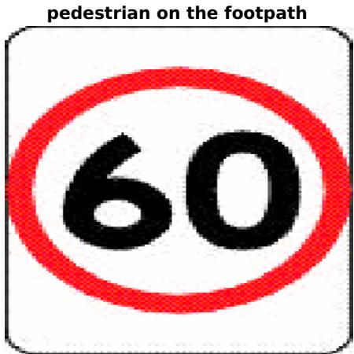

Example 2 Driver crossing a continuing road at a Tintersection to enter a road related area giving way

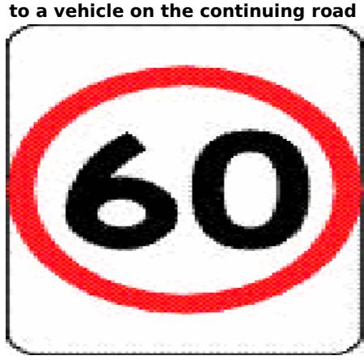

In each example, vehicle B must give way to vehicle A. In example 1, vehicle B must also give way to the pedestrian on the footpath.

# Division 4 Keeping clear of and giving way to particular vehicles

# 76 Keeping clear of trams travelling in tram lanes etc

(1) A driver must not move into the path of an approaching tram travelling in a tram lane, or on tram tracks marked along the left side of the tracks by a broken or continuous yellow line parallel to the tracks.

Maximum penalty—20 penalty units.

# Note.

Approaching, left, tram and tram tracks are defined in the Dictionary, and tram lane is defined in rule 155.

(2) If a driver is in the path of an approaching tram travelling in a tram lane, or on tram tracks marked along the left side of the tracks by a broken or continuous yellow line parallel to the tracks, the driver must move out of the path of the tram as soon as the driver can do so safely. Maximum penalty—20 penalty units.

(3) In this rule—

tram includes a bus travelling along tram tracks.

# Note.

Bus and travelling along tram tracks are defined in the Dictionary.

# 77 Giving way to buses

(1) A driver driving on a length of road in a built-up area, in the left lane or left line of traffic, or in a bicycle lane on the far left side of the road, must give way to a bus in front of the driver if—

(a) the bus has stopped, or is moving slowly, at the far left side of the road, on a shoulder of the road, or in a bus-stop bay, and   
(b) the bus displays a give way to buses sign and the right direction indicator lights of the bus are operating, and   
(c) the bus is about to enter or proceed in the lane or line of traffic in which the driver is driving.

Maximum penalty—20 penalty units.

# Note 1.

Built-up area, bus and length of road are defined in the Dictionary, left lane and left line of traffic are defined in subrule (2), and shoulder is defined in rule 12.

# Note 2.

For this rule, give way means the driver must slow down and, if necessary, stop to avoid a collision—see the definition in the Dictionary.

# Note 3.

The driver of the bus must give the change of direction signal for long enough to give sufficient warning to other drivers and pedestrians—see rule 48(2) and (3).

# Note 4.

Under rule 87(1), a driver entering a marked lane, or a line of traffic, from the side of the road must give way to any vehicle travelling in the lane or line of traffic. However, the driver of a public bus does not have to give way to a vehicle if the vehicle is required to give way to the bus under this rule and it is safe for the bus to enter the lane, or line of traffic, in which the other vehicle is travelling—see rule 87(2).

(2) In this rule— left lane, of a road, means—

(a) the marked lane nearest to the far left side of the road (the first lane) or, if the first lane is a bicycle lane, the marked lane next to the first lane, or

(b) if there is an obstruction in the first lane (for example, a parked car or roadworks) and the first lane is not a bicycle lane—the marked lane next to the first lane.

left line of traffic, for a road, means the line of traffic nearest to the far left side of the road.

# Note.

Marked lane and obstruction are defined in the Dictionary, and bicycle lane is defined in rule 153.

# Note 1 for diagram.

This sign is displayed on buses.

# Note 2 for diagram.

This sign must comply with the size requirements set out in rule 316–1.

# 78 Keeping clear of police and emergency vehicles

(1) A driver must not move into the path of an approaching police or emergency vehicle that is displaying a flashing blue or red light (whether or not it is also displaying other lights) or sounding an alarm.

Maximum penalty—20 penalty units.

# Note.

Approaching, emergency vehicle and police vehicle are defined in the Dictionary.

(2) If a driver is in the path of an approaching police or emergency vehicle that is displaying a flashing blue or red light (whether or not it is also displaying other lights) or sounding an alarm, the driver must move out of the path of the vehicle as soon as the driver can do so safely. Maximum penalty—20 penalty units.

(3) This rule applies to the driver despite any other rule of these Rules.

# 78–1 NSW rule: Approaching or passing stationary emergency response vehicles

(1) A driver approaching a stationary emergency response vehicle on a road that is displaying a flashing blue or red light or, in relation to a tow truck or motor breakdown service vehicle, a flashing yellow light must give way to any person who is on foot in the immediate vicinity of the vehicle.

Maximum penalty—20 penalty units.

# Note.

Approaching is defined in the Dictionary.

(2) If a stationary emergency response vehicle on a road is displaying a flashing blue or red light or, in relation to a tow truck or motor breakdown service vehicle, a flashing yellow light, a driver must not drive past the vehicle unless—

(a) where the speed limit applying to the driver for the length of the road does not exceed 80 kilometres per hour—the driver does not exceed 40 kilometres per hour when passing the stationary emergency response vehicle, or

(b) where the speed limit applying to the driver for the length of the road exceeds 80 kilometres per hour—the driver—

(i) passes the stationary emergency response vehicle at a reasonable speed having regard to the conditions, and

(ii) ensures that there is sufficient distance between the driver’s vehicle and the emergency response vehicle to allow the driver to safely avoid a collision with a person in the immediate vicinity of the emergency response vehicle, and

(iii) if the road is a multi-lane road—vacates the lane nearest the emergency response vehicle.

Maximum penalty—20 penalty units.

(2A) Subrule (2)(b)(iii) does not require a driver to vacate the lane nearest the emergency response vehicle if it is unsafe to do so.

(3) A driver who drives past a stationary emergency response vehicle on a road that is displaying a flashing blue or red light or, in relation to a tow truck or motor breakdown service vehicle, a flashing yellow light must not increase speed until the driver is at a sufficient distance from the vehicle so as to avoid causing a danger to any person in the immediate vicinity of the vehicle.

Maximum penalty—20 penalty units.

(4) A driver does not commit an offence under this rule if the driver is driving on a road that is divided by a median strip and the emergency response vehicle is on the other side of the road beyond the median strip.

# Note.

Median strip is defined in the Dictionary.

(5) This rule applies to a driver despite any other rule of these Rules.

(6) In this rule—

# emergency response vehicle means the following—

(a) a vehicle being used by—

(i) the NSW Police Force, or   
(ii) the Ambulance Service of NSW, or   
(iii) Fire and Rescue NSW (including a fire brigade within the meaning the Fire Brigades Act 1989), or   
(iv) the NSW Rural Fire Service, or   
(v) the NSW State Emergency Service, or   
(vi) Transport for NSW, or   
(vii) the Transport Management Centre, or   
(viii) the NSW Volunteer Rescue Association, or

(b) a tow truck, (c) a motor breakdown service vehicle.

# Note.

This rule is an additional NSW rule. There is no corresponding rule in the Australian Road Rules.

# 79 Giving way to police and emergency vehicles

(1) A driver must give way to a police or emergency vehicle that is displaying a flashing blue or red light (whether or not it is also displaying other lights) or sounding an alarm.

Maximum penalty—20 penalty units.

# Note 1.

Emergency vehicle and police vehicle are defined in the Dictionary.

# Note 2.

For this rule, give way means—

(a) if the driver is stopped—remain stationary until it is safe to proceed, or (b) in any other case—slow down and, if necessary, stop to avoid a collision, —see the definition in the Dictionary.

(2) This rule applies to the driver despite any other rule of these Rules that would otherwise require the driver of a police or emergency vehicle to give way to the driver.

# 79–1 NSW rule: interfering or interrupting funeral cortege or authorised procession

A driver must not interfere with, or interrupt, the free passage along any length of road

of—

(a) any funeral cortege or authorised procession, or

(b) any vehicle or person apparently forming part of the cortege or procession.

Maximum penalty—20 penalty units.

# Note.

This rule is an additional NSW road rule. There is no corresponding rule in the Australian Road Rules.

79–2 NSW rule: precedence at ferries, punts, bridges or railway crossings (1) A driver must, on arrival at any ferry, punt, bridge or railway crossing at which the driver is required to wait—

(a) keep the driver’s vehicle as near as practicable to that boundary of the carriageway of the road that is on the driver’s left, and at the end of the line of vehicles waiting to proceed on board the ferry or punt or over the bridge or railway crossing, and

(b) not break out of that line to take precedence over any vehicle that from its position had a prior right to proceed on board the ferry or punt or over the bridge or railway crossing.

Maximum penalty—20 penalty units.

# Note.

Carriageway and driver’s vehicle are defined in the Dictionary, and vehicle is defined in rule 15.

(2) However, subrule (1) does not apply to a driver at a ferry or punt if—

(a) an authorised person has given permission under this rule for the driver’s vehicle to break out of the line and take precedence over any vehicle that had a prior right to proceed on board the ferry or punt, and   
(b) the driver complies with any directions given by the authorised person as to the order or position in which the driver’s vehicle is to be placed and in which it may proceed to board the ferry or punt.

# Note.

Authorised person is defined in subrule (4).

(3) An authorised person may give permission for a driver to break out of line and take precedence over any vehicle that had a prior right to proceed on board a ferry or punt, in accordance with the directions of the authorised person, if the authorised person considers that an emergency or all the circumstances of the case make it necessary or appropriate for the driver to be given precedence.

# Note.

Precedence might, for example, be given to the driver of an ambulance proceeding to or from an accident, or to a fire fighter or police officer proceeding to an emergency or a bus being used to provide a regular bus service.

(4) In this rule—

authorised person means a police officer or, if no police officer is present, the person in charge of the ferry or punt concerned.

driver does not include a rider of a bicycle.

# Note.

This rule is an additional NSW road rule. There is no corresponding rule in the Australian Road Rules.

# Division 5 Crossings and shared zones

# 80 Stopping at a children’s crossing

(1) A driver approaching a children’s crossing must drive at a speed at which the driver can, if necessary, stop safely before the crossing.

Maximum penalty—20 penalty units.

# Note.

Children’s crossing is defined in subrule (6).

(2) A driver approaching or at a children’s crossing must stop as near as practicable to, but before reaching, the stop line at the crossing if—

(a) a hand-held stop sign is displayed at the crossing, or

(b) a pedestrian is on or entering the crossing.

Maximum penalty—20 penalty units.

# Note 1.

Stop line is defined in the Dictionary.

# Note 2.

Rule 322(3) and (4) deal with the meaning of a traffic control device at a place.

# Note 3.

This subrule is not uniform with the corresponding subrule in rule 80 of the Australian Road Rules. Different rules may apply in other Australian jurisdictions.

(3) If a driver stops at a children’s crossing for a hand-held stop sign, the driver must not proceed until there is no pedestrian on or entering the crossing and the holder of the

sign—

(a) no longer displays the sign towards the driver, or

(b) otherwise indicates that the driver may proceed.

Maximum penalty—20 penalty units.

# Note.

This subrule is not uniform with the corresponding subrule in rule 80 of the Australian Road Rules. Different rules may apply in other Australian jurisdictions.

(4) If a driver stops at a children’s crossing for a pedestrian, the driver must not proceed until there is no pedestrian on or entering the crossing.

Maximum penalty—20 penalty units.

# Note.

This subrule is not uniform with the corresponding subrule in rule 80 of the Australian Road Rules. Different rules may apply in other Australian jurisdictions.

(5) For this rule, if a children’s crossing extends across a road with a dividing strip, the part of the children’s crossing on each side of the dividing strip is taken to be a separate children’s crossing.

# Note.

Dividing strip is defined in the Dictionary.

(6) A children’s crossing is an area of a road—

(a) at a place with stop lines marked on the road, and—

(i) children crossing flags, or

(ii) children’s crossing signs and twin yellow lights, and

(b) indicated by—

(i) 2 red and white posts erected on each side of the road, or

(ii) 2 parallel continuous or broken lines on the road surface from one side of the road completely or partly across the road, and

(c) extending across the road between the posts or lines.

# Note.

Twin yellow lights is defined in the Dictionary.

Hand-held stop signs

Example.

Driver stopped at stop line for pedestrians on a children’s crossing with children crossing flags

In this example, the driver must stop at the stop line because there are pedestrians on the children’s crossing.

# Note.

Example 2 in rule 80 of the Australian Road Rules has not been reproduced because it is not relevant to this jurisdiction.

# 81 Giving way at a pedestrian crossing

(1) A driver approaching a pedestrian crossing must drive at a speed at which the driver

can, if necessary, stop safely before the crossing.

Maximum penalty—20 penalty units.

# Note.

Pedestrian crossing is defined in subrule (3).

(2) A driver must give way to any pedestrian on a pedestrian crossing. Maximum penalty—20 penalty units.

# Note 1.

For this rule, give way means the driver must slow down and, if necessary, stop to avoid a collision—see the definition in the Dictionary.

# Note 2.

This subrule is not uniform with the corresponding subrule in rule 81 of the Australian Road Rules. Different rules may apply in other Australian jurisdictions.

(3) A pedestrian crossing is an area of a road— (a) at a place with white stripes on the road surface that—

(i) run lengthwise along the road, and   
(ii) are of approximately the same length, and   
(iii) are approximately parallel to each other, and   
(iv) are in a row that extends completely, or partly, across the road, and

(b) with or without either or both of the following— (i) a pedestrian crossing sign, (ii) alternating flashing twin yellow lights.

# Note 1.

Twin yellow lights is defined in the Dictionary.

# Note 2.

Rule 322(3) and (4) deal with the meaning of a traffic sign at a place.

# Examples.

Example 2 Giving way to a pedestrian on a pedestrian crossing at a slip lane

In each of these examples, the driver must give way to the pedestrian on the crossing.

# 82 Overtaking or passing a vehicle at a children’s crossing or pedestrian crossing

A driver approaching a children’s crossing, or pedestrian crossing, must not overtake or pass a vehicle that is travelling in the same direction as the driver and is stopping, or has stopped, to give way to a pedestrian at the crossing.

Maximum penalty—20 penalty units.

Note 1.

Children’s crossing is defined in rule 80, overtake is defined in the Dictionary, and pedestrian crossing is defined in rule 81.

# Note 2.

This rule is not uniform with the corresponding rule 82 of the Australian Road Rules. Different rules may apply in other Australian jurisdictions.

# Example.

Driver not passing a vehicle that has stopped to give way to a pedestrian at a pedestrian crossing

In the example, vehicle A has stopped to give way to a pedestrian on the crossing. Vehicle B must not overtake or pass vehicle A.

# 83 Giving way to pedestrians in a shared zone

A driver driving in a shared zone must give way to any pedestrian in the zone.

Maximum penalty—20 penalty units.

# Note 1.

Shared zone is defined in rule 24.

# Note 2.

For this rule, give way means the driver must slow down and, if necessary, stop to avoid a collision—see the definition in the Dictionary.

# Division 6 Other give way rules

# 84 Giving way when driving through a break in a dividing strip

(1) If a driver drives through a break in a dividing strip that has no stop sign, stop line, give way sign or give way line, the driver must give way to—

(a) any tram on the dividing strip, and (b) any vehicle travelling on the part of the road the driver is entering (except a vehicle to which a stop sign, stop line, give way sign, or give way line, applies).

Maximum penalty—20 penalty units.

# Note 1.

Dividing strip, give way line, stop line and tram are defined in the Dictionary.

# Note 2.

Rule 68 applies to the driver if there is a stop sign or stop line, and rule 71 applies to the driver if there is a give way sign or give way line.

# Note 3.

For this rule, give way means the driver must slow down and, if necessary, stop to avoid a collision—see the definition in the Dictionary.

(2) In this rule—

tram includes a bus travelling along tram tracks.

Note.

Bus and travelling along tram tracks are defined in the Dictionary.

Examples.

Example 1 Giving way when driving through a break in a median strip

Example 2 Giving way when driving through a break in a dividing strip to leave a service road

Example 3 Giving way when driving through a break in a dividing strip to enter a service road

In each of the examples, vehicle B must give way to vehicle A.

# Note to examples.

A median strip is a particular kind of dividing strip—see the definition of median strip in the Dictionary.

# 85 Giving way on a painted island

A driver entering a turning lane from a painted island must give way to—

(a) any vehicle in the turning lane, or   
(b) if the turning lane and painted island are nearest to the far left side of the road—any vehicle entering the turning lane from the marked lane, or line of traffic, immediately to the right of the turning lane, or   
(c) if the turning lane and painted island are nearest to the dividing line or median strip on the road or the far right side of the road—any vehicle entering the turning lane from the marked lane, or line of traffic, immediately to the left of the turning lane.

Maximum penalty—20 penalty units.

# Note 1.

Line of traffic, marked lane, painted island and turning lane are defined in the Dictionary.

Note 2.   
Rules 138 and 139(4) allow a driver to drive on a painted island in certain circumstances.

# Note 3.

For this rule, give way means the driver must slow down and, if necessary, stop to avoid a collision—see the definition in the Dictionary.

# Examples.

Example 1 Driver entering a turning lane from a painted island giving way to a vehicle entering the turning lane from the marked lane immediately to the right of the turning lane.

Example 2 Driver entering a turning lane from a painted island giving way to a vehicle entering the turning lane from the marked lane immediately to the left of the turning lane.

In the examples, vehicle B must give way to vehicle A.

# 86 Giving way in median turning bays

(1) A driver entering a median turning bay must give way to any oncoming vehicle already in the turning bay.

Maximum penalty—20 penalty units.

# Note 1.

Oncoming vehicle is defined in the Dictionary.

# Note 2.

For this rule, give way means the driver must slow down and, if necessary, stop to avoid a collision—see the definition in the Dictionary.

(2) In this rule—

median turning bay means a marked lane, or the part of a marked lane—

(a) to which a median turning lane sign applies, or   
(b) where traffic lane arrows applying to the lane indicate that vehicles travelling in opposite directions must turn right.

# Note.

Marked lane and traffic lane arrows are defined in the Dictionary.

Example.

In the example, vehicle B must give way to vehicle A.

# 87 Giving way when moving from a side of a road or a median strip parking area

(1) A driver entering a marked lane, or a line of traffic, from the far left or right side of a road must give way to any vehicle travelling in the lane or line of traffic.

Maximum penalty—20 penalty units.

# Note 1.

Line of traffic and marked lane are defined in the Dictionary.

# Note 2.

For subrule (1), give way means—

(a) if the driver is stopped—remain stationary until it is safe to proceed, or (b) in any other case—slow down and, if necessary, stop to avoid a collision, —see the definition in the Dictionary.

(2) However, the driver of a public bus does not have to give way to a vehicle if— (a) the driver of the vehicle is required to give way to the bus under rule 77, and

(b) it is safe for the bus to enter the lane or line of traffic in which the vehicle is driving.

# Note 1.

Public bus is defined in the Dictionary.

# Note 2.

The bus must display a give way to buses sign and the right direction indicator lights of the bus must be operating—see rule 77.

(3) A driver turning from a median strip parking area into a marked lane, or a line of traffic, must give way to any vehicle travelling in the lane or line of traffic.

Maximum penalty—20 penalty units.

# Note 1.

Median strip parking area is defined in the Dictionary.

# Note 2.

For subrule (3), give way means the driver must slow down and, if necessary, stop to avoid a collision—see the definition in the Dictionary.

(4) In this rule—

road does not include a road related area, but includes any shoulder of the road.

# Note.

Road related area is defined in rule 13 and shoulder is defined in rule 12.

# Part 8 Traffic signs and road markings

# Note 1.

The rules in this Part cover most traffic signs and road markings. However, some traffic signs and road markings are dealt with in other Parts dealing with particular subjects. These include—

• speed limits (including speed limits in speed limited a   
• U-turns—see Part 4, Division 4   
• traffic lights—see Part 6   
• stop signs and give way signs—see Part 7, Division 1   
• roundabouts—see Part 9   
• level crossings—see Part 10   
• keeping left and lane signs—see Part 11   
• stopping and parking—see Part 12   
• pedestrians—see Part 14   
• bicycle riders—see Part 15.

# Note 2.

Rule 322 deals with the meaning of traffic control devices on a road or in or at an area or place (including an intersection).

# Note 3.

For a driver, a traffic sign or road marking mentioned in a rule is, unless the contrary intention appears, a sign or marking that applies to the driver. To find out how traffic signs and road markings apply to a driver, see rules 338 to 341.

# Division 1 Traffic signs and road markings at intersections and other places

Note.

Intersection, road marking and traffic sign are defined in the Dictionary.

# 88 Left turn signs

(1) If there is a left turn only sign at an intersection, a driver must turn left at the intersection. Maximum penalty—20 penalty units.

# Note.

For the meaning of left, see rule 351(1).

(2) If there is a left lane must turn left sign at an intersection, a driver who is in the left marked lane when entering the intersection must turn left at the intersection. Maximum penalty—20 penalty units.

# Note.

Marked lane is defined in the Dictionary.

Left lane must turn left sign

# 89 Right turn signs

(1) If there is a right turn only sign at an intersection, a driver must turn right at the intersection.

Maximum penalty—20 penalty units.

# Note.

For the meaning of right, see rule 351(2).

(2) If there is a right lane must turn right sign at an intersection, a driver who is in the right marked lane when entering the intersection must turn right at the intersection. Maximum penalty—20 penalty units.

# Note.

Marked lane is defined in the Dictionary.

(3) In this rule—

turn right does not include make a U-turn.

# Note.

U-turn is defined in the Dictionary.

Right lane must turn right sign

# 90 No turns signs

If there is a no turns sign at an intersection, a driver must not turn left or right, or make a

U-turn, at the intersection.

Maximum penalty—20 penalty units.

# Note.

U-turn is defined in the Dictionary.

# 91 No left turn and no right turn signs

(1) If there is a no left turn sign at an intersection, or another place on a road, a driver must not turn left at the intersection or place. Maximum penalty—20 penalty units.

(2) If there is a no right turn sign at an intersection, or another place on a road, a driver must not turn right or make a U-turn at the intersection or place. Maximum penalty—20 penalty units.

(3) However, a driver may make a U-turn at the intersection or place if there is a U-turn permitted sign at the intersection or place.

No left turn signs

# No left turn sign (Standard sign)

No left turn sign (Variable illuminated message

# No right turn signs

# No right turn sign (Standard sign)

# No right turn sign (Variable illuminated message

# 92 Traffic lane arrows

(1) If a driver is driving in a marked lane at an intersection (except a roundabout) and there are traffic lane arrows applying to the lane, the driver must—

(a) if the arrows indicate a single direction—drive in that direction, or (b) if the arrows indicate 2 or more directions—drive in one of those directions.

Maximum penalty—20 penalty units.

Note 1. Marked lane and traffic lane arrows are defined in the Dictionary.

# Note 2.

Part 9 deals with traffic lane arrows at roundabouts.

# Note 3.

Rule 329 explains when a traffic control device applies to a marked lane.

(2) However, this rule does not apply to a driver if—

(a) the arrows indicate a direction to the right (whether or not they also indicate another direction) at an intersection and the driver is making a U-turn at the intersection, or   
(b) a traffic sign indicates that the driver may drive in a direction different to that indicated by the traffic lane arrows, or   
(c) the driver is driving in the direction indicated by traffic lane arrows that apply to 1 or more marked lanes and there is an obstruction in each of those lanes, or   
(d) the driver is turning at an intersection in accordance with rule 28(2) or 32(2).

# Note 1.

# Obstruction and U-turn are defined in the Dictionary.

# Note 2.

Rules 40 and 41 deal with making a U-turn at an intersection. If there are traffic lights at the intersection, the driver may make a U-turn only if there is a $U$ -turn permitted sign at the intersection. If there are no traffic lights at the intersection, the driver may make a U-turn unless there is a no $U$ -turn sign at the intersection.

# Note 3.

Rule 28(2) deals with vehicles 7.5 metres long or longer turning left at an intersection from within the marked lane next to the left lane as well as, or instead of, the left lane on a multi-lane road. Rule 32(2) deals with vehicles 7.5 metres long or longer turning right at an intersection from within the marked lane next to the right lane as well as, or instead of, the right lane on a multi-lane road.

# Examples.

  
Example 2 Traffic lane arrows on a traffic sign

(3) The existence of a bicycle storage area in a marked lane does not alter a driver’s obligation to comply with this rule.

Note.

Bicycle storage area is defined in the Dictionary.

# Division 2 Traffic signs and road markings generally

# 93 No overtaking or passing signs

(1) A driver must not—

(a) drive past a no overtaking or passing sign if any oncoming vehicle is on the bridge or length of road to which the sign applies, or

(b) overtake a vehicle on a bridge or length of road to which a no overtaking or

passing sign applies.

Maximum penalty—20 penalty units.

# Note.

Oncoming vehicle and overtake are defined in the Dictionary.

(2) A no overtaking or passing sign on a road applies to the length of road (including a length of road on a bridge) beginning at the sign and ending—

(a) if information on or with the sign indicates a distance—at that distance past the sign, or   
(b) if the sign applies to a bridge—at the end of the bridge, or   
(c) at an end no overtaking or passing sign on the road.

# Note.

With is defined in the Dictionary.

No overtaking or passing sign

End no overtaking or passing sign

# 94 No overtaking on bridge signs

A driver on a bridge with a no overtaking on bridge sign must not overtake a vehicle between the sign and the far end of the bridge.

Maximum penalty—20 penalty units.

# Note.

Overtake is defined in the Dictionary.

# No overtaking on bridge sign

# 95 Emergency stopping lane only signs

(1) A driver must not drive in an emergency stopping lane unless—

(a) the driver needs to drive in the emergency stopping lane to avoid a collision, to stop in the lane, or because the driver’s vehicle is disabled, or (b) the driver is driving a police or emergency vehicle.

Maximum penalty—20 penalty units.

# Note 1.

Driver’s vehicle, emergency vehicle and police vehicle are defined in the Dictionary.

# Note 2.

Rule 178 deals with stopping in an emergency stopping lane.

# Note 3.

Subrule (1)(b) is not uniform with the corresponding paragraph in rule 95 of the Australian Road Rules. However, the corresponding paragraph in the Australian Road Rules allows another law of this jurisdiction to permit a driver to drive in an emergency stopping lane. Different rules may apply in other Australian jurisdictions.

(2) This rule does not apply to the rider of a bicycle.

Note 1.

Bicycle is defined in the Dictionary.

# Note 2.

If a no bicycles sign applies to the emergency stopping lane, the rider must not ride in the lane—see rule 252.

(3) In this rule—

emergency stopping lane means a marked lane, or the part of a marked lane, to which an emergency stopping lane only sign applies.

# Note 1.

Marked lane is defined in the Dictionary.

# Note 2.

Rule 329 explains when a traffic control device applies to a marked lane.

# Note for diagram.

The sign may have an arrow pointing in a different direction—see rule 316(4).

# 96 Keep clear markings

(1) A driver must not stop on an area of a road marked with a keep clear marking. Maximum penalty—20 penalty units.

(2) In this rule—

keep clear marking means the words “keep clear” marked across all or part of a road, with or without continuous lines marked across all or part of the road.

# Examples.

Example 1 Keep clear marking bounded by line road markings

Example 2 Keep clear marking with no line road markings

# 97 Road access signs

(1) A driver must not drive on a length of road to which a road access sign applies if

information on or with the sign indicates that the driver or the driver’s vehicle is not permitted beyond the sign.

Maximum penalty—20 penalty units.

# Note.

Driver’s vehicle, length of road and with are defined in the Dictionary.

(2) A road access sign on a road applies to the length of road beginning at the sign (including any road into which the length of road merges) and ending— (a) if the sign is on a freeway—at an end freeway sign or end road access sign on the road, or (b) if the sign is not on a freeway—at the nearer of the following— (i) if the road ends at a T-intersection or dead end—the end of the road, (ii) an end road access sign on the road.

# Example.

A road access sign on an access ramp to a freeway applies to the access ramp and the freeway into which the access ramp merges.

# Note 1.

Freeway is defined in rule 177, and road marking, T-intersection and traffic sign are defined in the Dictionary.

# Note 2.

Rule 229 applies the road access sign to pedestrians.

# Note 1 for diagrams.

There is another permitted version of the end freeway sign—see the diagram in Schedule 3.

# Note 2 for diagrams.

A road access sign may indicate that it applies to different or additional vehicles or persons—see rule 316(4).

# 98 One-way signs

(1) A driver must not drive on a length of road to which a one-way sign applies except in the direction indicated by the arrow on the sign. Maximum penalty—20 penalty units.

# Note.

Length of road is defined in the Dictionary.

(2) A one-way sign on a road applies to the length of road beginning at the sign and ending at the nearer of the following—

(a) a two-way sign on the road,   
(b) a keep left sign on the road,   
(c) another sign or road marking on the road that indicates that the road is a two-way road,   
(d) if the road ends at a T-intersection—the end of the road.

# Note 1.

Road marking, T-intersection and two-way road are defined in the Dictionary.

Note 2. There is a diagram of a keep left sign in rule 99.

(3) This rule does not apply to the rider of a motor bike that is a postal vehicle, the rider of a bicycle or the rider of an animal if the rider— (a) is riding on a bicycle path, footpath, nature strip, separated footpath or shared path adjacent to the length of road, and

(b) is permitted to ride on the bicycle path, footpath, nature strip, separated footpath or shared path under these Rules or another law of this jurisdiction.

# Note.

Bicycle, footpath, motor bike, nature strip and postal vehicle are defined in the Dictionary, bicycle path and separated footpath are defined in rule 239 and shared path is defined in rule 242.

# Note 1 for diagrams.

There is another permitted version of the two-way sign—see the diagram in Schedule 3.

# Note 2 for diagrams.

A one-way sign may have an arrow pointing in a different direction—see rule 316(4).

# 99 Keep left and keep right signs

(1) A driver driving past a keep left sign must drive to the left of the sign. Maximum penalty—20 penalty units.   
(2) A driver driving past a keep right sign must drive to the right of the sign. Maximum penalty—20 penalty units.   
(3) This rule does not apply to the rider of a motor bike that is a postal vehicle, the rider of a bicycle or the rider of an animal if the rider— (a) is riding on a bicycle path, footpath, nature strip, separated footpath or shared path, and (b) is permitted to ride on the bicycle path, footpath, nature strip, separated footpath or shared path under these Rules or another law of this jurisdiction.

# Note.

Bicycle, footpath, motor bike, nature strip and postal vehicle are defined in the Dictionary, bicycle path and separated footpath are defined in rule 239 and shared path is defined in rule 242.

# 100 No entry signs

A driver must not drive past a no entry sign.

Maximum penalty—20 penalty units.

No entry signs

# 101 Hand-held stop signs

(1) A driver approaching a hand-held stop sign must stop before reaching the sign. Maximum penalty—20 penalty units.

(2) The driver must not proceed until the holder of the sign—

(a) no longer displays the sign towards the driver, or

(b) otherwise indicates that the driver may proceed.

Maximum penalty—20 penalty units.

(3) This rule does not apply to a driver approaching or at a hand-held stop sign at a children’s crossing.

# Note.

Rule 80 defines children’s crossing, and deals with hand-held stop signs at children’s crossings.

# Hand-held stop signs

# 101A Safety ramp and arrester bed signs

(1) A driver must not drive on a safety ramp or arrester bed unless—

(a) it is necessary for the driver to do so in the interests of safety, or

(b) the driver is permitted to do so under another law of this jurisdiction.

Maximum penalty—20 penalty units.

(2) In this rule—

arrester bed means an area to which an arrester bed sign applies.   
safety ramp means an area to which a safety ramp sign applies.

# Division 3 Signs for trucks, buses and other large vehicles

# 102 Clearance and low clearance signs

(1) A driver must not drive past a clearance sign, or a low clearance sign, if the driver’s vehicle, or any vehicle connected to it, is higher than the height (in metres) indicated by the sign.

Maximum penalty—50 penalty units.

# Note.

Driver’s vehicle is defined in the Dictionary.

(2) In this rule—

vehicle includes any load carried by the vehicle.

# 103 Load limit signs

(1) A driver must not drive past a bridge load limit (gross mass) sign or gross load limit sign if the total of the gross mass (in tonnes) of the driver’s vehicle, and any vehicle connected to it, is more than the gross mass indicated by the sign.

Maximum penalty—20 penalty units.

# Note.

Driver’s vehicle is defined in the Dictionary.

(2) A driver must not drive past a bridge load limit (mass per axle group) sign if the mass (in tonnes) carried by an axle group of the driver’s vehicle, or any vehicle connected to it, is more than the mass indicated by the sign for the axle group. Maximum penalty—20 penalty units.

(3) In this rule—

vehicle includes any load carried by the vehicle.

# Bridge load limit (gross mass) sign

Bridge load limit (mass per axle group) sign

# 104 No trucks signs

(1) A driver (except the driver of a bus) must not drive past a no trucks sign that has information on or with it indicating a mass if the GVM of the driver’s vehicle (or, if the driver is driving a combination, any vehicle in the combination) is more than that mass, unless the driver is permitted to drive the vehicle on a route passing the sign under another law of this jurisdiction.

Maximum penalty—20 penalty units.

# Note.

Bus, combination, driver’s vehicle and with are defined in the Dictionary, and GVM is defined in the Act.

(2) A driver (except the driver of a bus) must not drive past a no trucks sign that has information on or with it indicating a length if the length of the driver’s vehicle (or, if the driver is driving a combination, the length of the combination) is longer than that length, unless the driver is permitted to drive the vehicle on a route passing the sign under another law of this jurisdiction.

Maximum penalty—

(a) for an offence in relation to the length of road between Galston and Hornsby Heights that crosses Galston Gorge—50 penalty units, or (b) otherwise—34 penalty units.

(3) The driver of a truck must not drive past a no trucks sign that has no information on or with it indicating a mass or length, unless the driver is permitted to drive the truck on a route passing the sign under another law of this jurisdiction.

Maximum penalty—20 penalty units.

# Note.

Truck is defined in the Dictionary.

(4) This rule does not apply to a driver if the destination of the driver lies beyond a no trucks sign and— (a) there is no other route by which the driver’s vehicle could reach that destination, or (b) any other route by which the driver’s vehicle could reach that destination would require the vehicle to pass another no trucks sign.

# 105 Trucks must enter signs

If the driver of a truck drives past a trucks must enter sign, the driver must enter the area indicated by information on or with the sign.

Maximum penalty—20 penalty units.

Note.

Truck and with are defined in the Dictionary.

# 106 No buses signs

(1) The driver of a bus must not drive past a no buses sign that has information on or with it indicating a mass if the GVM of the bus is more than that mass. Maximum penalty—20 penalty units.

# Note.

Bus and with are defined in the Dictionary, and GVM is defined in the Act.

(2) The driver of a bus must not drive past a no buses sign that has information on or with it indicating a length if the bus is longer than that length.

Maximum penalty—

(a) for an offence in relation to the length of road between Galston and Hornsby Heights that crosses Galston Gorge—50 penalty units, or

(b) otherwise—34 penalty units.

(3) The driver of a bus must not drive past a no buses sign that has no information on or with it indicating a mass or length.

Maximum penalty—20 penalty units.

# 107 Buses must enter signs

If the driver of a bus drives past a buses must enter sign, the driver must enter the area indicated by information on or with the sign.

Maximum penalty—20 penalty units.

# Note.

Bus and with are defined in the Dictionary.

# 108 Trucks and buses low gear signs

(1) If the driver of a truck or bus is driving on a length of road to which a trucks and buses low gear sign applies, the driver must drive the truck or bus in a gear that is low enough to limit the speed of the truck or bus without the use of a primary brake.

Maximum penalty—20 penalty units.

# Note.

Bus, length of road and truck are defined in the Dictionary.

(2) Subrule (1) does not apply to the driver of a bus if information on or with the sign indicates that it applies only to trucks.

Note.

With is defined in the Dictionary.

(3) A trucks and buses low gear sign on a road applies to the length of road beginning at the sign and ending—

(a) if information on or with the sign indicates a distance—at that distance on the road from the sign, or (b) in any other case—at an end trucks and buses low gear sign on the road.

(4) In this rule—

primary brake means the footbrake, or other brake, fitted to a truck or bus that is normally used to slow or stop the vehicle.

# Part 9 Roundabouts

# 109 What is a roundabout

A roundabout is an intersection—

(a) with either—

(i) one or more marked lanes, all of which are for the use of vehicles travelling in the same direction around a central traffic island, or   
(ii) room for 1 or more lines of traffic travelling in the same direction around a central traffic island, and

(b) with or without a roundabout sign at each entrance.

# Note 1.

Intersection, marked lane, traffic and traffic island are defined in the Dictionary.

# Note 2.

Rule 322(3) and (4) deal with the meaning of a traffic sign at a place.

# 110 Meaning of halfway around a roundabout

A driver leaves a roundabout halfway around the roundabout if the driver leaves the roundabout on a road that is straight ahead, or substantially straight ahead, from the road on which the driver enters the roundabout.

111 Entering a roundabout from a multi-lane road or a road with 2 or more lines of traffic travelling in the same direction

(1) A driver entering a roundabout from a multi-lane road, or a road with room for 2 or more lines of traffic (other than motor bikes, bicycles, motorised wheelchairs or animals) travelling in the same direction as the driver, must enter the roundabout in accordance with this rule.

Maximum penalty—20 penalty units.

# Note.

Multi-lane road is defined in the Dictionary.

(2) If the driver is to leave the roundabout less than halfway around it, the driver must enter the roundabout from the left marked lane or, if the road is not a multi-lane road, as near as practicable to the left side of the road.

Note.

Marked lane is defined in the Dictionary.

Example.

  
Example 1 Leaving a roundabout less than halfway around it

(3) If the driver is to leave the roundabout more than halfway around it, the driver must enter the roundabout from the right marked lane or, if the road is not a multi-lane road, from the left of, parallel to, and as near as practicable to, the dividing line or median strip.

Example.

  
Example 2 Leaving a roundabout more than halfway around it

(4) If the driver is to leave the roundabout halfway around it, the driver may enter the roundabout from any marked lane or, if the road is not a multi-lane road, anywhere on the part of the road on which vehicles travelling in the same direction as the driver may travel.

Example.

(5) Despite subrules (2) to (4), if the driver is entering the roundabout from a marked lane and there are traffic lane arrows applying to the lane, the driver must—

(a) if the arrows indicate a single direction—drive in that direction after entering the roundabout, or   
(b) if the arrows indicate 2 or more directions—drive in one of those directions after entering the roundabout.

# Note.

Traffic lane arrows is defined in the Dictionary.

Examples.

# Note 1 for examples 4 and 5.

Rule 116 requires a driver to obey traffic lane arrows when driving in or leaving a roundabout.

# Note 2 for examples 4 and 5.

The rules in Part 11 about driving in marked lanes, and moving from one marked lane or line of traffic, apply to a driver driving in a roundabout—see rules 146 to 148.

(6) Subrule (3) does not apply to the rider of a bicycle or animal.   
Note.

Bicycle is defined in the Dictionary.

(7) Subrule (5) does not apply to the rider of a bicycle or animal if the rider is to leave the

roundabout more than halfway around it.

(8) Despite subrule (2), a driver may approach and enter the roundabout from the marked lane next to the left lane as well as, or instead of, the left lane if— (a) the driver’s vehicle, together with any load or projection, is 7.5 metres long, or longer, and (b) the vehicle displays a do not overtake turning vehicle sign, and (c) any part of the vehicle is within 50 metres of the nearest point of the roundabout, and (d) it is not practicable for the driver to leave the roundabout less than halfway around it from within the left lane, and (e) the driver can safely occupy the next marked lane and can safely leave the roundabout less than halfway around it by occupying the next marked lane, or both lanes.

(9) Despite subrule (3), a driver may approach and enter the roundabout from the marked lane next to the right lane as well as, or instead of, the right lane if—

(a) the driver’s vehicle, together with any load or projection, is 7.5 metres long, or longer, and   
(b) the vehicle displays a do not overtake turning vehicle sign, and   
(c) any part of the vehicle is within 50 metres of the nearest point of the roundabout, and   
(d) it is not practicable for the driver to leave the roundabout more than halfway around it from within the right lane, and   
(e) the driver can safely occupy the next marked lane and can safely leave the roundabout more than halfway around it by occupying the next marked lane, or both lanes.

(10) In this rule—

# left lane means—

(a) the marked lane nearest to the far left side of the road, or (b) if there is an obstruction (for example, a parked car or roadworks) in that marked lane—the marked lane nearest to that marked lane that is not obstructed.

marked lane, for a driver, does not include a special purpose lane in which the driver is not permitted to drive.

# right lane means—

(a) the marked lane nearest to the dividing line or median strip on the road, or (b) if there is an obstruction (for example, a parked car or roadworks) in that marked lane—the marked lane nearest to that marked lane that is not obstructed.

# 112 Giving a left change of direction signal when entering a roundabout

(1) This rule applies to a driver entering a roundabout if—

(a) the driver is to leave the roundabout at the first exit after entering the roundabout, and (b) the exit is less than halfway around the roundabout.

(2) Before entering the roundabout, the driver must give a left change of direction signal for long enough to give sufficient warning to other drivers and pedestrians. Maximum penalty—20 penalty units.

# Note.

Left change of direction signal is defined in the Dictionary.

(3) The driver must continue to give the change of direction signal until the driver has left the roundabout. Maximum penalty—20 penalty units.

(4) This rule does not apply to a driver if the driver’s vehicle is not fitted with direction indicator lights.

Note.

Driver’s vehicle is defined in the Dictionary.

# 113 Giving a right change of direction signal when entering a roundabout

(1) This rule applies to a driver entering a roundabout if the driver is to leave the roundabout more than halfway around it.   
(2) Before entering the roundabout, the driver must give a right change of direction signal for long enough to give sufficient warning to other drivers and pedestrians. Maximum penalty—20 penalty units.

# Note.

Right change of direction signal is defined in the Dictionary.

(3) The driver must continue to give the change of direction signal while the driver is driving in the roundabout, unless—

(a) the driver is changing marked lanes, or entering another line of traffic, or (b) the driver’s vehicle is not fitted with direction indicator lights, or (c) the driver is about to leave the roundabout.

Maximum penalty—20 penalty units.

# Note 1.

Driver’s vehicle and marked lane are defined in the Dictionary.

Note 2. Rule 117 deals with giving change of direction signals before changing marked lanes, or entering another line of traffic, in a roundabout.

Note 3. Rule 118 requires a driver, if practicable, to give a left change of direction signal when leaving a roundabout.

# 114 Giving way when entering or driving in a roundabout

(1) A driver entering a roundabout must give way to—

(a) any vehicle in the roundabout, and

(b) a tram that is entering or approaching the roundabout.

Maximum penalty—20 penalty units.

Note 1. Tram is defined in the Dictionary.

# Note 2.

For this rule, give way means the driver must slow down and, if necessary, stop to avoid a collision—see the definition in the Dictionary.

(2) A driver driving in a roundabout must give way to a tram that is in, entering or approaching the roundabout. Maximum penalty—20 penalty units.

(3) In this rule—

tram includes a bus travelling along tram tracks.

# Note 1.

Bus and travelling along tram tracks are defined in the Dictionary.

# Note 2.

For the give way rules applying to a driver moving from one marked lane or line of traffic to another marked lane or line of traffic, see rule 148.

# 115 Driving in a roundabout

(1) A driver driving in a roundabout must drive—

(a) to the left of the central traffic island in the roundabout, or   
(b) if subrule (2) applies to the driver—on the edge of the central traffic island, to the left of the centre of the island, or   
(c) if subrule (3) applies to the driver—over the central traffic island, as near as practicable to the left of the centre of the island.

Maximum penalty—20 penalty units.

# Note.

Traffic island is defined in the Dictionary.

(2) This subrule applies to a driver if—

(a) the driver’s vehicle is too large to drive in the roundabout without driving on the edge of the central traffic island, and (b) the driver can safely drive on the edge of the central traffic island.

# Note.

Driver’s vehicle is defined in the Dictionary.

(3) This subrule applies to a driver if—

(a) the driver’s vehicle is too large to drive in the roundabout without driving over the central traffic island, and   
(b) the central traffic island is designed to allow a vehicle of that kind to be driven over it, and   
(c) the driver can safely drive over the central traffic island.

# 116 Obeying traffic lane arrows when driving in or leaving a roundabout

If a driver is driving in a marked lane in a roundabout and there are traffic lane arrows applying to the lane, the driver must—

(a) if the arrows indicate a single direction—drive in or leave the roundabout in that direction, or   
(b) if the arrows indicate 2 or more directions—drive in or leave the roundabout in one of those directions.

Maximum penalty—20 penalty units.

# Note.

Marked lane and traffic lane arrows are defined in the Dictionary.

117 Giving a change of direction signal when changing marked lanes or lines of traffic in a roundabout

(1) A driver driving in a roundabout must give a left change of direction signal before the driver changes marked lanes to the left, or enters a part of the roundabout where there is room for another line of traffic to the left, in the roundabout, unless the driver’s vehicle is not fitted with direction indicator lights.

Maximum penalty—20 penalty units.

# Note.

Driver’s vehicle and left change of direction signal are defined in the Dictionary.

(2) A driver driving in a roundabout must give a right change of direction signal before the driver changes marked lanes to the right, or enters a part of the roundabout where there is room for another line of traffic to the right, in the roundabout. Maximum penalty—20 penalty units.

# Note.

Right change of direction signal is defined in the Dictionary.

# 118 Giving a left change of direction signal when leaving a roundabout

(1) If practicable, a driver driving in a roundabout must give a left change of direction signal when leaving the roundabout. Maximum penalty—20 penalty units.

# Note.

Left change of direction signal is defined in the Dictionary.

(2) The driver must stop giving the change of direction signal as soon as the driver has left the roundabout. Maximum penalty—20 penalty units.

(3) This rule does not apply to a driver if the driver’s vehicle is not fitted with direction indicator lights.

Note 1.

Driver’s vehicle is defined in the Dictionary.

Note 2.

The rules in Part 11 about driving in marked lanes and moving from one marked lane or line of traffic to another marked lane or line of traffic apply to a driver leaving a roundabout—see rules 146 to 148.

# 119 Giving way by the rider of a bicycle or animal to a vehicle leaving a roundabout

The rider of a bicycle or animal who is riding in the far left marked lane of a roundabout with 2 or more marked lanes, or the far left line of traffic in a roundabout with room for 2 or more lines of traffic (other than motor bikes, bicycles, motorised wheelchairs or animals), must give way to any vehicle leaving the roundabout.

Maximum penalty—20 penalty units.

# Note 1.

Bicycle and marked lane are defined in the Dictionary, and vehicle is defined in rule 15.

Note 2.

For this rule, give way means the rider must slow down and, if necessary, stop to avoid a collision—see the definition in the Dictionary.

# Part 10 Level crossings

120 What is a level crossing

(1) A level crossing is—

(a) an area where a road and a railway meet at substantially the same level, whether or not there is a level crossing sign on the road at all or any of the entrances to the area, or

(b) an area where a road and tram tracks meet at substantially the same level and that has a level crossing sign on the road at each entrance to the area.

# Note.

Tram tracks is defined in the Dictionary.

(1A) A reference to a level crossing in this rule includes a reference to any area adjacent to the crossing that is denoted by painted cross-hatched road markings.

(2) In this rule—

road does not include a road related area.

# Note.

Road related area is defined in rule 13.

# Level crossing signs

# 121 Stopping and giving way at a stop sign at a level crossing

A driver at a level crossing with a stop sign must—

(a) stop as near as practicable to, but before reaching, the stop line or, if there is no stop line, as near as practicable to, but before reaching, the stop sign, and

(b) give way to any train or tram on, approaching or entering the crossing.

Maximum penalty—20 penalty units.

Note 1.

Approaching, enter, stop line and tram are defined in the Dictionary.

# Note 2.

For this rule, give way means the driver must remain stationary until it is safe for the driver to proceed—see the definition in the Dictionary.

# 122 Giving way at a give way sign or give way line at a level crossing

A driver at a level crossing with a give way sign or give way line must give way to any train or tram on, approaching or entering the crossing.

Maximum penalty—20 penalty units.

Approaching, enter, give way line and tram are defined in the Dictionary.

Note 2.

For this rule, give way means the driver must slow down and, if necessary, stop to avoid a collision—see the definition in the Dictionary.

# 123 Entering a level crossing when a train or tram is approaching etc

A driver must not enter a level crossing if—

(a) warning lights (for example, twin red lights or rotating red lights) are operating or warning bells are ringing, or

(b) a gate, boom or barrier at the crossing is closed or is opening or closing, or

(c) a train or tram is on or entering the crossing, or

(d) a train or tram approaching the crossing can be seen from the crossing, or is sounding a warning, and there would be a danger of a collision with the train or tram if the driver entered the crossing, or

(e) the driver cannot drive through the crossing because the crossing, or a road beyond the crossing, is blocked.

Maximum penalty—20 penalty units.

# Examples for paragraph (e).

The crossing, or a road beyond the crossing, may be blocked by congested traffic, a disabled vehicle, a collision between vehicles or between a vehicle and a pedestrian, or by stock on the road.

# Note.

Approaching, enter, tram and twin red lights are defined in the Dictionary.

# 124 Leaving a level crossing

A driver who enters a level crossing must leave the level crossing as soon as the driver can do so safely.

Maximum penalty—20 penalty units.

# Note.

Enter is defined in the Dictionary.

# Part 11 Keeping left, overtaking and other driving rules

# Division 1 General

125 Unreasonably obstructing drivers or pedestrians

(1) A driver must not unreasonably obstruct the path of another driver or a pedestrian. Maximum penalty—20 penalty units.

# Note.

Driver includes a person in control of a vehicle—see the definition of drive in the Dictionary.

(2) For this rule, a driver does not unreasonably obstruct the path of another driver or a pedestrian only because—

(a) the driver is stopped in traffic, or   
(b) the driver is driving more slowly than other vehicles (unless the driver is driving abnormally slowly in the circumstances).

# Example of a driver driving abnormally slowly.

A driver driving at a speed of 20 kilometres per hour on a length of road to which a speed limit of 80 kilometres per hour applies when there is no reason for the driver to drive at that speed on the length of road.

# 126 Keeping a safe distance behind vehicles

A driver must drive a sufficient distance behind a vehicle travelling in front of the driver so the driver can, if necessary, stop safely to avoid a collision with the vehicle.

Maximum penalty—20 penalty units.

# 127 Keeping a minimum distance between long vehicles

(1) The driver of a long vehicle must drive at least the required minimum distance behind another long vehicle travelling in front of the driver, unless the driver is—

(a) driving on a multi-lane road or any length of road in a built-up area, or (b) overtaking.

Maximum penalty—20 penalty units.

# Note.

Built-up area, length of road, multi-lane road and overtake are defined in the Dictionary.

(2) In this rule—

long vehicle means a vehicle that, together with any load or projection, is 7.5 metres

long, or longer.

Note.

Vehicle includes a combination—see rule 15(d).

# required minimum distance means—

(a) for a road train that is behind a long vehicle—200 metres or, if another law of this jurisdiction specifies a different distance, that distance, or

(b) for a long vehicle other than a road train that is behind a long vehicle—60 metres or, if another law of this jurisdiction specifies a different distance, that distance.

road train has the same meaning as in the Heavy Vehicle National Law (NSW).

This definition is not uniform with the corresponding definition in rule 127(2) of the Australian Road Rules. However, the definition in the Australian Road Rules allows the term to be defined by reference to another law of this jurisdiction. Different rules may apply in other Australian jurisdictions. Different definitions may apply in other Australian jurisdictions.

# 128 Entering blocked intersections

A driver must not enter an intersection if the driver cannot drive through the intersection because the intersection, or a road beyond the intersection, is blocked.

Maximum penalty—20 penalty units.

# Examples.

The intersection, or a road beyond the intersection, may be blocked by congested traffic, a disabled vehicle, a collision between vehicles or between a vehicle and a pedestrian, or by a fallen load on the road.

# Note.

Enter and intersection are defined in the Dictionary.

# 128A Entering blocked crossings

(1) A driver must not enter a children’s crossing, marked foot crossing or pedestrian crossing if the driver cannot drive through the crossing because the crossing, or a road beyond the crossing, is blocked.

Maximum penalty—20 penalty units.

# Examples.

The crossing, or a road beyond the crossing, may be blocked by congested traffic, a disabled vehicle, a collision between vehicles or between a vehicle and a pedestrian, or by a fallen load on the road.

# Note.

Children’s crossing, enter, marked foot crossing and pedestrian crossing are defined in the Dictionary.

(2) Despite subrule (1), a driver may enter a children’s crossing or a pedestrian crossing if—

(a) the crossing is immediately before an intersection that does not have traffic lights, and

(b) the crossing is not blocked, and

(c) before entering the crossing, the driver gives way to any pedestrian on the crossing.

(3) Subrule (2) applies despite anything to the contrary in rule 171 (Stopping on or near a children's crossing) or rule 172 (Stopping on or near a pedestrian crossing (except at an intersection)).

(4) However, subrule (3) is not intended to permit a driver to park a vehicle contrary to rule 171 or 172.

# Division 2 Keeping to the left

# 129 Keeping to the far left side of a road

(1) A driver on a road (except a multi-lane road) must drive as near as practicable to the far left side of the road.

Maximum penalty—20 penalty units.

# Note.

Multi-lane road is defined in the Dictionary.

(2) This rule does not apply to the rider of a motor bike.

Note.

Motor bike is defined in the Dictionary.

(3) In this rule—

road does not include a road related area.

# Note.

Road related area includes the shoulder of a road—see rule 13.

# 130 Keeping to the left on a multi-lane road

(1) This rule applies to a driver driving on a multi-lane road if—

(a) the speed limit applying to the driver for the length of road where the driver is driving is over 80 kilometres per hour, or (b) a keep left unless overtaking sign applies to the length of road where the driver is

driving.

# Note 1.

Length of road and multi-lane road are defined in the Dictionary.

# Note 2.

Part 3 deals with speed limits.

(2) The driver must not drive in the right lane unless—

(a) the driver is turning right, or making a U-turn from the centre of the road, and is giving a right change of direction signal, or   
(b) the driver is overtaking, or   
(b1) the driver is approaching or passing a stationary emergency response vehicle with a flashing blue, red or yellow light (in accordance with rule 78–1), or   
(c) a left lane must turn left sign or left traffic lane arrows apply to any other lane and the driver is not turning left, or   
(d) the driver is required to drive in the right lane under rule 159, or   
(e) the driver is avoiding an obstruction, or   
(f) the traffic in each other lane is congested, or   
(g) the traffic in every lane is congested, or   
(h) the right lane is a special purpose lane in which the driver, under another provision of these Rules, is permitted to drive, or   
(i) there are only 2 marked lanes and the left lane is a slow vehicle turn out lane.

Maximum penalty—20 penalty units.

# Note 1.

Centre of the road, left traffic lane arrows, obstruction, overtake, right change of direction signal, special purpose lane, traffic, and $\pmb { U }$ -turn are defined in the Dictionary.

Note 2. Rule 159 deals with traffic signs that require a particular kind of vehicle to drive in the marked lane indicated by the signs.

# Note 3.

Rule 329 deals with when a traffic control device applies to a marked lane.

(3) A keep left unless overtaking sign on a multi-lane road applies to the length of road beginning at the sign and ending at the nearest of the following—

(a) an end keep left unless overtaking sign on the road,   
(b) a traffic sign or road marking on the road that indicates that the road is no longer a multi-lane road,   
(c) if the road ends at a T-intersection or dead end—the end of the road.

# Note.

Road marking, T-intersection and traffic sign are defined in the Dictionary.

(4) In this rule—

lane, for a driver, means a marked lane for vehicles travelling in the same direction as the driver, but does not include a special purpose lane in which the driver is not permitted to drive.

Note 1.

Marked lane and special purpose lane are defined in the Dictionary.

# Note 2.

Rule 95 deals with driving in emergency stopping lanes, and Division 6 of this Part deals with driving in other special purpose lanes.

slow vehicle turn out lane means a marked lane, or the part of a marked lane, to which a slow vehicle turn out lane sign applies.

# Note.

A slow vehicle turn out lane is designed for slow-moving vehicles to move into to allow faster vehicles to pass in an adjacent marked lane.

  
Slow vehicle turn out lane sign

# Note for diagrams.

There is another permitted version of the end keep left unless overtaking sign—see the diagram in Schedule 3.

# 131 Keeping to the left of oncoming vehicles

(1) A driver must drive to the left of any oncoming vehicle unless—

(a) the driver is turning right at an intersection, and   
(b) the driver is passing an oncoming vehicle turning right at the intersection, and   
(c) there is no traffic sign or road marking indicating that the driver must pass to the left of the oncoming vehicle.   
Maximum penalty—20 penalty units.

# Note 1.

Intersection, oncoming vehicle, road marking and traffic sign are defined in the Dictionary.

# Note 2.

Part 4, Division 2 deals with making right turns.

(2) This rule does not apply to the rider of a motor bike that is a postal vehicle, the rider of a bicycle or the rider of an animal if—

(a) the rider is riding on a footpath, nature strip or shared path, and   
(b) the rider is permitted to ride on the footpath, nature strip or shared path under these Rules or another law of this jurisdiction, and   
(c) either— (i) the oncoming vehicle is not on the footpath, nature strip or shared path, or (ii) the oncoming vehicle is not permitted, under these Rules or under another la of this jurisdiction, to be on the footpath, nature strip or shared path.

# Note.

Bicycle, footpath, motor bike, nature strip and postal vehicle are defined in the Dictionary and shared path is defined in rule 242.

Examples.

Example 1 Driving to the left of an oncoming

Example 2 Oncoming vehicles turning right passing to the right of each other

# 132 Keeping to the left of the centre of a road or the dividing line

(1) A driver on a two-way road without a dividing line or median strip must drive to the left of the centre of the road, except as permitted under rule 133 or 139(1).

Maximum penalty—20 penalty units.

# Note 1.

Centre of the road, dividing line, median strip and two-way road are defined in the Dictionary.

# Note 2.

For the meaning of driving to the left of something, see rule 351(3).

# Note 3.

Rule 133 deals with driving to the right of the centre of the road to overtake another vehicle, to enter or leave a road, to move from one part of the road to another, or because of the width or condition of the road. Rule 139(1) deals with driving to the right of the centre of the road to avoid an obstruction.

(2) A driver on a road with a dividing line must drive to the left of the dividing line, except as permitted under rule 134 or 139(2).

Maximum penalty—20 penalty units.

# Note.

Rule 134 deals with driving to the right of the dividing line to overtake another vehicle, to enter or leave a road, or to move from one part of the road to another. Rule 139(2) deals with driving to the right of the

dividing line to avoid an obstruction.

The effect of this subrule, in relation to continuous dividing lines, is as follows—

(a) in the case of a dividing line that is only a single continuous dividing line, or that is a broken dividing line to the right of a single continuous dividing line, a driver may only drive to the right of such a line in the circumstances set out in rules 134(3) and 139(2), as supplemented by rule 139(3),

(b) in the case of a dividing line that is a single continuous dividing line to the right of a broken dividing line, a driver may only drive to the right of such a line in the circumstances set out in rules 134(2), 134(3) and 139(2),

(c) in the case of a dividing line that is 2 parallel continuous dividing lines, a driver may only drive to the right of such a line in the circumstances set out in rule 139(2), as supplemented by rule 139(3).

(2A) A driver on a road with a single continuous dividing line, a single continuous dividing line to the left of a broken dividing line or 2 parallel continuous dividing lines must not drive across the dividing lines to perform a U-turn.

Maximum penalty—20 penalty units.

Example 1 Driving across a single continuous dividing line to make a U-turn is not

Example 2 Driving across a single continuous dividing line to the left of a broken dividing line to make a U-turn is not permitted

xample 3 Driving across 2 parallel continuous dividing lines to make a U-turn is not permit

(3) This rule, and rules 133, 134 and 139(1) and (2), apply to a service road to which a two-way sign applies as if it were a separate road, but do not apply to any other service road.

Note 1.

Service road is defined in the Dictionary.

# Note 2.

Rule 136 deals with driving on a service road without a two-way sign.

(4) In this rule—

road does not include a footpath, nature strip, bicycle path, separated footpath or shared path.

# Note.

Footpath and nature strip are defined in the Dictionary, bicycle path and separated footpath are defined in rule 239 and shared path is defined in rule 242.

# Note for diagram.

There is another permitted version of the two-way sign—see the diagram in Schedule 3.

Examples for subrule (2).

Example 1 Driving to the left of a single continuous dividing line only

Example 2 Driving to the left of a single continuous dividing line to the left of a broken dividing line

Example 3 Driving to the left of 2 parallel continuous dividing lines

# 133 Exceptions to keeping to the left of the centre of a road

(1) This rule applies to a driver on a two-way road without a dividing line or median strip.   
Note.

Dividing line, median strip and two-way road are defined in the Dictionary.

(2) The driver may drive to the right of the centre of the road—

(a) to overtake another driver, or

(b) to enter or leave the road, or (c) to enter a part of the road of one kind from a part of the road of another kind (for example, moving to or from a service road or emergency stopping lane).

# Note.

Centre of the road, overtake and service road are defined in the Dictionary, and emergency stopping lane is defined in rule 95.

(3) The driver may also drive to the right of the centre of the road if—

(a) because of the width or condition of the road, it is not practicable to drive to the left of the centre of the road, and   
(b) the driver can do so safely.

# 134 Exceptions to keeping to the left of a dividing line

(1) This rule applies to a driver on a road with a dividing line.   
Note.

Dividing line is defined the Dictionary.

(2) If the dividing line is a single broken dividing line only, or a broken dividing line to the left of a single continuous dividing line, or 2 parallel broken dividing lines, the driver may drive to the right of the dividing line—

(a) to overtake another driver, or   
(b) to perform a U-turn, unless another rule would prohibit the driver performing the U-turn.

# Note 1.

Overtake is defined the Dictionary.

# Note 2.

A driver must not overtake another driver unless the driver has a clear view of any approaching traffic, and it is safe to overtake the other driver—see rule 140.

(3) If the dividing line is a single continuous line or broken dividing line, or a broken dividing line to the left or right of a single continuous dividing line, or 2 parallel broken dividing lines, the driver may drive to the right of the dividing line—

(a) to enter or leave the road, or (b) to enter a part of the road of one kind from a part of the road of another kind (for example, moving to or from a service road or emergency stopping lane), or (c) to park in angle parking on the opposite side of the road provided that the driver does not need to perform a U-turn to reach the parking area.

Note 1.

Angle parking, overtake, parking area and $\pmb { U }$ -turn are defined in the Dictionary.

# Note 2.

Emergency stopping lane is defined in rule 95, and service road is defined in the Dictionary.

(3–1) Without limiting subrule (2) or (3), a driver on a road with a dividing line (whether or not continuous) may drive to the right of the dividing line to enter or leave the road by the shortest practicable route.

# Note.

This subrule is an additional NSW subrule. There is no corresponding subrule in rule 134 of the Australian Road Rules.

# Examples.

Example 1 Driving to the right of the centre of the road permitted—overtaking on a road with a

Example 2 Driving to the right of the centre of the road permitted—overtaking on a road with a broken dividing line to the left of a single continuous

Example 2A Driving across a single continuous dividing line is permitted to enter or leave the

Example 2B Driving across a single continuous dividing line is permitted to leave the road to enter

Example 2C Driving across a single continuous dividing line to the left of a broken dividing line is permitted to enter or leave the road

Example 3 Driving to the right of the centre of the road not permitted—overtaking on a road with a single continuous dividing line only

Example 4 Driving to the right of the centre of the road not permitted—overtaking on a road with a single continuous dividing line to the left of a

Example 5 Driving to the right of the centre of the road not permitted—overtaking on a road with 2 parallel continuous dividing lines

# Note on examples.

These examples do not include the crossing of a dividing line as permitted by subrule (3–1).

# 135 Keeping to the left of a median strip

(1) A driver on a road with a median strip must drive to the left of the median strip,

unless the driver is—

(a) entering or driving in a median strip parking area, or

(b) required to drive to the right of the median strip by a keep right sign.

Maximum penalty—20 penalty units.

# Note 1.

Median strip and median strip parking area are defined in the Dictionary.

# Note 2.

For the meaning of driving to the left of something, see rule 351(3).

(2) In this rule—

median strip does not include a painted island.

# Note 1.

Painted island is defined in the Dictionary.

# Note 2.

Rule 138 deals with keeping off painted islands.

# 136 Driving on a one-way service road

A driver on the part of the road that is a service road (except a service road to which a two-way sign applies) must drive in the same direction as a vehicle travelling on the part of the road closest to the service road is required to travel.

Maximum penalty—20 penalty units.

# Note.

Service road is defined in the Dictionary.

# Note for diagram.

There is another permitted version of the two-way sign—see the diagram in Schedule 3.

# 137 Keeping off a dividing strip

(1) A driver must not drive on a dividing strip, except as permitted under this rule or rule 139(4).

Maximum penalty—20 penalty units.

Note 1. Dividing strip is defined in the Dictionary.

# Note 2.

Rule 139 deals with avoiding obstructions on a road.

(2) A driver may drive on a dividing strip that is at the same level as the road, and marked at each side by a continuous line— (a) to enter or leave the road, or (b) to enter or leave an area on the dividing strip to which a parking control sign applies if the driver is permitted to park in the area.

# Note 1.

Parking control sign is defined in the Dictionary.

# Note 2.

Part 12 deals with restrictions on stopping and parking.

(2A) For the purposes of subrule (2), a dividing strip is to be treated as being at the same level as the road even if it contains one or more raised pavement bars or markers.

(3) In this rule—

dividing strip does not include a painted island.

# Note 1.

# Painted island is defined in the Dictionary.

# Note 2.

Rule 138 deals with keeping off painted islands.

# 138 Keeping off a painted island

(1) A driver must not drive on or over a single continuous line, or 2 parallel continuous lines, along a side of or surrounding a painted island, except as permitted under this rule or rule 139(4).

Maximum penalty—20 penalty units.

# Note 1.

Painted island is defined in the Dictionary.

# Note 2.

Rule 139 deals with avoiding obstructions on a road.

Example.

Painted island surrounded by 2 parallel continuous lines

In this example, vehicle B is contravening the rule.

(2) A driver may drive on or over a single continuous line along the side of or surrounding a painted island for up to 50 metres— (a) to enter or leave the road, or (b) to enter a turning lane that begins immediately after the painted island, or (c) to enter a part of the road of one kind from a part of the road of another kind (for example, moving to or from a service road or emergency stopping lane), or

(d) to park in angle parking on the opposite side of the road provided that the driver does not need to perform a U-turn to reach the parking area.

# Note 1.

Angle parking, parking area, service road, turning lane and $\pmb { U }$ -turn are defined in the Dictionary and emergency stopping lane is defined in rule 95.

# Note 2.

Rule 85 deals with the give way rules applying to a driver entering a turning lane from a painted island and rule 197 deals with stopping on painted islands.

# Note 3.

Subrule (3) excludes certain painted islands from the application of paragraph (a).

(3) Subrule (2)(a) does not apply in the case of a painted island—

(a) that separates a road that takes vehicles in one direction from another road that takes vehicles in the same direction at a place where the roads merge, or (b) that separates one part of a road from other parts of the road to create a slip lane.

# Note.

Slip lane is defined in the Dictionary.

Examples.

In these examples, vehicle B is contravening the rule.

# 139 Exceptions for avoiding obstructions on a road

(1) A driver on a two-way road without a dividing line or median strip may drive to the right of the centre of the road to avoid an obstruction if—

(a) the driver has a clear view of any approaching traffic, and   
(b) it is necessary and reasonable, in all the circumstances, for the driver to drive to the right of the centre of the road to avoid the obstruction, and   
(c) the driver can do so safely.

# Note.

Approaching, centre of the road, dividing line, median strip, obstruction, traffic and two-way road are defined in the Dictionary.

(2) A driver on a road with a dividing line may drive to the right of the dividing line to avoid an obstruction if—

(a) the driver has a clear view of any approaching traffic, and (b) it is necessary and reasonable, in all the circumstances, for the driver to drive to the right of the dividing line to avoid the obstruction, and

(c) the driver can do so safely.

(3) For subrule (2), if the dividing line is a single continuous dividing line to the left of a broken dividing line, a single continuous dividing line only or 2 parallel continuous dividing lines, the hazard in driving to the right of such a dividing line must be taken into account in deciding whether it is reasonable to drive to the right of the dividing line.

(4) A driver may drive on a dividing strip, or on or over a single continuous line, or 2 parallel continuous lines, along a side of or surrounding a painted island, to avoid an obstruction if—

(a) the driver has a clear view of any approaching traffic, and   
(b) it is necessary and reasonable to drive on the dividing strip or painted island to avoid the obstruction, and   
(c) the driver can do so safely.

# Note.

Dividing strip and painted island are defined in the Dictionary.

# Division 3 Overtaking

140 No overtaking unless safe to do so

A driver must not overtake a vehicle unless—

(a) the driver has a clear view of any approaching traffic, and

(b) the driver can safely overtake the vehicle.

Maximum penalty—20 penalty units.

Note 1.

Approaching, overtake and traffic are defined in the Dictionary.

# Note 2.

A driver is not permitted to overtake another vehicle by crossing a single continuous dividing line only, a single continuous dividing line to the left of a broken dividing line or 2 parallel continuous dividing lines—see rules 134(2) and 132(2).

# 141 No overtaking etc to the left of a vehicle

(1) A driver (except the rider of a bicycle) must not overtake a vehicle to the left of the vehicle unless—

(a) the driver is driving on a multi-lane road and the vehicle can be safely overtaken in a marked lane to the left of the vehicle, or   
(b) the vehicle is turning right, or making a U-turn from the centre of the road, and is giving a right change of direction signal and it is safe to overtake to the left of the vehicle, or   
(c) the vehicle is stationary and it is safe to overtake to the left of the vehicle, or   
(d) the driver is lane filtering in accordance with rule 151A.

Maximum penalty—20 penalty units.

# Note.

Bicycle, centre of the road, marked lane, multi-lane road, overtake, right change of direction signal and $\pmb { U }$ -turn are defined in the Dictionary and lane filtering is defined in rule 151A.

(2) The rider of a bicycle must not ride past, or overtake, to the left of a vehicle that is turning left and is giving a left change of direction signal. Maximum penalty—20 penalty units.

# Note.

Left change of direction signal is defined in the Dictionary.

(3) In this rule—

turning right does not include making a hook turn.

vehicle does not include a tram, a bus travelling along tram tracks, or any vehicle displaying a do not overtake turning vehicle sign.

# Note 1.

Bus, tram and travelling along tram tracks are defined in the Dictionary.

# Note 2.

Part 4, Division 3 deals with making hook turns.

# Note 3.

Division 7 of this Part deals with overtaking and passing trams (and buses travelling along tram tracks). Rule 143 deals with overtaking or passing a vehicle displaying a do not overtake turning vehicle sign.

# 142 No overtaking to the right of a vehicle turning right etc

(1) A driver must not overtake to the right of a vehicle if the vehicle is turning right, or making a U-turn from the centre of the road, and is giving a right change of direction signal.

Maximum penalty—20 penalty units.

# Note.

Centre of the road, overtake, right change of direction signal and U-turn are defined in the Dictionary.

(2) In this rule—

turning right does not include making a hook turn.

vehicle does not include a tram, a bus travelling along tram tracks, or any vehicle displaying a do not overtake turning vehicle sign.

Note 1. Bus, tram and travelling along tram tracks are defined in the Dictionary.

# Note 2.

Part 4, Division 3 deals with making hook turns.

# Note 3.

Division 7 of this Part deals with overtaking and passing trams (and buses travelling along tram tracks). Rule 143 deals with overtaking or passing a vehicle displaying a do not overtake turning vehicle sign.

143 Passing or overtaking a vehicle displaying a do not overtake turning vehicle sign (1) A driver must not drive past, or overtake, to the left of a vehicle displaying a do not overtake turning vehicle sign if the vehicle is turning left and is giving a left change of direction signal, unless it is safe to do so. Maximum penalty—20 penalty units.

# Note.

Left change of direction signal and overtake are defined in the Dictionary.

(1A) A driver must not drive past, or overtake, to the left of a vehicle displaying a do not overtake turning vehicle sign unless—

(a) the driver is driving on a multi-lane road and the vehicle can be safely overtaken in a marked lane to the left of the vehicle, or

(b) the vehicle is turning right, or making a U-turn from the centre of the road, and is giving a right change of direction signal and it is safe to overtake to the left of the vehicle, or

(c) the vehicle is stationary and it is safe to overtake to the left of the vehicle.

Maximum penalty—20 penalty units.

# Note.

Centre of the road, marked lane, multi-lane road, overtake, right change of direction signal and U-turn are defined in the Dictionary.

(2) A driver must not drive past, or overtake, to the right of a vehicle displaying a do not overtake turning vehicle sign if the vehicle is turning right, or making a U-turn from the centre of the road, and is giving a right change of direction signal, unless it is safe to do so.

Maximum penalty—20 penalty units.

# Example.

A driver driving on a multi-lane road who is turning right at an intersection to which a right turn only sign applies may drive past a vehicle displaying a do not overtake turning vehicle sign that is turning right from another marked lane, and giving a right change of direction signal, if it is safe to do so.

# Note.

Centre of the road, right change of direction signal and U-turn are defined in the Dictionary.

(3) In this rule—

turning right does not include making a hook turn.

# Note.

Part 4, Division 3 deals with making hook turns.

# Do not overtake turning vehicle signs

# Note 1 for diagrams.

These signs are displayed on certain long vehicles.

# Note 2 for diagrams.

These signs must comply with the size requirements set out in rule 316–1.

# 144 Keeping a safe distance when overtaking

A driver overtaking a vehicle—

(a) must pass the vehicle at a sufficient distance to avoid a collision with the vehicle or obstructing the path of the vehicle, and   
(b) must not return to the marked lane or line of traffic where the vehicle is travelling until the driver is a sufficient distance past the vehicle to avoid a collision with the vehicle or obstructing the path of the vehicle.

Maximum penalty—20 penalty units.

# Note.

Marked lane and overtake are defined in the Dictionary.

# 144–1 NSW rule: keeping a safe distance when passing bicycle rider

(1) The driver of a motor vehicle driving past to the right of a bicycle that is travelling on a road in the same direction as the motor vehicle must pass the bicycle at a safe distance from the bicycle.

Maximum penalty—20 penalty units.

# (2) A safe distance from the bicycle is—

(a) if the speed limit applying to the driver of the motor vehicle for the length of the road is not more than 60 kilometres per hour—a distance of at least 1 metre, or   
(b) if the speed limit applying to the driver of the motor vehicle for the length of the road is more than 60 kilometres per hour—a distance of at least 1.5 metres,

measured laterally from the furthest right side of the bicycle to the furthest left side of the motor vehicle or any part of the vehicle (including anything attached to or projecting from the vehicle).

(3) For the purposes of subrule (2), bicycle includes any bicycle trailer towed by the bicycle, the rider or any passenger on the bicycle or in or on the trailer and any basket or pannier bags attached to the bicycle or trailer, but does not include any flag or stick (whether or not flexible) attached to and projecting sideways from the bicycle or trailer.

# Note.

This rule is an additional NSW rule. There is no corresponding rule in the Australian Road Rules.

# 144–2 NSW rule: exceptions for passing bicycle rider

(1) The driver of a motor vehicle driving past to the right of a bicycle that is travelling on a road in the same direction as the motor vehicle may, if it is necessary in order to comply with rule 144–1 while passing the bicycle, do any of the following but only if the driver can do so safely and has a clear view of any approaching traffic—

(a) if the driver is driving on a two-way road without a dividing line or median strip—drive to the right of the centre of the road,   
(b) if the driver is driving on a road with a dividing line—drive to the right of the dividing line,   
(c) drive— (i) on a dividing strip that is at the same level as the road, or (ii) on or over a single continuous line, or 2 parallel continuous lines, along a side of or surrounding a painted island,

(d) if the driver is driving on a multi-lane road—drive so that the driver’s vehicle is not completely in a marked lane,

(e) if the driver is driving on a road with 2 or more lines of traffic travelling in the same direction as the driver, but without marked lanes—drive so that the driver’s vehicle is not completely in a single line of traffic,

(f) if the driver is driving on a multi-lane road—move from one marked lane to another marked lane across a continuous line separating the lanes.

(2) Subrule (1) has effect despite anything in rule 132, 137, 138, 146 or 147.

(3) For the purposes of subrule (1)(c), a dividing strip does not include a painted island and is taken to be at the same level as the road even if the dividing strip contains 1 or more raised pavement bars or markers.

# Note.

This rule is an additional NSW rule. There is no corresponding rule in the Australian Road Rules.

# 145 Driver being overtaken not to increase speed

If a driver is overtaking another driver on a two-way road by crossing a dividing line, or crossing to the right of the centre of the road, the other driver must not increase the speed at which the driver is driving until the first driver—

(a) has passed the other driver, and (b) has returned to the marked lane or line of traffic where the other driver is driving, and (c) is a sufficient distance in front of the other driver to avoid a collision.

Maximum penalty—20 penalty units.

# Note.

Centre of the road, dividing line, marked lane, overtake and two-way road are defined in the Dictionary.

# Division 4 Driving in marked lanes or lines of traffic

# 146 Driving within a single marked lane or line of traffic

(1) A driver on a multi-lane road must drive so the driver’s vehicle is completely in a marked lane, unless the driver is—

(a) entering a part of the road of one kind from a part of the road of another kind (for example, moving to or from a service road or a shoulder of the road), or   
(b) entering or leaving the road, or   
(c) moving from one marked lane to another marked lane, or   
(d) avoiding an obstruction, or   
(e) obeying a traffic control device applying to the marked lane, or   
(e1) lane filtering in accordance with rule 151A, or   
(f) permitted to drive in more than one marked lane under another provision of these Rules or under another law of this jurisdiction.

Maximum penalty—20 penalty units.

# Note 1.

Driver’s vehicle, marked lane, multi-lane road, obstruction, service road and traffic control device are defined in the Dictionary, shoulder is defined in rule 12 and lane filtering is defined in rule 151A.

# Note 2.

A driver is generally not permitted to move from one marked lane to another marked lane across a continuous line separating the lanes—see rule 147.

# Note 3.

Rule 148 deals with giving way when moving from one marked lane to another marked lane.

# Note 4.

An overhead lane control device may require a driver to leave a marked lane—see rule 152.

# Note 5.

Drivers of certain long vehicles are permitted to use 2 marked lanes when turning at an intersection—see rule 28 (left turns) and rule 32 (right turns).

(2) A driver on a road with 2 or more lines of traffic travelling in the same direction as the driver, but without marked lanes, must drive so the driver’s vehicle is completely in a single line of traffic unless—

(a) it is not practicable to drive completely in a single line of traffic, or   
(b) the driver is entering a part of the road of one kind from a part of the road of another kind (for example, moving to or from a service road or a shoulder of the road), or   
(c) the driver is entering or leaving the road, or   
(d) the driver is moving from one line of traffic to another line of traffic, or   
(e) the driver is avoiding an obstruction, or   
(f) the driver is lane filtering in accordance with rule 151A.

Maximum penalty—20 penalty units.

# Note.

Rule 148 deals with giving way when moving from one line of traffic to another line of traffic.

# 147 Moving from one marked lane to another marked lane across a continuous line separating the lanes

A driver on a multi-lane road must not move from one marked lane to another marked lane by crossing a continuous line separating the lanes unless—

(a) the driver is avoiding an obstruction, or (b) the driver is obeying a traffic control device applying to the first marked lane, or (c) the driver is permitted to drive in both marked lanes under another provision of these

Rules or under another law of this jurisdiction, or

(d) either of the marked lanes is a special purpose lane in which the driver is permitted to drive under these Rules and the driver is moving to or from the special purpose lane, or

(e) either of the marked lanes is a special purpose lane during specified times only and the driver—

(i) is moving to or from that lane outside of the times during which it is a special purpose lane, and

(ii) is permitted to drive in that lane outside of the times during which it is a special purpose lane under these Rules.

Maximum penalty—20 penalty units.

# Note 1.

Marked lane, multi-lane road, obstruction, special purpose lane and traffic control device are defined in the Dictionary.

Note 2.   
An overhead lane control device may require a driver to leave a marked lane—see rule 152.

# Note 3.

Drivers of certain long vehicles are permitted to use 2 marked lanes when turning at an intersection—see rule 28 (left turns) and rule 32 (right turns).

# Note 4.

Rule 95 deals with driving in emergency stopping lanes, and Division 6 of this Part deals with driving in other special purpose lanes.

# Note 5.

This rule is not uniform with the corresponding rule in rule 147 of the Australian Road Rules. However, the corresponding rule in the Australian Road Rules allows another jurisdiction to provide for drivers to be exempted from this rule. Different rules may apply in other Australian jurisdictions.

148 Giving way when moving from one marked lane or line of traffic to another marked lane or line of traffic

(1) A driver who is moving from one marked lane (whether or not the lane is ending) to another marked lane must give way to any vehicle travelling in the same direction as the driver in the marked lane to which the driver is moving.

Maximum penalty—20 penalty units.

Note 1.

Marked lane and multi-lane road are defined in the Dictionary.

# Note 2.

For this rule, give way means the driver must slow down and, if necessary, stop to avoid a collision—see the definition in the Dictionary.

# Examples.

Giving way when moving from one marked lane to another marked lane

In these examples, vehicle B must give way to vehicle A.

(2) A driver on a road with 2 or more lines of traffic travelling in the same direction as the driver, and who is moving from one line of traffic to another line of traffic, must give way to any vehicle travelling in the same direction as the driver in the line of traffic to which the driver is moving.

Maximum penalty—20 penalty units.

(3) Subrule (2) does not apply to a driver if the line of traffic in which the driver is driving is merging with the line of traffic to which the driver is moving.

# Note.

Rule 149 deals with giving way when lines of traffic merge.

Example.

Giving way when moving from one line of traffic to another line of traffic when the lines are not merging

In this example, vehicle B must give way to vehicle A

# 148A Giving way when moving within a single marked lane

If a driver diverges to the left or right within a marked lane, the driver must give way to any vehicle that is in the lane.

Maximum penalty—20 penalty units.

Note.

Marked lane is defined in the Dictionary.

# 149 Giving way when lines of traffic merge into a single line of traffic

A driver in a line of traffic that is merging with one or more lines of traffic travelling in the same direction as the driver must give way to a vehicle in another line of traffic if any part of the vehicle is ahead of the driver’s vehicle.

Maximum penalty—20 penalty units.

# Note 1.

Driver’s vehicle is defined in the Dictionary.

# Note 2.

For this rule, give way means the driver must slow down and, if necessary, stop to avoid a collision—see the definition in the Dictionary.

# Example.

Giving way when lines of traffic merge into a single line of traffic

In this example, vehicle B must give way to vehicle A.

# 150 Driving on or across a continuous white edge line

(1) A driver must not drive on or over a continuous white edge line on a road unless subrule (1A) or (1B) applies to the driver. Maximum penalty—20 penalty units.

Note 1. Edge line is defined in the Dictionary.

# Note 2.

A driver must not stop at the side of a road marked with a continuous yellow edge line—see rule 169.

(1A) A driver may drive on or over a continuous white edge line on a road if the driver is— (a) overtaking a vehicle that is turning right, or making a U-turn from the centre of the road, and is giving a right change of direction signal, or (b) driving a slow-moving vehicle, and it is necessary for the driver to drive on or over the edge line to allow the vehicle to be overtaken or passed by another vehicle, or (c) driving a vehicle that is too wide, or too long, to drive on the road without driving on or over the edge line, or (d) carrying out functions under the road transport legislation or complying with a direction given by a police officer or other person carrying out functions under the road transport legislation, or (e) avoiding an obstruction.

# Note 1.

Centre of the road, obstruction, overtake, right change of direction signal and $\pmb { U }$ -turn are defined in the Dictionary and road transport legislation is defined in the Act.

# Note 2.

Subrule (1A)(d) is not uniform with the corresponding paragraph in rule 150 of the Australian Road Rules. However, the corresponding paragraph in the Australian Road Rules allows another law of this jurisdiction to permit a driver to drive on or over a continuous white edge line on a road. Different rules may apply in other Australian jurisdictions.

(1B) A driver may drive on or over a continuous white edge line on a road for up to 100 metres if the driver is—

(a) turning at an intersection, or   
(b) entering or leaving the road, or   
(c) entering a part of the road of one kind from a part of the road of another kind (for example, moving to or from a service road, a shoulder of the road or an emergency stopping lane), or   
(d) stopping at the side of the road (including any shoulder of the road).

# Note.

Intersection and service road are defined in the Dictionary, emergency stopping lane is defined in rule 95, and shoulder is defined in rule 12.

(2) This rule does not apply to the rider of a bicycle or animal.   
Note. Bicycle is defined in the Dictionary.

(3) For this rule, a driver drives over a continuous white edge line on a road if—

(a) for a line on the far left side of the road—the driver’s vehicle is wholly or partly to the left of the line, or   
(b) for a line on the far right side of the road—the driver’s vehicle is wholly or partly to the right of the line.

# 151 Riding a motor bike or bicycle alongside more than 1 other rider

(1) The rider of a motor bike or bicycle must not ride on a road that is not a multi-lane road alongside more than 1 other rider, unless subrule (3) applies to the rider.

Maximum penalty—20 penalty units.

# Note.

Bicycle, motor bike and multi-lane road are defined in the Dictionary, and rider is defined in rule 17.

(2) The rider of a motor bike or bicycle must not ride in a marked lane alongside more than 1 other rider in the marked lane, unless subrule (3) applies to the rider. Maximum penalty—20 penalty units.

# Note.

Marked lane is defined in the Dictionary.

(3) The rider of a motor bike or bicycle may ride alongside more than 1 other rider if the rider is—

(a) overtaking the other riders, or (b) permitted to do so under another law of this jurisdiction.

# Note.

Overtake is defined in the Dictionary.

(4) If the rider of a motor bike or bicycle is riding on a road that is not a multi-lane road alongside another rider, or in a marked lane alongside another rider in the marked lane, the rider must ride not over 1.5 metres from the other rider. Maximum penalty—20 penalty units.

(5) In this rule—

road does not include a road related area, but includes a bicycle path, shared path and any shoulder of the road.

# Note.

Bicycle path is defined in rule 239, road related area is defined in rule 13, shared path is defined in rule 242, and shoulder is defined in rule 12.

# 151A Lane filtering between vehicles on a motor bike

(1) The rider of a motor bike is lane filtering along a length of road if the rider rides the motor bike between 2 vehicles, each vehicle travelling in—

(a) the same direction as the motor bike, and (b) separate, but adjacent, marked lanes or lines of traffic.

(2) The rider of the motor bike must not unlawfully lane filter along a length of road.

Maximum penalty—20 penalty units.

(3) For subrule (2), it is unlawful for the rider of a motor bike to lane filter along a length of road if any of the following circumstances apply—

(a) the rider is edge filtering,

(b) the rider is riding at a speed of more than 30 kilometres per hour, (c) the rider is riding in a school zone,   
(d) a no filtering sign applies to the length of the road,   
(e) it is not safe to lane filter,   
(e1) the rider is not the holder of an unrestricted motor bike rider’s licence.

# Note.

This paragraph is an additional NSW paragraph. There is no corresponding paragraph in rule 151A(3) of the Australian Road Rules.

# Example of when lane filtering is not safe.

A rider lane filtering between vehicles in a manner that does not seek to avoid collisions (including lane filtering between vehicles when there is insufficient clearance between those vehicles).

# Note.

Length of road, motor bike, overtake and traffic are defined in the Dictionary and unrestricted motor bike rider’s licence is defined in subrule (6).

(4) A no filtering sign on a road applies to a length of road starting at the sign and ending at the nearer of the following—

(a) if the length of the road ends at a T-intersection or dead end—the end of the length of the road,   
(b) the next end no filtering sign that is on the road.

(5) For this rule, the rider of a motor bike is edge filtering along the length of a road if—

(a) the rider changes direction towards the edge of the road to pass 1 or more vehicles on the road, or   
(b) the rider changes direction towards the edge of the road to pass between 2 vehicles, 1 of which is stationary.

(6) In this rule—

end no filtering sign means a traffic sign—

(a) with a symbol displaying a motor bike positioned between 2 vehicles with a black diagonal line across the symbol, or   
(b) with a symbol positioned below the symbol mentioned in paragraph (a) displaying the word “END” in black letters.

# no filtering sign means—

(a) a traffic sign with a symbol displaying a motor bike positioned between 2 vehicles with a red diagonal line across the symbol, or   
(b) a traffic sign displaying the words “no filtering”.

unrestricted motor bike rider’s licence means an Australian driver licence (other than a provisional licence or learner licence) that authorises its holder to ride a motor bike.

# Division 5 Obeying overhead lane control devices applying to marked lanes

# 152 Complying with overhead lane control devices

(1) A driver in a marked lane to which an overhead lane control device applies must comply with this rule. Maximum penalty—20 penalty units.

# Note.

Marked lane and overhead lane control device are defined in the Dictionary.

(2) If the device displays an illuminated red diagonal cross or is a traffic sign displaying a red diagonal cross, the driver must not drive in the marked lane past the device.   
(3) If the device displays a flashing illuminated red diagonal cross, the driver must leave the marked lane as soon as it is safe to do so.   
(4) If the device displays an illuminated white, green or yellow arrow pointing downwards or indicating one or more directions, the driver may drive in the marked lane past the device.

# Example.

# Overhead lane control device applying to marked lanes

# Note for diagram.

If the device displays an arrow indicating one or more directions, the device operates also as traffic lane arrows—see the definition of traffic lane arrows in the Dictionary. Rule 92 deals with traffic lane arrows.

# Division 6 Driving in marked lanes designated for special purposes

# 153 Bicycle lanes

(1) A driver (except the rider of a bicycle) must not drive in a bicycle lane, unless the driver is permitted to drive in the bicycle lane under this rule or rule 158.

Maximum penalty—20 penalty units.

# Note 1.

Bicycle is defined in the Dictionary.

# Note 2.

Rule 158 provides additional exceptions applying to this rule, and also provides a defence to the prosecution of a driver for an offence against this rule.

(2) If stopping or parking is permitted at a place in a bicycle lane under another law of this jurisdiction, a driver may drive for up to 50 metres in the bicycle lane to stop or park at that place.

# Note.

Part 12 deals with parking and restricted stopping areas.

(3) A driver may drive for up to 50 metres in a bicycle lane if—

(a) the driver is driving a public bus, public minibus or taxi, and is dropping off or picking up, passengers, and

(b) there is not another law of this jurisdiction prohibiting the driver from driving in the bicycle lane.

# Note 1.

Public bus and taxi are defined in the Dictionary.

# Note 2.

The term public minibus is not a term that is used in this jurisdiction. The reference to that term in this subrule is retained in order to preserve uniformity with the Australian Road Rules.

(4) A bicycle lane is a marked lane, or the part of a marked lane— (a) beginning at a bicycle lane sign applying to the lane, or a road marking comprising both a white bicycle symbol and the word lane painted in white, and (b) ending at the nearest of the following— (i) an end bicycle lane sign applying to the lane, or a road marking comprising both a white bicycle symbol and the words lane end painted in white, (ii) an intersection (unless the lane is at the unbroken side of the continuing road at a T-intersection or continued across the intersection by broken lines), (iii) if the road ends at a dead end—the end of the road.

# Note.

Continuing road, intersection, marked lane and T-intersection are defined in the Dictionary.

# 154 Bus lanes

(1) A driver (except the driver of a public bus) must not drive in a bus lane, unless the driver is permitted to drive in the bus lane under rule 158.

Maximum penalty—20 penalty units.

# Note 1.

Public bus is defined in the Dictionary.

# Note 2.

Rule 158 provides additional exceptions applying to this rule, and also provides a defence to the prosecution of a driver for an offence against this rule.

(2) A bus lane is a marked lane, or the part of a marked lane—

(a) beginning at a bus lane sign (whether or not there is also a bus lane road marking) and ending at the nearest of the following— (i) an end bus lane sign, (ii) a traffic sign that indicates the beginning of another special purpose lane, or   
(b) beginning at a bus lane road marking (if there is no bus lane sign) and ending at the next intersection.

# Note.

Intersection, marked lane, special purpose lane and traffic sign are defined in the Dictionary.

(3) In this rule—

bus lane road marking means a road marking consisting of—

(a) the letters “BL”, or (b) the words “bus lane”. (c) (Repealed)

# Note.

Road marking is defined in the Dictionary.

# Note for diagrams—

There is another permitted version of the bus lane sign—see the diagram in Schedule 3.

# 154A Bus only lanes

(1) A driver, except the driver of a public bus, must not drive in a bus only lane, unless the driver is permitted to drive in the bus only lane under subrule (2).

Maximum penalty—20 penalty units.

# Note—

Bus and public bus are defined in the Dictionary and bus only lane is defined in subrule (6).

(2) A driver may drive in a bus only lane if—

(a) it is necessary for the driver to drive in the bus only lane to avoid an obstruction, and   
(b) the driver does not obstruct the path of a public bus travelling in the bus only lane, and   
(c) where the driver is approaching the bus only lane from the same direction as a vehicle in a bus only lane—the driver approaches the bus only lane from the lane nearest to the bus only lane, and   
(d) the driver gives way to any vehicles driving in the bus only lane.

(3) A driver must not drive across a bus only lane, unless the driver is permitted to drive across the bus only lane under subrule (4). Maximum penalty—20 penalty units.

(4) A driver may drive across a bus only lane only if— (a) the driver is driving across the bus only lane to—

(i) enter or leave a road, or   
(ii) enter a part of the road of one kind from a part of the road of another kind, for example, moving to or from a service road, the shoulder of the road or an emergency stopping lane, and

(b) where the driver is approaching the bus only lane from the same direction as a vehicle in a bus only lane—the driver approaches the bus only lane from the lane nearest to the bus only lane, and

(c) the driver gives way to any vehicles driving in the bus only lane.

(5) A driver turning at an intersection immediately after a bus only lane must— (a) if the driver is approaching the bus only lane from the same direction as a vehicle in a bus only lane—approach the bus only lane from the lane nearest to the bus only lane, and

(b) give way to any vehicles driving in the bus only lane.

Maximum penalty—20 penalty units.

(6) A bus only lane is a marked lane or the part of a marked lane— (a) beginning at a bus only lane sign, whether or not there is also a bus only lane road marking, and ending at the nearest of the following—

(i) an end bus only lane sign,   
(ii) a traffic sign that indicates the beginning of a special purpose lane,   
(iii) a traffic sign that indicates drivers of vehicles may drive in the lane beyond the sign,   
(iv) an intersection with traffic lights or traffic arrows, or

(b) beginning at a bus only lane road marking, if there is no bus only lane sign, and ending at the next intersection, or

(c) that is marked with a continuous line starting at the beginning of a bus only lane road marking and ending at an end bus only lane road marking.

# Note—

Bus only lane road marking, marked lane, special purpose lane and traffic sign are defined in the Dictionary.

# Note for diagrams—

There are other permitted versions of the bus only lane sign and the end bus only lane sign—see the diagrams in Schedules 2 and 3. There is no note that corresponds to this note in rule 154A of the Australian Road Rules.

# 155 Tram lanes

(1) A driver (except the driver of a tram, tram recovery vehicle or public bus) must not drive in a tram lane, unless the driver is permitted to drive in the tram lane under this rule or rule 158.

Maximum penalty—20 penalty units.

# Note 1.

Public bus, tram and tram recovery vehicle are defined in the Dictionary.

# Note 2.

Rule 158 provides additional exceptions applying to this rule, and also provides a defence to the prosecution of a driver for an offence against this rule.

(2) A driver may drive in a tram lane if the driver is driving a truck and it is necessary for the driver to drive in the tram lane to reach a place to drop off, or pick up, passengers or goods.

(3) A tram lane is a part of a road with tram tracks that—

(a) is between a tram lane sign and an end tram lane sign, and

(b) is marked along the left side of the tracks (when facing the direction of travel of a tram on the tracks) by a continuous yellow line parallel to the tracks.

# Note.

Tram tracks is defined in the Dictionary.

Example.

# 155A Tramways

(1) A driver (except the driver of a tram, tram recovery vehicle, public bus or special purpose vehicle) must not drive in a tramway, unless the driver is permitted to drive in the tramway under subrule (2).

Maximum penalty—20 penalty units.

# Note 1.

Public bus, tram and tram recovery vehicle are defined in the Dictionary.

# Note 2.

The exceptions and defence provided in rule 158 do not apply to tramways.

# Note 3.

This subrule is not uniform with the corresponding subrule in rule 155A of the Australian Road Rules to the extent that it permits a driver of a special purpose vehicle to drive in a tramway. Different rules may apply in other Australian jurisdictions.

(2) A driver may drive in a tramway if—

(a) it is necessary for the driver to drive in the tramway to avoid an obstruction, and (b) when driving in the tramway, the driver does not move into the path of an approaching tram or public bus travelling in the tramway.

# Note.

Obstruction is defined in the Dictionary.

(3) A tramway is a part of a road with tram tracks that— (a) is between a tramway sign and an end tramway sign, and (b) is marked along the left side of the tracks (when facing the direction of travel of a tram on the tracks) by either—

(i) 2 continuous yellow lines parallel to the tracks, or (ii) a structure (for example, a dividing strip, pedestrian refuge, traffic island, row of bollards or separation kerb), whether or not the structure is also being used to indicate a safety zone,

but does include any part of the road where vehicles are permitted to cross the tramway.

(4) For the purposes of subparagraph (3)(b)(i), a line is to be considered to be continuous despite any break in it that is designed to permit vehicles to cross the tramway.

Dividing strip, traffic island and tram tracks are defined in the Dictionary and safety zone is defined in rule 162.

(4–1) In this rule—

existing service contract means an existing service contract within the meaning of Part 2 of Schedule 3 to the Passenger Transport Act 2014.

public bus means a bus used to provide— (a) a regular passenger service, within the meaning of the Passenger Transport Act 1990, operated under an existing service contract, or

(b) a public passenger service, within the meaning of the Passenger Transport Act 2014, that is either—

(i) operated under a passenger service contract entered into under Division 1 of Part 3 of that Act, or

(ii) exempt from the requirement to be operated under a passenger service contract by the operation of section 39(3) or (4) of that Act, or

(c) a service for the transport of passengers that replaces a public passenger service, or a part of a public passenger service, provided by a tram that has been disrupted in whole or part.

special purpose vehicle means a motor vehicle (whether a tow truck, a vehicle used for repairing traffic control light signals or another vehicle) being operated by or at the direction of Transport for NSW and proceeding to the scene of an accident or other emergency.

# Note 2.

This is an additional NSW subrule. There are no corresponding definitions for existing service contract or special purpose vehicle for the purposes of rule 155A of the Australian Road Rules. The definitions are required for the purposes of subrule (1).

# Examples.

# 156 Transit lanes

(1) A driver must not drive in a transit lane unless—

(a) the driver is driving—

(i) a public bus, public minibus, motor bike, taxi or tram, or   
(ii) if the transit lane sign applying to the transit lane is a transit lane (T2) sign—a vehicle carrying at least 1 other person, or   
(iii) if the transit lane sign applying to the transit lane is a transit lane (T3) sign—a vehicle carrying at least 2 other people, or

(b) the driver is permitted to drive in the transit lane under rule 158.

Maximum penalty—20 penalty units.

# Note 1.

Motor bike, public bus, taxi and tram are defined in the Dictionary.

# Note 2.

The term public minibus is not a term that is used in this jurisdiction. The reference to that term in this subrule is retained in order to preserve uniformity with the Australian Road Rules.

# Note 3.

Rule 158 provides additional exceptions applying to this rule, and also provides a defence to the prosecution of a driver for an offence against this rule.

(2) A transit lane is a marked lane, or the part of a marked lane—

(a) beginning at a transit lane sign, and (b) ending at an end transit lane sign.

# Note.

Marked lane is defined in the Dictionary.

Transit lane signs

  
End transit lane signs

# Note for diagrams.

There are a number of other permitted versions of the transit lane sign—see the diagrams in Schedule 3.

# 157 Truck lanes

(1) A driver (except the driver of a truck) must not drive in a truck lane, unless the driver is permitted to drive in the truck lane under rule 158. Maximum penalty—20 penalty units.

# Note 1.

Truck is defined in the Dictionary.

# Note 2.

Rule 158 provides additional exceptions applying to this rule, and also provides a defence to the prosecution of a driver for an offence against this rule.

(2) A truck lane is a marked lane, or the part of a marked lane—

(a) beginning at a truck lane sign, and (b) ending at an end truck lane sign.

# Note.

Marked lane is defined in the Dictionary.

# 157–1 NSW rule: T-Way lanes

(1) A driver (except the driver of an authorised T-Way vehicle) must not drive in a T-Way lane. Maximum penalty—20 penalty units.

(2) A driver (except the driver of an authorised T-Way vehicle) must not stop in a T-Way lane. Maximum penalty—20 penalty units.

(3) A T-Way lane is a marked lane, or part of a marked lane— (a) beginning with a T-Way lane sign, and (b) ending with the nearest of the following— (i) an end T-Way lane sign, (ii) an intersection.

# Note.

Marked lane and intersection are defined in the Dictionary.

T-Way lane sign

(4) In this rule—

authorised T-Way vehicle means a vehicle (or a vehicle belonging to a class of vehicles) approved by Transport for NSW that displays in a prominent position on the vehicle adjacent to each number-plate an authorised T-Way vehicle label or plate.

# Note for diagram.

This label or plate is displayed on certain vehicles.

# Note 2.

This rule is an additional NSW road rule. There is no corresponding rule in the Australian Road Rules.

# 158 Exceptions to driving in special purpose lanes etc

(1) The driver of any vehicle may drive for up to the permitted distance in a bicycle lane, bus lane, tram lane, transit lane or truck lane if it is necessary for the driver to drive in the lane—

(a) to enter or leave the road, or

(b) to enter a part of the road of one kind from a part of the road of another kind (for example, moving to or from a service road, the shoulder of the road or an emergency stopping lane), or

(c) to overtake a vehicle that is turning right, or making a U-turn from the centre of the road, and is giving a right change of direction signal, or

(d) to enter a marked lane, or part of the road where there is room for a line of traffic

(other than motor bikes, bicycles, motorised wheelchairs or animals), from the side of the road.

# Note 1.

Permitted distance is defined in subrule (4).

# Note 2.

Bicycle lane is defined in rule 153, bus lane is defined in rule 154, emergency stopping lane is defined in rule 95, centre of the road, marked lane, overtake, right change of direction signal, service road and $\pmb { U }$ -turn are defined in the Dictionary, shoulder is defined in rule 12, tram lane is defined in rule 155, transit lane is defined in rule 156, and truck lane is defined in rule 157.

# Note 3.

A driver must keep clear of a tram travelling in a tram lane—see rule 76.

(1–1) Subrule (1) does not apply to a driver in a bus only lane.

# Note.

This subrule is an additional NSW subrule. There is no corresponding subrule in rule 158 of the Australian Road Rules.

(2) The driver of any vehicle may drive in a bicycle lane, bus lane, tram lane, transit lane or truck lane if—

(a) it is necessary for the driver to drive in the lane to avoid an obstruction, or

(b) information on or with a traffic sign applying to the lane indicates that the driver may drive in the lane, or

(c) the driver is—

(i) riding a bicycle in a bus lane (other than a bus only lane), tram lane, transit lane or truck lane, or

(ii) driving a taxi or motor bike in a bus lane (other than a bus only lane), or

(iia) (Repealed)

(iii) driving a special purpose vehicle in a bus lane, tram lane, transit lane or truck lane, or

(iv) driving a motor breakdown service vehicle in a transit lane and is responding to an urgent or priority call, or

(v) driving a police vehicle, ambulance or fire brigade vehicle in a transit lane or bus lane (other than a bus only lane) while returning to base after proceeding to the scene of an accident or other emergency, or

(vi) driving a vehicle in a bus lane (other than a bus only lane), tram lane, transit

lane or truck lane where the vehicle is being operated by or at the direction of Transport for NSW for the purpose of conducting road and traffic surveys.

# Note 1.

Obstruction, traffic sign and with are defined in the Dictionary.

# Note 2.

Subrule (2)(c) is not uniform with the corresponding paragraph in rule 158 of the Australian Road Rules. However, the corresponding paragraph in the Australian Road Rules allows another law of this jurisdiction to permit a driver to drive in special purpose lanes. Different rules may apply in other Australian jurisdictions.

(3) It is a defence to the prosecution of a driver for an offence against a provision of this Division for driving in a bicycle lane, bus lane, tram lane, transit lane or truck lane if—

(a) it is necessary for the driver to drive in the lane to stop at a place in the lane, and   
(b) the driver is permitted to stop at that place under these Rules or another law of this jurisdiction, or it is a defence under rule 165 for the driver to stop at that place, and   
(c) if the lane is a bicycle lane—the driver drives in the lane for no more than the permitted distance.

# Note.

Rule 165 provides a defence to the prosecution of a driver for an offence against a provision of Part 12 (Restrictions on stopping and parking). The defence is available, for example, if the driver needs to stop to deal with a medical or other emergency.

(4) In this rule—

# permitted distance means—

(a) for a bicycle lane or a tram lane—50 metres, or (b) for any other lane—100 metres.

special purpose vehicle means a motor vehicle (whether a tow truck, a vehicle used for repairing traffic control light signals or another vehicle) being operated by or at the direction of Transport for NSW and proceeding to the scene of an accident or other emergency.

Note 2.

There is no corresponding definition for this term for the purposes of rule 158 of the Australian Road Rules.   
The definition is required for the purposes of subrule (2)(c).

# 159 Marked lanes required to be used by particular kinds of vehicles

(1) If information on or with a traffic sign applying to a length of road indicates that a vehicle of a particular kind must drive in a particular marked lane, a driver driving a

vehicle of that kind on the length of road must drive in the indicated lane, unless the driver is—

(a) avoiding an obstruction, or

(b) obeying a traffic control device applying to the indicated lane, or

(c) permitted to drive in the indicated lane and also another marked lane under another provision of these Rules or under another law of this jurisdiction, or

(d) intending to turn off the road or to make a U-turn, and in order to do so safely without disrupting other vehicles on the road it is necessary to position the vehicle in another lane before starting the turn, or to make the turn.

Maximum penalty—20 penalty units.

# Note 1.

Length of road, marked lane, obstruction, traffic control device, traffic sign and with are defined in the Dictionary.

Note 2. An overhead lane control device may require a driver to leave a marked lane—see rule 152.

# Note 3.

Drivers of certain long vehicles are permitted to use 2 marked lanes when turning at an intersection—see rule 28 (left turns) and rule 32 (right turns).

(2) A traffic sign mentioned in this rule that is on a road applies to the length of road beginning at the sign and ending at the nearest of the following—

(a) a traffic sign or road marking on the road that indicates that the first traffic sign no longer applies,   
(b) the next intersection on the road,   
(c) if the road ends at a T-intersection or dead end—the end of the road.

# Note 1.

Intersection, road marking, T-intersection and traffic sign are defined in the Dictionary.

# Note 2.

Rule 322(1) and (2) deal with the meaning of a traffic sign on a road.

Examples of a traffic sign mentioned in the rule and a traffic sign indicating that the first traffic sign no longer applies.

# Note for diagrams.

There are other permitted versions of these signs—see the diagrams in Schedule 3.

# Division 7 Passing trams and safety zones

Note.

Bus, tram, tram tracks and travelling along tram tracks are defined in the Dictionary.

160 Passing or overtaking a tram that is not at or near the left side of a road

(1) This rule applies to a driver driving on a road with tram tracks that are not at or near the far left side of the road.   
(2) The driver must not drive past, or overtake, a tram to the right of the tram, unless the driver is permitted to do so by a traffic sign or road marking. Maximum penalty—20 penalty units.

# Note.

Overtake is defined in the Dictionary.

(3) The driver must not drive past, or overtake, a tram if the tram is turning left or is giving a left change of direction signal, unless the driver is turning left and there is no danger of a collision with the tram. Maximum penalty—20 penalty units.

# Note.

Left change of direction signal is defined in the Dictionary.

(4) In this rule—

tram includes a bus travelling along tram tracks.

# 161 Passing or overtaking a tram at or near the left side of a road

(1) This rule applies to a driver driving on a road with tram tracks at or near the far left side of the road.

(2) The driver must not drive past, or overtake, a tram to the left of the tram unless the driver is turning left and there is no danger of a collision with the tram. Maximum penalty—20 penalty units.   
(3) The driver must not drive past, or overtake, a tram if the tram is turning right or is giving a right change of direction signal. Maximum penalty—20 penalty units.

# Note.

Right change of direction signal is defined in the Dictionary.

(4) In this rule—

tram includes a bus travelling along tram tracks.

# 162 Driving past a safety zone

(1) A driver driving past a safety zone—

(a) must not drive on the safety zone, and   
(b) must drive to the left of the safety zone at a speed that does not put at risk the safety of any pedestrian crossing the road to or from the safety zone.   
Maximum penalty—20 penalty units.

(2) A safety zone is an area of a road— (a) at a place with safety zone signs at or near a tram stop, and (b) indicated by a structure on the road (for example, a dividing strip, pedestrian refuge or traffic island).

# Note.

Dividing strip and traffic island are defined in the Dictionary.

# 163 Driving past the rear of a stopped tram at a tram stop

(1) A driver must comply with this rule if—

(a) the driver is driving behind the rear of a tram travelling in the same direction as the driver, and   
(b) the tram stops at a tram stop, except at the far left side of the road, and   
(c) there is no safety zone, dividing strip or traffic island between the tram and the part of the road where the driver is driving, and   
(d) there is no other law of this jurisdiction (other than subrule (5)) that permits the driver to pass the tram without stopping.

Maximum penalty—20 penalty units.

# Note.

Dividing strip, traffic island and tram stop are defined in the Dictionary, and safety zone is defined in rule 162.

(2) The driver must stop before passing the rear of the tram.

(3) After stopping in accordance with subrule (2), the driver must not proceed if—

(a) one or more of the doors on the side of the tram closest to the driver are open or opening, or   
(b) a pedestrian is entering or crossing the road between the tram tracks and the far left side of the road.

(4) After stopping in accordance with subrule (2), if the tram remains at the tram stop and subrule (3)(a) and (b) do not apply, the driver must not proceed past the tram at a speed greater than 10 kilometres per hour.

(5) However, subrules (2), (3) and (4) do not apply if the driver is directed to drive past the tram by an authorised person.

(6) In this rule—

tram includes a bus travelling along tram tracks.

# 164 Stopping beside a stopped tram at a tram stop

(1) A driver must comply with this rule if—

(a) the driver is driving alongside, or overtaking, a tram travelling in the same direction as the driver, and   
(b) the tram stops at a tram stop, except at the far left side of the road, and   
(c) there is no safety zone, dividing strip or traffic island between the tram and the part of the road where the driver is driving, and

(d) there is no other law of this jurisdiction (other than subrule (5)) that permits the driver to pass the tram without stopping.

Maximum penalty—20 penalty units.

# Note.

Dividing strip, traffic island and tram stop are defined in the Dictionary, and safety zone is defined in rule 162.

(2) The driver must stop.

(3) After stopping in accordance with subrule (2), the driver must not proceed if—

(a) one or more of the doors on the side of the tram closest to the driver are open or opening, or   
(b) a pedestrian is entering or crossing the road between the tram tracks and the far left side of the road.

(4) After stopping in accordance with subrule (2), if the tram remains at the tram stop and subrule (3)(a) and (b) do not apply, the driver must not proceed past the tram at a speed greater than 10 kilometres per hour.

(5) However, subrules (2), (3) and (4) do not apply if the driver is directed to drive past the tram by an authorised person.   
(6) In this rule— tram includes a bus travelling along tram tracks.

164A Staying stopped if a tram comes from behind a stopped driver and stops (1) A driver must comply with this rule if—

(a) the driver is stopped beside a tram stop, and   
(b) a tram stops at the tram stop, except at the far left side of the road, and   
(c) there is no safety zone, dividing strip or traffic island between the tram and the part of the road where the driver is driving, and   
(d) there is no other law of this jurisdiction (other than subrule (4)) that permits the driver to proceed past the tram.

Maximum penalty—20 penalty units.

# Note.

Dividing strip, traffic island and tram stop are defined in the Dictionary, and safety zone is defined in rule 162.

(2) The driver must not proceed if—

(a) one or more of the doors on the side of the tram closest to the driver are open or opening, or   
(b) a pedestrian is entering or crossing the road between the tram tracks and the far left side of the road.   
(3) If the tram remains at the tram stop and subrules (2)(a) and (b) do not apply, the driver must not proceed past the tram at a speed greater than 10 kilometres per hour.   
(4) However, subrules (2) and (3) do not apply if the driver is directed to proceed past the tram by an authorised person.   
(5) In this rule— tram includes a bus travelling along tram tracks.

# Part 12 Restrictions on stopping and parking

# Division 1 General

# Note 1.

For the general rules about the application of traffic signs (including parking control signs), see Part 20, Divisions 2 and 3 especially rules 332 to 335 and 346. Parking control signs often include information about the times they apply and the types of vehicles to which they do not apply—see rules 317 and 318. For the meaning of abbreviations and symbols on parking control signs, see rule 347 and Schedule 1.

# Note 2.

Park and stop are defined in the Dictionary.

# 165 Stopping in an emergency etc or to comply with another rule

It is a defence to the prosecution of a driver for an offence against a provision of this Part if—

(a) the driver stops at a particular place, or in a particular way, to avoid a collision, and the driver stops for no longer than is necessary to avoid the collision, or   
(b) the driver stops at a particular place, or in a particular way, because the driver’s vehicle is disabled, and the driver stops for no longer than is necessary for the vehicle to be moved safely to a place where the driver is permitted to park the vehicle under these Rules, or   
(c) the driver stops at a particular place, or in a particular way, to deal with a medical or other emergency, or to assist a disabled vehicle, and the driver stops for no longer than is necessary in the circumstances, or   
(d) the driver stops at a particular place, or in a particular way, because the condition of

the driver, a passenger, or the driver’s vehicle makes it necessary for the driver to stop in the interests of safety, and the driver stops for no longer than is necessary in the circumstances, or

(e) the driver stops at a particular place, or in a particular way, to comply with another provision of these Rules or a provision of another law, and the driver stops for no longer than is necessary to comply with the other provision.

# Example for paragraph (e).

If a driver stops at an intersection at a stop line, stop sign, or traffic lights, or to give way to a vehicle, in accordance with these Rules, the driver does not contravene rule 170 (stopping in or near an intersection).

Note 1.   
See rule 125 (in Part 11) for the offence of unreasonably obstructing the path of another vehicle or a pedestrian. Note 2.   
Driver’s vehicle is defined in the Dictionary.

# 166 Application of Part to bicycles

This Part does not apply to a bicycle that is parked at a bicycle rail or in a bicycle rack.   
Note.

Bicycle is defined in the Dictionary.

Division 2 No stopping and no parking signs and road markings

Note 1.

Area, length of road, park and stop are defined in the Dictionary.

# Note 2.

Rule 165 provides defences to the prosecution of a driver for an offence against a provision of this Division.

# 167 No stopping signs

A driver must not stop on a length of road or in an area to which a no stopping sign applies.

Maximum penalty—20 penalty units.

# Note.

Rule 167–1 permits a taxi driver to drop off or pick up passengers or luggage in Central Sydney on lengths of roads or areas to which a no stopping sign applies.

# No stopping signs

# No stopping sign (for a length of road)

# Note 1 for diagrams.

There is another permitted version of the no stopping sign (for a length of road)—see the diagram in Schedule 3 and rule 167–1.

# Note 2 for diagrams.

A no stopping sign may have an arrow pointing in a different direction and anything on the sign may be differently arranged—see rule 316(4).

# 167–1 NSW rule: taxis stopping in Central Sydney Taxi Zone

(1) Despite rule 167, the driver of a taxi is permitted to stop on a road or in an area to which a no stopping sign applies and that is located within the Central Sydney Taxi Zone if—

(a) the sign displays a reference to particular days or times when restrictions on stopping apply, and   
(b) the driver is stopping for the sole purpose of dropping off, or picking up, passengers or luggage, and   
(c) the driver stops for a period not exceeding one minute.

# Note.

Rule 167 provides that a driver must not stop on a length of road or in an area to which a no stopping sign applies. This rule provides for exceptions to rule 167.

(2) In this rule—

# Central Sydney Taxi Zone—

(a) consists of that area within the City of Sydney bounded by the Harbour from Day Street, Darling Harbour, in the west to the Opera House in the north, and thence along Macquarie Street, Prince Albert Road, College Street, Wentworth Avenue and Elizabeth Street in the east, Eddy Avenue, Pitt Street, Railway Square and Broadway in the south, and Harris Street, William Henry Street, Pier Street, Harbour Street and Day Street in the west, returning to the waterfront at Darling

Harbour, and

(b) includes those named roads specified as constituting the boundary of the area.

# Note.

This rule is an additional NSW road rule. There is no corresponding rule in the Australian Road Rules.

# 168 No parking signs

(1) The driver of a vehicle must not stop on a length of road or in an area to which a no parking sign applies, unless the driver—

(a) is dropping off, or picking up, passengers or goods, and   
(b) does not leave the vehicle unattended, and   
(c) completes the dropping off, or picking up, of the passengers or goods, and drives on, as soon as possible and, in any case, within the required time after stopping.   
Maximum penalty—20 penalty units.

(2) For this rule, a driver leaves a vehicle unattended if the driver leaves the vehicle so the driver is over 3 metres from the closest point of the vehicle.

(3) In this rule—

# required time means—

(a) if information on or with the sign indicates a time—the indicated time, or   
(b) if there is no indicated time—2 minutes, or   
(c) if there is no indicated time, or the indicated time is less than 5 minutes, and rule 206 applies to the driver—5 minutes.

# Note 1.

With is defined in the Dictionary.

# Note 2.

Rule 206 applies to a driver if the driver’s vehicle displays a current parking permit for people with disabilities and the driver complies with the conditions of use of the permit—see rule 206(1).

# No parking signs

# Note 1 for diagrams.

There is another permitted version of the no parking sign—see the diagram in Schedule 3.

# Note 2 for diagrams.

A no parking sign may have an arrow pointing in a different direction and anything on the sign may be differently arranged—see rule 316(4).

# 168–1 NSW rule: restricted parking areas

(1) The driver of a vehicle (other than a public utility service vehicle) must not stop in a restricted parking area, unless the driver is—

(a) stopping in a parking station or in accordance with the directions marked on (or on a sign displayed adjacent to) a parking bay, or

(b) actually engaged in dropping off, or picking up, passengers or goods.

Maximum penalty—20 penalty units.

# Note.

Parking bay, stop, public utility service vehicle and vehicle are defined in the Dictionary.

(2) A restricted parking area is an area with—

(a) a restricted parking area sign on each road into the area, and (b) an end restricted parking area sign on each road out of the area.

(3) In this rule—

vehicle does not include a bicycle or animal that is being ridden.

# Note.

This rule is an additional NSW road rule. There is no corresponding rule in the Australian Road Rules.

169 No stopping on a road with a yellow edge line

A driver must not stop at the side of a road marked with a continuous yellow edge line.   
Maximum penalty—20 penalty units.

Note.

Edge line is defined in the Dictionary.

# Division 3 Stopping at intersections and crossings

Note 1.

Area, length of road, park and stop are defined in the Dictionary.

# Note 2.

Rule 165 provides defences to the prosecution of a driver for an offence against a provision of this Division.

# 170 Stopping in or near an intersection

(1) A driver must not stop in an intersection unless—

(a) the driver is permitted to stop at that place under these Rules, or (b) the intersection is a T-intersection without traffic lights and the driver stops along the continuous side of the continuing road at the intersection.

Maximum penalty—20 penalty units.

# Note.

Continuing road, intersection and T-intersection are defined in the Dictionary.

(2) A driver must not stop on a road within 20 metres from the nearest point of an intersecting road at an intersection with traffic lights, unless the driver stops at a place on a length of road, or in an area, to which a parking control sign applies and the driver is permitted to stop at that place under these Rules.

Maximum penalty—20 penalty units.

# Note 1.

Parking control sign and traffic lights are defined in the Dictionary.

# Note 2.

A driver stops within a particular distance from an intersection if the driver stops so any part of the driver’s vehicle is within that distance—see rule 350(2).

(3) A driver must not stop on a road within 10 metres from the nearest point of an intersecting road at an intersection without traffic lights, unless the driver stops—

(a) at a place on a length of road, or in an area, to which a parking control sign applies and the driver is permitted to stop at that place under these Rules, or

(b) if the intersection is a T-intersection—along the continuous side of the continuing road at the intersection.

Maximum penalty—20 penalty units.

# Note.

Continuing road and T-intersection are defined in the Dictionary.

(4) For this rule, distances are measured in the direction in which the driver is driving, and—

(a) for subrule (2)—as shown in example 1, or (b) for subrule (3)—as shown in example 2.

(5) In this rule—

road does not include a road related area, but includes any shoulder of the road.

# Note.

Road related area is defined in rule 13, and shoulder is defined in rule 12.

Examples.

  
xample 1 Measurement of distance—intersection with traffic lights

Example 2 Measurement of distance—T-intersection without traffic lights

# 171 Stopping on or near a children’s crossing

(1) A driver must not stop on a children’s crossing, or on the road within 20 metres before the crossing and 10 metres after the crossing, unless the driver stops at a place on a length of road, or in an area, to which a parking control sign applies and the driver is permitted to stop at that place under these Rules.

Maximum penalty—20 penalty units.

# Note 1.

Children’s crossing is defined in rule 80, and parking control sign is defined in the Dictionary.

# Note 2.

A driver stops within a particular distance from a children’s crossing if the driver stops so any part of the driver’s vehicle is within that distance—see rule 350(2).

(2) For this rule, distances are measured—

(a) in the direction in which the driver is driving, and

(b) as shown in example 1 or 2.

(3) In this rule—

road does not include a road related area, but includes any shoulder of the road.

Note.

Road related area is defined in rule 13, and shoulder is defined in rule 12.

Examples.

Example 1 Measurement of distance—children’s crossing with red and white posts

Example 2 Measurement of distance—children’s crossing with 2 parallel continuous or broken lines

# 172 Stopping on or near a pedestrian crossing (except at an intersection)

(1) A driver must not stop on a pedestrian crossing that is not at an intersection, or on the road within 20 metres before the crossing and 10 metres after the crossing, unless the driver stops at a place on a length of road, or in an area, to which a parking control sign applies and the driver is permitted to stop at that place under these Rules.

Maximum penalty—20 penalty units.

# Note 1.

Intersection and parking control sign are defined in the Dictionary, and pedestrian crossing is defined in rule 81.

# Note 2.

A driver stops within a particular distance from a crossing if the driver stops so any part of the driver’s vehicle is within that distance—see rule 350(2).

(2) For this rule, distances are measured—

(a) in the direction in which the driver is driving, and (b) as shown in the example.

(3) In this rule—

road does not include a road related area, but includes any shoulder of the road.

# Note.

Road related area is defined in rule 13, and shoulder is defined in rule 12.

Example.

# 173 Stopping on or near a marked foot crossing (except at an intersection)

(1) A driver must not stop on a marked foot crossing that is not at an intersection, or on the road within 10 metres before the traffic lights pole nearest to the driver at the crossing and 3 metres after the crossing, unless the driver stops at a place on a length of road, or in an area, to which a parking control sign applies and the driver is permitted to stop at that place under these Rules.

Maximum penalty—20 penalty units.

# Note 1.

Intersection, marked foot crossing, parking control sign and traffic lights pole are defined in the Dictionary.

# Note 2.

A driver stops within a particular distance from a traffic lights pole or a crossing if the driver stops so any

part of the driver’s vehicle is within that distance—see rule 350(2).

(2) For this rule, distances are measured—

(a) in the direction in which the driver is driving, and

(b) as shown in the example.

(3) In this rule—

road does not include a road related area, but includes any shoulder of the road.

# Note.

Road related area is defined in rule 13, and shoulder is defined in rule 12.

Example.

# 174 Stopping on or near a bicycle crossing (except at an intersection)

(1) (Repealed)

(2) A driver must not stop on a bicycle crossing or within 10 metres before the traffic lights nearest to the driver at the bicycle crossing, and 3 metres after the traffic lights, unless the driver stops at a place on a length of road, or in an area, to which a parking control sign applies and the driver is permitted to stop at that place under these Rules.

Maximum penalty—20 penalty units.

# Note.

A driver stops within a particular distance from traffic lights if the driver stops so any part of the driver’s vehicle is within that distance—see rule 350(2).

(3) For this rule, distances are measured—

(a) in the direction in which the driver is driving, and

(b) as shown in the example.

(4) In this rule—

bicycle crossing means an area of road—

(a) with bicycle crossing lights facing bicycle riders crossing the road, and

(b) with traffic lights facing traffic travelling on the road, and

(c) that is not at an intersection.

road does not include a road related area, but includes any shoulder of the road.

# Note—

Intersection, parking control sign and traffic lights are defined in the Dictionary, road related area is defined in rule 13 and shoulder is defined in rule 12.

# Example.

# 175 Stopping on or near a level crossing

(1) A driver must not stop on a level crossing, or on a road within 20 metres before the nearest rail or track to the driver approaching the crossing and 20 metres after the nearest rail or track to the driver leaving the crossing, unless the driver stops at a place on a length of road, or in an area, to which a parking control sign applies and the driver is permitted to stop at that place under these Rules.

Maximum penalty—20 penalty units.

# Note 1.

Level crossing is defined in rule 120, and parking control sign is defined in the Dictionary.

# Note 2.

A driver stops within a particular distance from a level crossing if the driver stops so any part of the driver’s vehicle is within that distance—see rule 350(2).

(2) For this rule, distances are measured as shown in the example.

(3) In this rule—

road does not include a road related area, but includes any shoulder of the road.

# Note.

Road related area is defined in rule 13, and shoulder is defined in rule 12.

Example.

# Division 4 Stopping on clearways and freeways and in emergency stopping lanes

Note 1.

Area, length of road, park and stop are defined in the Dictionary.

# Note 2.

Rule 165 provides defences to the prosecution of a driver for an offence against a provision of this Division.

# 176 Stopping on a clearway

(1) A driver must not stop on a length of road to which a clearway sign applies, unless subrule (2) or (3) applies to the driver. Maximum penalty—20 penalty units.

(1A) In subrule (1)—

road does not include a road related area.

# Note.

Road related area is defined in rule 13.

(2) The driver of a public bus or public minibus may stop on the length of road if the driver is dropping off, or picking up, passengers.

Note 1.

Public bus is defined in the Dictionary.

# Note 2.

The term public minibus is not a term that is used in this jurisdiction. The reference to that term in this

subrule is retained in order to preserve uniformity with the Australian Road Rules.

(3) The driver of a taxi may stop on the length of road if—

(a) the driver is dropping off, or picking up, passengers, and (b) there is not another law of this jurisdiction prohibiting the driver of a taxi from stopping on a length of road to which a clearway sign applies.

# Note.

Taxi is defined in the Dictionary.

(4) A clearway sign applies, for the days or times indicated on the sign, to a length of road beginning at the sign and ending at the nearest of the following—

(a) a clearway sign on the road that indicates different days or times,

(b) an end clearway sign on the road,

(c) the end of the road.

Clearway signs

  
End clearway signs

# Note 1 for diagrams.

There are a number of other permitted versions of the clearway sign—see the diagrams in Schedules 2 and 3.

# Note 2 for diagrams.

Anything on these signs may be differently arranged—see rule 316(4).

# 176–1 NSW rule: stopping next to clearway (no stopping) line

(1) A driver (other than an authorised driver) must not stop at the side of a road marked with a clearway (no stopping) line unless it is in accordance with a clearway sign applying to that length of road.

Maximum penalty—20 penalty units.

# Note.

Rule 176 sets out when a driver may stop on a length of road to which a clearway sign applies.

(2) A clearway (no stopping) line is a broken longitudinal yellow line marked—

(a) on the top or side of the kerb of a road, or (b) on the carriageway of a road adjacent to the kerb, or (c) if there is no kerb, along a lateral boundary of the carriageway.

# Note.

Carriageway is defined in the Dictionary.

(3) In this rule—

# authorised driver means—

(a) the driver of a bus being used to provide a regular bus service at a bus stop, or (b) the driver of a taxi dropping off, or picking up, passengers, or (c) the driver of a postal vehicle engaged in the clearance of mail from a public postbox.

# Note 1.

Bus, postal vehicle, public postbox, regular bus service and taxi are defined in the Dictionary.

Note 2.   
This rule is an additional NSW road rule. There is no corresponding rule in the Australian Road Rules.

# 177 Stopping on a freeway

(1) A driver must not stop on a freeway unless—

(a) the driver stops in an emergency stopping lane, or   
(b) the driver’s vehicle is permitted to stop on the freeway under another law of this jurisdiction.

Maximum penalty—20 penalty units.

# Note 1.

Driver’s vehicle is defined in the Dictionary, and emergency stopping lane is defined in rule 95.

# Note 2.

Rule 178 sets out when a driver can stop in an emergency stopping lane.

(1–1) This rule does not apply to—

(a) the driver of a truck while stopped in a truck parking area, or   
(b) the driver of a public bus used to provide a public passenger service, while stopped— (i) in a bus parking area, or (ii) in a bus zone or at a bus stop to drop off or pick up passengers, or   
(c) the driver of a vehicle who is authorised to maintain facilities in a bus parkin area, while stopped in the bus parking area for that purpose.

# Note 1.

Bus parking area, public bus, public passenger service, truck and truck parking area are defined in the Dictionary. Bus zone is defined in rule 183(2). Vehicle is defined in rule 15.

# Note 2.

This subrule is an additional NSW subrule. There is no corresponding subrule in rule 177 of the Australian Road Rules.

(2) A freeway is a length of road to which a freeway sign applies.

(3) A freeway sign on a road applies to a length of road beginning at the sign (including any road into which the length of road merges) and ending at the next end freeway sign on the road.

Freeway signs

# End freeway sign

# Note for diagrams.

There are a number of other permitted versions of each of these signs—see the diagrams in Schedule 3.

# 178 Stopping in an emergency stopping lane

A driver (except the rider of a bicycle) must not stop in an emergency stopping lane unless—

(a) the condition of the driver, a passenger or the driver’s vehicle, or any other factor, makes it necessary or desirable for the driver to stop in the emergency stopping lane in the interests of safety, and the driver stops for no longer than is necessary in the circumstances, or

(b) the driver is permitted to stop in the emergency stopping lane under another law of this jurisdiction.

Maximum penalty—20 penalty units.

# Note.

Bicycle and driver’s vehicle are defined in the Dictionary, and emergency stopping lane is defined in rule 95.

# Division 5 Stopping in zones for particular vehicles

Note 1.

Area, length of road, park and stop are defined in the Dictionary.

# Note 2.

Rule 165 provides defences to the prosecution of a driver for an offence against a provision of this Division.

# Note 3.

The signs mentioned in this Division are particular types of parking control sign (defined in the Dictionary) to which the general rules about the application of parking control signs apply—see rules 332 to 335.

# 179 Stopping in a loading zone

(1) A driver must not stop in a loading zone unless the driver is driving—

(a) a public bus that is dropping off, or picking up, passengers, or

(b) a truck that is dropping off, or picking up, goods, or

(c) any of the following vehicles—

(i) a vehicle that a person is getting into or out of or getting on or off, (ii) (Repealed) (iii) a motor vehicle constructed principally for the conveyance of goods.

# Note—

For example, a driver may stop in a loading zone to deliver music equipment at a venue.

Maximum penalty—20 penalty units.

# Note 1.

Public bus and truck are defined in the Dictionary.

# Note 2.

Subrule (1)(c) is not uniform with the corresponding paragraph in rule 179 of the Australian Road Rules. However, the corresponding paragraph in the Australian Road Rules allows another law of this jurisdiction to permit a driver of specified vehicles to stop in a loading zone. Different rules may apply in other Australian jurisdictions.

(2) A driver who is permitted to stop in a loading zone must not stay continuously in the zone for longer than—

(a) 30 minutes, or   
(b) if information on or with the loading zone signs applying to the loading zone indicates another time—the indicated time, or   
(c) for a driver of a vehicle referred to in subrule (1)(c)— (i) in the case of a vehicle that a person is getting into or out of or getting on or off—the period during which the person is getting into or out of, or on or off, the vehicle, or (ii) (Repealed) (iii) in the case of a motor vehicle constructed principally for the conveyance of goods—the period during which goods are being dropped off or picked up from the vehicle or 30 minutes (whichever is the lesser).

Maximum penalty—20 penalty units.

# Note 1.

Motor vehicle and with are defined in the Dictionary.

# Note 2.

Subrule (2)(c) is not uniform with the corresponding paragraph in rule 179 of the Australian Road Rules. However, the corresponding paragraph in the Australian Road Rules allows another law of this jurisdiction to specify the period during which the driver of a vehicle permitted to stop in loading zones may stop in such zones. Different rules may apply in other Australian jurisdictions.

(3) A loading zone is a length of a road to which a loading zone sign applies.

(3–1) This rule does not apply to a driver who stops a goods vehicle in a controlled loading zone.

Note 1.

Goods vehicle and controlled loading zone are defined in the Dictionary.

# Note 2.

Rule 179–1 makes special provision for goods vehicles stopping in controlled loading zones.

# Note 3.

This subrule is an additional NSW subrule. There is no corresponding subrule in rule 179 of the Australian Road Rules.

# Note 1 for diagram.

There is another permitted version of the loading zone sign—see the diagram in Schedule 3.

# Note 2 for diagram.

A loading zone sign may have an arrow pointing in a different direction and anything on the sign may be differently arranged—see rule 316(4).

# 179–1 NSW rule: stopping in controlled loading zone

(1) This rule applies to a driver who stops a goods vehicle in a controlled loading zone.   
Note.

Goods vehicle is defined in the Dictionary.

(2) A controlled loading zone is a length of road to which a loading zone sign applies where information on or with the sign—

(a) indicates the length of road is controlled by a loading zone device, or

(b) includes the words “CONTROLLED”, “TICKET” or “METER”.

# Note.

With is defined in the Dictionary.

(3) A driver must obey instructions, if any, on or with the loading zone sign or a loading zone device used in connection with the controlled loading zone. Maximum penalty—20 penalty units.

# Note.

Loading zone device is defined in the Dictionary.

(4) If the instructions referred to in subrule (3) require a loading zone ticket to be printed, the printed loading zone ticket must be displayed in or on the vehicle in a way making its date and expiry time clearly visible to persons outside the vehicle. Maximum penalty—20 penalty units.

(5) A driver does not commit an offence under subrule (3) or (4) if the driver— (a) stops a goods vehicle in a controlled loading zone before complying with subrule (3) or (4), so long as the person complies with subrules (3) and (4) immediately after stopping the vehicle, or

(b) is driving a vehicle engaged in dropping off, or picking up, passengers.

(6) The driver of a goods vehicle must not allow the vehicle to remain stopped in a controlled loading zone after the expiry of the loading zone ticket. Maximum penalty—20 penalty units.

(7) A driver must not stop in a controlled loading zone closed under the Road Transport (General) Regulation 2021.

Maximum penalty—20 penalty units.

# Note.

The Road Transport (General) Regulation 2021, section 125 enables a parking authority to temporarily close a controlled loading zone by erecting a sign to that effect in, or in close proximity to, the zone.

(8) This rule prevails over other parking restrictions that may apply within a controlled loading zone, and those restrictions do not apply, and may not be enforced, in relation to a goods vehicle stopped in a controlled loading zone in accordance with this rule.

# Note 1 for diagram.

There is another permitted version of the loading zone sign—see the diagram in Schedule 3.

# Note 2 for diagram.

A loading zone sign may have an arrow pointing in a different direction and anything on the sign may be differently arranged—see rule 316(4).

# Note.

This rule is an additional NSW road rule. There is no corresponding rule in the Australian Road Rules.

# 180 Stopping in a truck zone

(1) A driver must not stop in a truck zone unless the driver is driving—

(a) a truck that is dropping off, or picking up, goods, or

(b) a motor vehicle that is dropping off, or picking up, passengers.

Maximum penalty—20 penalty units.

# Note 1.

Motor vehicle and truck are defined in the Dictionary.

# Note 2.

Subrule (1)(b) is not uniform with the corresponding paragraph in rule 180 of the Australian Road Rules. However, the corresponding paragraph in the Australian Road Rules allows another law of this jurisdiction to permit a driver of a vehicle to stop in a truck zone. Different rules may apply in other Australian jurisdictions.

(2) A truck zone is a length of a road to which a truck zone sign applies.

# Note for diagram.

A truck zone sign may have an arrow pointing in a different direction and anything on the sign may be differently arranged—see rule 316(4).

# 181 Stopping in a works zone

(1) A driver must not stop in a works zone unless the driver is driving a vehicle that is—

(a) engaged in construction work in or near the zone, or

(b) dropping off, or picking up, passengers.

Maximum penalty—20 penalty units.

# Note.

Subrule (1)(b) is not uniform with the corresponding paragraph in rule 181 of the Australian Road Rules. However, the corresponding paragraph in the Australian Road Rules allows another law of this jurisdiction to permit the driver of a vehicle to stop in a works zone. Different rules may apply in other Australian jurisdictions.

(2) A works zone is a length of a road to which a works zone sign applies.

# Note 1 for diagram.

There is another permitted version of this sign—see the diagram in Schedule 3.

# Note 2 for diagram.

A works zone sign may have an arrow pointing in a different direction and anything on the sign may be differently arranged—see rule 316(4).

# 182 Stopping in a taxi zone

(1) A driver must not stop in a taxi zone, unless the driver is driving a taxi. Maximum penalty—20 penalty units.

# Note.

Taxi is defined in the Dictionary.

(2) A taxi zone is a length of a road to which a taxi zone sign applies.

# Note 1 for diagram.

There is another permitted version of this sign—see the diagram in Schedule 3.

# Note 2 for diagram.

A taxi zone sign may have an arrow pointing in a different direction and anything on the sign may be differently arranged—see rule 316(4).

# 183 Stopping in a bus zone

(1) A driver must not stop in a bus zone unless the driver is driving a public bus (except a public bus of a kind that is not permitted to stop in the bus zone by information on or with the bus zone sign applying to the bus zone) that is—

(a) dropping off, or picking up, passengers, or

(b) stopping for the purposes of a regular bus service.

Maximum penalty—20 penalty units.

# Note 1.

Public bus, regular bus service and with are defined in the Dictionary.

# Note 2.

This subrule is not uniform with the corresponding subrule in rule 183 of the Australian Road Rules. Different rules may apply in other Australian jurisdictions.

(2) A bus zone is a length of a road to which a bus zone sign applies.

# Note 1 for diagram.

There is another permitted version of the bus zone sign—see the diagram in Schedule 3.

# Note 2 for diagram.

A bus zone sign may have an arrow pointing in a different direction and anything on the sign may be differently arranged—see rule 316(4).

# 184 Stopping in a minibus zone

(1) A driver (except the driver of a public minibus) must not stop in a minibus zone.

Maximum penalty—20 penalty units.

# Note.

Public minibus is defined in the Dictionary.

(2) A minibus zone is a length of road to which a minibus zone sign applies.

# Note.

Minibus zones are not used in this jurisdiction because the term public minibus is not used in this jurisdiction.   
This rule is retained in order to preserve uniformity with the Australian Road Rules.

# Note for diagram.

A minibus zone sign may have an arrow pointing in a different direction and anything on the sign may be differently arranged—see rule 316(4).

# 185 Australian Road Rule not reproduced

\* \* \* \* \*

# Note.

Rule 185 (Stopping in a permit zone) of the Australian Road Rules has not been reproduced in these Rules. This rule has been left blank in order to preserve uniformity of numbering with the Australian Road Rules.

# 186 Stopping in a mail zone

(1) A driver must not stop in a mail zone. Maximum penalty—20 penalty units.

(2) A mail zone is a length of a road to which a mail zone sign applies.

# Note.

Exemptions for drivers of postal vehicles may be provided under rule 313.

# Note for diagram.

A mail zone sign may have an arrow pointing in a different direction and anything on the sign may be differently arranged—see rule 316(4).

# Division 6 Other places where stopping is restricted

Note 1.

Area, length of road, park and stop are defined in the Dictionary.

# Note 2.

Rule 165 provides defences to the prosecution of a driver for an offence against a provision of this Division.

187 Stopping in a bicycle lane, bus lane, bus only lane, tram lane, tramway, transit lane, truck lane or on tram tracks

(1) A driver must not stop in a bus lane, transit lane or truck lane unless the driver— (a) is driving a public bus, public minibus or taxi, and is dropping off or picking up, passengers, and

(b) is permitted to drive in the lane under these Rules or another law of this jurisdiction.   
Maximum penalty—20 penalty units.

(2) A driver must not stop in a bicycle lane unless—

(a) the driver—

(i) is driving a public bus, public minibus or taxi, and is dropping off or picking up, passengers, and   
(ii) is permitted to drive in the lane under these Rules or another law of this jurisdiction, or

(b) the driver is permitted to stop or park in the bicycle lane under another law of this jurisdiction.

Maximum penalty—20 penalty units.

(3) A driver (except the driver of a tram, a tram recovery vehicle or a public bus) must not stop in a tram lane, a tramway or on tram tracks.

Maximum penalty—20 penalty units.

Note 1.

Bicycle lane is defined in rule 153, bus lane is defined in rule 154, tram lane is defined in rule 155, tramway is defined in rule 155A, transit lane is defined in rule 156, truck lane is defined in rule 157, and public bus, taxi, tram and tram tracks are defined in the Dictionary.

# Note 2.

The term public minibus is not a term that is used in this jurisdiction. The reference to that term in this rule is retained in order to preserve uniformity with the Australian Road Rules.

# Note 3.

Rule 76 deals with drivers keeping clear of trams travelling in tram lanes or on tram tracks marked on each side by a yellow line.

# Note 4.

Part 11, Division 6 deals with driving in bicycle lanes, bus lanes, tram lanes, tramways, transit lanes and truck lanes.

(4) A driver must not stop in a bus only lane unless the driver is driving a public bus and is dropping off, or picking up, passengers. Maximum penalty—20 penalty units.

Note 1—

Public bus is defined in the Dictionary and bus only lane is defined in rule 154A.

# Note 2—

Subrule (4) is not uniform with the corresponding subrule in rule 187 of the Australian Road Rules. Different rules may apply in other Australian jurisdictions.

# 188 Stopping in a shared zone

A driver must not stop in a shared zone unless—

(a) the driver stops at a place on a length of road, or in an area, to which a parking control sign applies and the driver is permitted to stop at that place under these Rules, or

(b) the driver stops in a parking bay and the driver is permitted to stop in the parking bay under these Rules, or

(c) the driver is dropping off, or picking up, passengers or goods, or

(d) the driver is engaged in the door-to-door delivery or collection of goods, or in the collection of waste or garbage.

Maximum penalty—20 penalty units.

# Note.

Parking bay and parking control sign are defined in the Dictionary, and shared zone is defined in rule 24.

# 189 Double parking

(1) A driver must not stop on a road if to do so would put any part of the vehicle that he or she is driving between a vehicle that is parked on the road and the centre of the road.

Maximum penalty—20 penalty units.

# Note.

One-way road and two-way road are defined in the Dictionary.

Examples.

  
Example 1 Double parked on a two-way road without a dividing line

Example 2 Double parked on two-way road with a centre dividing line

Example 3 Double parked on the right side of a one-way road with no vehicles parked on

Example 4 Double parked on the left side of a one-way road with other vehicles lawfully parked

In the examples, the vehicle marked with an “X” is stopped in contravention of this rule.

(2) A driver does not contravene this rule by parking on the side of the road, or in a median strip parking area, in accordance with rule 210.

Note.

Median strip parking area is defined in the Dictionary.

Example.

In the example, the angle-parked vehicles are not stopped in contravention of this rule.

# 190 Stopping in or near a safety zone

(1) A driver must not stop in a safety zone, or on a road within 10 metres before or after a safety zone, unless the driver stops at a place on a length of road, or in an area, to which a parking control sign applies and the driver is permitted to stop at that place under these Rules.

Maximum penalty—20 penalty units.

# Note 1.

Parking control sign is defined in the Dictionary, and safety zone is defined in rule 162.

# Note 2.

A driver stops within a particular distance before or after something if the driver stops so any part of the vehicle is within that distance—see rule 350(2).

(2) For this rule, distances are measured—

(a) in the direction in which the driver is driving, and (b) from the end of the structure, and (c) as shown in the example.

(3) In this rule—

road does not include a road-related area, but includes any shoulder of the road.

# Note.

Road related area is defined in rule 13, and shoulder is defined in rule 12.

Example.

In the example, the vehicles marked with an $" \times "$ are stopped in contravention of this rule.

# 191 Stopping near an obstruction

A driver must not stop on a road near an obstruction on the road in a position that obstructs traffic on the road.

Maximum penalty—20 penalty units.

# Note.

Obstruction is defined in the Dictionary.

# 192 Stopping on a bridge or in a tunnel etc

(1) A driver must not stop on a bridge, causeway, ramp or similar structure unless— (a) the road is at least as wide on the structure as it is on each of the approaches, or (b) the driver stops at a place on a length of road, or in an area, to which a parking control sign applies and the driver is permitted to stop at that place under these Rules.

Maximum penalty—20 penalty units.

# Note.

Parking control sign is defined in the Dictionary.

(2) A driver must not stop in a tunnel or underpass unless—

(a) the road is at least as wide in the tunnel or underpass as it is on each of the approaches, or   
(b) the driver stops at a place on a length of road, or in an area, to which a parking control sign applies and the driver is permitted to stop at that place under these Rules.

Maximum penalty—20 penalty units.

# Example.

Stopping on a bridge where the road on the bridge is narrower than on an approach

In the example, the vehicle is stopped in contravention of subrule (1).

# 193 Stopping on a crest or curve outside a built-up area

(1) A driver must not stop on or near a crest or curve on a length of road that is not in a built-up area unless—

(a) the driver’s vehicle is visible for 100 metres to drivers approaching the vehicle and travelling in the direction of travel of traffic on the same side of the road as the vehicle, or

(b) the driver stops at a place on a length of road, or in an area, to which a parking control sign applies and the driver is permitted to stop at that place under these Rules.

Maximum penalty—20 penalty units.

# Note.

Built-up area, driver’s vehicle and parking control sign are defined in the Dictionary.

(2) In this rule—

road does not include a road related area, but includes any shoulder of the road.

# Note.

Road related area is defined in rule 13, and shoulder is defined in rule 12.

# 194 Stopping near a fire hydrant etc

(1) A driver must not stop within 1 metre of a fire hydrant, fire hydrant indicator, or fire plug indicator, unless—

(a) the driver is driving a public bus, and the driver stops at a bus stop or in a bus zone and does not leave the bus unattended, or   
(b) the driver is driving a taxi, and the driver stops in a taxi zone and does not leave the taxi unattended, or   
(c) the driver is driving a public minibus, and the driver stops in a minibus zone and does not leave the minibus unattended.

Maximum penalty—20 penalty units.

# Note 1.

Bus zone is defined in rule 183, public bus and taxi are defined in the Dictionary, minibus zone is defined in rule 184, and taxi zone is defined in rule 182.

Note 2. Neither minibus zones nor the term public minibus are used in this jurisdiction. The references to those terms in this subrule are retained in order to preserve uniformity with the Australian Road Rules.

(2) For this rule, a driver leaves a vehicle unattended if the driver leaves the vehicle so the driver is over 3 metres from the closest point of the vehicle.

(3) In this rule—

fire hydrant means an upright pipe with a spout, nozzle or other outlet for drawing water from a main or service pipe in case of fire or other emergency.

# Examples.

Fire hydrant indicators

Fire plug indicator

# 195 Stopping at or near a bus stop

(1) A driver (except the driver of a public bus) must not stop at a bus stop, or on the road, within 20 metres before a sign on the road that indicates the bus stop, and 10 metres after the sign, unless the driver stops at a place on a length of road, or in an area, to which a parking control sign applies and the driver is permitted to stop at that place under these Rules.

Maximum penalty—20 penalty units.

# Note 1.

Parking control sign and public bus are defined in the Dictionary.

# Note 2.

A driver stops within a particular distance before or after a sign indicating a bus stop if the driver stops so any part of the driver’s vehicle is within that distance—see rule 350(2).

(1–1) A driver of a public bus must not stop at a bus stop, or on the road, within 20 metres before a sign on the road that indicates the bus stop, and 10 metres after the sign, unless the driver—

(a) is dropping off, or picking up, passengers, or   
(b) is stopping for the purposes of a regular bus service, or   
(c) stops at a place on a length of road, or in an area, to which a parking control sign applies and the driver is permitted to stop at that place under these Rules.

Maximum penalty—20 penalty units.

# Note 1.

Parking control sign, public bus and regular bus service are defined in the Dictionary.

# Note 2.

This subrule is an additional NSW subrule. There is no corresponding subrule in rule 195 of the Australian Road Rules.

(2) For this rule, distances are measured in the direction in which the driver is driving.

(3) In this rule—

road does not include a road related area, but includes any shoulder of the road.

# Note.

Road related area is defined in rule 13, and shoulder is defined in rule 12.

# 196 Stopping at or near a tram stop

(1) A driver (except the driver of a tram, a tram recovery vehicle or a public bus travelling along tram tracks) must not stop at a tram stop or on the road within 20 metres before a sign that indicates a tram stop, unless—

(a) the driver stops at a place on a length of road, or in an area, to which a parking control sign applies, and

(b) the driver is permitted to stop at that place under these Rules.

Maximum penalty—20 penalty units.

# Note 1.

Parking control sign, public bus, tram and travelling along tram tracks are defined in the Dictionary.

# Note 2.

A driver stops within a particular distance before a sign indicating a tram stop if the driver stops so any part of the driver’s vehicle is within that distance—see rule 350(2).

(2) For this rule, the distance is measured in the direction in which the driver is driving.

(3) In this rule—

road does not include a road related area, but includes any shoulder of the road.

# Note.

Road related area is defined in rule 13, and shoulder is defined in rule 12.

# 197 Stopping on a path, dividing strip, nature strip, painted island or traffic island

(1) A driver must not stop on a bicycle path, footpath, shared path or dividing strip, or a nature strip adjacent to a length of road in a built-up area, unless—

(a) the driver stops at a place on a length of road, or in an area, to which a parking control sign applies and the driver is permitted to stop at that place under these Rules, or

(b) the driver is permitted to stop under another law of this jurisdiction.

Maximum penalty—20 penalty units.

# Note 1.

Bicycle path is defined in rule 239, built-up area, dividing strip, footpath, nature strip and parking control sign are defined in the Dictionary, and shared path is defined in rule 242.

# Note 2.

A separated footpath is a particular kind of footpath—see rule 239.

(1A) A driver must not stop on a painted island.

Maximum penalty—20 penalty units.

# Note 1.

Painted island is defined in the Dictionary.

# Note 2.

Rule 85 deals with the give way rules applying to a driver entering a turning lane from a painted island and rule 138 deals with keeping off painted islands.

(1B) A driver must not stop on a traffic island.

Maximum penalty—20 penalty units.

# Note.

Traffic island is defined in the Dictionary.

(2) Subrules (1) and (1B) do not apply to the rider of a bicycle or animal.   
Note.

Bicycle is defined in the Dictionary.

# 198 Obstructing access to and from a footpath, driveway etc

(1) A driver must not stop on a road in a position that obstructs access by vehicles or pedestrians to or from a footpath ramp or a similar way of access to a footpath, or a bicycle path or passageway unless—

(a) the driver is driving a public bus that is dropping off, or picking up, passengers, or

(b) the driver stops in a parking bay and the driver is permitted to stop in the parking bay under these Rules.

Maximum penalty—20 penalty units.

# Note.

Bicycle path is defined in rule 239, and footpath, parking bay and public bus are defined in the Dictionary.

(2) A driver must not stop on or across a driveway or other way of access for vehicles travelling to or from adjacent land unless—

(a) the driver—

(i) is dropping off, or picking up, passengers, and   
(ii) does not leave the vehicle unattended, and   
(iii) completes the dropping off, or picking up, of the passengers, and drives on, as soon as possible and, in any case, within 2 minutes after stopping, or

(b) the driver stops in a parking bay and the driver is permitted to stop in the parking bay under these Rules.

Maximum penalty—20 penalty units.

# Note 1.

Adjacent land is defined in the Dictionary.

# Note 2.

A driver stops on or across a driveway or way of access if any part of the vehicle is on or across the driveway or way of access—see rule 350.

# Example.

In the example, the vehicle marked with an $" \times "$ is stopped in contravention of subrule (2).

(3) For this rule, a driver leaves a vehicle unattended if the driver leaves the vehicle so that the driver is over 3 metres from the closest point of the vehicle.

# 199 Stopping near a postbox

(1) A driver must not stop on a road within 3 metres of a public postbox, unless the driver—

(a) is dropping off, or picking up, passengers or mail, or

(b) stops at a place on a length of road, or in an area, to which a parking control sign applies and the driver is permitted to stop at that place under these Rules.

Maximum penalty—20 penalty units.

# Note 1.

Parking control sign and public postbox are defined in the Dictionary.

# Note 2.

Rule 199(2) of the Australian Road Rules, which contains a definition of public postbox, has not been reproduced in these Rules. The definition in the Australian Road Rules allows the term to be defined in another law of this jurisdiction. Accordingly, a definition of the term is set out in the Dictionary.

# 200 Stopping on roads—heavy and long vehicles

(1) The driver of a heavy vehicle, or long vehicle, must not stop on a length of road that is not in a built-up area, except on the shoulder of the road.

Maximum penalty—20 penalty units.

# Note.

Built-up area and heavy vehicle are defined in the Dictionary, and shoulder is defined in rule 12.

(2) The driver of a heavy vehicle, or long vehicle, must not stop on a length of road in a built-up area for longer than 1 hour, unless the driver is permitted to stop on the length of road for longer than 1 hour by information on or with a traffic control device, or under subrule (2A), (2A–1) or (2A–2).

Maximum penalty—20 penalty units.

# Note 1.

Traffic control device and with are defined in the Dictionary.

# Note 2.

Subrule (2) is not uniform with the corresponding subrule in rule 200 of the Australian Road Rules. However, the corresponding subrule in the Australian Road Rules allows another law of this jurisdiction to permit a driver of a heavy vehicle or long vehicle to stop on a length of road in a built-up area for longer than 1 hour. Different rules may apply in other Australian jurisdictions.

(2A) The driver of a heavy vehicle, or long vehicle, other than a bus, is permitted to stop on a length of road in a built up area for longer than 1 hour if, throughout the period when the vehicle is stopped on the length of road, the driver is engaged in dropping off, or picking up, goods.

(2A–1) The driver of a heavy vehicle, or a long vehicle, is permitted to stop on a length of road in a built-up area for longer than 1 hour if—

(a) the driver is carrying out functions under the road transport legislation, or (b) the driver is complying with a direction given by a police officer or other person carrying out functions under the road transport legislation, or (c) the heavy vehicle or long vehicle is a bus.

# Note 1.

Bus is defined in the Dictionary and road transport legislation is defined in the Act.

# Note 2.

This subrule is an additional NSW subrule. There is no corresponding subrule in rule 200 of the Australian Road Rules.

(2A–2) The driver of a heavy vehicle, or a long vehicle, is permitted to stop on a length of road in a built-up area for longer than 1 hour if the vehicle is stopped for a purpose that is ancillary to or connected with the lawful carrying out of a filming project (within the meaning of the Local Government Act 1993) that is approved under that Act.

# Note.

This subrule is an additional NSW subrule. There is no corresponding subrule in rule 200 of the Australian Road Rules.

(3) In this rule—

long vehicle means a vehicle that, together with any load or projection, is 7.5 metres long, or longer.

road does not include a road related area, but includes any shoulder of the road.

# Note 1.

GVM is defined in the Act, road related area is defined in rule 13, and shoulder is defined in rule 12.

Note 2.

Vehicle includes a combination—see rule 15(d).

# 201 Stopping on a road with bicycle parking sign

A driver (except the rider of a bicycle) must not stop on a length of road to which a bicycle parking sign applies, unless the driver is dropping off, or picking up, passengers.

Maximum penalty—20 penalty units.

# Note.

Bicycle is defined in the Dictionary.

# Note for diagram.

Anything on this sign may be differently arranged—see rule 316(4).

# 202 Stopping on a road with motor bike parking sign

A driver (except the rider of a motor bike) must not stop on a length of road to which a motor bike parking sign applies, unless the driver is dropping off, or picking up, passengers.

Maximum penalty—20 penalty units.

# Note.

Motor bike is defined in the Dictionary.

# Note for diagram.

Anything on this sign may be differently arranged—see rule 316(4).

# 203 Stopping in a parking area for people with disabilities

(1) A driver must not stop in a parking area for people with disabilities unless— (a) the driver’s vehicle displays a current parking permit for people with disabilities, and (b) the driver complies with the conditions of use of the permit.

Maximum penalty—20 penalty units.

# Note.

Driver’s vehicle and parking permit for people with disabilities are defined in the Dictionary.

(2) A parking area for people with disabilities is a length or area of a road—

(a) to which a permissive parking sign displaying a people with disabilities symbol applies, or

(b) to which a people with disabilities parking sign applies, or

(c) indicated by a road marking (a people with disabilities road marking) that consists of, or includes, a people with disabilities symbol.

People with disabilities symbols

Permissive parking sign displaying a people with disabilities symbol (for a length of road)

Permissive parking sign displaying a people with disabilities symbol (for an area)

People with disabilities parking sign

# Note for diagrams.

Anything on these signs may be differently arranged—see rule 316(4).

# 203A Stopping in a slip lane

A driver must not stop in a slip lane unless— (a) a parking control sign applies to the place where the driver stops, and (b) the driver is permitted to stop at that place under these Rules.

Maximum penalty—20 penalty units.

Note.

Parking control sign and slip lane are defined in the Dictionary.

203B Stopping in a parking area for electric-powered vehicles (1) A driver of a vehicle that is not an electric-powered vehicle must not stop in a parking area for electric-powered vehicles. Maximum penalty—20 penalty units.

(2) A parking area for electric-powered vehicles is a length or area of a road— (a) to which a permissive parking sign displaying an electric-powered vehicle symbol applies, or (b) to which an electric-powered vehicle parking sign applies, or (c) indicated by a road marking that consists of, or includes, an electric-powered vehicle symbol. Note— Road marking is defined in the Dictionary.

(3) An electric-powered vehicle means a vehicle that— (a) is powered by 1 or more electric motors or traction motors, regardless of whether the vehicle is also powered by another form of propulsion, and (b) can be recharged from an external source of electricity.

203C Stopping in a parking area for the charging of electric-powered vehicles (1) A driver must not stop in a parking area for the charging of electric-powered vehicles unless—

(a) the driver’s vehicle is an electric-powered vehicle, and (b) the electric-powered vehicle is plugged in to an external source of electricity.

Maximum penalty—20 penalty units.

# Note—

Electric-powered vehicle is defined in rule 203B.

(2) A parking area for the charging of an electric-powered vehicle is a length or area of a road— (a) to which a permissive parking sign displaying an electric-powered vehicle symbol and the words “while charging” applies, or (b) to which an electric-powered vehicle charging parking sign applies, or (c) indicated by a road marking that consists of, or includes, an electric-powered vehicle symbol and the words “while charging”.

# Note—

Road marking is defined in the Dictionary.

Examples—

Example 1 Sign referred to in subrule (2)(a)

Example 2 Sign referred to in subrule (2)(b)

# Note—

Subrule (2) and the examples are not uniform with the corresponding subrule and diagram in rule 203C of the Australian Road Rules. Different rules may apply in other Australian jurisdictions.

# Division 7 Permissive parking signs and parking fees

Note 1.

Area, length of road, park and stop are defined in the Dictionary.

# Note 2.

Rule 165 provides defences to the prosecution of a driver for an offence against a provision of this Division.

# 204 Meaning of certain information on or with permissive parking signs

(1) This rule explains the meaning of certain information on or with a permissive parking sign applying to a length of road or an area.

Note.

With is defined in the Dictionary.

Permissive parking sign (for a length of road)

Permissive parking sign (for an area)

Permissive parking sign (for a length of road)

# Note 1 for diagrams.

There is another permitted version of a permissive parking sign—see the diagram in Schedule 3.

# Note 2 for diagrams.

A permissive parking sign may have an arrow pointing in a different direction and anything on the sign may be differently arranged—see rule 316(4).

# Note.

Rule 318(1) and (2) deal with the effect of information on or with a traffic control device (including a permissive parking sign) that limits the application of the device to particular times or days. Under rule 318(3), if the information indicates that the device applies on a particular day, for example Friday, the sign does not have effect on a Friday that is a public holiday unless otherwise stated.

(2) A whole number, fraction, or whole number and fraction, immediately to the left of the letter “P” indicates that a driver must not park on the length of road, or in the area, continuously for longer than the period of hours, or fraction of an hour, equal to the number, fraction, or number and fraction, shown.

Examples of permissive parking signs showing permitted parking periods and times of operation.

Example 1 Permissive parking sign applying to a length of road with a whole number to

Example 2 Permissive parking sign applying to an area with a whole number to the left of P

In example 1, the sign indicates that a driver must not park continuously for longer than 1 hour on Saturdays between 9 am and 12 noon.

In example 2, the sign indicates that a driver must not park in the area for longer than 2 hours on Mondays to Fridays between 8.30 am and 5 pm, and on Saturdays between 8.30 am and 12 noon, unless permitted by information on or with another traffic control device.

(3) A number, together with the word “minute”, immediately to the right of the letter “P” indicate that a driver must not park on the length of road, or in the area, continuously for longer than the number of minutes shown.

Example.

Example 3 Permissive parking sign with a number of minutes to the right of P

In this example, the sign indicates that a driver must not park continuously for longer than 5 minutes on Mondays to Fridays between 9 am and 4 pm.

(4) The word “parking”, together with words indicating a number of hours or minutes, indicate that a driver must not park on the length of road, or in the area, continuously for longer than the number of hours or minutes shown.

# 205 Parking for longer than indicated

(1) A driver must not park continuously on a length of road, or in an area, to which a permissive parking sign applies for longer than the period indicated by information on or with the sign or, if rule 206 applies to the driver, the period allowed under that rule.

Maximum penalty—20 penalty units.

# Note.

With is defined in the Dictionary.

(1A) If a permissive parking sign does not indicate a period and does not indicate that it applies at particular times, or at particular times on particular days, a driver may, at any time, park continuously on a length of road, or in an area, to which the sign applies, unless—

(a) another parking control sign applies to the length of road or area, and (b) the driver is prohibited from parking on the length of road, or in the area, under these Rules.

# Note.

Parking control sign is defined in the Dictionary.

(2) For subrule (1), a driver parks continuously on a length of road, or in an area, to which a permissive parking sign applies, from the time when the driver parks on the length of road, or in the area, until the driver, or another driver, moves the vehicle off the length of road, or out of the area, to which the permissive parking sign applies.

# 205A Parking outside times indicated

If a permissive parking sign indicates that it applies at particular times, or at particular times on particular days, a driver may park on the length of road, or in an area, to which the sign applies at a time, or at a time on a day, when the sign does not apply, unless—

(a) another parking control sign applies to the length of road or area, and

(b) the driver is prohibited from parking on the length of road, or in the area, at that time, or at that time on that day, under these Rules.

# Note 1.

Parking control sign is defined in the Dictionary.

# Note 2.

Rule 318(1) and (2) deal with the effect of information on or with a traffic control device (including a permissive parking sign) that limits the application of the device to particular times or days. Under rule 318(3), if the information indicates that the device applies on a particular day, for example Friday, the sign does not have effect on a Friday that is a public holiday at the place where the device is located, unless otherwise stated.

# 205A–1 NSW rule: parking in special event parking areas

(1) A driver must not park continuously in a special event parking area for longer than the period indicated by information on or with the special event parking area signs for the area.

Maximum penalty—20 penalty units.

# Note.

With is defined in the Dictionary.

(2) A special event parking area is the network of roads in an area with— (a) a special event parking area sign on each road into the area, and (b) an end special event parking area sign on each road out of the area.

(3) A whole number, fraction, or whole number and fraction, immediately to the left of the letter “P” on a special event parking area sign indicates that a driver must not park in the area continuously for longer than the period of hours, or fraction of an hour, equal to the number, fraction, or number and fraction, shown.

# Note.

Rule 318(1) and (2) deal with the effect of information on or with a traffic control device (including a special event parking area sign) that limits the application of the device to particular times or days. Under rule 318(3), if the information indicates that the device applies on a particular day, for example Friday, the sign does not have effect on a Friday that is a public holiday unless otherwise stated.

(4) In subrule (2)(a) and (b)— road does not include a road related area.

(5) Subrule (1) does not apply to the driver of a vehicle in any of the following circumstances—

(a) if the vehicle is a public utility service vehicle,

(b) if the vehicle—

(i) is the subject of a current special event parking permit, and (ii) is parked in accordance with the terms of the permit,

(iii) (Repealed)

(c) if the vehicle is actually dropping off or picking up passengers or goods.

# Note.

Public utility service vehicle is defined in the Dictionary.

(6) This rule does not affect any other parking restrictions that apply within a special event parking area, and those restrictions continue to apply, and may be enforced, accordingly.

(7) In this rule—

driver does not include the rider of a bicycle or an animal.

special event parking permit means a permit issued by Transport for NSW in accordance with a special event parking scheme established under the Road Transport

(General) Regulation 2021, section 127, for use of a special event parking area.

End special event parking area sign

# Note for diagrams.

A special event parking area sign or end special event parking area sign may have a different number on the sign—see rule 316(4).

# Note.

This rule is an additional NSW road rule. There is no corresponding rule in the Australian Road Rules.

# 206 Time extension for people with disabilities

(1) This rule applies to a driver if—

(a) the driver’s vehicle displays a current parking permit for people with disabilities, and

(a–1) in the case of a permit that is a mobility parking scheme authority—the driver’s vehicle is being used for—

(a) the conveyance of the disabled person to whom the authority was issued, or

(b) the conveyance of disabled persons by the organisation to which the authority was issued, and

(b) the driver complies with the conditions of use of the permit.

# Note 1.

Disabled person, driver’s vehicle, mobility parking scheme authority and parking permit for people with disabilities are defined in the Dictionary.

Note 2. Paragraph (a–1) is an additional NSW paragraph. There is no corresponding paragraph in rule 206 of the Australian Road Rules.

# Note 3.

The Road Transport (General) Regulation 2021, Part 7, provides for the issue of, and conditions of use for, mobility parking scheme authorities.

(2) The driver may park continuously on a length of road, or in an area, to which a permissive parking sign applies (except in a parking area for people with disabilities) for—

(a) twice the period indicated on the sign, or

(b) if the permit displayed on the driver’s vehicle is a mobility parking scheme authority—

(i) 30 minutes, if the maximum period indicated on the sign is less than 30 minutes, or

# Note 1.

Parking area for people with disabilities is defined in rule 203.

# Note 2.

Subrule (2) is not uniform with the corresponding subrule in rule 206 of the Australian Road Rules. Different rules may apply in other Australian jurisdictions.

(2–1) This rule applies to a disabled person to whom an interstate or overseas authority has been issued in the same way as it applies to a person to whom a mobility parking scheme authority has been issued.

(2–2) In this rule—

interstate or overseas authority has the same meaning as in the Road Transport (General) Regulation 2021, Part 7.

# Note.

Subrules (2–1) and (2–2) are additional NSW subrules. There are no corresponding subrules in rule 206 of the Australian Road Rules.

# 207 Parking where fees are payable

(1) This rule applies to a driver who parks on a length of road, or in an area, to which a permissive parking sign applies if information on or with the sign indicating a fee is payable for parking.

Note. With is defined in the Dictionary.

(2) The driver must—

(a) pay the fee, if any, payable under the law of this jurisdiction, and

(b) obey the instructions, if any—

(i) on or with the sign or a meter, ticket or ticket-vending machine, and   
(ii) in a mobile app or other electronic method used for the payment of fees under this rule, being an app or method indicated on or with the sign or a meter, ticket or ticket-vending machine.

Maximum penalty—20 penalty units.

(2–1) Subrule (2) does not apply to the driver of a vehicle displaying a mobility parking scheme authority if—

(a) the authority is in force, and (b) the conditions of the authority are complied with, and (c) the vehicle is parked in accordance with rule 206.

(2–2) In this rule, if information in or with a permissive parking sign includes the words “METER”, “TICKET”, “COUPON” or “PHONE”, the information is taken to indicate a fee is payable for parking.

Note 1.

Mobility parking scheme authority is defined in the Dictionary.

# Note 2.

The Road Transport (General) Regulation 2021, Part 6 makes provision for the administration of pay parking schemes, including the designation of pay parking areas and the fixing of fees by parking authorities.

# Note 3.

Subrules (2–1) and (2–2) are additional NSW subrules. There are no corresponding subrules in rule 207 of the Australian Road Rules.

# 207–1–207–6 (Repealed)

# 207–7 NSW rule: parking in temporarily closed pay parking areas and spaces

A driver must not park in a pay parking area or a pay parking space that is closed under the Road Transport (General) Regulation 2021.

Maximum penalty—20 penalty units.

Note 1.

Pay parking area and pay parking space are defined in the Dictionary.

# Note 2.

The Road Transport (General) Regulation 2021, section 90 enables parking authorities to temporarily close pay

parking areas or spaces that have been designated by such authorities by erecting signs to that effect in, or in close proximity to, the areas or spaces concerned.

207–8, 207–9 (Repealed)

# Division 8 Parallel parking

Note 1.

Area, length of road, park and stop are defined in the Dictionary.

# Note 2.

Rule 165 provides defences to the prosecution of a driver for an offence against a provision of this Division.

208 Parallel parking on a road (except in a median strip parking area)

(1) A driver who parks on a road (except in a median strip parking area) must position the driver’s vehicle in accordance with subrules (2) to (8). Maximum penalty—20 penalty units.

# Note.

Driver’s vehicle and median strip parking area are defined in the Dictionary.

(2) The driver must position the vehicle to face—

(a) in the direction of travel of vehicles in the marked lane or line of traffic on, or next to, the part of the road where the driver parks, or   
(b) if there is no traffic on, or next to, that part of the road—in the direction in which vehicles could lawfully travel on that part of the road.

# Note.

Marked lane is defined in the Dictionary.

(3) If the road is a two-way road, the driver must position the vehicle parallel, and as near as practicable, to the far left side of the road.

# Note.

Two-way road is defined in the Dictionary.

(4) If the road is a one-way road, the driver must position the vehicle parallel, and as near as practicable, to the far left or far right side of the road, unless otherwise indicated by information on or with a parking control sign.

# Note.

One-way road, parking control sign and with are defined in the Dictionary.

(5) If the driver does not park in a parking bay, the driver must position the vehicle at least 1 metre from the closest point of any vehicle in front of it and any vehicle behind

it.

# Note.

Parking bay is defined in the Dictionary.

(6) If the road has a continuous dividing line or a dividing strip, the driver must position the vehicle at least 3 metres from the continuous dividing line or dividing strip, unless otherwise indicated by information on or with a parking control sign.

# Note.

Dividing line and dividing strip are defined in the Dictionary.

(7) If the road does not have a continuous dividing line or a dividing strip, the driver must position the vehicle so there is at least 3 metres of the road alongside the vehicle that is clear for other vehicles to pass, unless otherwise indicated by information on or with a parking control sign.

(8) The driver must position the vehicle so the vehicle does not unreasonably obstruct the path of other vehicles or pedestrians.

(9) This rule does not apply to—

(a) a driver if the driver parks on a length of road, or in an area, to which a parking control sign or road marking applies, and information on or with the sign or road marking includes the words “angle parking” or “angle”, or   
(b) the rider of a motor bike if the rider parks the motor bike on a length of road, or in an area, to which a permissive parking sign applies and the sign indicates that the length of road or area is for parking motor bikes.

# Note 1.

Motor bike and road marking are defined in the Dictionary.

# Note 2.

Division 9 deals with angle parking.

(10) Subrules (3) and (4) do not apply to the rider of a motor bike if the rider positions the motor bike so at least 1 wheel is as near as practicable to the far left or far right side of the road.

(11) If a road has one or more service roads, the part of the road used by the main body of moving vehicles, and each service road, is taken to be a separate road for this rule. Note.

Part of the road used by the main body of moving vehicles and service road are defined in the Dictionary.

(12) In this rule—

# continuous dividing line means—

(a) a single continuous dividing line only, or   
(b) a single continuous dividing line to the left or right of a broken dividing line, or (c) 2 parallel continuous dividing lines.

road does not include a road related area, but includes any shoulder of the road.

# Note.

Road related area is defined in rule 13, and shoulder is defined in rule 12.

Example.

Parallel parking—minimum distance from other vehicles and dividing strip

In the example, the vehicles marked with an “X” are parked in contravention of this rule.

# 208A Parallel parking in a road related area (except in a median strip parking area)

(1) A driver who parks in a road related area (except in a median strip parking area) must position the driver’s vehicle to face—

(a) in the direction of travel of vehicles in the marked lane or line of traffic next to the part of the road related area where the driver parks, or   
(b) if there is no traffic next to that part of the road related area—in the direction in which vehicles could lawfully travel in the road related area, or   
(c) if the road related area is an area that divides a road—either— (i) in the direction of travel of vehicles in the marked lane or line of traffic to the left of the driver, or (ii) if there is no traffic to the left of the driver—in the direction in which vehicles could lawfully travel on that part of the road.

Maximum penalty—20 penalty units.

# Note.

Driver’s vehicle, line of traffic, marked lane and median strip parking area are defined in the Dictionary and road related area is defined in rule 13.

(2) Subrule (1) does not apply if—

(a) another law of this jurisdiction permits the driver to park in another manner in the road related area, or   
(b) signs or road markings indicate that angle parking is required in the road related area.

# 209 Parallel parking in a median strip parking area

(1) This rule applies to a driver who parks in a median strip parking area if a parking control sign or road marking applies to the area, and information on or with the sign or road marking indicates that the driver’s vehicle must be positioned parallel to the median strip.

# Note.

Driver’s vehicle, median strip, median strip parking area, parking control sign, road marking and with are defined in the Dictionary.

(2) The driver must position the driver’s vehicle—

(a) to face—

(i) in the direction of travel of vehicles in the marked lane or line of traffic to the left of the driver, or   
(ii) if there is no traffic to the left of the driver—in the direction in which vehicles could lawfully travel on that part of the road, and

(b) parallel, and as near as practicable, to the centre of the median strip, and (c) if the driver does not park in a parking bay—at least 1 metre from the closest point of any vehicle in front of it and any vehicle behind it.

Maximum penalty—20 penalty units.

# Note.

Marked lane and parking bay are defined in the Dictionary.

(3) This rule does not apply to the rider of a motor bike.   
Note.

Motor bike is defined in the Dictionary.

# Division 9 Angle parking

Note 1.

Park and stop are defined in the Dictionary.

# Note 2.

Rule 165 provides defences to the prosecution of a driver for an offence against a provision of this Division.

# 210 Angle parking

(1) If a driver parks in a parking area on the side of a road, or in a median strip parking area— (a) to which a parking control sign with the words “angle parking” or “angle” applies, or (b) to which a road marking indicating an angle applies, the driver must position the driver’s vehicle in accordance with subrules (2) to (4). Maximum penalty—20 penalty units.

Note 1.

Driver’s vehicle, median strip parking area, parking area, parking control sign, road marking and with are defined in the Dictionary.

# Note 2.

Rule 212 deals with whether a driver enters a median strip parking area forwards or in reverse.

(2) If the parking control sign or road marking indicates that the vehicle must be positioned at a specified angle (other than $9 0 ^ { \circ }$ ), the driver must position the vehicle— (a) so that the vehicle is at an angle as near as practicable to the specified angle, and (b) if the vehicle is parked on the side of the road—with the rear of the vehicle nearest to the centre of the road.

(2A) If the parking control sign or road marking does not indicate the angle at which the vehicle must be positioned, the driver must position the vehicle—

(a) so that the vehicle is at an angle as near as practicable to $4 5 ^ { \circ }$ , as shown in example 1 or 2, and   
(b) if the vehicle is parked on the side of the road—with the rear of the vehicle nearest to the centre of the road.

# Examples.

  
Example 1 Parking at $\pmb {4 5 } ^ { \circ }$ at the side of a two

  
Example 2 Parking at $\pmb {4 5 } ^ { \circ }$ at the right side of a one-way road

(2B) Subrules (2) and (2A) do not apply if the road marking, or information on the parking control sign, includes the words “rear in” or similar words.

(3) If the parking control sign or road marking indicates that the vehicle must be positioned at an angle of $9 0 ^ { \circ }$ , the driver— (a) must position the driver’s vehicle so the vehicle is at an angle as near as practicable to $9 0 ^ { \circ }$ , as shown in example 3 or 4, and (b) if the vehicle is parked on the side of the road— (i) if the road marking, or information on the parking control sign, includes the words “rear in” or “front in”, or similar words—must position the vehicle so that the front of the vehicle is nearest the centre of the road, or the rear of the vehicle is nearest the centre of the road, in accordance with the road marking or sign, or (ii) otherwise—may position the vehicle either way around.

# Examples.

# Example 3 Parking at $\mathfrak { s o }$ at the side of a two

Example 4 Parking at $\mathfrak { s o }$ at the right side of a

(4) If the road marking, or information on the parking control sign, includes the words “rear in”, or similar words, the driver must position the driver’s vehicle—

(a) so that the vehicle is at an angle as near as practicable to—

(i) the angle indicated by the road marking or parking control sign, or (ii) if the road marking or parking control sign does not indicate an angle— $4 5 ^ { \circ }$ , and (b) if the vehicle is parked on the side of the road—with the front of the vehicle nearest to the centre of the road.

(4A) Subrule (4) does not apply if the parking control sign or road marking indicates that the vehicle must be positioned at an angle of $9 0 ^ { \circ }$ .

Examples for subrule (4).

  
Example 5 Parking “rear in” at $\mathbf { 3 0 ^ { \circ } }$ at the side of a road

Example 6 Parking “rear in” at $\mathbf { 3 0 ^ { \circ } }$ in a median strip parking area

  
Example 7 Parking “rear in” at $\pmb {4 5 } ^ { \circ }$ at the side of a road

  
Example 8 Parking “rear in” at $\pmb {4 5 } ^ { \circ }$ in a median strip parking area

Example 9 Parking “rear in” at ${ \bf 6 0 ^ { \circ } }$ at the side of a road

Example 10 Parking “rear in” at ${ \bf 6 0 ^ { \circ } }$ in a median strip parking area

(5) This rule does not apply to the rider of a motor bike.   
Note.

Motor bike is defined in the Dictionary.

# Division 10 Other parking related rules

Note 1.

Area, length of road, park and stop are defined in the Dictionary.

Note 2.   
Rule 165 provides defences to the prosecution of a driver for an offence against a provision of this Division.

# 211 Parking in parking bays

(1) This rule applies to a driver who parks on a length of road, or in an area, that has parking bays (whether or not a park in bays only sign applies to the length of road or area).

Note.

Parking bay is defined in the Dictionary.

(2) The driver must position the driver’s vehicle completely within a single parking bay, unless the vehicle is too wide or long to fit completely within the bay.

Maximum penalty—20 penalty units.

# Note 1.

Driver’s vehicle is defined in the Dictionary.

# Note 2.

Vehicle includes a combination—see rule 15(d).

(3) If the vehicle is too wide or long to fit completely within a single parking bay, the driver must park the driver’s vehicle within the minimum number of parking bays needed to park the vehicle.

Maximum penalty—20 penalty units.

(3–1) (Repealed)

# 212 Entering and leaving a median strip parking area

(1) If information on or with a traffic control device indicates that a driver must enter or leave a median strip parking area in a particular direction, the driver must enter or leave the area in that direction.

Maximum penalty—20 penalty units.

# Note.

Median strip parking area, traffic control device and with are defined in the Dictionary.

(2) If there is no information on or with a traffic control device that indicates that a driver

must enter or leave a median strip parking area in a particular direction, the driver must enter or leave the area by driving forward.

Maximum penalty—20 penalty units.

# Example.

Leaving median strip parking area by driving forward

# 213 Making a motor vehicle secure

(1) This rule applies to the driver of a motor vehicle who stops and leaves the vehicle on a road, except so far as the driver is exempt from this rule by an exemption order under rule 213–1 or an exemption under rule 313A(2).

Note 1.

Motor vehicle is defined in the Dictionary.

# Note 2.

Subrule (1) is not uniform with the corresponding subrule in rule 213 of the Australian Road Rules. However, the corresponding subrule in the Australian Road Rules allows another law of this jurisdiction to provide for drivers to be exempted from this rule. Different rules may apply in other Australian jurisdictions.

(2) Before leaving the vehicle, the driver must apply the parking brake effectively or, if weather conditions (for example, snow) would prevent the effective operation of the parking brake, effectively restrain the motor vehicle’s movement in another way.

Maximum penalty—20 penalty units.

(3) If the driver will be over 3 metres from the closest part of the vehicle, the driver must switch off the engine before leaving the vehicle. Maximum penalty—20 penalty units.

(4) If the driver will be over 3 metres from the closest part of the vehicle, and—

(a) there is no-one left in the vehicle, or

(b) there is only a child or children under 16 years old left in the vehicle,

the driver must remove the ignition key before leaving the vehicle.

Maximum penalty—20 penalty units.

(5) If the driver will be over 3 metres from the closest part of the vehicle and there is noone left in the vehicle, the driver must—

(a) if the windows of the vehicle can be secured—secure the windows immediately before leaving the vehicle, and

(b) if the doors of the vehicle can be locked—lock the doors immediately after leaving the vehicle.

Maximum penalty—20 penalty units.

# Note.

Window is defined in the Dictionary.

(6) For the purposes of subrule (5), a window is secure even if it is open by up to 2 centimetres.

# 213–1 NSW rule: exemption orders for rule 213

(1) Transport for NSW may, by order in writing (an exemption order), exempt any class of motor vehicles from the operation of rule 213(3) and (4) if Transport for NSW is satisfied that—

(a) such vehicles are used for the purpose of delivering or collecting goods (including money) in circumstances that require the drivers of those vehicles to enter and leave those vehicles at frequent intervals, and

(b) the engines of such vehicles have to be kept running in order to operate equipment used in connection with the use of those vehicles for that purpose.

(2) An exemption order may be made subject to such conditions as Transport for NSW considers appropriate.

(3) For the purposes of rule 213(1), the driver of a vehicle to which an exemption order applies is exempt from the operation of rule 213(3) and (4) so long as the driver complies with any condition to which the order is subject.

# Note.

This rule is an additional NSW road rule. There is no corresponding rule in the Australian Road Rules.

# Part 13 Lights and warning devices

# Division 1 Lights on vehicles (except bicycles, animals and animaldrawn vehicles)

214 Division does not apply to riders of bicycles, animals or animal-drawn vehicles

This Division does not apply to the rider of a bicycle, animal or animal-drawn vehicle.   
Note 1.

Bicycle is defined in the Dictionary.

# Note 2.

The rules for using lights when riding a bicycle or an animal-drawn vehicle at night, or in hazardous weather conditions, are—

• for riders of bicycles—rule 259 • for riders of animal-drawn vehicles—rule 223.

# 214–1 NSW rule: interpretation

In this Division—

dipping device has the same meaning as in rule 79 of the Light Vehicle Standards Rules.

fog light means a light used to improve the illumination of the road in case of fog, snowfall, heavy rain or a dust storm.

headlight means a headlight of the kind referred to in the Light Vehicle Standards Rules.

parking light means a parking light of the kind referred to in the Light Vehicle Standards Rules.

# period of darkness means—

(a) any time during the night, or   
(b) any other time when there is insufficient daylight to render a person dressed in dark clothing discernible at a distance of 100 metres. Note 1.   
Night is defined in the Dictionary.

# Note 2.

There are no corresponding definitions for the purposes of Division 1 of Part 13 of the Australian Road Rules.   
These definitions are required for the purposes of the NSW rules contained in this Division.

# 215 Australian Road Rule not reproduced

\* \* \* \* \*

# Note.

Rule 215 (Using lights when driving at night or in hazardous weather conditions) of the Australian Road Rules has not been reproduced in these Rules. This rule has been left blank in order to preserve uniformity of numbering with the Australian Road Rules.

# 215–1 NSW rule: using lights when driving in dark

(1) A driver must not drive during a period of darkness unless the lights required by the applicable vehicle standards law to be fitted to the vehicle are lighted.

Maximum penalty—20 penalty units.

# Note.

Period of darkness is defined in rule 214–1.

(2) Subrule (1) does not apply to any lights required or permitted during a period of darkness under these Rules or the applicable vehicle standards law to be extinguished by the operation of a dipping device or otherwise.

# Note.

This rule is an additional NSW road rule. This rule applies in this jurisdiction instead of rule 215 of the Australian Road Rules.

# 216 Towing a vehicle at night or in hazardous weather conditions

(1) A driver must not tow a vehicle at night, or in hazardous weather conditions causing reduced visibility unless—

(a) if the towed vehicle is being towed from the front of the vehicle—

(i) the tail lights of the vehicle are operating effectively and are clearly visible, or

(ii) the vehicle has portable rear lights that are operating, or

(b) if the towed vehicle is being towed from the rear of the vehicle—the vehicle has portable rear lights that are operating.

Maximum penalty—20 penalty units.

# Note.

Night is defined in the Dictionary.

(2) However, this rule does not apply to the driver of a tow truck if—

(a) the driver is towing a disabled vehicle carrying a placard load of dangerous goods to a place that is safely off the road, and

(b) a vehicle carrying a warning to other traffic is following immediately behind the disabled vehicle.

(3) In this rule—

# portable rear lights means—

(a) for a vehicle being towed from the front of the vehicle—a pair of lights attached to the rear of the vehicle that, when operating, show a red light that is clearly visible for at least 200 metres from the rear of the vehicle, and

(b) for a vehicle being towed from the rear of the vehicle—a pair of lights attached to the front of the vehicle that, when operating, show a red light that is clearly visible for at least 200 metres from the front of the vehicle.

road does not include a road related area, but includes any shoulder of the road.

# Note 1.

Road related area is defined in rule 13, and shoulder is defined in rule 12.

# Note 2.

The definitions of dangerous goods and placard load in rule 216(3) have not been reproduced in these Rules. Those definitions in the Australian Road Rules allow the terms to be defined in another law of this jurisdiction. Accordingly, dangerous goods and placard load are defined in the Dictionary.

# 217 Australian Road Rule not reproduced

\* \* \* \* \*

# Note 1.

Rule 217 (Using fog lights) of the Australian Road Rules has not been reproduced in these Rules. This rule has been left blank in order to preserve uniformity of numbering with the Australian Road Rules.

# 218 Using headlights on high-beam

(1) The driver of a vehicle must not use the vehicle’s headlights on high-beam, or allow the vehicle’s headlights to be used on high-beam, if the driver is driving—

(a) less than 200 metres behind a vehicle travelling in the same direction as the driver, or

(b) less than 200 metres from an oncoming vehicle.

Maximum penalty—20 penalty units.

# Note.

High-beam and oncoming vehicle are defined in the Dictionary.

(2) However, if the driver is overtaking a vehicle, the driver may briefly switch the

headlights from low-beam to high-beam immediately before the driver begins to overtake the vehicle.

# Note.

Low-beam and overtake are defined in the Dictionary.

Examples.

Example 1 Using headlights on low-beam when travelling less than 200 metres behind another vehicle travelling in the same direction

Example 2 Using headlights on low-beam when travelling within 200 metres of an oncoming vehicle

# 218–1 NSW rule: using lights on vehicles generally

The driver of a vehicle must not—

(a) use any fog light fitted to the vehicle unless the driver is driving in fog, mist or under other atmospheric conditions that restrict visibility, or

(b) use any spot or search light fitted to the vehicle unless— (i) the vehicle is stationary and the light is used only for the purpose of examining or making adjustments or repairs to a vehicle, and the light from the light is not projected more than 6 metres, or

(ii) the light is used for the temporary purpose of reading any finger or notice board or house number, or

(iii) the vehicle is being driven or used by a police officer in the performance of the officer’s duty, or

(iv) the vehicle is being used by a governmental or semi-governmental or local government or other authority in connection with its functions, or

(c) use any additional headlight permitted to be fitted to the vehicle by the applicable vehicle standards law when the vehicle is being driven on a length of road for which there is provision for the lighting by means of road lighting or when any approaching

vehicle is visible to the driver, or

(d) flash any headlight or additional headlight permitted to be fitted to the vehicle by rule 73(6) of the Light Vehicle Standards Rules (or, in the case of a heavy vehicle, a corresponding heavy vehicle standard) unless—

(i) the vehicle is being used to respond to an emergency and is being driven by a person who is authorised to drive the vehicle and has identification or any other distinguishing mark indicating that authority, or

(ii) the vehicle is a bus and the warning system (within the meaning of the Road Transport (General) Regulation 2021, section 18) is activated as required by rule 222–2, or

(e) use any light permitted to be fitted to the vehicle by rule 114(4) of the Light Vehicle Standards Rules (or, in the case of a heavy vehicle, a corresponding heavy vehicle standard) unless—

(i) the vehicle is standing in a hazardous position or moving in hazardous circumstances, or

(ii) the vehicle is an ambulance, police vehicle, fire fighting vehicle, mines rescue or other rescue vehicle, Red Cross vehicle or another emergency vehicle that is being used for urgent purposes arising from an accident, fire or other emergency, or

(iii) the vehicle is a motor vehicle or trailer that is transporting any load that exceeds the maximum length, width or height limits set out in the applicable vehicle standards law or any other vehicle used to escort such vehicles and either vehicle is being used for such purposes, or

(iv) the vehicle is being used by Transport for NSW or a police officer for law enforcement purposes, or

(v) the vehicle is being used by an officer of the National Heavy Vehicle Regulator for law enforcement purposes, or

(f) use any device referred to in rule 114A of the Light Vehicle Standards Rules (or, in the case of a heavy vehicle, a corresponding heavy vehicle standard) or any hazard warning signal complying with the requirements of the third edition ADR relating to the installation of lighting and light-signalling devices—

(i) if the vehicle is not a bus—unless the vehicle is standing in a hazardous position or moving in hazardous conditions, or

(ii) if the vehicle is a bus—unless the bus is standing in a hazardous position or moving in hazardous conditions or while the bus is stopped to allow a passenger to get on or off the bus.

Maximum penalty—20 penalty units.

# Note 1.

Bus, emergency vehicle, motor vehicle, police officer, police vehicle, third edition ADR and trailer are defined in the Dictionary, and vehicle is defined in rule 15. Fog light, headlight and period of darkness are defined in rule 214–1.

# Note 2.

This rule is an additional NSW road rule. This rule applies in this jurisdiction instead of rules 215, 217, 221 and 222 of the Australian Road Rules.

# 219 Lights not to be used to dazzle other road users

A driver must not use, or allow to be used, any light fitted to or in the driver’s vehicle to dazzle, or in a way that is likely to dazzle, another road user.

Maximum penalty—20 penalty units.

Note 1.

Driver’s vehicle is defined in the Dictionary, and road user is defined in rule 14.

Note 2.   
Driver includes a person in control of a vehicle—see the definition of drive in the Dictionary.

# 220 Australian Road Rule not reproduced

\* \* \* \* \*

# Note.

Rule 220 (Using lights on vehicles that are stopped) of the Australian Road Rules has not been reproduced in these Rules. This rule has been left blank in order to preserve uniformity of numbering with the Australian Road Rules.

# 220–1 NSW rule: using lights on stationary vehicles

(1) A driver must not stand a motor vehicle or trailer on a road during a period of darkness unless the parking lights and any clearance or side marker light required to be fitted to the vehicle by the applicable vehicle standards law are lighted.

Maximum penalty—20 penalty units.

# Note.

Motor vehicle and trailer are defined in the Dictionary, and parking light and period of darkness are defined in rule 214–1.

(2) Subrule (1) does not apply to—

(a) a driver who stands the driver’s vehicle on a length of road with street light that renders a motor vehicle or trailer clearly visible, or

(b) a rider of a motor bike to which a sidecar is not attached.

# Note.

Driver’s vehicle, length of road, motor bike, motor vehicle, sidecar and trailer are defined in the Dictionary.

(3) A driver must not stand a motor vehicle on a road during a period of darkness with its headlight lighted while the vehicle is not actually engaged in dropping off, or picking up, passengers.

Maximum penalty—20 penalty units.

# Note.

This rule is an additional NSW road rule. This rule applies in this jurisdiction instead of rule 220 of the Australian Road Rules.

# 221 Australian Road Rule not reproduced

\* \* \* \* \*

# Note.

Rule 221 (Using hazard warning lights) of the Australian Road Rules has not been reproduced in these Rules. Thi rule has been left blank in order to preserve uniformity of numbering with the Australian Road Rules.

# 221–1 NSW rule: using crimson flashing warning lights on certain local council vehicles

(1) Without limiting rule 218–1(e), a driver must not use any crimson flashing warning light permitted to be fixed to a motor vehicle by rule 114(4)–(9) of the Light Vehicle Standards Rules (or, in the case of a heavy vehicle, a corresponding heavy vehicle standard) unless the vehicle is being used by an employee of a local council for the purposes of enforcing excess weight limits legislation.

Maximum penalty—20 penalty units.

# Note.

Local council and motor vehicle are defined in the Dictionary.

(2) In this rule—

excess weight limits legislation means any of the following—

(a) the Heavy Vehicle National Law (NSW),

(b) the Road Transport (General) Regulation 2021, Part 4 and section 163.

# Note.

This rule is an additional NSW road rule. There is no corresponding rule in the Australian Road Rules.

# 221–2 NSW rule: using flashing warning lights on street vending vehicles

(1) The driver of a street vending vehicle must cause any prescribed flashing warning light that is fitted to the vehicle to be lighted while the vehicle is standing for the purpose of attending to customers.

Maximum penalty—20 penalty units.

(2) Except as provided by subrule (1), the driver of a street vending vehicle must not cause or permit any prescribed flashing warning light that is fitted to the vehicle to be lighted while the vehicle is on a road. Maximum penalty—20 penalty units.

(3) In this rule—

prescribed flashing warning light means the light required to be fitted to street vending vehicles by rule 114B of the Light Vehicle Standards Rules.

street vending vehicle has the same meaning as in the Light Vehicle Standards Rules.

# Note.

This rule is an additional NSW road rule. There is no corresponding rule in the Australian Road Rules.

# 222 Australian Road Rule not reproduced

\* \* \* \* \*

# Note.

Rule 222 (Using warning lights on buses carrying children) of the Australian Road Rules has not been reproduced in these Rules. This rule has been left blank in order to preserve uniformity of numbering with the Australian Road Rules.

# 222–1 NSW rule: using four-way flashers on school buses

(1) If a bus fitted with a four-way flasher is being driven for school purposes, the driver must operate the four-way flasher when the bus is stopped to allow passengers to get on or off the bus.

Maximum penalty—20 penalty units.

# Note.

Bus is defined in the Dictionary.

(2) For the purposes of this rule, a bus is driven for school purposes if the bus is being used—

(a) solely or principally for the conveyance of children to or from school, and

(b) on a journey wholly outside a transport district.

# Note.

Transport district is defined in the Dictionary.

(3) This rule does not apply to the driver of a bus that is operated in accordance with rule 222–2.

# Note.

Rule 222–2 provides for the use by drivers of warning systems fitted to buses used to convey school children.

(4) In this rule—

# four-way flasher means—

(a) a device referred to in rule 114A(1) of the Light Vehicle Standards Rules, or   
(b) direction indicator lights that can be operated as referred to in rule 100(4) of the Light Vehicle Standards Rules, or   
(c) any hazard warning signal device complying with the requirements of the third edition ADR relating to the installation of lighting and light-signalling devices.

# Note 1.

Third edition ADR is defined in the Dictionary.

Note 2.   
This rule is an additional NSW road rule. There is no corresponding rule in the Australian Road Rules.

# 222–2 NSW rule: using warning systems for buses carrying school children

(1) A driver must not drive a bus for school purposes unless a warning system is attached to the bus. Maximum penalty—20 penalty units.   
(2) The driver of a bus being used for school purposes must activate the flashing lights of a warning system when stopping the bus to drop off, or pick up, children. Maximum penalty—20 penalty units.   
(3) The driver of a bus must not activate the flashing lights of a warning system fitted to the bus when the bus is not being used for school purposes. Maximum penalty—20 penalty units.   
(4) For the purposes of this rule, a bus is driven or used for school purposes if— (a) it is being used to convey children (whether with or without adult passengers) to

or from school—

(i) between 7.00 am and 9.30 am on a weekday, or (ii) between 2.30 pm and 5.00 pm on a weekday, or (b) it is used solely for the purpose of conveying children to or from school.

(5) This rule does not apply to the following drivers—

(a) the driver of a bus—

(i) that is operating on charter for a school excursion or being used for community service activities, and (ii) where no individual fares are being directly collected or school passes used, (b) the driver of a bus that is owned by a person that Transport for NSW has exempted from compliance with the Road Transport (General) Regulation 2021, section 18.

(6) In this rule—

warning system has the same meaning as in the Road Transport (General) Regulation 2021, section 18.

# Note 1.

The Road Transport (General) Regulation 2021, section 18 requires the owner of a bus that is used for school purposes not to permit the bus to be driven unless a warning system is attached to the bus.

# Note 2.

This rule is an additional NSW road rule. There is no corresponding rule in the Australian Road Rules.

# Division 2 Lights on animal-drawn vehicles

223 Using lights when riding an animal-drawn vehicle at night or in hazardous weather conditions

A person must not ride an animal-drawn vehicle at night, or in hazardous weather conditions causing reduced visibility, unless the vehicle is fitted with, and displays—

(a) a white light fitted at or towards the front of each side of the vehicle that is clearly visible for at least 200 metres from the front of the vehicle, and   
(b) a red light fitted at or towards the rear of each side of the vehicle that is clearly visible for at least 200 metres from the rear of the vehicle, and   
(c) a red reflector fitted at or towards the rear of each side of the vehicle that is— (i) not over 1.5 metres above ground level, and

(ii) clearly visible for at least 50 metres from the rear of the vehicle when light is projected onto it by another vehicle’s headlight on low-beam.

Maximum penalty—20 penalty units.

Note.

Low-beam and night are defined in the Dictionary.

# Division 3 Horns and radar detectors

# 224 Using horns and similar warning devices

A driver must not use, or allow to be used, a horn, or similar warning device, fitted to or in the driver’s vehicle unless—

(a) it is necessary to use the horn, or warning device, to warn other road users or animals of the approach or position of the vehicle, or   
(b) the horn, or warning device, is being used as part of an anti-theft device, or an alcohol interlock device, fitted to the vehicle.

Maximum penalty—20 penalty units.

# Note 1.

Driver’s vehicle and alcohol interlock device are defined in the Dictionary and road user is defined in rule 14.

# Note 2.

Driver includes a person in control of a vehicle—see the definition of drive in the Dictionary.

# 224-1 NSW rule: using sirens

(1) A driver, rider or passenger must not, while in or on a vehicle, use a device to make a sound like the sound of a siren.

(2) This rule does not apply if—

(a) the vehicle is a police vehicle or an emergency vehicle, or   
(b) the vehicle is approved by Transport for NSW to use the device for a purpose approved by Transport for NSW, or   
(c) the vehicle is being used by Transport for NSW, or a police officer, for law enforcement purposes,   
(d) the vehicle is being used by an officer of the National Heavy Vehicle Regulator law enforcement purposes.

Maximum penalty—20 penalty units.

# Note 1.

Emergency vehicle and police vehicle are defined in the Dictionary.

Note 2.   
This rule is an additional NSW road rule. There is no corresponding rule in the Australian Road Rules.

# 225 Australian Road Rule not reproduced

\* \* \* \* \*

# Note 1.

Rule 225 (Using radar detectors and similar devices) of the Australian Road Rules has not been reproduced in these Rules. This rule has been left blank in order to preserve uniformity of numbering with the Australian Road Rules.

Rule 225 of the Australian Road Rules is unnecessary in this jurisdiction because section 119(2) of the Act makes it an offence for a person to drive a motor vehicle, or cause a motor vehicle or trailer to stand, on a road if a prohibited speed measuring evasion article is fitted or applied to, or carried in, the vehicle or trailer.

# Division 4 Portable warning triangles for heavy vehicles

226 Heavy vehicles to be equipped with portable warning triangles

(1) A person must not drive a vehicle with a GVM over 12 tonnes unless the vehicle is equipped with at least 3 portable warning triangles.

Maximum penalty—20 penalty units.

# Note.

Portable warning triangle is defined in the Dictionary, and GVM is defined in the Act.

(2) The person must produce the portable warning triangles for inspection if the person is directed to do so by a police officer or an authorised person. Maximum penalty—20 penalty units.

# Note.

Authorised person and police officer are defined in the Dictionary.

(2–1) This rule does not apply to the driver of a bus that is being used to provide a regular bus service wholly within a transport district.

Note 1.

Bus, regular bus service and transport district are defined in the Dictionary.

# Note 2.

This subrule is an additional NSW subrule. There is no corresponding subrule in rule 226 of the Australian Road Rules.

# 227 Using portable warning triangles

(1) This rule applies to a driver if the GVM of the driver’s vehicle is over 12 tonnes.   
Note.

Driver’s vehicle is defined in the Dictionary, and GVM is defined in the Act.

(2) If the driver stops on a road, or if some or all of any load being carried by the vehicle falls on to a road, at a place where the speed limit is 80 kilometres per hour or more and the vehicle is not visible at any time for at least 300 metres in all directions from that place, the driver must use at least 3 portable warning triangles, placed in accordance with subrule (4), to warn other road users of the vehicle or load.

Maximum penalty—20 penalty units.

# Note.

Portable warning triangle is defined in the Dictionary, road is defined in subrule (7) and road user is defined in rule 14.

(3) If the driver stops on a road, or if some or all of any load being carried by the vehicle falls on to a road, at a place where the speed limit is less than 80 kilometres per hour and the vehicle is not visible at any time for at least 200 metres in all directions from that place, the driver must use at least 3 portable warning triangles, placed in accordance with subrule (5), to warn other road users of the vehicle or load.

Maximum penalty—20 penalty units.

(4) For the purposes of subrule (2), the driver must—

(a) place 1 triangle at least 200 metres, but not over 250 metres, behind the vehicle or fallen load, and   
(b) if the vehicle or fallen load is on a one-way or divided road, place 1 triangle between the triangle required by paragraph (a) and the vehicle or fallen load, and   
(c) if the vehicle or fallen load is not on a one-way or divided road, place 1 triangle at least 200 metres, but not over 250 metres, in front of the vehicle or fallen load, and   
(d) place 1 triangle at the side of the vehicle, or fallen load, in a position that gives sufficient warning to other road users of the position of the vehicle or fallen load.

# Note.

One-way road is defined in the Dictionary and divided road is defined in subrule (7).

(5) For the purposes of subrule (3), the driver must— (a) place 1 triangle at least 50 metres, but not over 150 metres, behind the vehicle or fallen load, and

(b) if the vehicle or fallen load is on a one-way or divided road, place 1 triangle between the triangle required by paragraph (a) and the vehicle or fallen load, and   
(c) if the vehicle or fallen load is not on a one-way or divided road, place 1 triangle at least 50 metres, but not over 150 metres, in front of the vehicle or fallen load, and   
(d) place 1 triangle at the side of the vehicle, or fallen load, in a position that gives sufficient warning to other road users of the position of the vehicle or fallen load.

(6) A reference to “the vehicle or fallen load” in subrules (4) and (5) is to be read as a reference to “the vehicle or fallen load, as the case may be”.

(6–1) This rule does not—

(a) apply to the driver of a bus that is being used to provide a regular bus service wholly within a transport district, or   
(b) require the driver of a vehicle to place a triangle in front of the vehicle if the vehicle is on a one-way or divided road.

# Note 1.

Bus, regular bus service and transport district are defined in the Dictionary.

# Note 2.

This subrule is an additional NSW subrule. There is no corresponding subrule in rule 227 of the Australian Road Rules.

(7) In this rule—

divided road means any length of a two-way road that has a median strip (other than a painted median strip).

road does not include a road related area, but includes any shoulder of the road.

# Note 1.

Median strip and two-way road are defined in the Dictionary, road related area is defined in rule 13, and shoulder is defined in rule 12.

Note 2. Although the presence of a median strip is necessary to establish that a road is a divided road, for the purposes of this rule the median strip is not part of the road (as it is a road related area).

# Note 3.

The definition of divided road is not uniform with the corresponding definition in rule 227 of the Australian Road Rules. Different definitions may apply in other Australian jurisdictions.

# Part 14 Rules for pedestrians

# Division 1 General

# Note 1.

For these Rules, a pedestrian includes—

• a person driving a motorised wheelchair that cannot travel at over 10 kilometres per hour (on level ground) • a person in a non-motorised wheelchair   
• a person pushing a motorised or non-motorised wheelchair   
• a person in or on a wheeled recreational device or wheeled toy (see rule 18)   
• a person riding an electric skateboard in the circumstances set out in rule 228–1.

Note 2.

Electric skateboard, wheelchair, wheeled recreational device and wheeled toy are defined in the Dictionary.

# 228–1 NSW Rule: pedestrians on electric skateboards

(1) For these Rules, a person driving an electric skateboard is taken to be a pedestrian if—

(a) the person has a disability that impairs the person’s mobility and the electric skateboard is used solely for the conveyance of the person, and   
(b) the person— (i) is carrying a medical certificate or a health practitioner certificate stating that the person is able to use the device as a mobility aid, and (ii) immediately produces the certificate if an authorised person asks to see the certificate, and   
(c) the electric skateboard is not driven at a speed of more than 10 kilometres per hour.

(2) In this rule—

health practitioner means a physiotherapist or an occupational therapist.

health practitioner certificate means a certificate that— (a) is signed by a health practitioner, and (b) states a date of issue.

# Note—

This rule is an additional NSW rule. There is no corresponding rule in the Australian Road Rules.

# 228 No pedestrians signs

A pedestrian must not travel past a no pedestrians sign.

Maximum penalty—20 penalty units.

# 229 Pedestrians on a road with a road access sign

A pedestrian must not be on a length of road to which a road access sign applies if information on or with the sign indicates that pedestrians are not permitted beyond the sign.

Maximum penalty—20 penalty units.

Note 1.   
Length of road and with are defined in the Dictionary. Note 2.   
For the way in which a road access sign applies, see rule 97. The sign is usually used on a freeway.

# Note for diagram.

The sign may indicate that it applies to different or additional vehicles or persons—see rule 316(4).

229–1 NSW Rule: exemption from prohibition on pedestrians being on a road with a road access sign

Rule 229 does not apply to—

(a) the driver or passenger of a truck while in a truck parking area, or

(b) the driver of a public bus used to provide a public passenger service, while in a bus parking area, or   
(c) a person approaching or waiting in a bus zone or at a bus stop to be picked up as a passenger on a public bus providing a public passenger service, or a person leaving a bus zone or bus stop after being dropped off as such a passenger, or   
(d) a person who is authorised to maintain facilities in a bus parking area, while in the bus parking area for that purpose.

# Note 1.

Bus parking area, footpath, public bus, public passenger service, truck and truck parking area are defined in the Dictionary. Bus zone is defined in rule 183(2).

# Note 2.

This rule is an additional NSW road rule. There is no corresponding rule in the Australian Road Rules.

# 230 Crossing a road—general

(1) A pedestrian crossing a road—

(a) must cross by the shortest safe route, and

(b) must not stay on the road longer than necessary to cross the road safely.

Maximum penalty—20 penalty units.

(2) However, if the pedestrian is crossing the road at an intersection with traffic lights and a pedestrians may cross diagonally sign, the pedestrian may cross the road diagonally at the intersection.

# Note.

Intersection and traffic lights are defined in the Dictionary.

(3) In this rule—

road does not include a road related area, but includes any shoulder of the road.

# Note.

Road related area is defined in rule 13, and shoulder is defined in rule 12.

# Pedestrians may cross diagonally sign

# 231 Crossing a road at pedestrian lights

(1) A pedestrian approaching or at an intersection, or another place on a road, with pedestrian lights and traffic lights must comply with this rule.

Maximum penalty—20 penalty units.

# Note.

Intersection, pedestrian lights and traffic lights are defined in the Dictionary.

(2) If the pedestrian lights show a red pedestrian light and the pedestrian has not already started crossing the intersection or road, the pedestrian must not start to cross until the pedestrian lights change to green.

Note 1.

Green pedestrian light and red pedestrian light are defined in the Dictionary.

# Note 2.

A traffic control device (including pedestrian lights) generally only applies to a person if the device faces the person—see Part 20, Division 3, especially rule 340.

(3) If, while the pedestrian is crossing the road, the pedestrian lights change to flashing red or red, the pedestrian must not stay on the road for longer than necessary to cross safely to the nearer (in the direction of travel of the pedestrian) of the following—

(a) a dividing strip, safety zone, or traffic island, forming part of the area set aside or used by pedestrians to cross the road at the intersection or place (the safety area),

(b) the nearest side of the road.

# Note.

Dividing strip and traffic island are defined in the Dictionary, and safety zone is defined in rule 162.

(4) If, under subrule (3), the pedestrian crosses to the safety area, the pedestrian must remain in the safety area until the pedestrian lights change to green.

(5) However, if the pedestrian cannot operate the pedestrian lights from the safety area, the pedestrian may cross to the far side of the road when—

(a) the traffic lights change to green or flashing yellow, or there is no red traffic light showing, and   
(b) it is safe to do so.

# Note.

Red traffic light is defined in the Dictionary.

(6) In this rule—

road does not include a road related area, but includes any shoulder of the road.

# Note.

Road related area is defined in rule 13, and shoulder is defined in rule 12.

Red pedestrian light showing red pedestrian

Green pedestrian light showing green pedestrian

# 232 Crossing a road at traffic lights

(1) A pedestrian approaching or at an intersection, or another place on a road, with traffic lights, but without pedestrian lights, must comply with this rule.

Maximum penalty—20 penalty units.

# Note.

Intersection, pedestrian lights and traffic lights are defined in the Dictionary.

(2) If the traffic lights show a red or yellow traffic light and the pedestrian has not already started crossing the intersection or road, the pedestrian must not start to cross until the traffic lights change to green or flashing yellow, or there is no red traffic light showing.

# Note.

Green traffic light, red traffic light and yellow traffic light are defined in the Dictionary.

(3) If, while the pedestrian is crossing the road, the traffic lights change to yellow or red, the pedestrian must not stay on the road for longer than necessary to cross safely to the nearer (in the direction of travel of the pedestrian) of the following—

(a) a dividing strip, safety zone, or traffic island, forming part of the area set aside or used by pedestrians to cross the road at the intersection or place (the safety area),

(b) the far side of the road.

# Note.

Dividing strip and traffic island are defined in the Dictionary, and safety zone is defined in rule 162.

(3A) Despite subrule (3), in the circumstances set out in that subrule the pedestrian may instead return to the side of the road, or to the safety area, that he or she has just left, but only if—

(a) at the time the lights change, that side or safety area is closer to him or her than the side or safety area (whichever is the closer) that he or she was heading for at that time, and

(b) he or she does not stay on the road for longer than is necessary to return to that side or safety area.

(4) If, under subrule (3), the pedestrian crosses to the safety area, the pedestrian must remain in the safety area until the traffic lights change to green or flashing yellow, or there is no red traffic light showing.

(5) In this rule—

road does not include a road related area, but includes any shoulder of the road.

# Note.

Road related area is defined in rule 13, and shoulder is defined in rule 12.

# 233 Crossing a road to or from a tram

(1) A pedestrian must not cross a road to get on a tram at a tram stop until the tram has stopped at the tram stop. Maximum penalty—20 penalty units.

# Note.

Tram is defined in the Dictionary.

(2) A pedestrian crossing a road after getting off a tram—

(a) must cross to the nearest footpath by the shortest safe route or, if there is no footpath, cross the road by the shortest safe route, and (b) must not stay on the road for longer than necessary to cross the road safely.

Maximum penalty—20 penalty units.

# Note.

Footpath is defined in the Dictionary.

(3) This rule does not apply to a pedestrian—

(a) on a safety zone, or (b) crossing a road to or from a safety zone.

# Note.

Safety zone is defined in rule 162.

(4) Subrule (2) does not apply to—

(a) a pedestrian in a shared zone, or   
(b) an employee of a public transport operator who is in uniform and engaged in carrying out his or her duties.

# Note.

Shared zone is defined in rule 24.

(5) In this rule—

road does not include a road related area, but includes any shoulder of the road.

tram includes a bus travelling along tram tracks.

# Note 1.

Bus and travelling along tram tracks are defined in the Dictionary, road related area is defined in rule 13, and shoulder is defined in rule 12.

# Note 2.

For the duties of drivers where there are pedestrians getting on or off trams or buses, or in safety zones, see rules 162 to 164A.

# 234 Crossing a road on or near a crossing for pedestrians

(1) A pedestrian must not cross a road, or part of a road, within 20 metres of a crossing on the road, except at the crossing or another crossing, unless the pedestrian is— (a) crossing, or helping another pedestrian to cross, an area of the road between tram tracks and the far left side of the road to get on, or after getting off, a tram or public bus, or

(b) crossing to or from a safety zone, or

(c) crossing at an intersection with traffic lights and a pedestrians may cross diagonally sign, or   
(d) crossing in a shared zone, or   
(e) crossing a road, or a part of a road, from which vehicles are excluded, either permanently or temporarily.

Maximum penalty—20 penalty units.

# Note.

Intersection, public bus, traffic lights, tram and tram tracks are defined in the Dictionary, safety zone is defined in rule 162, and shared zone is defined in rule 24.

(2) A pedestrian must not stay on a crossing on a road for longer than necessary to cross the road safely. Maximum penalty—20 penalty units.

(3) Subrule (2) does not apply to a person who—

(a) has been authorised to conduct a scheme under the Road Transport (General) Regulation 2021, Part 2, Division 5 (Child safety), and

(b) is on the crossing for the purpose of carrying out the scheme.

# Note 1.

Subrule (3) is not uniform with the corresponding subrule in rule 234 of the Australian Road Rules. However, the corresponding subrule in the Australian Road Rules allows another law of this jurisdiction to permit a person who is helping pedestrians cross a road at a crossing to stay on the crossing for longer than is necessary for road safety. Different rules may apply in other Australian jurisdictions.

# Note 2.

The Road Transport (General) Regulation 2021, Part 2, Division 5 (Child safety) enables Transport for NSW to authorise persons to conduct schemes designed to assist children to cross roads with safety.

(4) In this rule—

crossing means a children’s crossing, marked foot crossing or pedestrian crossing.

# Note.

Children’s crossing is defined in rule 80, marked foot crossing is defined in the Dictionary, and pedestrian crossing is defined in rule 81.

# Pedestrians may cross diagonally sign

# 235 Crossing a level crossing

(1) A pedestrian must not cross a railway line, or tram tracks, at a level crossing unless— (a) there is a pedestrian facility at the crossing and the pedestrian uses the facility, or (b) there is no pedestrian facility at, or within 20 metres of, the crossing.

Maximum penalty—20 penalty units.

Note 1. Level crossing is defined in rule 120.

# Note 2.

If the pedestrian facility is a footpath or shared path at which there is a red pedestrian light, rule 235A imposes further obligations on pedestrians using the facility.

(2) A pedestrian must not cross a railway line, or tram tracks, at a level crossing if— (a) warning lights (for example, twin red lights or rotating red lights) are flashing or warning bells are ringing, or (b) a gate, boom or barrier at the crossing is closed or is opening or closing, or (c) a train or tram is on or entering the crossing, or (d) a train or tram approaching the crossing can be seen from the crossing or is sounding a warning, and there would be a danger of the pedestrian being struck by the train or tram if the pedestrian entered the crossing, or (e) the crossing, or a road beyond the crossing, is blocked.

Maximum penalty—20 penalty units.

# Example for subrule (2)(e).

The crossing, or a road beyond the crossing, may be blocked by congested traffic, a disabled vehicle, a collision between vehicles or between a vehicle and a pedestrian, or by stock on the road.

# Note.

Enter and twin red lights are defined in the Dictionary.

(2A) If any of the following events occurs after a pedestrian has started to cross a railway line, or tram tracks, at a level crossing, he or she must finish crossing the line or tracks without delay—

(a) warning lights start flashing or warning bells start ringing,

(b) a gate, boom or barrier starts to close,

(c) a train or tram approaches the crossing.

Maximum penalty—20 penalty units.

(3) In this rule—

pedestrian facility means a footpath, bridge or other structure designed for the use of pedestrians.

# Note.

Footpath is defined in the Dictionary.

235A Crossing a pedestrian level crossing that has a red pedestrian light

(1) A pedestrian level crossing is an area where a footpath or shared path crosses a railway or tram tracks at substantially the same level.

Note.

Footpath, shared path and tram tracks are defined in the Dictionary.

(2) If a pedestrian approaches a pedestrian level crossing that has a red pedestrian light, he or she must not start to cross the crossing while the light is red. Maximum penalty—20 penalty units.

# Note.

Red pedestrian light is defined in the Dictionary.

(3) If a red pedestrian light at a pedestrian level crossing appears after a pedestrian has started to cross the crossing, he or she must finish crossing the crossing without delay. Maximum penalty—20 penalty units.

# Note.

Red pedestrian light is defined in the Dictionary.

Red pedestrian light showing red pedestrian symbol

# 236 Pedestrians not to cause a traffic hazard or obstruction

(1) A pedestrian must not cause a traffic hazard by moving into the path of a driver. Maximum penalty—20 penalty units.

(2) A pedestrian must not unreasonably obstruct the path of any driver or another pedestrian. Maximum penalty—20 penalty units.

(3) For subrule (2), a pedestrian does not unreasonably obstruct the path of another pedestrian only by travelling more slowly than other pedestrians.

(4) A pedestrian must not stand on, or move onto, a road to—

(a) solicit contributions, employment or business from an occupant of a vehicle, or (b) hitchhike, or   
(c) display an advertisement, or   
(d) sell or offer articles for sale, or   
(e) wash or clean, or offer to wash or clean, the windscreen of a vehicle.

Maximum penalty—20 penalty units.

(5) A driver, or a passenger, in or on a vehicle must not buy, or offer to buy, an article or service from a person standing on a road. Maximum penalty—20 penalty units.   
(6) Subrules (4) and (5) do not apply to the carrying on of an activity permitted by another law of this jurisdiction.

(7) In this rule—

road includes any shoulder of the road, and any median strip, painted island or traffic island, but does not include any other road related area.

# Note.

Median strip, painted island and traffic island are defined in the Dictionary, shoulder is defined in rule 12, and road related area is defined in rule 13.

# 237 Getting on or into a moving vehicle

(1) A person must not get on, or into, a moving vehicle unless—

(a) the person is engaged in the door-to-door delivery or collection of goods, or in the collection of waste or garbage, and is required to get in or out of the vehicle, or on or off the vehicle, at frequent intervals, and   
(b) the vehicle is not travelling at a speed over 5 kilometres per hour.   
Maximum penalty—20 penalty units.

(2) This rule does not apply to a person who is getting on or off a bicycle or animal.

Note 1.

Bicycle is defined in the Dictionary.

# Note 2.

Rule 269(1) prohibits a person getting off, or out of, a moving vehicle.

238 Pedestrians travelling along a road (except in or on a wheeled recreational device or toy)

(1) A pedestrian must not travel along a road if there is a footpath or nature strip adjacent to the road, unless it is impracticable to travel on the footpath or nature strip. Maximum penalty—20 penalty units.

# Note.

Footpath and nature strip are defined in the Dictionary.

(2) A pedestrian travelling along a road—

(a) must keep as far to the left or right side of the road as is practicable, and   
(ab) must, when moving forward, face approaching traffic that is moving in the direction opposite to which the pedestrian is travelling, unless it is impracticable to do so, and   
(b) must not travel on the road alongside more than 1 other pedestrian or vehicle

travelling on the road in the same direction as the pedestrian, unless the pedestrian is overtaking other pedestrians.

Maximum penalty—20 penalty units.

(2A) This rule does not apply to a pedestrian in a shared zone.   
Note.

Shared zone is defined in the Dictionary.

(3) In this rule—

pedestrian does not include a person travelling in or on a wheeled recreational device or wheeled toy.

road does not include a road related area, but includes any shoulder of the road.

Note 1.

Road related area is defined in rule 13, shoulder is defined in rule 12, and wheeled recreational device and wheeled toy are defined in the Dictionary.

Note 2. Persons travelling on roads in or on wheeled recreational devices or wheeled toys are dealt with in rule 241.

# 239 Pedestrians on a bicycle path or separated footpath

(1) A pedestrian must not be on a bicycle path, or a part of a separated footpath designated for the use of bicycles, unless the pedestrian—

(a) is crossing the bicycle path or separated footpath by the shortest safe route, and (b) does not stay on the bicycle path or separated footpath for longer than necessary to cross the bicycle path or separated footpath safely.

Maximum penalty—20 penalty units.

# Note 1.

Bicycle is defined in the Dictionary, and bicycle path and separated footpath are defined in subrule (4).

# Note 2.

Rule 336 deals with how parts of a separated footpath are designated for bicycle riders and pedestrians.

(2) However, a pedestrian may be on a bicycle path, or a part of a separated footpath designated for the use of bicycles, if—

(a) the pedestrian is— (i) in or pushing a wheelchair, or

(ii) on rollerblades, rollerskates or a similar wheeled recreational device, and (b) there is no traffic control device, or information on or with a traffic control device, applying to the bicycle path or separated footpath that indicates that the pedestrian is not permitted to be on the bicycle path or the part of the separated footpath designated for the use of bicycles.

# Note 1.

Traffic control device, wheelchair, wheeled recreational device and with are defined in the Dictionary.

# Note 2.

Rule 243(2) provides that a person travelling on rollerblades, rollerskates, or a similar wheeled recreational device, on a bicycle path, or a part of a separated footpath designated for the use of bicycles, must keep out of the path of any bicycle.

(3) A pedestrian who is crossing a bicycle path, or a part of a separated footpath designated for the use of bicycles, must keep out of the path of any bicycle, or any pedestrian who is permitted under subrule (2) to be on the bicycle path, or the part of the separated footpath designated for the use of bicycles.

Maximum penalty—20 penalty units.

(4) In these Rules—

bicycle path means a length of path beginning at a bicycle path sign or bicycle path road marking, and ending at the nearest of the following—

(a) an end bicycle path sign or end bicycle path road marking, (b) a separated footpath sign or separated footpath road marking, (c) a road (except a road related area), (d) the end of the path.

# Note.

Road related area is defined in rule 13.

bicycle path road marking means a road marking on a path, consisting of a bicycle symbol, the words “bicycles only”, or both the bicycle symbol and the word “only”. Note.

Bicycle symbol is defined in the Dictionary.

end bicycle path road marking means a bicycle path road marking with the word “end”.

end separated footpath road marking means a separated footpath road marking

with the word “end”.

separated footpath means a length of footpath beginning at a separated footpath sign or separated footpath road marking, and ending at the nearest of the following—

(a) an end separated footpath sign or end separated footpath road marking, (b) a bicycle path sign or bicycle path road marking,   
(c) a no bicycles sign or no bicycles road marking,   
(d) a road (except a road related area),   
(e) the end of the footpath.

Note.

Footpath and no bicycles road marking are defined in the Dictionary.

separated footpath road marking means a road marking on a footpath consisting of a pedestrian symbol and a bicycle symbol side by side, with or without the word “only”.

Note.

Pedestrian symbol is defined in the Dictionary.

# Note for diagrams.

A separated footpath sign may have the pedestrian symbol and the bicycle symbol reversed—see rule 316(4).

# Division 2 Rules for persons travelling in or on wheeled recreational devices and wheeled toys

# Note 1.

For these Rules, a person in or on a wheeled recreational device or wheeled toy is a pedestrian, not a rider—see rule 18(d). This Division contains rules that apply only to persons travelling in or on wheeled recreational devices and wheeled toys.

# Note 2.

Wheeled recreational device and wheeled toy are defined in the Dictionary.

# 240A No wheeled recreational devices or toys sign

A person on a road who is travelling in or on a wheeled recreational device or wheeled toy must not travel past a no wheeled recreational devices or toys sign.

Maximum penalty—20 penalty units.

No wheeled recreational devices or toys sign

# 240 Wheeled recreational devices and toys not to be used on certain roads

(1) A person must not travel in or on a wheeled recreational device or wheeled toy on—

(a) a road with a dividing line or median strip, or   
(b) a road on which the speed limit is greater than 50 kilometres per hour, or (c) a one-way road with more than 1 marked lane.

Maximum penalty—20 penalty units.

# Note.

Dividing line, marked lane, median strip and one-way road are defined in the Dictionary.

(2) A person must not travel in or on a wheeled recreational device—

(a) on a road that is declared, under another law of this jurisdiction, to be a road on which wheeled recreational devices are prohibited, or   
(b) on a road at night, or   
(c) on a road at any time while any person travelling in or on the device is wholly or partly assisted in propelling the device by means other than human power.

Maximum penalty—20 penalty units.

# Note 1.

Night is defined in the Dictionary.

# Note 2.

Subrule (2)(c) is not uniform with the corresponding paragraph in rule 240 of the Australian Road Rules. However, the corresponding paragraph in the Australian Road Rules allows another law of this jurisdiction to prohibit a person from travelling in or on a wheeled recreational device at other times. Different rules may apply in other Australian jurisdictions.

(3) A person must not travel in or on a wheeled toy—

(a) on a road that is declared, under another law of this jurisdiction, to be a road on which wheeled toys are prohibited, or   
(b) on a road at a particular time if another law of this jurisdiction prohibits wheeled toys on all roads, or that road, at that time.

Maximum penalty—20 penalty units.

(3A) Subrules (1) and (2) do not apply to a person who is crossing a road in or on a wheeled recreational device or wheeled toy, if the person—

(a) crosses the road by the shortest safe route, and (b) does not stay on the road longer than necessary to cross the road safely, and (c) is not prohibited, under another law of this jurisdiction, from crossing the road in or on the wheeled recreational device or wheeled toy.

(4) In subrules (1) and (2)(b), road does not include a road related area but includes any shoulder of the road.

# 241 Travelling in or on a wheeled recreational device or toy on a road

(1) A person travelling in or on a wheeled recreational device or wheeled toy on a road—

(a) must keep as far to the left side of the road as is practicable, and   
(b) must not travel alongside more than 1 other pedestrian or vehicle travelling on the road in the same direction as the person, unless the person is overtaking other pedestrians.   
Maximum penalty—20 penalty units.

(2) In this rule—

road does not include a road related area, but, in subrule (1)(b), includes any shoulder of the road.

# Note.

Road related area is defined in rule 13, and shoulder is defined in rule 12.

242 Travelling in or on a wheeled recreational device or toy on a footpath or shared path

(1) A person travelling in or on a wheeled recreational device or wheeled toy on a footpath or shared path must—

(a) keep to the left of the footpath or shared path unless it is impracticable to do so, and

(b) give way to any pedestrian (except a person travelling in or on a wheeled recreational device or wheeled toy) who is on the footpath or shared path.

Maximum penalty—20 penalty units.

# Note 1.

Footpath is defined in the Dictionary.

# Note 2.

For this rule, give way means the person must slow down and, if necessary, stop to avoid a collision—see the definition in the Dictionary.

# Note 3.

Bicycle riders on footpaths and shared paths must give way to persons travelling in or on wheeled recreational devices or toys, as well as other pedestrians—see rule 250(2).

# Note 4.

Another law of this jurisdiction may prescribe give way rules for persons travelling in or on wheeled recreational devices or toys.

(2) A shared path is an area open to the public (except a separated footpath) that is designated for, or has as one of its main uses, use by both the riders of bicycles and pedestrians, and includes a length of path for use by both bicycles and pedestrians beginning at a shared path sign or shared path road marking and ending at the nearest of the following—

(a) an end shared path sign or end shared path road marking, (b) a no bicycles sign or no bicycles road marking, (c) a bicycle path sign or bicycle path road marking, (d) a road (except a road related area), (e) the end of the path.

# Note.

Bicycle and no bicycles road marking are defined in the Dictionary, road related area is defined in rule 13, and bicycle path road marking and separated footpath are defined in rule 239.

End shared path sign

(3) In this rule—

end shared path road marking means a shared path road marking with the word “end”.

shared path road marking means a road marking consisting of a pedestrian symbol above a bicycle symbol.

# 243 Travelling on rollerblades etc on a bicycle path or separated footpath

(1) A person travelling on rollerblades, rollerskates, or a similar wheeled recreational device, must not be on a part of a separated footpath designated for the use of pedestrians unless the person—

(a) is crossing the separated footpath by the shortest safe route, and (b) does not stay on the separated footpath for longer than necessary to cross the separated footpath safely.

Maximum penalty—20 penalty units.

# Note.

Separated footpath is defined in rule 239.

(2) A person travelling on rollerblades, rollerskates, or a similar wheeled recreational device, on a bicycle path, or a part of a separated footpath designated for the use of bicycles, must keep out of the path of any bicycle. Maximum penalty—20 penalty units.

# Note.

Bicycle is defined in the Dictionary, and bicycle path is defined in rule 239.

# 244 Wheeled recreational devices or wheeled toys being towed etc

(1) A person must not travel in or on a wheeled recreational device or wheeled toy that is being towed by a vehicle. Maximum penalty—20 penalty units.   
(2) A person travelling in or on a wheeled recreational device or wheeled toy must not hold onto a vehicle while the vehicle is moving. Maximum penalty—20 penalty units.   
(3) A person travelling in or on a wheeled recreational device or wheeled toy must not travel within 2 metres of the rear of a moving motor vehicle continuously for more than 200 metres. Maximum penalty—20 penalty units.

# Note.

Vehicle is defined in rule 15.

# 244A Australian Road Rule not reproduced

\* \* \* \* \*

# Note.

Rule 244A (Meanings of scooter and motorised scooter) of the Australian Road Rules has not been reproduced in these Rules. This rule has been left blank in order to preserve uniformity of numbering with the Australian Road Rules.

# 244B Australian Road Rule not reproduced

\* \* \* \* \*

Note.

Rule 244B (Wearing of helmets by users of motorised scooters) of the Australian Road Rules has not been reproduced in these Rules. This rule has been left blank in order to preserve uniformity of numbering with the Australian Road Rules.

# 244C Australian Road Rule not reproduced

\* \* \* \* \*

Note.

Rule 244C (Motorised scooters not to be used) of the Australian Road Rules has not been reproduced in these Rules. This rule has been left blank in order to preserve uniformity of numbering with the Australian Road Rules.

# Part 15 Additional rules for bicycle riders

# Note 1.

This Part contains rules that apply only to bicycle riders. Most rules in these Rules apply to bicycle riders in the same way as they apply to drivers—see rule 19. There are some other rules that are for bicycle riders only, or that have exceptions for bicycle riders. These include—

• optional hook turn by bicycle riders—rule 35   
• bicycle riders making a hook turn contrary to a no hook turn by bicycles sign—rule 36   
• bicycle riders excepted from giving stop signals—rule 52   
• exception for bicycle riders riding in emergency stopping lanes—rule 95   
• bicycle riders entering and leaving roundabouts—rules 111 and 119   
• bicycle riders overtaking on the left—rule 141   
• riding alongside other riders—rule 151   
• bicycle lanes—rule 153   
• parking at a bicycle rail or in a bicycle rack—rule 166   
• stopping on footpaths—rule 197   
• stopping on a road with a bicycle parking sign—rule 201.

# Note 2.

Bicycle is defined in the Dictionary.

# 245 Riding a bicycle

The rider of a bicycle must—

(a) be astride the rider’s seat facing forwards (except if the bicycle is not built to be ridden astride), and   
(b) ride with at least 1 hand on the handlebars, and   
(c) if the bicycle is equipped with a seat—not ride the bicycle seated in any other position on the bicycle.

Maximum penalty—20 penalty units.

# 245–1 NSW rule: riding a bicycle negligently, furiously or recklessly

(1) The rider of a bicycle must not ride the bicycle—

(a) negligently, or   
(b) furiously, or   
(c) recklessly.   
Maximum penalty—20 penalty units.

(2) An offence against subrule (1) is not a strict liability offence.

# Note.

This rule is an additional NSW road rule. There is no corresponding rule in the Australian Road Rules.

# 246 Carrying people on a bicycle

(1) The rider of a bicycle must not carry more persons on the bicycle than the bicycle is designed to carry. Maximum penalty—20 penalty units.

# Example.

A single-seat bicycle with a child’s seat attached is designed to carry 2 people, 1 on the bicycle seat and 1 on the attached child’s seat.

(2) A passenger on a bicycle that is moving, or is stationary but not parked, must sit in the seat designed for the passenger. Maximum penalty—20 penalty units.

(3) The rider of a bicycle must not ride with a passenger unless the passenger complies with subrule (2).

Maximum penalty—20 penalty units.

# 247 Riding in a bicycle lane on a road

(1) The rider of a bicycle riding on a length of road with a bicycle lane designed for bicycles travelling in the same direction as the rider must ride in the bicycle lane unless it is impracticable to do so.

Maximum penalty—20 penalty units.

# Note.

Rule 153 defines a bicycle lane and deals with the use of bicycle lanes by other vehicles.

(2) In this rule—

road does not include a road related area.

# Note.

Road related area includes the shoulder of a road—see rule 13.

# 247A Entering a bicycle storage area

(1) A rider of a bicycle approaching a bicycle storage area at an intersection that has traffic lights or traffic arrows showing a red traffic light or red arrow must not enter the bicycle storage area other than from a bicycle lane, unless the rider is not required to ride in the bicycle lane under these Rules.

Maximum penalty—20 penalty units.

# Note.

Bicycle storage area is defined in the Dictionary.

(2) Subrule (1) does not apply if—

(a) the bicycle storage area cannot, under another law of this jurisdiction, be entered from a bicycle lane, and (b) the rider enters the area in accordance with another law of this jurisdiction.

# 247B Giving way while entering or in a bicycle storage area

(1) A rider of a bicycle must when entering a bicycle storage area, give way to—

(a) any vehicle that is in the area, and   
(b) if the area is before any green or yellow traffic lights, any motor vehicle that is entering or about to enter the area, unless the motor vehicle is turning in a direction that is subject to a red traffic arrow, and

(c) if the area forms part of a lane to which traffic arrows apply, any motor vehicle that is entering or about to enter the area at a time when those arrows are green or yellow.

Maximum penalty—20 penalty units.

# Note.

Bicycle storage area is defined in the Dictionary.

(2) A rider of a bicycle that is in a bicycle storage area that extends across more than one lane of a multi-lane road must, if the area is before any green or yellow traffic lights, give way to a motor vehicle that is in any lane other than the lane that the bicycle is directly in front of, unless the motor vehicle is turning in a direction that is subject to a red traffic arrow.

Maximum penalty—20 penalty units.

# 248 No riding across a road on a crossing

(1) The rider of a bicycle must not ride across a road, or part of a road, on a children’s crossing or pedestrian crossing.

Maximum penalty—20 penalty units.

# Note 1.

Children’s crossing is defined in rule 80, and pedestrian crossing is defined in rule 81.

# Note 2.

This subrule is not uniform with the corresponding subrule in rule 248 of the Australian Road Rules. However, the corresponding rule in the Australian Road Rules allows another law of this jurisdiction to prohibit a rider of a bicycle from riding on a children’s crossing, marked foot crossing or pedestrian crossing. Different rules may apply in other Australian jurisdictions.

(2) The rider of a bicycle must not ride across a road, or part of a road, on a marked foot crossing, unless there are bicycle crossing lights at the crossing showing a green bicycle crossing light.

Maximum penalty—20 penalty units.

# Note 1.

Marked foot crossing is defined in the Dictionary.

# Note 2.

This subrule is not uniform with the corresponding subrule in rule 248 of the Australian Road Rules. However, the corresponding rule in the Australian Road Rules allows another law of this jurisdiction to prohibit a rider of a bicycle from riding on a children’s crossing, marked foot crossing or pedestrian crossing. Different rules may apply in other Australian jurisdictions.

# 249 Riding on a separated footpath

The rider of a bicycle must not ride on a part of a separated footpath designated for the use of pedestrians.

Maximum penalty—20 penalty units.

Note 1.   
Separated footpath is defined in rule 239, and pedestrian is defined in rule 18.

# Note 2.

Rule 336 deals with how parts of a separated footpath are designated for bicycle riders and pedestrians.

# 250 Riding on a footpath or shared path

(1) The rider of a bicycle who is 16 years old or older must not ride on a footpath unless—

(a) if the rider is an adult—the rider is accompanying a child under 16 years of age who is riding on the footpath and the child is under the rider’s supervision, or   
(b) if the rider is not an adult—the rider is accompanying a child under 16 years of age who is riding on the footpath under the supervision of an adult and the rider is also under the supervision of the adult, or   
(c) the rider is a postal worker who is riding the bicycle in the course of his or her duties as a postal worker, or   
(d) the rider is carrying a person who is under 10 years old as a passenger on the bicycle or in or on a bicycle trailer towed by the bicycle and the bicycle is not a pedicab.

Maximum penalty—20 penalty units.

# Note 1.

Bicycle trailer is defined in rule 257 and footpath and postal worker are defined in the Dictionary.

# Note 2.

Subrule (1) is not uniform with the corresponding subrule in rule 250 of the Australian Road Rules. However, the corresponding subrule in the Australian Road Rules allows another law of this jurisdiction to prohibit a rider of a bicycle who is 12 years old or older from riding on a footpath. Different rules may apply in other Australian jurisdictions.

# Note 3.

A rider of a bicycle who is under 16 years of age may ride on a footpath unless such a rider is prohibited from doing so under rule 250–1 or rule 252.

(1A) A rider of a bicycle does not have to comply with subrule (1) if—

(a) the rider is carrying a medical certificate that states a medical practitioner believes the rider should be allowed to ride on the footpath because of a medical condition the rider has, and   
(b) the rider is complying with any conditions stated in the medical certificate, and   
(c) no other law of this jurisdiction states that this subrule does not apply.

# Note.

Medical certificate and medical practitioner are defined the Dictionary and medical condition is defined in subrule (3).

(1B) Also, a rider of a bicycle does not have to comply with subrule (1) if the rider is accompanying another person who is exempt under subrule (1A).

(1C) However, the rider is exempt under subrule (1A) or (1B) only if the rider who is carrying the medical certificate immediately produces the medical certificate when an authorised person asks to see the certificate.

# Note.

Authorised person and medical certificate are defined in the Dictionary.

(1C–1) A rider is not exempt under subrule (1A) or (1B) if there is a bicycle path or shared path available near the footpath.

Note 1.

Bicycle path is defined in rule 239.   
Note 2.   
This subrule is an additional NSW subrule. There is no corresponding subrule in rule 250 of the Australian Road Rules.

(2) The rider of a bicycle riding on a footpath or shared path must—

(a) keep to the left of the footpath or shared path unless it is impracticable to do so, and   
(b) give way to any pedestrian on the footpath or shared path.   
Maximum penalty—20 penalty units.

# Note 1.

Pedestrian is defined in rule 18, and shared path is defined in rule 242.

# ote 2.

For subrule (2), give way means the rider must slow down and, if necessary, stop to avoid a collision—see the definition in the Dictionary.

(3) In this rule—

adult means an individual who is 18 years old or older.

# Note.

There is no corresponding definition for this term for the purposes of rule 250 of the Australian Road Rules.   
The definition is required for the purposes of subrule (1)(a) and (b).

footpath does not include a separated footpath.

medical condition means a medical condition that makes it impractical or unsafe for a person who has the condition to ride a bicycle on the road.

There is no corresponding definition for this term for the purposes of rule 250 of the Australian Road Rules.   
The definition is required for the purposes of subrule (1A).

# Note.

Separated footpath is defined in rule 239.

# 250–1 NSW rule: children under 16 years not to ride on certain footpaths

(1) A rider of a bicycle who is under 16 years old must not ride on any footpath in an area that the Minister has declared, by order published in the Gazette, to be an area in which riding on footpaths by children under 16 years of age is prohibited.

Maximum penalty—20 penalty units.

(1A) An order made under this rule in force immediately before 23 July 2018 that declares an area to be an area in which riding on footpaths by children under 12 years of age is prohibited is taken, on 23 July 2018, to have declared the area to be an area in which riding on footpaths by children under 16 years of age is prohibited.

(2) In this rule—

footpath does not include a separated footpath.

# Note 1.

Separated footpath is defined in rule 239.

# Note 2.

This rule is an additional NSW road rule. There is no corresponding rule in the Australian Road Rules.

# 251 Riding to the left of oncoming bicycle riders on a path

The rider of a bicycle riding on a bicycle path, footpath, separated footpath or shared path must keep to the left of any oncoming bicycle rider on the path.

Maximum penalty—20 penalty units.

# Note.

Bicycle path and separated footpath are defined in rule 239, footpath is defined in the Dictionary, and

shared path is defined in rule 242.

# 252 No bicycles signs and markings

(1) The rider of a bicycle must not ride on a length of road or footpath to which a no bicycles sign, or a no bicycles road marking, applies. Maximum penalty—20 penalty units.

# Note.

Footpath, length of road and no bicycles road marking are defined in the Dictionary.

(2) A no bicycles sign, or a no bicycles road marking, applies to a length of road or footpath beginning at the sign or marking and ending at the nearest of the following— (a) a bicycle path sign or bicycle path road marking, (b) a bicycle lane sign, (c) a separated footpath sign or separated footpath road marking, (d) a shared path sign, (e) an end no bicycles sign, (f) the next intersection.

# Note.

Intersection is defined in the Dictionary, and bicycle path road marking and separated footpath road marking are defined in rule 239.

# Note for diagrams.

A separated footpath sign may have the pedestrian symbol and the bicycle symbol reversed—see rule 316(4).

# 253 Bicycle riders not to cause a traffic hazard

The rider of a bicycle must not cause a traffic hazard by moving into the path of a driver or pedestrian.

Maximum penalty—20 penalty units.

# 254 Bicycles being towed etc

(1) A person must not ride on a bicycle that is being towed by another vehicle. Maximum penalty—20 penalty units.

# Note.

Vehicle is defined in rule 15.

(2) The rider of a bicycle must not hold onto another vehicle while the vehicle is moving.

Maximum penalty—20 penalty units.

# 255 Riding too close to the rear of a motor vehicle

The rider of a bicycle must not ride within 2 metres of the rear of a moving motor vehicle continuously for more than 200 metres.

Maximum penalty—20 penalty units.

# Note.

Motor vehicle is defined in the Dictionary.

# 256 Bicycle helmets

(1) The rider of a bicycle must wear an approved bicycle helmet securely fitted and fastened on the rider’s head, unless the rider is exempt from wearing a bicycle helmet under another law of this jurisdiction.

Maximum penalty—20 penalty units.

# Note.

Approved bicycle helmet is defined in the Dictionary.

(2) A passenger on a bicycle that is moving, or is stationary but not parked, must wear an approved bicycle helmet securely fitted and fastened on the passenger’s head, unless the passenger is—

(a) a paying passenger on a three or four-wheeled bicycle, or

(b) exempt from wearing a bicycle helmet under another law of this jurisdiction.

Maximum penalty—20 penalty units.

(3) The rider of a bicycle must not ride with a passenger on the bicycle unless the passenger complies with subrule (2). Maximum penalty—20 penalty units.

# 257 Riding with a person on a bicycle trailer

(1) The rider of a bicycle must not tow a bicycle trailer with a person in or on the bicycle trailer, unless—

(a) the rider is 16 years old, or older, and

(b) the person in or on the bicycle trailer is under 10 years old, or as otherwise provided under another law of this jurisdiction, and

(c) the bicycle trailer can safely carry the person, and

(d) the person in or on the bicycle trailer is wearing an approved bicycle helmet securely fitted and fastened on the person’s head, unless the person is exempt from wearing a bicycle helmet under another law of this jurisdiction.

Maximum penalty—20 penalty units.

# Note.

Approved bicycle helmet is defined in the Dictionary.

(2) In this rule—

bicycle trailer means a vehicle that is built to be towed, or is towed, by a bicycle.

# Note.

Vehicle is defined in rule 15.

# 258 Equipment on a bicycle

A person must not ride a bicycle that does not have—

(a) at least 1 effective brake, and

(b) a bell, horn, or similar warning device, in working order.

Maximum penalty—20 penalty units.

# 259 Riding at night

The rider of a bicycle must not ride at night, or in hazardous weather conditions causing reduced visibility, unless the bicycle, or the rider, displays—

(a) a flashing or steady white light that is clearly visible for at least 200 metres from the front of the bicycle, and   
(b) a flashing or steady red light that is clearly visible for at least 200 metres from the rear of the bicycle, and   
(c) a red reflector that is clearly visible for at least 50 metres from the rear of the bicycle when light is projected onto it by a vehicle’s headlight on low-beam.

Maximum penalty—20 penalty units.

# Note.

Low-beam and night are defined in the Dictionary.

# 260 Stopping for a red bicycle crossing light

(1) The rider of a bicycle approaching or at an intersection, or another place on a road or road related area, with bicycle crossing lights must comply with this rule.

Maximum penalty—20 penalty units.

# Note.

Bicycle crossing lights is defined in the Dictionary.

(2) If the bicycle crossing lights show a red bicycle crossing light and the rider has not already started crossing the intersection or place, the rider must not start to cross until—

(a) the bicycle crossing lights change to green, or (b) there is no red or yellow bicycle crossing light showing.

# Note 1.

Red bicycle crossing light includes a flashing red bicycle crossing light—see the definition in the Dictionary.

# Note 2.

Green bicycle crossing light and yellow bicycle crossing light are defined in the Dictionary.

# Example.

(3) In this rule—

road includes any shoulder of the road.

# Note.

Road related area is defined in rule 13, and shoulder is defined in rule 12.

# 261 Stopping for a yellow bicycle crossing light

(1) The rider of a bicycle approaching or at an intersection, or another place on a road or road related area, with bicycle crossing lights must comply with this rule. Maximum penalty—20 penalty units.

# Note.

Bicycle crossing lights and intersection are defined in the Dictionary.

(2) If the bicycle crossing lights show a yellow bicycle crossing light and the rider has not already started crossing the intersection or place, the rider must not start to cross until—

(a) the bicycle crossing lights change to green, or (b) there is no red or yellow bicycle crossing light showing.

# Note 1.

Yellow bicycle crossing light includes a flashing yellow bicycle crossing light—see the definition in the Dictionary.

# Note 2.

Green bicycle crossing light and red bicycle crossing light are defined in the Dictionary.

(3) In this rule—

road includes any shoulder of the road.

# Note.

Road related area is defined in rule 13, and shoulder is defined in rule 12.

262 Proceeding when bicycle crossing at an intersection or another place on road

(1) The rider of a bicycle who is crossing at an intersection, or another place on a road, with bicycle crossing lights and traffic lights must comply with this rule. Maximum penalty—20 penalty units.

# Note.

Bicycle crossing lights, intersection and traffic lights are defined in the Dictionary.

(2) If the bicycle crossing lights change from green to yellow, flashing yellow, red or flashing red while the rider is crossing the road, the rider must not stay on the road for longer than necessary to cross safely to the nearer (in the direction of travel of the rider) of the following—

(a) a dividing strip, safety zone, or traffic island, forming part of the area set aside or used by riders of bicycles to cross the road at the intersection or place (the safety area),

(b) the far side of the road.

# Note.

Dividing strip and traffic island are defined in the Dictionary, and safety zone is defined in rule 162.

(2A) Despite subrule (2), in the circumstances set out in that subrule the rider may instead return to the side of the road, or to the safety area, that he or she has just left, but only if—

(a) at the time the lights change, that side or safety area is closer to him or her than the side or safety area (whichever is the closer) that he or she was heading for at that time, and

(b) he or she does not stay on the road for longer than is necessary to return to that side or safety area.

(3) If, under subrule (2), the rider crosses to the safety area, the rider must remain in the safety area until the bicycle crossing lights change to green.

(4) However, if the rider cannot operate the bicycle crossing lights from the safety area, the rider may cross to the far side of the road when—

(a) the traffic lights change to green or flashing yellow, or there is no red traffic light showing, and   
(b) it is safe to do so.

# Note.

Red traffic light is defined in the Dictionary.

(4A) If the bicycle crossing lights show a green bicycle crossing light, the rider may cross at the intersection, or another place on the road, even though the traffic lights show a red traffic light or yellow traffic light.

Note.

Bicycle crossing lights, green bicycle crossing light, red traffic light, traffic lights and yellow traffic light are defined in the Dictionary.

(5) In this rule—

road does not include a road related area, but includes any shoulder of the road.

Note.

Road related area is defined in rule 13 and shoulder is defined in rule 12.

# 262A (Repealed)

# Part 15–1 Additional rules for electric scooter riders

# Note 1—

This Part contains rules that apply only to electric scooter riders. Most rules in these Rules apply to electric scooter riders in the same way as they apply to bicycle riders—see rule 262–3.

# Note 2—

Electric scooter is defined in the Dictionary. A vehicle is only an electric scooter for this Part if it is borrowed or hired through a share scheme. Share scheme is also defined in the Dictionary.

# Division 1 General prohibition on electric scooters

262–1 NSW rule: Electric scooter use on roads prohibited

A person must not ride an electric scooter on a road.

Maximum penalty—20 penalty units.

# Note 1—

Road includes a road related area—see rule 11(2).

Note 2—

This rule is an additional NSW rule. There is no corresponding rule in the Australian Road Rules.

# 262–2 NSW rule: Exemption to prohibition

For the Act, section 21(1)(b), Transport for NSW may, by notice published in the Gazette, exempt a person, or a class of persons, from rule 262–1 if the road is within an area specified in the notice.

Note—

This rule is an additional NSW rule. There is no corresponding rule in the Australian Road Rules.

# Division 2 Use of electric scooters

# Note—

The use of an electric scooter on a road that is not within an area specified by Transport for NSW is prohibited—see Division 1.

# 262–3 NSW rule: Application of Rules to electric scooters

(1) In these Rules, particularly Part 15—

(a) a reference to a bicycle is taken to include a reference to an electric scooter, and (b) a reference to a bicycle rider is taken to include a reference to an electric scooter rider.

(2) Subrule (1)—

(a) applies even if a rule, or a subrule, is an offence, but   
(b) does not apply to the extent that a rule is disapplied or modified by, or otherwise inconsistent with, this Part.

# Note 1—

Bicycle is defined in the Dictionary.

# Note 2—

Rules applicable to drivers of vehicles apply to riders of electric scooters because a reference in these Rules to a driver includes a reference to a rider, and a reference to driving includes a reference to riding—see rule 19.

# Note 3—

This rule is an additional NSW rule. There is no corresponding rule in the Australian Road Rules.

# 262–4 NSW rule: Riding on footpaths prohibited

(1) A rider of an electric scooter must not ride on a footpath. Maximum penalty—20 penalty units.

(2) In this rule—

footpath does not include a separated footpath.

Note 1—

Footpath is defined in the Dictionary and separated footpath is defined in rule 239.

Note 2—

This rule is an additional NSW rule. There is no corresponding rule in the Australian Road Rules.

262–5 NSW rule: Electric scooters not to be used on certain roads

(1) A rider of an electric scooter must not ride on a road on which the ordinary speed limit is greater than 50 kilometres per hour. Maximum penalty—20 penalty units.   
(2) Subrule (1) does not apply if the rider of the electric scooter is crossing a road and the rider— (a) crosses the road by the shortest safe route, and (b) does not stay on the road for longer than is necessary to cross the road safely, and (c) is not otherwise prohibited under these Rules from crossing the road while riding the electric scooter.

(3) In this rule—

ordinary speed limit, for a length of road within a school zone, means the speed limit that applies outside the times of operation indicated on the school zone sign.

road does not include a road related area, but includes the shoulder of the road.

Note 1—

Road related area is defined in rule 13, and shoulder is defined in rule 12.

# Note 2—

This rule is an additional NSW rule. There is no corresponding rule in the Australian Road Rules.

# 262–6 NSW rule: Electric scooter must ride single-file on roads

A rider of an electric scooter riding on a road must not ride alongside another vehicle or a pedestrian travelling on the road in the same direction as the rider unless the rider is overtaking the vehicle or pedestrian.

Maximum penalty—20 penalty units.

Note 1—

Pedestrian is defined in rule 18 and vehicle is defined in rule 15.

# Note 2—

This rule is an additional NSW rule. There is no corresponding rule in the Australian Road Rules.

262–7 NSW rule: Riding electric scooters on bicycle paths, separated footpaths and shared paths

(1) A rider of an electric scooter riding on a bicycle path, separated footpath or shared path must keep to the left of oncoming bicycle riders or other electric scooter riders on the path. Maximum penalty—20 penalty units.

(2) A rider of an electric scooter riding on a shared path must keep to the left of the path unless it is impracticable to do so. Maximum penalty—20 penalty units.

(3) A rider of an electric scooter riding on a shared path must also— (a) give way to a pedestrian who is on the shared path, and (b) ride a sufficient distance from a pedestrian so that the rider can, if necessary, stop safely to avoid a collision with the pedestrian.

Maximum penalty—20 penalty units.

# Note 1—

For this Rule, give way means the person must slow down and, if necessary, stop to avoid a collision—see the definition in the Dictionary.

Note 2—

Bicycle path and separated footpath are defined in rule 239, shared path is defined in rule 242, pedestrian is defined in rule 18 and bicycle is defined in the Dictionary.

# Note 3—

This rule is an additional NSW rule. There is no corresponding rule in the Australian Road Rules.

# 262–8 NSW rule: Speed limits

A person must not ride an electric scooter at a speed greater than—

(a) for a road—the lower of the following—

(i) 20 kilometres per hour,   
(ii) for a length of road to which a speed limit sign applies—the number of kilometres per hour indicated by the number on the sign, or

(b) for a shared path—10 kilometres per hour.

Maximum penalty—20 penalty units.

Note 1—

Shared path is defined in rule 242.

Note 2—

This rule is an additional NSW rule. There is no corresponding rule in the Australian Road Rules.

# 262–9 NSW rule: Wearing of bicycle helmets

A rider of an electric scooter must wear an approved bicycle helmet securely fitted and fastened on the rider’s head.

Maximum penalty—20 penalty units.

Note 1—

Approved bicycle helmet is defined in the Dictionary.

Note 2—

This rule is an additional NSW rule. There is no corresponding rule in the Australian Road Rules.

262–10 NSW rule: Minimum age of electric scooter riders

A rider of an electric scooter must be at least 16 years of age.

Maximum penalty—20 penalty units.

# Note—

This rule is an additional NSW rule. There is no corresponding rule in the Australian Road Rules.

262–11 NSW rule: Carrying people or animals prohibited

A rider of an electric scooter must not carry another person or an animal.

Maximum penalty—20 penalty units.

Note—

This rule is an additional NSW rule. There is no corresponding rule in the Australian Road Rules.

# 262–12 NSW rule: Equipment on an electric scooter

A person must not ride an electric scooter that does not have a bell, horn, or similar warning device, in working order.

Maximum penalty—20 penalty units.

# Note—

This rule is an additional NSW rule. There is no corresponding rule in the Australian Road Rules.

# 262–13 NSW rule: No sharp protrusions

An electric scooter must not be fitted with an object or fitting likely, because it is pointed or has a sharp edge, to increase the risk of bodily harm or injury to a person.

Maximum penalty—20 penalty units.

# Note—

This rule is an additional NSW rule. There is no corresponding rule in the Australian Road Rules.

# 262–14 NSW rule: Disapplied or modified provisions

(1) Despite rule 262–3(1), the following provisions do not apply to an electric scooter—

(a) rules 245–246,   
(b) rules 250–251,   
(c) rules 256–258,   
(d) rule 288, to the extent it applies to the rider of a bicycle riding on a footpath.

(2) Rule 300–1 does not apply to a person riding an electric scooter.

(3) In addition to rule 166, Part 12 also does not apply to an electric scooter parked in an electric scooter parking bay.

# Note 1—

Bicycle is defined in the Dictionary.

# Note 2—

This rule is an additional NSW rule. There is no corresponding rule in the Australian Road Rules.

# 262–15 NSW rule: Repeal of trial provisions

The following provisions are repealed at the end of the day that is 42 months after the commencement of this Part—

(a) this Part, (b) the Dictionary, definitions of electric scooter and share scheme.

# Note—

This rule is an additional NSW rule. There is no corresponding rule in the Australian Road Rules.

# Part 16 Rules for persons travelling in or on vehicles

# 263 Application of Part to persons in or on trams

This Part, except rule 269(1), does not apply to a person in or on a tram.   
Note.

Rule 269(1) prohibits a person getting off, or out of, a moving vehicle.

# 264 Wearing of seatbelts by drivers

(1) The driver of a motor vehicle that is moving, or is stationary but not parked—

(a) must occupy a driver’s seating position that is fitted with an approved seatbelt, and   
(b) must not occupy the same seating position as another passenger, whether or not the other passenger is exempt from wearing a seatbelt under rule 267, and   
(c) must wear the seatbelt properly adjusted and fastened, unless the driver is reversing the vehicle or exempt from wearing a seatbelt under rule 267.

Maximum penalty—20 penalty units.

# Examples of seatbelts being properly adjusted and fastened—

1 A lap and sash seatbelt is properly adjusted and fastened for a driver if—

(a) the seatbelt is secured in the buckle with the lap portion of the belt sitting low and firmly over the driver’s hips, and   
(b) the sash portion of the belt is positioned firmly over the driver’s shoulder and not under the driver’s arm furthest from the secured buckle or behind the driver’s back.

2 A lap belt is properly adjusted and fastened for a driver if the seatbelt is secured in the buckle with the belt sitting low and firmly over the driver’s hips.

# Note 1—

Driver is defined in rule 16, and approved seatbelt, motor vehicle and park are defined in the Dictionary.

# Note 2—

Rule 267 provides exemptions from wearing seatbelts.

(1–1) Subrule (1) does not apply to the driver of a motor vehicle, other than a motor bike, who is the holder of a learner licence or a provisional P1 or P2 licence.

Note 1—

Driver, motor bike, motor vehicle, provisional P1 licence and provisional P2 licence are defined in the Dictionary, and learner licence is defined in the Act.

# Note 2—

Rule 267–1 provides for the use of seatbelts and other restraints by drivers of motor vehicles, other than motor bikes, who are holders of learner licences or provisional P1 or P2 licences and their passengers.

# Note 3—

This subrule is an additional NSW subrule. There is no corresponding subrule in rule 264 of the Australian Road Rules.

# 264–1 NSW rule: drivers must ensure passengers comply with seatbelt requirements

(1) The driver of a motor vehicle that is moving, or is stationary but not parked, must ensure a passenger in or on the vehicle complies with the requirements of rule 265 or 266 applying to the passenger.

Maximum penalty—20 penalty units.

(2) Subrule (1) does not apply in relation to the following— (a) a bus passenger, (b) a taxi passenger who is 16 years of age or more, (c) a passenger who is exempt from wearing a seatbelt under rule 267.

(3) The driver of a motor vehicle does not commit an offence under subrule (1) arising from the refusal or failure of a passenger to wear a seatbelt properly fastened and adjusted if the passenger is in the driver’s lawful custody and is being transported by the driver—

(a) in the course of the driver’s employment as a juvenile justice officer, within the meaning of the Children (Detention Centres) Act 1987, or

(b) in the course of the driver’s employment as a correctional officer, within the meaning of the Crimes (Administration of Sentences) Act 1999, or

(c) in the course of performing the duties of a correctional officer in accordance with an authority issued under the Crimes (Administration of Sentences) Act 1999, section 240.

(4) This rule does not apply to the driver of a motor vehicle who is the holder of a learner licence or a provisional P1 or P2 licence.

# Note—

This rule is an additional NSW road rule. There is no corresponding rule in the Australian Road Rules.

# 264–2 NSW rule: medical exemption—passenger less than 16 years of age

(1) The driver of a motor vehicle does not commit an offence under rule 264–1(1) relating to a passenger not complying with rule 266(2), (2A) or (2B) if—

(a) the driver is carrying a medical certificate stating that a medical practitioner believes the passenger should not be restrained in the way described in those subrules because of a medical condition or disability that the passenger has, and

(b) the passenger is properly restrained in a child restraint that has been designed for, and is suitable for use by, the passenger or a person with the same medical condition or disability as the passenger, and

(c) the driver is complying with any conditions stated in the medical certificate, and

(d) no other law of this jurisdiction states that this subrule does not apply.

(2) The driver of a motor vehicle does not commit an offence under rule 264–1(1) relating to a passenger not complying with rule 266(3) or (3A) if—

(a) the driver is carrying a medical certificate stating that a medical practitioner believes the passenger should not be seated in the position described in those subrules because of a medical condition or disability that the passenger has, and

(b) the driver is complying with any conditions stated in the medical certificate, and

(c) no other law of this jurisdiction states that this subrule does not apply.

(3) Subrules (1) and (2) only apply to a driver who produces the relevant medical certificate or a copy of the certificate—

(a) for a camera recorded offence—to the Commissioner of Fines Administration—

(i) within 28 days after receiving a penalty notice, or

(ii) during an internal review conducted under the Fines Act 1996, Part 3, Division 2A, or

(b) otherwise—to an authorised person immediately after being asked to do so by the authorised person.

# Note—

This rule is an additional NSW road rule. There is no corresponding rule in the Australian Road Rules.

# 265 Wearing of seatbelts by passengers 16 years old or older

(1) A passenger in or on a motor vehicle that is moving, or that is stationary but not parked, must comply with subrule (2) if he or she—

(a) is 16 years old or older, and   
(b) is not exempt from wearing a seatbelt under rule 267. Maximum penalty—20 penalty units.

(2) The passenger—

(a) must occupy a seating position that is fitted with an approved seatbelt, and (b) must not occupy the same seating position as another passenger (whether or not the other passenger is exempt from wearing a seatbelt under rule 267), and (c) must wear the seatbelt properly adjusted and fastened.

# Examples of seatbelts being properly adjusted and fastened—

1 A lap and sash seatbelt is properly adjusted and fastened for a passenger if—

(a) the seatbelt is secured in the buckle with the lap portion of the belt sitting low and firmly over the passenger’s hips, and   
(b) the sash portion of the belt is positioned firmly over the passenger’s shoulder and not under the passenger’s arm furthest from the secured buckle or behind the passenger’s back.

2 A lap belt is properly adjusted and fastened for a passenger if the seatbelt is secured in the buckle with the belt sitting low and firmly over the passenger’s hips.

# Note 1.

Approved seatbelt is defined in the Dictionary.

# Note 2.

Subrule (4) provides that subrule (2)(b) does not apply to passengers holding children under 1 year old in their laps in tow trucks in certain circumstances. Tow truck is defined in the Dictionary.

(3) \* \* \* \* \*

# Note—

The Australian Road Rules, rule 265(3) has not been reproduced in these rules. The subrule has been left blank in order to preserve uniformity of numbering with the Australian Road Rules.

(3–1, 3–2) (Repealed)

(4) Subrule (2)(b) does not apply to a passenger in a tow truck who has a child who is less than 1 year old seated in his or her lap—

(a) if no suitable approved child restraint is fitted and available for use, and

(b) if the tow truck has 2 or more rows of seats—the passenger is not in the front row of seats.

# Note 1.

Approved child restraint is defined in rule 266(7) and tow truck is defined in the Dictionary.

# Note 2.

This subrule is not uniform with the corresponding subrule in rule 265 of the Australian Road Rules. Different rules may apply in other Australian jurisdictions.

# 266 Wearing of seatbelts by passengers under 16 years old

(1) \* \* \* \* \*

# Note—

The Australian Road Rules, rule 266(1) has not been reproduced in these Rules. The subrule has been left blank in order to preserve uniformity of numbering with the Australian Road Rules.

(2) A passenger who is less than 6 months old must be restrained in a suitable and properly fastened and adjusted rearward facing approved child restraint.

Note 1.

Approved child restraint is defined in subrule (7), approved seatbelt is defined in the Dictionary and rearward facing is defined in subrule (6A).

# Note 2.

See subrule (4B) if a passenger cannot safely be restrained as required by this subrule because of his or her height or weight.

# Note 3—

Subrule (2) is not uniform with the corresponding subrule in the Australian Road Rules, rule 266.

(2A) A passenger who is 6 months old or older, but is less than 4 years old, must be restrained in a suitable and properly fastened and adjusted—

(a) rearward facing approved child restraint, or (b) forward facing approved child restraint that has an inbuilt harness.

# Note 1.

Approved child restraint is defined in subrule (7) and forward facing and rearward facing are defined in subrule (6A).

# Note 2.

See subrule (4C) if a passenger cannot safely be restrained as required by this subrule because of his or her height or weight.

Subrule (2A) is not uniform with the corresponding subrule in the Australian Road Rules, rule 266.

(2B) A passenger who is 4 years old or older, but is less than 7 years old, must— (a) be restrained in a suitable and properly fastened and adjusted forward facing approved child restraint that has an inbuilt harness, or

(b) be placed on a properly positioned approved booster seat and be restrained by either a suitable lap and sash type approved seatbelt that is properly adjusted and fastened, or by a suitable approved child safety harness that is properly adjusted and fastened, or

(c) if he or she is seated in a seating position in a part of the vehicle that is designed primarily for the carriage of goods—

(i) be restrained by a suitable lap and sash style seatbelt that is properly adjusted and fastened, or

(ii) have his or her hip restrained by a suitable lap type seatbelt that is properly adjusted and fastened, and have his or her upper body restrained by an approved child safety harness that is properly adjusted and fastened.

# Examples of seatbelts being properly adjusted and fastened—

1 A lap and sash seatbelt is properly adjusted and fastened for a passenger if—

(a) the seatbelt is secured in the buckle with the lap portion of the belt sitting low and firmly over the passenger’s hips, and   
(b) the sash portion of the belt is positioned firmly over the passenger’s shoulder and not under the passenger’s arm furthest from the secured buckle or behind the passenger’s back.

2 A lap belt is properly adjusted and fastened for a passenger if the seatbelt is secured in the buckle with the belt sitting low and firmly over the passenger’s hips.

# Note 1.

Approved booster seat, approved child restraint and approved child safety harness are defined in subrule (7) and forward facing is defined in subrule (6A).

Note 2. See subrule (4D) if a passenger cannot safely be restrained as required by this subrule because of his or her height or weight.

Note 3. In relation to paragraph (b), subrule (4E) permits an approved child safety harness to be worn instead of the sash part of a lap and sash seatbelt.

# Note 4.

In relation to paragraph (c), under rule 268(2), a person may only occupy a seating position in a part of a vehicle that is designed primarily for the carriage of goods if that part of the vehicle is enclosed and that

position is suitable for the size and weight of the person.

# Note 5—

Subrule (2B) is not uniform with the corresponding subrule in the Australian Road Rules, rule 266.

(2C) \* \* \* \* \* Note—

The Australian Road Rules, rule 266(2C) has not been reproduced in these rules. The subrule has been left blank in order to preserve uniformity of numbering with the Australian Road Rules.

(2D) \* \* \* \* \*

# Note—

The Australian Road Rules, rule 266(2D) has not been reproduced in these rules. The subrule has been left blank in order to preserve uniformity of numbering with the Australian Road Rules.

(3) A passenger who is under 4 years old must not be in the front row of a motor vehicle that has 2 or more rows of seats.

(3A) A passenger who is 4 years old or older, but is less than 7 years old, must not be in the front row of a motor vehicle that has 2 or more rows of seats unless there is no available seating position in the row or rows behind the front row in which the passenger can sit in accordance with this rule.

(3A–1) For the purposes of subrule (3A), an available seating position includes a seating position that is occupied by another passenger who would, under this Part, be able to occupy a different seating position, but does not include a seating position in a part of the vehicle that is designed primarily for the carriage of goods.

# Example.

Subrule (3A) would permit a 6 year old to sit in the front row of a vehicle that has 2 rows of seats if 2 occupied approved child restraints in the back row encroached on an empty seating position between them in a way that made it impossible for another approved child restraint or booster seat to be placed in that position.

# Note.

Subrule (3A) is not uniform with the corresponding subrule in rule 266 of the Australian Road Rules. Subrule (3A–1) is an additional NSW subrule. There is no corresponding subrule in rule 266 of the Australian Road Rules.

(3B) \* \* \* \* \*

# Note—

The Australian Road Rules, rule 266(3B) has not been reproduced in these rules. The subrule has been left blank in order to preserve uniformity of numbering with the Australian Road Rules.

(3C) \* \* \* \* \*

# Note—

The Australian Road Rules, rule 266(3C) has not been reproduced in these rules. The subrule has been left

blank in order to preserve uniformity of numbering with the Australian Road Rules.

(4) If the passenger is at least 7 years old but under 16 years old—

(a) he or she must be placed on a properly positioned approved booster seat and restrained by a properly adjusted and fastened—

(i) seatbelt, or (ii) approved child safety harness, or

(a1) he or she must be restrained in a suitable and properly adjusted and fastened forward facing approved child restraint that is or was designated as a Type G child restraint under the relevant Australian Standard and has an inbuilt harness, or

(b) he or she—

(i) must occupy a seating position that is fitted with a suitable approved seatbelt, and

(ii) must not occupy the same seating position as another passenger (whether or not the other passenger is exempt from wearing a seatbelt under rule 267), and

(iii) must wear the seatbelt properly adjusted and fastened.

# Examples of seatbelts being properly adjusted and fastened—

1 A lap and sash seatbelt is properly adjusted and fastened for a passenger if—

(a) the seatbelt is secured in the buckle with the lap portion of the belt sitting low and firmly over the passenger’s hips, and   
(b) the sash portion of the belt is positioned firmly over the passenger’s shoulder and not under the passenger’s arm furthest from the secured buckle or behind the passenger’s back.

2 A lap belt is properly adjusted and fastened for a passenger if the seatbelt is secured in the buckle with the belt sitting low and firmly over the passenger’s hips.

# Note 1.

In relation to paragraph (b)(iii), subrule (4E) permits an approved child safety harness to be worn instead of the sash part of a lap and sash seatbelt.

# Note 2.

Subrule (4) is not uniform with the corresponding paragraph in rule 266 of the Australian Road Rules.

(4A) Subrules (2), (2A), (2B) and (4) do not apply if the passenger is exempt from wearing a seatbelt under rule 267.

(4A–1) (Repealed)

(4B) If a passenger cannot safely be restrained as required by subrule (2) because of his or her height or weight, he or she must be restrained as if subrule (2A) applied to him or her.

(4C) If a passenger cannot safely be restrained as required by subrule (2A) or (4B) because of his or her height or weight, he or she must be restrained as if subrule (2B) applied to him or her.

(4D) If a passenger cannot safely be restrained as required by subrule (2B) or (4C) because of his or her height or weight, he or she must be restrained as if subrule (4) applied to him or her.

(4E) In the case of a passenger sitting in a seating position that is fitted with a lap and sash type seatbelt, it is sufficient compliance with subrule (2B)(b) or (4)(b)(iii), as the case may be, if, instead of using the sash part of the seatbelt, an approved child safety harness that is properly adjusted and fastened is used to restrain the upper body of the passenger.

# Note.

Approved child safety harness is defined in subrule (7).

(5) \* \* \* \* \*

# Note.

Rule 266(5) of the Australian Road Rules has not been reproduced in these Rules. The subrule has been left blank in order to preserve uniformity of numbering with the Australian Road Rules.

(5–1) The provisions of this rule have effect in relation to passengers in or on taxis who are under 16 years old, subject to the following modifications—

(a) subrule (2A) applies only in relation to passengers who are 6 months old or older, but less than 12 months old,   
(b) subrule (2B) does not apply to any passengers who are 4 years old or older, but less than 7 years old,   
(c) subrule (4) extends to passengers who are 12 months old or older, but less than 7 years old, in addition to passengers who are 7 years old or older, but under 16 years old.

# Note 1.

Taxi is defined in the Dictionary.

# Note 2.

This subrule is an additional NSW subrule. There is no corresponding subrule in rule 266 of the Australian Road Rules.

(5A) \* \* \* \* \*

# Note.

Rule 266(5A) of the Australian Road Rules has not been reproduced in these Rules. The subrule has been left blank in order to preserve uniformity of numbering with the Australian Road Rules.

(5A–1) Subrules (2A) and (2B) do not apply to passengers in a motor vehicle who are 12 months old or older, but less than 7 years old if—

(a) the motor vehicle—

(i) was manufactured before January 1971, and (ii) is used on a road solely in the course of, or as an incident to, an activity of an organisation that is identified in the records of Transport for NSW as an historic vehicle club, and

(iii) is registered conditionally under clause 13 of the Road Transport (Vehicle Registration) Regulation 2017, and

(iv) is the subject of a written advice given by a relevant licensed certifier to the effect that it is not reasonably practicable for any of the restraints referred to in either of subrule (2A) or (2B) to be installed in the vehicle, and that written advice is carried in the vehicle while the passenger is in the vehicle, and

(b) the passengers are not seated in the front row of the vehicle.

# Note.

This subrule is an additional NSW subrule. There is no corresponding subrule in rule 266 of the Australian Road Rules.

(5B) \* \* \* \* \*

Note.

Rule 266(5B) of the Australian Road Rules has not been reproduced in these Rules. The subrule has been left blank in order to preserve uniformity of numbering with the Australian Road Rules.

(5C) \* \* \* \* \*

# Note.

Rule 266(5C) of the Australian Road Rules has not been reproduced in these Rules. The subrule has been left blank in order to preserve uniformity of numbering with the Australian Road Rules.

(6) For this rule—

(a) an approved child restraint is available in the motor vehicle for a passenger if an approved child restraint is fitted in the vehicle and is not occupied by someone else under 16 years old, and   
(b) an approved child restraint or approved seatbelt is suitable for a passenger if it is suitable for restraining, or to be worn by the passenger.

(6A) For this rule, a child restraint that is properly fastened and adjusted—

(a) is forward facing if, once it restrains a passenger, his or her head is closer to the rear of the vehicle than his or her feet, and   
(b) is rearward facing if, once it restrains a passenger, his or her feet are closer to the rear of the vehicle than his or her head.

(6–1) This rule does not apply to the driver of a motor vehicle (other than a motor bike) who is the holder of a learner licence or a provisional P1 or P2 licence.

Note 1.

Motor bike, motor vehicle, provisional P1 licence and provisional P2 licence are defined in the Dictionary, and learner licence is defined in the Act.

# Note 2.

Rule 267–1 provides for the use of seatbelts and other restraints by drivers of motor vehicles (other than motor bikes) who are holders of learner licences or provisional P1 or P2 licences and their passengers.

# Note 3.

This subrule is an additional NSW subrule. There is no corresponding subrule in rule 266 of the Australian Road Rules.

(6–2) The driver of a motor vehicle does not commit an offence under this rule that arises from the refusal or failure of a passenger to wear a seatbelt properly fastened and adjusted if the passenger is in his or her lawful custody and is being transported by the driver in the course of his or her employment as a juvenile justice officer (within the meaning of the Children (Detention Centres) Act 1987).

# Note 1.

This subrule is an additional NSW subrule. There is no corresponding subrule in rule 266 of the Australian Road Rules.

(7) In this rule—

approved booster seat means any of the following— (a) a booster seat or booster cushion that— (i) is or was designated as a Type E or Type F child restraint under the relevant Australian Standard, and

(ii) complies with the edition of the relevant Australian Standard that was in force at the time of its manufacture in Australia or importation into Australia (as the case may be) or with any later edition of the Standard in force at the time the seat or cushion is being used, and

(iii) has an identifying mark from a body accredited or approved by the Joint Accreditation System of Australia and New Zealand that certifies compliance with the edition concerned of the Standard, (b) a booster seat or cushion that—

(i) is an integrated part of a motor vehicle, and   
(ii) was installed by the manufacturer of the motor vehicle to enable an existing adult lap-sash seatbelt to become suitable for use by a child, and   
(iii) complies with the relevant Australian Design Rules under the Road Vehicle Standards Act 2018 of the Commonwealth for child restraints of the type concerned that was in force at the time the vehicle was manufactured or imported into Australia (as the case may be) or with any later edition of those Rules in force at the time the seat or cushion is being used.

# Note.

This definition is not uniform with the definition in rule 266(7) of the Australian Road Rules. However, the definition in the Australian Road Rules allows another law of this jurisdiction to make provision for the approval of booster seats. Different definitions may apply in other Australian jurisdictions.

approved child restraint means a child restraint that— (a) is or was designated as a Type A1, A1/0, A2, A2/0, A3, A3/0, A4, A4/0, B, D, G or H child restraint under the relevant Australian Standard, and

(b) complies with the edition of the relevant Australian Standard that was in force at the time of its manufacture in Australia or importation into Australia (as the case may be) or with any later edition of the Standard in force at the time the restraint is being used, and

(c) has an identifying mark from a body accredited or approved by the Joint Accreditation System of Australia and New Zealand that certifies compliance with the edition concerned of the Standard.

# Note.

This definition is not uniform with the definition in rule 266(7) of the Australian Road Rules. However, the definition in the Australian Road Rules allows another law of this jurisdiction to make provision for the approval of child restraints. Different definitions may apply in other Australian jurisdictions.

# approved child safety harness means a harness that—

(a) is or was designated as a Type C child restraint under the relevant Australian Standard, and

(b) complies with the edition of the relevant Australian Standard that was in force at the time of its manufacture in Australia or importation into Australia (as the case may be) or with any later edition of the Standard in force at the time the harness is being used, and

(c) has an identifying mark from a body accredited or approved by the Joint Accreditation System of Australia and New Zealand that certifies compliance with the edition concerned of the Standard.

# Note.

This definition is not uniform with the definition in rule 266(7) of the Australian Road Rules. However, the definition in the Australian Road Rules allows another law of this jurisdiction to make provision for the approval of child safety harnesses. Different definitions may apply in other Australian jurisdictions.

relevant Australian Standard means any of the following editions of the Australian/ New Zealand Standard for child restraint systems for use in motor vehicles (as in force from time to time)—

(a) AS/NZS 1754:1995,   
(b) AS/NZS 1754:2000,   
(c) AS/NZS 1754:2004,   
(d) any subsequent edition of the Standard.

# Note.

This is an additional NSW definition. There is no corresponding definition in rule 266 of the Australian Road Rules.

relevant licensed certifier means a person who is registered as a licensed certifier under the Vehicle Safety Compliance Certification Scheme of Transport for NSW.

# Note.

This is an additional NSW definition. There is no corresponding definition in rule 266 of the Australian Road Rules.

# 267 Exemptions from wearing seatbelts

(1) A person is exempt from wearing a seatbelt if—

(a) the person is authorised by Transport for NSW under rule 268–1 not to comply with rule 268 and is complying with the conditions (if any) of the authorisation, and   
(b) the person is a passenger in or on a motor vehicle with 2 or more rows of seats and there is not another law of this jurisdiction permitting the person to sit in the front row of seats, and the person is not in the front row of seats.

# Note 1.

Motor vehicle is defined in the Dictionary.

# Note 2.

Subrule (1)(a) is not uniform with the corresponding paragraph in rule 267 of the Australian Road Rules. However, the corresponding paragraph in the Australian Road Rules allows another law of this jurisdiction to exempt a person from wearing a seatbelt. Different rules may apply in other Australian jurisdictions.

(1A) A person in or on a motor vehicle is exempt from wearing a seatbelt if— (a) the seating position that he or she occupies is not fitted with a seatbelt, and (b) there is no requirement for that seating position to be fitted with a seatbelt, and (c) all passengers in the vehicle who are exempt from wearing a seatbelt are complying with subrule (8).

(1B) Subrule (1A) does not apply to a person who is under 7 years old.

(1C) To avoid doubt, subrule (1A) does not authorise a passenger to whom subrule 266(3) or (3A) applies to occupy a seat in the front row of seats in a vehicle that has 2 or more rows of seats.

(2) A person in or on a motor vehicle is exempt from wearing a seatbelt if— (a) the person is engaged in the door-to-door delivery or collection of goods, or in the collection of waste or garbage, and is required to get in or out of the vehicle, or on or off the vehicle, at frequent intervals, and

(b) the vehicle is not travelling over 25 kilometres per hour.

(2A) Subrule (2) does not apply to a person who is under 7 years old.

(3) A person is exempt from wearing a seatbelt if— (a) the person (or, for a passenger, the driver of the vehicle in or on which the person is a passenger) is carrying a certificate (other than a medical certificate issued under subrule (3A)), issued under another law of this jurisdiction, stating that the person is not required to wear a seatbelt, and

(b) the person is complying with the conditions (if any) stated in the certificate.

(3A) A person who is in, or on, a motor vehicle is exempt from wearing a seatbelt if— (a) the person (or, if the person is a passenger in or on a vehicle, the vehicle’s driver) is carrying a medical certificate that states a medical practitioner believes the person should not wear a seatbelt because of a medical condition or disability the person has, and

(b) the person is complying with any conditions stated in the medical certificate, and (c) no other law of this jurisdiction states that this subrule does not apply.

# Note.

Medical certificate and medical practitioner are defined in the Dictionary.

(3A–1) (Repealed)

(4) However, a person is exempt under subrule (3) or (3A) only if the driver produces the relevant medical certificate or a copy of the certificate—

(a) for a camera recorded offence—to the Commissioner of Fines Administration—

(i) within 28 days after receiving a penalty notice, or   
(ii) during an internal review conducted under the Fines Act 1996, Part 3, Division 2A, or

(b) otherwise—to an authorised person immediately after being asked to do so by the authorised person.

# Note—

Subrule (4) is not uniform with the corresponding subrule in the Australian Road Rules, rule 267. However, the corresponding paragraph in the Australian Road Rules allows another law of this jurisdiction to exempt a person from wearing a seatbelt. Different rules may apply in other Australian jurisdictions.

(4–1) For the purposes of this rule, a medical certificate is not required to display an expiry date if the certificate that belongs to a class of certificates that is exempted, by an order of Transport for NSW, from the requirement to display an expiry date.

(5) A person is exempt from wearing a seatbelt if—

(a) the person is a passenger in or on a police or emergency vehicle, and   
(b) either— (i) if the vehicle has 2 or more rows of seats—the person is not in the front row of seats or there is not a seating position available for the person in another row of seats, or (ii) if the vehicle is a police vehicle and has a caged, or other secured, area designed for the carriage of passengers—the person occupies a seating position in that area.

# Note.

Emergency vehicle and police vehicle are defined in the Dictionary.

(6) A person is exempt from wearing a seatbelt if he or she is providing or receiving medical treatment of an urgent and necessary nature while in or on a vehicle.

(6–1) A person who is a passenger in a bus (within the meaning of the Passenger Transport Act 2014) is exempt from wearing a seatbelt (and from any requirement to use a seating position that is fitted with a seatbelt) if—

(a) the bus is being used to provide a public passenger service (within the meaning of

that Act, and

(b) the bus is specifically designed for use by standing passengers, and (c) in the case where the bus has one or more seating positions that are fitted with seatbelts—all of those seating positions are occupied by other passengers.

# Example for subrule (6–1).

A passenger may stand in a bus that is fitted with seatbelts, but only if all of the seats with seatbelts are occupied by other passengers.

# Note.

This subrule is an additional NSW subrule. There is no corresponding subrule in rule 267 of the Australian Road Rules.

(7) If a truck or bus has a sleeper compartment, a two-up driver of the truck or bus is exempt from wearing a seatbelt while he or she occupies the sleeper compartment for rest purposes.

# Note.

Bus and truck are defined in the Dictionary.

(8) If a vehicle does not have seatbelts or approved child restraints fitted to all its passenger seating positions, a passenger who is exempt from wearing a seatbelt under this rule must not occupy a seating position that is fitted with a seatbelt or an approved child restraint if the result would be that a passenger who is not exempt from wearing a seatbelt under this rule would be required to occupy a seating position that is not fitted with a seatbelt or an approved child restraint.

(8–1) A reference in subrule (8) to an approved child restraint includes a reference to an approved booster seat.

Note 1.

Approved booster seat and approved child restraint are defined in rule 266.

# Note 2.

This subrule is an additional NSW subrule. There is no corresponding subrule in rule 267 of the Australian Road Rules.

(9) In this rule—

two-up driver means a person accompanying a driver of a truck or bus on a journey, or part of a journey, who has been, is or will be sharing the task of driving the truck or bus during the journey.

267–1 NSW rule: restraint of drivers who are holders of learner licences or provisional P1

# or P2 licences and their passengers

(1) This rule applies to the driver of a motor vehicle (other than a motor bike) who is the holder of a learner licence or a provisional P1 or P2 licence.

# Note.

Motor bike, motor vehicle, provisional P1 licence and provisional P2 licence are defined in the Dictionary, and learner licence is defined in the Act.

(2) The driver must not drive the driver’s vehicle unless—

(a) the driver and each passenger who is 16 years old or older occupies a seating position fitted with a suitable seatbelt and is wearing the seatbelt properly fastened and adjusted, and

(b) the driver ensures that each passenger who is under 16 years old is restrained in the appropriate child restraint for a person of the passenger’s age.

# Examples of seatbelts being properly adjusted and fastened—

1 A lap and sash seatbelt is properly adjusted and fastened for a passenger if—

(a) the seatbelt is secured in the buckle with the lap portion of the belt sitting low and firmly over the passenger’s hips, and   
(b) the sash portion of the belt is positioned firmly over the passenger’s shoulder and not under the passenger’s arm furthest from the secured buckle or behind the passenger’s back.

2 A lap belt is properly adjusted and fastened for a passenger if the seatbelt is secured in the buckle with the belt sitting low and firmly over the passenger’s hips.

Maximum penalty—20 penalty units.

# Note.

See subrule (3) for the appropriate child restraint for a passenger who is under 16 years old.

(3) For the purposes of subrule (2)(b), a passenger who is under 16 years old is restrained in the appropriate child restraint for a person of the passenger’s age if the passenger is restrained in an approved child restraint, or is using a seatbelt, approved booster seat or approved child safety harness, in a manner (including positioning) that is required or permitted under rule 266 for a person of the passenger’s age.

# Note 1.

Approved booster seat, approved child safety harness and approved child restraint are defined in rule 266.

# Note 2.

The exemptions in rule 267 (except for those in rule 267(3A) and (4–1) do not apply in relation to the use of appropriate child restraints. See subrules (5)(a) and (7).

# Note 3.

Rule 266 does not directly apply to drivers to whom this rule applies. See rule 266(6–1).

(4) A person who is 16 years old or older must not travel in or on a motor vehicle (other than a motor bike) driven by a driver to whom this rule applies unless the person is occupying a seating position to which a suitable seatbelt is fitted and the person is using the seatbelt properly fastened and adjusted.

# Examples of seatbelts being properly adjusted and fastened—

1 A lap and sash seatbelt is properly adjusted and fastened for a passenger if—

(a) the seatbelt is secured in the buckle with the lap portion of the belt sitting low and firmly over the passenger’s hips, and   
(b) the sash portion of the belt is positioned firmly over the passenger’s shoulder and not under the passenger’s arm furthest from the secured buckle or behind the passenger’s back.

2 A lap belt is properly adjusted and fastened for a passenger if the seatbelt is secured in the buckle with the belt sitting low and firmly over the passenger’s hips.

Maximum penalty—20 penalty units.

(5) Subrules (2) and (4) do not apply to a driver or passenger if—

(a) the driver or passenger is exempt from wearing a seatbelt, or from being restrained in an approved child restraint or placed on an approved booster seat, under rule 267(3A) or (4–1), or   
(b) the driver or passenger belongs to a class of persons exempted from the application of the subrule by an order of Transport for NSW.

# Note.

Approved booster seat and approved child restraint are defined in rule 266.

(6) (Repealed)

(7) Except as provided by subrule (5)(a), the exemptions in rule 267 do not apply in relation to the use of seatbelts or appropriate child restraints as required by subrule (2) or (4).

# Note.

This rule is an additional NSW road rule. There is no corresponding rule in the Australian Road Rules.

# 267–2 (Repealed)

# 268 How persons must travel in or on a motor vehicle

(1) A person must not travel in or on a part of a motor vehicle that is not a part designed primarily for the carriage of passengers or goods. Maximum penalty—20 penalty units.

# Note.

Motor vehicle is defined in the Dictionary.

(2) A person must not travel in or on a part of a motor vehicle that is a part designed primarily for the carriage of goods unless—

(a) the part is enclosed, and   
(b) he or she occupies a seating position that is suitable for the size and weight of the person and that is fitted with a seatbelt.

Maximum penalty—20 penalty units.

# Note 1.

Enclosed is defined in subrule (7).

# Note 2.

Rule 265 deals with the wearing of seatbelts by passengers 16 years old or older, and rule 266 deals with the wearing of seatbelts by passengers under 16 years old.

(3) A person must not travel in or on a motor vehicle with any part of the person’s body outside a window or door of the vehicle, unless the person is the driver of the vehicle and is giving a hand signal—

(a) for changing direction to the right in accordance with rule 50, or

(b) for stopping or slowing in accordance with rule 55.

Maximum penalty—20 penalty units.

# Note.

Window is defined in the Dictionary.

(4) The driver of a motor vehicle (except a bus) must not drive with a passenger if any part of the passenger’s body is outside a window or door of the vehicle. Maximum penalty—20 penalty units.

# Note.

Bus is defined in the Dictionary.

(4A) The driver of a motor vehicle must not drive with a passenger in or on a part of the vehicle that is not a part designed primarily for the carriage of passengers or goods. Maximum penalty—20 penalty units.

(4B) The driver of a motor vehicle must not drive with a passenger in or on a part of the vehicle that is a part designed primarily for the carriage of goods unless—

(a) the part is enclosed, and   
(b) the person occupies a seating position that is suitable for the size and weight of the person and that is fitted with a seatbelt.

Maximum penalty—20 penalty units.

# Note.

Rule 265 deals with the wearing of seatbelts by passengers 16 years old or older, and rule 266 deals with the wearing of seatbelts by passengers under 16 years old.

(5) This rule does not apply to a person who is—

(a) in or on a police or emergency vehicle, or   
(b) on a motor bike, or   
(c) engaged in the door-to-door delivery or collection of goods, or in the collection of waste or garbage, in or on a motor vehicle that is not travelling over 25 kilometres per hour.

# Note.

Emergency vehicle, motor bike, and police vehicle are defined in the Dictionary.

(6) This rule also does not apply to a person if—

(a) in all the circumstances, there is no reasonable danger of the person falling or being thrown from the vehicle or being injured because of the person travelling in a manner prohibited by that rule, or

(b) the person is authorised not to comply with this rule under rule 268–1.

# Note.

Subrule (6) is not uniform with the corresponding subrule in rule 268 of the Australian Road Rules. However, the corresponding subrule in the Australian Road Rules allows another law of this jurisdiction to provide for the circumstances when this rule does not apply to a person. Different rules may apply in other Australian jurisdictions.

(6–1) This rule does not apply in relation to— (a) a driver who is driving a motor vehicle with a person in or on the boot of the vehicle, or (b) a person who is travelling in or on the boot of a motor vehicle.

# Note 1.

Boot is defined in the Dictionary.

Note 2.

Rule 268–2 prohibits a driver from driving a motor vehicle with a person in the boot or a person travelling in or on a boot.

# Note 3.

This Rule is limited to travelling in or on motor vehicles. Rule 268–3 provides for how persons are to travel in or on trailers. Rule 298 makes similar provision in relation to drivers of motor vehicles towing trailers.

# Note 4.

This subrule is an additional NSW subrule. There is no corresponding subrule in rule 268 of the Australian Road Rules.

(7) For this rule—

enclosed, for a part of a vehicle, means enclosed by—

(a) the structure of the vehicle, or

(b) a canopy, cage or other device fitted to the vehicle that is of a kind approved for the purposes of this rule by Transport for NSW.

# Note 2.

Paragraph (b) of the definition of enclosed is not uniform with the corresponding paragraph in rule 268 of the Australian Road Rules. However, the corresponding paragraph in the Australian Road Rules allows another law of this jurisdiction to permit the approval of a canopy, cage or other device. Different rules may apply in other Australian jurisdictions.

# 268–1 NSW rule: exemptions from rule 268

Transport for NSW may—

(a) authorise a person, by order in writing, not to comply with rule 268 for the purpose of allowing sporting or similar events to be filmed or facilitating any other special event, and

(b) impose conditions on any such authorisation.

# Note 2.

This rule is an additional NSW road rule. There is no corresponding rule in the Australian Road Rules.

268–2 NSW rule: persons must not travel in or on boots

(1) A person must not travel in or on the boot of a motor vehicle.

Maximum penalty—20 penalty units.

# Note.

Boot and motor vehicle are defined in the Dictionary.

(2) The driver of a motor vehicle must not drive the motor vehicle if any person is in or on

the boot of the vehicle.

Maximum penalty—20 penalty units.

# Note.

This rule is an additional NSW road rule. There is no corresponding rule in the Australian Road Rules.

# 268–3 NSW rule: how persons must travel in or on trailers

(1) A person must not travel in or on any part of a trailer that is a part designed primarily for the carriage of goods if the part is not enclosed. Maximum penalty—20 penalty units.

# Note 1.

Trailer is defined in the Dictionary.

# Note 2.

Rule 298 makes similar provision in relation to drivers of motor vehicles towing trailers with persons in or on trailers.

(2) This rule does not apply to a person—

(a) who is in or on a police or emergency vehicle, or   
(b) engaged in the door-to-door delivery or collection of goods, or in the collection of waste or garbage, in or on a trailer that is not travelling over 25 kilometres per hour, or   
(c) if in all the circumstances, there is no reasonable danger of the person falling or being thrown from the trailer, or being injured, because of the person travelling in a manner prohibited by this rule.

# Note.

Emergency vehicle and police vehicle are defined in the Dictionary.

(3) In this rule—

enclosed, in relation to a part of a trailer, means enclosed by—

(a) the structure of the trailer, or   
(b) a canopy, cage or other device fitted to the trailer that is of a kind approved for the purposes of this rule by Transport for NSW.

# Note 2.

This rule is an additional NSW road rule. There is no corresponding rule in the Australian Road Rules.

# 269 Opening doors and getting out of a vehicle etc

(1) A person must not get off, or out of, a moving vehicle, unless the person is engaged in the door-to-door delivery or collection of goods, or in the collection of waste or garbage, and the vehicle is not travelling over 5 kilometres per hour.

Maximum penalty—20 penalty units.

Note 1. Vehicle is defined in rule 15.

# Note 2.

Rule 237 deals with persons getting on, or into, a moving vehicle.

(2) Subrule (1) does not apply to a person getting off a bicycle or animal.

(3) A person must not cause a hazard to any person or vehicle by opening a door of a vehicle, leaving a door of a vehicle open, or getting off, or out of, a vehicle. Maximum penalty—20 penalty units.   
(4) The driver of a bus must not drive the bus unless the doors of the bus are closed while the bus is moving. Maximum penalty—20 penalty units.

# Note.

Bus is defined in the Dictionary.

# 270 Wearing motor bike helmets

(1) The rider of a motor bike that is moving, or is stationary but not parked, must—

(a) wear an approved motor bike helmet securely fitted and fastened on the rider’s head, and (b) not ride with a passenger unless the passenger complies with subrule (2).

Maximum penalty—20 penalty units.

# Note.

Motor bike and park are defined in the Dictionary.

(1A) However, the rider of a motor bike that is moving, or is stationary but not parked, is exempt from wearing an approved motor bike helmet if—

(a) the motor bike’s engine is not on, and (b) the rider is pushing the motor bike, and (c) in the circumstances, it is safe for the rider not to wear the helmet.

(2) A passenger on a motor bike that is moving, or is stationary but not parked, must wear an approved motor bike helmet securely fitted and fastened on the passenger’s head. Maximum penalty—20 penalty units.

(3) In this rule—

# approved motor bike helmet means a helmet—

(a) made in compliance with—

(i) AS 1698, or   
(ii) AS/NZS 1698, or   
(iii) the United Nations Economic Commission for Europe standard 22.05 (UNECE 22.05), or   
(iv) the United Nations Economic Commission for Europe standard 22.06 (UNECE 22.06), and

(b) that has an identifying mark certifying compliance with a standard mentioned in paragraph (a), and

(c) that is in good repair and proper working order and condition.

Examples of a helmet that is in good repair and proper working order and condition.

1 A helmet that is scratched or marked but the scratch or mark has not— (a) penetrated the helmet’s outer shell, or (b) damaged the helmet’s retention system, or (c) damaged the helmet’s inner lining.

2 A helmet that is damaged to a degree that might reasonably be expected from the normal use of the helmet.

passenger, of a motor bike, includes a person on a passenger seat of the motor bike (including the pillion seat), or in a sidecar.

(4) (Repealed)

# 271 Riding on motor bikes

(1) Unless subrule (1A) applies, the rider of a motor bike that is moving, other than a motor bike that is being pushed by a rider who is walking beside it, or the rider of a motor bike that is stationary but not parked, must—

(a) sit astride the rider’s seat facing forwards, and

(b) if the motor bike is moving—

(i) keep at least 1 hand on the handlebars, and

(ii) keep both feet on the footrests or footboard designed for the rider’s use.

Maximum penalty—20 penalty units.

# Note—

Motor bike and park are defined in the Dictionary.

(1A) The rider of a motor bike that is moving may—

(a) stand on the motor bike’s footrests or footboard designed for the rider’s use if—

(i) the rider has both feet on the footrests or footboard, and (ii) in the circumstances, it is safe for the rider to do so, or

(b) remove a foot from the footrest or footboard designed for the rider’s use if—

(i) the rider is sitting on the rider’s seat, and (ii) at least 1 foot is on a footrest or footboard, and (iii) in the circumstances, it is safe for the rider to do so, or

(c) remove both feet from the footrests or footboard designed for the rider’s use if the motor bike is moving at less than 10 kilometres per hour and—

(i) the rider is manoeuvring the motor bike in order to park the motor bike, or

(ii) the motor bike is decelerating to come to a stop, or

(iii) the motor bike is accelerating from being stopped.

# Note—

Motor bike is defined in the Dictionary.

(2) A passenger on a motor bike (except a passenger in a sidecar or on a seat designed for a passenger, other than a pillion seat) that is moving, or is stationary but not parked, must—

(a) sit astride the pillion seat facing forwards, and   
(b) keep both feet on the footrests designed for use by a pillion passenger on the motor bike.

Maximum penalty—20 penalty units.

(3) The rider of a motor bike must not ride with a passenger (except a passenger in a sidecar or other seat designed for a passenger) unless the passenger complies with subrule (2). Maximum penalty—20 penalty units.   
(4) The rider of a motor bike must not ride with more than 1 passenger (excluding any passenger in a sidecar or other seat designed for a passenger, other than a pillion seat). Maximum penalty—20 penalty units.   
(5) The rider of a motor bike must not ride with more passengers in a sidecar, or on a seat designed for a passenger, than the sidecar, or seat, is designed to carry. Maximum penalty—20 penalty units.   
(5A) The rider of a motor bike must not ride with a passenger who is under 8 years old unless the passenger is in a sidecar. Maximum penalty—20 penalty units.   
(5B) A passenger must not ride in a sidecar of a motor bike unless the passenger is seated safely. Maximum penalty—20 penalty units.   
(5C) The rider of a motor bike must not ride with a passenger in a sidecar unless the passenger complies with subrule (5B). Maximum penalty—20 penalty units.   
(6) Subrules (2) and (3) do not apply to a passenger or rider of a motor bike if Transport for NSW has, for the purpose of allowing sporting or similar events to be filmed, by order in writing exempted the passenger from compliance with those subrules to the extent that they require the passenger to face forward while being carried on the motor bike.   
Note 2.

Subrule (6) is not uniform with the corresponding subrule in rule 271 of the Australian Road Rules. However, the corresponding subrule in the Australian Road Rules allows another law of this jurisdiction to exempt persons from provisions of this rule. Different rules may apply in other Australian jurisdictions.

# 271–1 NSW rule: passengers on motor bikes not permitted unless rider holds licence for at least 12 months

(1) A rider of a motor bike must not ride with a passenger unless the rider has held a motor bike rider’s licence (or the equivalent of such a licence issued under the law for the time being in force in any State, Territory or country) for a period of, or for periods totalling, at least 12 months.

Maximum penalty—20 penalty units.

# Note.

Motor bike and motor bike rider’s licence are defined in the Dictionary.

(2) Subrule (1) does not apply to a rider to whom clause 17(1) or 22(1)(c) of the Road Transport (Driver Licensing) Regulation 2017 applies.

# Note 1.

Clause 17(1) of the Road Transport (Driver Licensing) Regulation 2017 makes it an offence for a learner driver to use a motor bike or motor trike on a road or road related area for the carriage of any other person. Clause 22(1)(c) of that Regulation makes it a condition of a provisional P1 licence that a rider not use a motor bike or motor trike on a road or road related area for the carriage of any other person. Failure to comply with that condition is an offence.

# Note 2.

This rule is an additional NSW road rule. There is no corresponding rule in the Australian Road Rules.

271–2 NSW rule: children under 16 years travelling in or on car-based motor tricycles

(1) A driver must not drive a car-based motor tricycle if any person under the age of 16 years is in or on any part of the motor tricycle. Maximum penalty—20 penalty units.

(2) Subrule (1) does not apply to a driver who is the holder of a motor bike rider’s licence.   
Note.

Motor bike and motor bike rider’s licence are defined in the Dictionary.

(3) In this rule—

car-based motor tricycle has the same meaning as in the Road Transport (Driver Licensing) Regulation 2017.

# Note.

This rule is an additional NSW road rule. There is no corresponding rule in the Australian Road Rules.

# 272 Interfering with the driver’s control of the vehicle etc

A passenger in or on a vehicle must not—

(a) interfere with the driver’s control of the vehicle, or (b) obstruct the driver’s view of the road or traffic.

Maximum penalty—20 penalty units.

Part 17 Additional rules for drivers of trams, tram recovery vehicles

# and public buses

# Note 1.

This Part contains rules about T lights and B lights. These are traffic signals that operate in the same way as, or together with, traffic lights but apply only to drivers of trams, tram recovery vehicles, public buses and, in the case of B lights, to other vehicles if specified by another law of this jurisdiction. An example of a T light is shown in rule 278 and an example of a B light is shown in rule 285.

# Note 2.

Rule 309 sets out a number of exemptions from these Rules for drivers of trams, tram recovery vehicles and public buses travelling along tram tracks. Some other rules have exceptions for drivers of trams or particular trams.

# Division 1 Trams

Note.

Public bus, T lights, tram, tram recovery vehicle and travelling along tram tracks are defined in the Dictionary.

# 273 Division applies to tram recovery vehicles and public buses travelling along tram tracks where B lights do not apply

(1) This Division applies to the driver of a tram recovery vehicle as if a reference in the Division to a tram included a reference to a tram recovery vehicle.

(2) This Division applies to the driver of a public bus travelling along tram tracks as if a reference in the Division to a tram included a reference to a public bus travelling along tram tracks.

(2–1) However, this Division does not apply to the driver of a public bus travelling along tram tracks to which B lights apply.

# Note.

This subrule is an additional NSW subrule. There is no corresponding subrule in rule 273 of the Australian Road Rules.

# 274 Stopping for a red T light

The driver of a tram approaching or at T lights showing a red T light must stop—

(a) if there is a stop line at or near the T lights—as near as practicable to, but before reaching, the stop line, or   
(b) if there is no stop line at or near the T lights—as near as practicable to, but before reaching, the nearest or only T lights.

Maximum penalty—20 penalty units.

# Note 1.

Red T light and stop line are defined in the Dictionary.

# Note 2.

Rule 276 explains when the driver of a tram does not have to stop for a red T light.

# 275 Stopping for a yellow T light

The driver of a tram approaching or at T lights showing a yellow T light must stop—

(a) if there is a stop line at or near the T lights and the driver can stop safely before reaching the stop line—as near as practicable to, but before reaching, the stop line, or   
(b) if there is no stop line at or near the T lights and the driver can stop safely before reaching the T lights—as near as practicable to, but before reaching, the nearest or only T lights.

Maximum penalty—20 penalty units.

Note 1.

Yellow T light and stop line are defined in the Dictionary.

# Note 2.

Rule 276 explains when the driver of a tram does not have to stop for a yellow T light.

# 276 Exception to stopping for a red or yellow T light

The driver of a tram approaching or at T lights showing a red or yellow T light does not have to stop if a white traffic arrow is also showing and the driver is turning in the direction indicated by the arrow.

Note.

Red T light, white traffic arrow and yellow T light are defined in the Dictionary.

# 277 Proceeding after stopping for a red or yellow T light

The driver of a tram who stops for T lights showing a red or yellow T light must not proceed until—

(a) a white T light is showing, or   
(b) no T light is showing and traffic lights at or near the T lights are showing a green traffic light.

Maximum penalty—20 penalty units.

# Note.

Green traffic light, red T light, traffic lights, white T light and yellow T light are defined in the Dictionary.   
A diagram of a white T light is shown in rule 278.

278 Proceeding when a red traffic light and a white T light or white traffic arrow is

# showing

(1) The driver of a tram approaching or at a white T light at or near traffic lights showing a red traffic light may proceed straight ahead, or turn, despite the red traffic light.

# Note.

Red traffic light, straight ahead, traffic lights and white T light are defined in the Dictionary.

(2) The driver of a tram approaching or at a white traffic arrow at or near traffic lights showing a red traffic light may turn in the direction indicated by the arrow, despite the red traffic light.

# Note.

White traffic arrow is defined in the Dictionary.

279 Proceeding when a white T light or white traffic arrow is no longer showing

(1) This rule applies to—

(a) the driver of a tram at an intersection with T lights showing a white T light who has stopped after the stop line, or nearest or only T lights, at the intersection, or   
(b) the driver of a tram at an intersection with traffic arrows showing a white traffic arrow who is turning in the direction indicated by the arrow and has stopped after the stop line, or nearest or only traffic arrows, at the intersection.

# Example.

The driver of a tram may stop after the stop line at an intersection with T lights showing a white T light, and not proceed through the intersection, because the intersection, or a road beyond the intersection, is blocked by traffic.

# Note.

Intersection, stop line, traffic arrows, white T light and white traffic arrow are defined in the Dictionary.

(2) If the T lights or traffic arrows change to yellow or red, or turn off, while the driver is stopped and the driver has not entered the intersection, the driver must not proceed until—

(a) a white T light is showing, or   
(b) there is no T light showing, and traffic lights at or near the T lights are showing a green traffic light, or   
(c) if the driver is turning at the intersection—a white traffic arrow is showing that indicates the direction in which the driver is turning.

Maximum penalty—20 penalty units.

# Note.

Enter, green traffic light, red traffic arrow and yellow traffic arrow are defined in the Dictionary.

(3) If the T lights or traffic arrows change to yellow or red, or turn off, while the driver is stopped and the driver has entered the intersection, the driver must leave the intersection as soon as the driver can do so safely.

Maximum penalty—20 penalty units.

# Division 2 Public buses

Note.

B lights and public bus are defined in the Dictionary.

# 280 Application of Division

(1) This Division applies to the driver of a public bus who is—

(a) driving in a bus lane, or (b) travelling along tram tracks to which B lights apply.

# Note.

The rules in Division 1 of this Part apply to drivers of public buses travelling along tram tracks to which B lights do not apply—see rule 273.

# Note 2.

This subrule is not uniform with the corresponding subrule in rule 280 of the Australian Road Rules. Different rules may apply in different jurisdictions.

(2) This Division applies to the driver of a vehicle other than a public bus, in the same way as it applies to the driver of a public bus, if—

(a) the vehicle being driven by the driver is in a class of vehicles specified for this rule by another law of this jurisdiction, and (b) the driver is driving in a bus lane to which B lights apply, and (c) the driver is permitted to drive in the lane under another law of this jurisdiction.

(2–1) This Division applies to the driver of an authorised T-Way vehicle in the same way as it applies to the driver of a public bus who is driving in a bus lane, if the driver is driving in or entering a T-Way lane to which B lights apply.

# Note 1.

B lights is defined in the Dictionary, and authorised T-Way vehicle and T-Way lane are defined in rule 157–1.

# Note 2.

This subrule is an additional NSW subrule. There is no corresponding subrule in rule 280 of the Australian Road Rules.

# 281 Stopping for a red B light

The driver of a public bus approaching or at B lights showing a red B light must stop—

(a) if there is a stop line at or near the B lights—as near as practicable to, but before reaching, the stop line, or   
(b) if there is no stop line at or near the B lights—as near as practicable to, but before reaching, the nearest or only B lights.

Maximum penalty—20 penalty units.

# Note 1.

Red B light and stop line are defined in the Dictionary.

# Note 2.

Rule 283 explains when the driver of a public bus does not have to stop for a red B light.

# 282 Stopping for a yellow B light

The driver of a public bus approaching or at B lights showing a yellow B light must stop—

(a) if there is a stop line at or near the B lights and the driver can stop safely before reaching the stop line—as near as practicable to, but before reaching, the stop line, or   
(b) if there is no stop line at or near the B lights and the driver can stop safely before reaching the B lights—as near as practicable to, but before reaching, the nearest or only B lights.

Maximum penalty—20 penalty units.

Note 1.

Yellow B light and stop line are defined in the Dictionary.

# Note 2.

Rule 283 explains when the driver of a public bus does not have to stop for a yellow B light.

# 283 Exception to stopping for a red or yellow B light

The driver of a public bus approaching or at B lights showing a red or yellow B light does not have to stop if a white traffic arrow is also showing and the driver is turning in the direction indicated by the arrow.

Note.

Red B light, white traffic arrow and yellow B light are defined in the Dictionary.

# 284 Proceeding after stopping for a red or yellow B light

The driver of a public bus who stops for B lights showing a red or yellow B light must not proceed until—

(a) a white B light is showing, or

(b) no B light is showing and traffic lights at or near the B lights are showing a green traffic light.

Maximum penalty—20 penalty units.

# Note.

Green traffic light, red B light, traffic lights, white B light and yellow B light are defined in the Dictionary. A diagram of a white B light is shown in rule 285.

285 Proceeding when a red traffic light and a white B light or white traffic arrow is showing

(1) The driver of a public bus approaching or at a white B light at or near traffic lights showing a red traffic light may proceed straight ahead, or turn, despite the red traffic light.

# Note.

Red traffic light, straight ahead, traffic lights and white B light are defined in the Dictionary.

(2) The driver of a public bus approaching or at a white traffic arrow at or near traffic lights showing a red traffic light may turn in the direction indicated by the arrow, despite the red traffic light.

Note.

White traffic arrow is defined in the Dictionary.

# 286 Proceeding when a white B light or white traffic arrow is no longer showing

(1) This rule applies to—

(a) the driver of a public bus at an intersection with B lights showing a white B light who has stopped after the stop line, or nearest or only B lights, at the intersection, or   
(b) the driver of a public bus at an intersection with traffic arrows showing a white traffic arrow who is turning in the direction indicated by the arrow and has stopped after the stop line, or nearest or only traffic arrows, at the intersection.

# Example.

The driver of a public bus may stop after the stop line at an intersection with B lights showing a white B light, and not proceed through the intersection, because the intersection, or a road beyond the intersection, is blocked by traffic.

# Note.

Intersection, stop line, traffic arrows, white B light and white traffic arrow are defined in the Dictionary.

(2) If the B lights or traffic arrows change to yellow or red, or turn off, while the driver is stopped and the driver has not entered the intersection, the driver must not proceed until—

(a) a white B light is showing, or   
(b) there is no B light showing, and traffic lights at or near the B lights are showing a green traffic light, or   
(c) if the driver is turning at the intersection—a white traffic arrow is showing that indicates the direction in which the driver is turning.

Maximum penalty—20 penalty units.

# Note.

Enter, green traffic light, red traffic arrow and yellow traffic arrow are defined in the Dictionary.

(3) If the B lights or traffic arrows change to yellow or red, or turn off, while the driver is stopped and the driver has entered the intersection, the driver must leave the intersection as soon as the driver can do so safely.

Maximum penalty—20 penalty units.

Part 18 Miscellaneous road rules

# Division 1 Miscellaneous rules for drivers

287 Duties of a driver involved in a crash

(1) A driver involved in a crash must comply with this rule. Maximum penalty—20 penalty units.

Note 1.

Crash is defined in the Dictionary.

# Note 2.

The law of this jurisdiction also requires a driver involved in a crash to stop and give assistance to anyone who is injured.

(2) The driver must stop at the scene of the crash and give the driver’s required particulars, within the required time and, if practicable, at the scene of the crash, to—

(a) any other driver (or that driver’s representative) involved in the crash, and   
(b) any other person involved in the crash who is injured, or the person’s representative, and   
(c) the owner of any property (including any vehicle) damaged in the crash (or the owner’s representative), unless, in the case of damage to a vehicle, the particulars are given to the driver of the vehicle (or the driver’s representative).

(3) The driver must also give the driver’s required particulars, within the required time, to a police officer if—

(a) anyone is killed or injured in the crash, or   
(b) the driver does not, for any reason, give the driver’s required particulars to each person mentioned in subrule (2), or   
(c) the required particulars for any other driver involved in the crash are not given to the driver, or   
(d) a vehicle involved in the crash is towed or carried away by another vehicle (excep if another law of this jurisdiction provides that the crash is not required to be reported), or

(e) the police officer asks for any of the required particulars.

# Note 1.

Police officer is defined in the Dictionary.

# Note 2.

Subrule (3)(e) is not uniform with the corresponding paragraph in rule 287 of the Australian Road Rules. However, the corresponding paragraph in the Australian Road Rules allows the required particulars to be given if another law of this jurisdiction requires a particular crash to be reported to a police officer. Different rules may apply in other Australian jurisdictions.

(4) For this rule—

required particulars, for a driver involved in a crash, means— (a) the driver’s name and address, and (b) the name and address of the owner of the driver’s vehicle, and (c) the vehicle’s registration number (if any), and (d) any other information necessary to identify the vehicle, and, for subrule (3), includes an explanation of the circumstances of the crash.

Note 1.

Driver’s vehicle is defined in the Dictionary.

# Note 2.

This definition is not uniform with the corresponding definition in rule 287 of the Australian Road Rules. However, the corresponding definition in the Australian Road Rules allows the additional information to be provided to a police officer for the purposes of subrule (3) if another law of this jurisdiction requires the information to be given. Different definitions may apply in other Australian jurisdictions.

required time, for a driver involved in a crash, means as soon as possible but, except in exceptional circumstances, within 24 hours after the crash.

# 288 Driving on a path

(1) A driver (except the rider of a bicycle) must not drive on a path, unless subrule (2) or (3) applies to the driver.

Maximum penalty—20 penalty units.

# Note.

Bicycle is defined in the Dictionary, and path is defined in subrule (6).

(2) A driver may drive on a path if the driver is— (a) driving on a part of the path indicated by information on or with a traffic control device as a part where vehicles may drive, or (b) driving on the path to enter or leave, by the shortest practicable route, a road related area or adjacent land and there is not a part of the path indicated by information on or with a traffic control device as a part where vehicles may drive, or

(c) permitted to drive on the path under another law of this jurisdiction.

# Note.

Adjacent land, traffic control device and with are defined in the Dictionary, and road related area is defined in rule 13.

(3) A driver may drive a motorised wheelchair on a path if—

(a) the unladen mass of the wheelchair is not over 110 kilograms, and

(b) the wheelchair is not travelling over 10 kilometres per hour, and

(c) because of the driver’s physical condition, the driver has a reasonable need to use a wheelchair.

# Note.

Wheelchair is defined in the Dictionary.

(4) A driver on a path (except the rider of a bicycle, or a driver driving on the path to enter a road from a road related area or adjacent land, or to enter a road related area or adjacent land from a road) must give way to all other road users, and to animals, on the path.

Maximum penalty—20 penalty units.

# Note 1.

Road user is defined in rule 14.

# Note 2.

For this subrule, give way means the driver must slow down and, if necessary, stop to avoid a collision—see the definition in the Dictionary.

Note 3. Rules 74 and 75 deal with drivers giving way when crossing a footpath or other path to enter or leave a road related area or adjacent land.

# Note 4.

Rules 249 to 251 deal with bicycle riders riding on footpaths, separated paths and shared paths.

(5) This rule does not apply to the rider of an animal riding the animal on a footpath.

# Note 1.

Footpath is defined in the Dictionary.

# Note 2.

The rider of an animal on a footpath must give way to a pedestrian on the path—see rule 302.

(5A) This rule does not apply to the rider of a motor bike (with or without a trailer attached) that is a postal vehicle if—

(a) the rider gives way to pedestrians and other vehicles and takes reasonable precautions to avoid collision or danger or obstruction to any person or thing on or next to the path, and

(b) the rider does not exceed 10 kilometres per hour, and

(c) the motor bike has an engine capacity not exceeding 125 cc.

# Note.

Motor bike and postal vehicle are defined in the Dictionary.

(6) In this rule—

path means a bicycle path, footpath or shared path.

# Note.

Bicycle path is defined in rule 239, footpath is defined in the Dictionary and shared path is defined in rule 242.

# 289 Driving on a nature strip

(1) A driver must not drive on a nature strip adjacent to a length of road in a built-up area, unless the driver is—

(a) entering or leaving, by the shortest practicable route, an area on the nature strip indicated by information on or with a traffic control device as an area where vehicles may drive, or

(b) driving on a part of the nature strip indicated by information on or with a traffic control device as a part where vehicles may drive, or

(c) driving on the nature strip to enter or leave, by the shortest practicable route, a road related area or adjacent land and there is not a part of the nature strip indicated by information on or with a traffic control device as a part where vehicles may drive, or

(d) riding a bicycle or animal, and there is not another law of this jurisdiction prohibiting the rider from riding a bicycle or animal on the nature strip, or (e) driving a ride-on lawnmower that is cutting grass on the nature strip, or

(f) driving a motorised wheelchair, or (g) driving any of the following vehicles— (i) a motor vehicle (other than a ride-on lawnmower) that is constructed and used solely for cutting grass, or for purposes incidental to cutting grass,

(ii) a motor vehicle that is designed for the purposes of cleaning a footpath, is being driven on the nature strip for that purpose and is displaying an amber flashing signal by means of a light or lights mounted on the top of the vehicle, (iii) a vehicle that is being used for the carriage of goods or materials for use in (or for the purposes of) the construction or maintenance of roads by or on behalf of Transport for NSW.

Maximum penalty—20 penalty units.

# Note 1.

Adjacent land, bicycle, built-up area, length of road, nature strip, traffic control device, wheelchair and with are defined in the Dictionary and road related area is defined in rule 13.

# Note 2.

Subrule (1)(g) is not uniform with the corresponding paragraph in rule 289 of the Australian Road Rules. However, the corresponding paragraph in the Australian Road Rules allows another law of this jurisdiction to permit a driver to drive on a nature strip adjacent to a length of road in a built-up area. Different rules may apply in other Australian jurisdictions.

(2) A driver driving on a nature strip (except the rider of an animal, or a driver driving on the nature strip to enter a road from a road related area or adjacent land, or to enter a road related area or adjacent land from a road) must give way to all other road users, and to animals, on the nature strip.

Maximum penalty—20 penalty units.

# Note 1.

Road user is defined in the Dictionary.

# Note 2.

For subrule (2), give way means the driver must slow down and, if necessary, stop to avoid a collision—see the definition in the Dictionary.

# Note 3.

Rules 74 and 75 deal with drivers giving way when crossing a nature strip adjacent to a road to enter or leave a road related area or adjacent land.

# Note 4.

The rider of an animal on a nature strip must give way to any pedestrian on the nature strip—see rule 302.

(3) This rule does not apply to the rider of a motor bike (with or without a trailer attached) that is a postal vehicle if— (a) the rider gives way to pedestrians and other vehicles and takes reasonable precautions to avoid collision or danger or obstruction to any person or thing on or next to the nature strip, and (b) the rider does not exceed 10 kilometres per hour, and (c) the motor bike has an engine capacity not exceeding 125 cc.

# Note.

Motor bike and postal vehicle are defined in the Dictionary.

# 290 Driving on a traffic island

A driver must not drive on a traffic island (except the central traffic island in a roundabout), unless—

(a) the traffic island is designed to allow vehicles to be driven on it, or (b) the driver is permitted to drive on the traffic island under another law of this jurisdiction.

Maximum penalty—20 penalty units.

# Note 1.

Roundabout is defined in rule 109, and traffic island is defined in the Dictionary.

# Note 2.

A driver must drive to the left of the central traffic island in a roundabout except in certain circumstances—see rule 115.

# 291 Making unnecessary noise or smoke

A person must not start a vehicle, or drive a vehicle, in a way that makes unnecessary noise or smoke.

Maximum penalty—20 penalty units.

# Example.

Causing the wheels of the driver’s vehicle to lose traction and spin on the road surface may make unnecessary noise or smoke.

# Note.

Other laws of this jurisdiction also deal with vehicles and equipment that make noise or smoke.

# 291–1 NSW rule: engine of stationary vehicle to be switched off to prevent noise

(1) The driver of a vehicle that is stationary must switch off the vehicle’s engine so far as may be necessary for the prevention of noise.

Maximum penalty—20 penalty units.

(2) Subrule (1) does not apply to an enforced stoppage owing to the necessities of traffic or so as to prevent the examination of any machinery of the motor vehicle if the examination is necessary by any failure or derangement of the machinery.

Note 1.

Traffic is defined in the Dictionary, and vehicle is defined in rule 15.

# Note 2.

This rule is an additional NSW road rule. There is no corresponding rule in the Australian Road Rules.

# 291–2 NSW rule: use of vehicle that drops waste oil or grease

The driver of a motor vehicle or trailer must not drive the vehicle without adequate precautions being taken to prevent waste oil or grease from the machinery, or from any other part, of the vehicle from dropping on the roadway.

Maximum penalty—20 penalty units.

Note 1.

Motor vehicle and trailer are defined in the Dictionary.

# Note 2.

This rule is an additional NSW road rule. There is no corresponding rule in the Australian Road Rules.

# 291–3 (Repealed)

# 292 Insecure or overhanging load

A driver must not drive or tow a vehicle if the vehicle is carrying a load that—

(a) is not properly secured to the vehicle, or   
(b) is placed on the vehicle in a way that causes the vehicle to be unstable, or   
(c) projects from the vehicle in a way that is likely to injure a person, obstruct the path of other drivers or pedestrians, or damage a vehicle or anything else (for example, the road surface).

Maximum penalty—20 penalty units.

# Note 1.

Other laws of this jurisdiction may deal with the loading of vehicles and carrying loads on vehicles.

# Note 2.

This rule is not uniform with the corresponding rule in rule 292 of the Australian Road Rules. Different rules may apply in other Australian jurisdictions.

# 292A Australian Road Rule not reproduced

\* \* \* \* \*

# Note.

Rule 292A (Restricting movement of load) of the Australian Road Rules has not been reproduced in these Rules because the Road Transport (General) Regulation 2021, section 66 provides for load requirements. This rule has been left blank in order to preserve uniformity of numbering with the Australian Road Rules.

# 293 Removing fallen etc things from the road

(1) This rule applies to a driver if—

(a) something falls onto the road from the driver’s vehicle, or the driver, or a passenger in or on the driver’s vehicle, puts something on the road, and   
(b) there is a possibility that the thing, if left on the road, may injure a person, obstruct the path of other drivers or pedestrians, or damage a vehicle or anything else (for example, the road surface).

# Note.

Driver’s vehicle is defined in the Dictionary.

(2) The driver must remove the thing, or take action to have the thing removed, from the road as soon as the driver can do so safely. Maximum penalty—20 penalty units.

# Examples of things.

1 Fallen loads.   
2 Oil or grease.   
3 Debris from an accident.   
4 Wheel chocks.

# Note.

Rule 165(e) provides a defence to the prosecution of a driver for an offence against a provision of Part 12 (Restrictions on stopping and parking) if the driver stops to comply with another provision of these Rules (including this rule).

(3) In this rule—

put, something onto the road, includes—

(a) throw, drop or propel the thing onto the road, and

(b) otherwise cause the thing to be on the road.

# 294 Keeping control of a vehicle being towed

(1) The driver of a motor vehicle must not tow another motor vehicle unless—

(a) either—

(i) the driver can control the movement of the towed vehicle, or   
(ii) the brakes and steering of the towed vehicle are in working order and a person who is licensed to drive the towed vehicle is sitting in the driver’s seat of the towed vehicle, and is in control of its brakes and steering, and

(b) it is safe to tow the towed vehicle.

Maximum penalty—20 penalty units.

# Note.

Motor vehicle is defined in the Dictionary.

(2) The driver of a motor vehicle must not tow a trailer unless—

(a) the driver can control the movement of the trailer, and

(b) it is safe to tow the trailer.

Maximum penalty—20 penalty units.

# Note.

Trailer is defined in the Dictionary.

# 294–1 NSW rule: number of vehicles that may be towed together

(1) A driver must not drive any of the following vehicles unless written permission is first obtained from Transport for NSW and all conditions of the permission are strictly complied with—

(a) an articulated vehicle towing any motor vehicle, trailer or other vehicle, (b) any other motor vehicle towing more than one motor vehicle, trailer or other vehicle.

Maximum penalty—20 penalty units.

# Note.

Articulated vehicle, motor vehicle and trailer are defined in the Dictionary, and vehicle is defined in rule 15.

(2) Subrule (1)(b) does not apply to a driver who drives any of the following— (a) a tow truck that tows an articulated vehicle (not being a road train) on a road if—

(i) the articulated vehicle or trailer has broken down on a road and it is necessary for it to be towed away, or   
(ii) the articulated vehicle or trailer has been involved in an accident on a road and, as a result of damage occasioned to the articulated vehicle or trailer in that accident, it is necessary for it to be towed away,

(b) a vehicle that tows another vehicle if— (i) the other vehicle is partially supported by a lift and tow trailer, and (ii) the speed of the combination does not exceed 60 kilometres per hour, and (iii) the combined weight of the towed vehicle and lift and tow trailer does not exceed the unladen weight of the towing vehicle,

(c) a motor vehicle that tows a set of 2 portable traffic light trailers if—

(i) the portable traffic light trailers are manufactured by the same manufacturer, and   
(ii) the portable traffic light trailers are registered, and   
(iii) when being towed, the portable traffic light trailers are rigidly connected to each other and the centrelines of the axles of each trailer are not more than 2 metres apart, and   
(iv) the portable traffic light trailers are not carrying a load.

# Note.

Articulated vehicle, combination, motor vehicle, road train, tow truck and trailer are defined in the Dictionary, and vehicle is defined in rule 15.

(3) Subrule (1) does not apply to a driver who drives any of the following—

(a) a tractor-harvester-cutting head trailer combination,   
(b) a tractor with multiple implements attached, where those implements are normally used as one unit when performing agricultural operations,   
(c) a tractor and implement combination towing a fuel trailer or a laser tower,   
(d) an articulated low-loader consisting of a prime mover towing a converter dolly and a semi-trailer,   
(e) a road train,   
(f) a vehicle or combination of vehicles with a GVM or GCM over 4.5 tonnes.

# Note.

Articulated vehicle, combination, converter dolly, motor vehicle, prime mover, road train, semitrailer, tractor and trailer are defined in the Dictionary, vehicle is defined in rule 15, and GCM and GVM are defined in the Act.

(4) In this rule—

implement means a motor vehicle or trailer that comprises an excavator, road grader, road roller, bulldozer, forklift truck or other machinery or apparatus and is not constructed on a chassis of a type normally used in the construction of a motor lorry.

lift and tow trailer means a trailer consisting of an axle group and a drawbar intended for supporting one axle group of a vehicle under tow.

portable traffic light trailer means a single axle trailer that is permanently fitted with traffic lights and that is designed to be towed with another portable traffic light trailer.

# Note 1.

Axle group, drawbar, motor lorry, prime mover and trailer are defined in the Dictionary, and vehicle is defined in rule 15.

# Note 2.

This rule is an additional NSW road rule. There is no corresponding rule in the Australian Road Rules.

# 294–2 NSW rule: towing by vehicles under 4.5 tonnes

(1) A driver must not drive a motor vehicle (the towing vehicle) that has a motor vehicle, trailer or other vehicle attached to it for the purpose of being towed (the towed vehicle), if the laden weight of the towed vehicle exceeds—

(a) the capacity of the towing attachment fitted to the towing vehicle, or

(b) the maximum laden weight for the towed vehicle.

Maximum penalty—20 penalty units.

# Note.

Motor vehicle, towing attachment and trailer are defined in the Dictionary, and vehicle is defined in rule 15.

(2) For the purposes of subrule (1), the maximum laden weight for a towed vehicle is—

(a) the maximum laden weight for a towed vehicle that the manufacturer of the towing vehicle has specified in respect of the towing vehicle, or   
(b) if the manufacturer of the towing vehicle has not specified such a maximum, the manufacturer cannot be identified or the towing vehicle has been modified to the

extent that the manufacturer’s specification is no longer appropriate— (i) one and a half times the unladen weight of the towing vehicle if the towed vehicle is fitted with a braking system that is working properly, or (ii) the unladen weight of the towing vehicle in any other case.

(3) A driver of a towing vehicle does not contravene subrule (1) if—

(a) the towing vehicle is driven or used in accordance with the prior written permission of Transport for NSW and any conditions set out in the document giving the permission, and   
(b) a copy of that document is carried by the driver of the towing vehicle when using the vehicle otherwise than in accordance with subrule (1).

(4) This rule does not apply to any vehicle or combination of vehicles with a GVM or GCM over 4.5 tonnes.

Note 1.

Combination is defined in the Dictionary, vehicle is defined in rule 15, and GCM and GVM are defined in the Act.

# Note 2.

This rule is an additional NSW road rule. There is no corresponding rule in the Australian Road Rules.

# 294–3 NSW rule: towing restrictions generally

(1) A driver must not drive a motor vehicle (the towing vehicle) having attached to its rear for the purpose of being towed any other vehicle that is not a trailer (the towed vehicle) unless the following conditions are satisfied—

(a) the space between the 2 vehicles does not exceed 4 metres or, if either of the vehicles is a motor bike, 3 metres,

(b) if the towed vehicle is a motor vehicle—(except as provided in paragraphs (c) and (d))— (i) a person licensed to drive the towed vehicle is in charge of the towed vehicle to control it so far as the condition of its brakes or mechanism will permit and to prevent accident to any person on the road, or (ii) the vehicle is authorised under subrule (3) to be towed without a person licensed to drive the towed vehicle in charge of it and the conditions of the authorisation are strictly complied with,

(c) if the towing vehicle is a tow truck and the towed vehicle is a motor vehicle that is lifted partially clear of the ground and is securely connected to the tow truck—

(i)–(iii) (Repealed)

(iv) the brakes of the towed vehicle, where the weight of that vehicle (including any loading) exceeds 6 tonnes or exceeds the unladen weight of the tow truck, are interconnected with the braking system of the tow truck and are capable of independent operation by the driver of the tow truck, and

(v) all of the weight of the towed vehicle is released from the lifting hook or other lifting device, and

(vi) the combination of the tow truck (if it is being driven on a road) and the towed vehicle is driven at a speed not exceeding 80 kilometres per hour,

(d) the towing vehicle is not a motor bike and the towed vehicle is a motor bike the front wheel of which is lifted clear of the ground and is rigidly connected to the towing vehicle,

(e) if the 2 vehicles are joined by means of a rope, chain or wire—there is displayed between the vehicles a red flag or other suitable object so as to be clearly visible as a warning of danger,

(f) an illuminated light is attached at night to that portion of the towed vehicle that faces any following vehicle (in the centre of that portion or to the right-hand or off side of the centre) and shows a clear red light so that it will be distinctly visible to the driver of any following vehicle and, if the 2 vehicles are joined by means of a rope, chain or wire, a bright white light is projected by a light or lights attached to the towed vehicle so that it will render clearly visible any flag or other object displayed in accordance with paragraph (e),

(g) if the towed vehicle is not constructed to be propelled by mechanical means—it is fastened with the shafts or pole of it in actual contact with the towing vehicle.

Maximum penalty—20 penalty units.

# Note.

Motor bike, motor vehicle, tow truck and trailer are defined in the Dictionary and vehicle is defined in rule 15.

(2) The requirements of subrule (1)(f) are in addition to the requirements of these Rules relating to lights on motor vehicles in respect of the towing vehicle.

(3) For the purposes of subrule (1)(b)(ii), a vehicle may be authorised to be towed without a person licensed to drive the towed vehicle in charge of it if—

(a) the driver of the towing vehicle is given written permission (whether with or without conditions) to tow the towed vehicle without a person licensed to drive the towed vehicle in charge of it—

(i) by Transport for NSW, or

(ii) by a police officer (but only in the case of an emergency), or (b) the towed vehicle belongs to a class of vehicles exempted from the requirement that the vehicle be towed with a person licensed to drive the towed vehicle in charge of the vehicle by a notice published in the Gazette by Transport for NSW (whether with or without conditions).

(4) Despite any other provision of these Rules, no light must be displayed on a motor vehicle that is being towed so as to be visible to the driver of any following vehicle other than—

(a) as provided by subrule (1)(f), or

(b) light from any clearance, side marker or rear light required or permitted by the applicable vehicle standards law to be fitted to the vehicle.

# Note.

This rule is an additional NSW road rule. There is no corresponding rule in the Australian Road Rules.

# 294–4 NSW rule: special provisions relating to boat trailers

(1) Any boat trailer is taken to comply with an affixing provision if the affixed item is securely affixed to a removable panel or panels, constructed of wood, metal or other suitable material and the panel or panels are—

(a) while a boat is being carried on the trailer—securely affixed to the boat in such a manner that the affixed item is in a position and is facing in a direction that would comply with the provisions of these Rules if the boat comprised part of the trailer, and   
(b) while a boat is not being carried on the trailer—securely affixed to the trailer in such a manner that the affixed item is in a position and is facing in a direction that complies with the provisions of these Rules.

(2) In this rule—

affixed item, in relation to an affixing provision, means any light, reflector or flashing light turn signal to which the affixing provision applies.

affixing provision means any provision of these Rules relating to the affixing of and any fitting for any light, reflector or flashing light turn signal required or permitted by these Rules to be fitted to the trailer.

boat trailer means a trailer constructed or that is being used for the conveyance of a boat.

# Note 1.

Trailer is defined in the Dictionary.

Note 2.   
This rule is an additional NSW road rule. There is no corresponding rule in the Australian Road Rules.

# 295 Australian Road Rule not reproduced

\* \* \* \* \*

# Note.

Rule 295 (Motor vehicle towing another vehicle with a towline) of the Australian Road Rules has not been reproduced in these Rules. This rule has been left blank in order to preserve uniformity of numbering with the Australian Road Rules. See rule 294–3.

# 296 Driving a vehicle in reverse

(1) The driver of a vehicle must not reverse the vehicle unless the driver can do so safely. Maximum penalty—20 penalty units.   
(2) The driver of a vehicle must not reverse the vehicle further than is reasonable in the circumstances. Maximum penalty—20 penalty units.

# 297 Driver to have proper control of a vehicle etc

(1) A driver must not drive a vehicle unless the driver has proper control of the vehicle. Maximum penalty—20 penalty units.

(1A) A driver must not drive a vehicle if a person or an animal is in the driver’s lap. Maximum penalty—20 penalty units.

(2) A driver must not drive a motor vehicle unless the driver has a clear view of the road, and traffic, ahead, behind and to each side of the driver. Maximum penalty—20 penalty units.

# Note.

Motor vehicle is defined in the Dictionary.

(3) The rider of a motor bike must not ride with an animal on the motor bike between the rider and the handle bars. Maximum penalty—20 penalty units.

# Note 1.

# Motor bike is defined in the Dictionary.

# Note 2.

Subrule (3) is not uniform with the corresponding subrule in rule 297 of the Australian Road Rules. Different rules may apply in other jurisdictions.

(4) Subrule (3) does not apply to the rider of a motor bike who rides with an animal between the rider and the handle bars for a distance of not more than 500 metres on a road for the purpose of a farming activity that the rider is carrying out.

# 298 Driving with a person in a trailer

(1) A driver must not drive a motor vehicle towing a trailer with a person in or on any part of the trailer that is not a part designed primarily for the carriage of passengers or goods.

Maximum penalty—20 penalty units.

# Note 1.

Motor vehicle and trailer are defined in the Dictionary.

# Note 2.

Rule 257 deals with persons travelling in or on bicycle trailers.

(2) This rule does not apply in relation to a person—

(a) who is in or on a police or emergency vehicle, or   
(b) engaged in the door-to-door delivery or collection of goods, or in the collection of waste or garbage, in or on a trailer that is not travelling over 25 kilometres per hour, or   
(c) if in all the circumstances, there is no reasonable danger of the person falling or being thrown from the trailer, or being injured, because of the person travelling in a manner prohibited by this rule.

# Note 1.

Emergency vehicle and police vehicle are defined in the Dictionary.

# Note 2.

This rule is not uniform with the corresponding rule 298 of the Australian Road Rules. However, the corresponding rule in the Australian Road Rules provides that a driver must not drive a motor vehicle towing a trailer with a person in or on the trailer, unless the trailer is exempt from this rule under another law of this jurisdiction. Different rules may apply in other Australian jurisdictions.

# 298–1 NSW rule: drinking while driving

A driver must not consume alcohol while driving.

Maximum penalty—20 penalty units.

# Note.

This rule is an additional NSW road rule. There is no corresponding rule in the Australian Road Rules.

# 299 Television receivers and visual display units in vehicles

(1) A driver must not drive a vehicle that has a television receiver or visual display unit in or on the vehicle operating while the vehicle is moving, or is stationary but not parked, if any part of the image on the screen—

(a) is visible to the driver from the normal driving position, or

(b) is likely to distract another driver.

Maximum penalty—20 penalty units.

# Note.

Park is defined in the Dictionary, and vehicle is defined in rule 15.

(2) This rule does not apply to the driver if—

(a) the driver is driving a bus and the visual display unit is, or displays, a destination sign or other bus sign, or   
(aa) \* \* \* \* \*   
(b) the visual display unit is used as a driver’s aid and either— (i) is an integrated part of the vehicle design, or (ii) is secured in a mounting affixed to the vehicle while being used, or   
(ba) the visual display unit is a mobile data terminal fitted to a police vehicle or an emergency vehicle, or   
(c) the driver or vehicle is exempt from this rule under another law of this jurisdiction.

# Examples of driver’s aids.

1 Closed-circuit television security cameras.   
2 Dispatch systems.   
3 Navigational or intelligent highway and vehicle system equipment.   
4 Rearview screens.   
5 Ticket-issuing machines.   
6 Vehicle monitoring devices.

Note 1. Bus, emergency vehicle and police vehicle are defined in the Dictionary.

Note 2. Rule 299(2)(aa) of the Australian Road Rules has not been reproduced in these Rules. The paragraph has been left blank in order to preserve uniformity of numbering with the Australian Road Rules.

Note 3. Subrule (2)(b) is not uniform with the corresponding paragraph in rule 299 of the Australian Road Rules. Different rules may apply in other Australian jurisdictions.

(3) For the purposes of subrule (2)(b)(ii), a visual display unit is secured in a mounting affixed to the vehicle only if—

(a) the mounting is commercially designed and manufactured for that purpose, and (b) the unit is secured in the mounting, and the mounting is affixed to the vehicle, in the manner intended by the manufacturer.

(4) For the purpose of this rule, a vehicle may be parked even though— (a) the key to the vehicle is located in the vehicle’s ignition lock, or (b) the engine of the vehicle is running.

# 300 Use of mobile phones

(1) The driver of a vehicle must not use a mobile phone while the vehicle is moving, or is stationary but not parked, unless—

(a) the phone is being used to make or receive an audio phone call or to perform an audio playing function and the body of the phone—

(i) is secured in a mounting affixed to the vehicle while being so used, or (ii) is not secured in a mounting affixed to the vehicle and is not being held by the driver, and the use of the phone does not require the driver, at any time while using it, to press any thing on the body of the phone or to otherwise manipulate any part of the body of the phone, or

(b) the phone is functioning as a visual display unit that is being used as a driver’s aid and the phone is secured in a mounting affixed to the vehicle, or (c) the vehicle is an emergency vehicle or a police vehicle, or (d) the driver is exempt from this rule under another law of this jurisdiction.

Maximum penalty—20 penalty units.

# Examples of driver’s aids.

1 Closed-circuit television security cameras.   
2 Dispatch systems.   
3 Navigational or intelligent highway and vehicle system equipment.   
4 Rearview screens.   
5 Ticket-issuing machines.   
6 Vehicle monitoring devices.

# Note 1.

Emergency vehicle, park and police vehicle are defined in the Dictionary.

# Note 2.

Subrule (1) is not uniform with the corresponding subrule in rule 300 of the Australian Road Rules. Different rules may apply in other Australian jurisdictions.

(1–1) Subrule (1) does not apply if—

(a) the vehicle is stationary in a road related area, and   
(b) the phone— (i) is functioning as a payment device to enable the driver to pay for goods or services that are required to be paid for in the road related area, or (ii) is being used to display an electronic coupon, voucher, card or similar article that requires the body of the phone to be held in close proximity to another device located in the road related area in order for the article to be used or redeemed, or (iii) is being used as an electronic device that enables the driver to enter another road related area or land adjacent to the road related area.

# Note.

This subrule is an additional NSW subrule. There is no corresponding subrule in rule 300 of the Australian Road Rules.

(2) For the purposes of this rule, a mobile phone is secured in a mounting affixed to the vehicle only if—

(a) the mounting is commercially designed and manufactured for that purpose, and (b) the mobile phone is secured in the mounting, and the mounting is affixed to the vehicle, in the manner intended by the manufacturer.

(3) For the purposes of this rule, a driver does not use a phone to receive a text message, video message, email or similar communication if—

(a) the communication is received automatically by the phone, and   
(b) on and after receipt, the communication itself (rather than any indication that the communication has been received) does not become automatically visible on the screen of the phone.

(3A) For the purpose of this rule, a vehicle may be parked even though— (a) the key to the vehicle is located in the vehicle’s ignition lock, or (b) the engine of the vehicle is running.

(3–1) This rule does not apply to the driver of a motor vehicle who is the holder of a learner licence or a provisional P1 or P2 licence.

Note 1.

Provisional P1 licence and provisional P2 licence are defined in the Dictionary and learner licence is defined in the Act.

# Note 2.

Rule 300–1 provides for the use of mobile phones by drivers of motor vehicles who are holders of learner licences or provisional P1 or P2 licences.

# Note 3.

This subrule is an additional NSW subrule. There is no corresponding subrule in rule 300 of the Australian Road Rules.

(4) In this rule—

affixed to, in relation to a vehicle, includes forming part of the vehicle.

audio phone call does not include an email, text message, video call, video message or other similar communication.

body, in relation to a mobile phone, means the part of the phone that contains the majority of the phone’s mechanisms.

held includes held by, or resting on, any part of the driver’s body, but does not include held in a pocket of the driver’s clothing or in a pouch worn by the driver.

mobile phone does not include a CB radio or any other two-way radio.

use, in relation to a mobile phone, includes any of the following actions by a driver—

(a) holding the body of the phone in her or his hand (whether or not engaged in a phone call), except while in the process of giving the body of the phone to a passenger in the vehicle,   
(b) entering or placing, other than by the use of voice, anything into the phone, or sending or looking at anything that is in the phone,   
(c) turning the phone on or off,   
(d) operating any other function of the phone.

# 300–1 NSW rule: use of mobile phones by drivers who are holders of learner or provisiona P1 or P2 licences

(1) The driver of a motor vehicle (except an emergency vehicle or police vehicle) who is the holder of a learner licence or a provisional P1 or P2 licence must not use a mobile phone, whether or not held by the driver, while the motor vehicle is moving or is stationary but not parked.

Maximum penalty—20 penalty units.

# Note.

Emergency vehicle, park, police vehicle, provisional P1 licence and provisional P2 licence are defined in the Dictionary, and learner licence is defined in the Act.

(2) In this rule, held, mobile phone and use have the same meanings as in rule 300.

(3) Subrule (1) does not apply if— (a) the motor vehicle is stationary in a road related area, and

(b) the phone—

(i) is functioning as a payment device to enable the driver to pay for goods or services that are required to be paid for in the road related area, or

(ii) is being used to display an electronic coupon, voucher, card or similar article that requires the body of the phone to be held in close proximity to another device located in the road related area in order for the article to be used or redeemed, or

# Note.

This rule is an additional NSW road rule. There is no corresponding rule in the Australian Road Rules.

# 300–2 NSW rule: carriage of dangerous goods in prohibited areas

(1) The driver of a dangerous goods transporter must not use the vehicle on or in any road or tunnel (or part of a road or tunnel) specified in the Table to this rule (a prohibited area)—

(a) on any day or during any period specified in that Table for the prohibited area, or   
(b) at any time if no such day or period is specified in that Table for the prohibited area.   
Maximum penalty—20 penalty units.

(2) A driver of a dangerous goods transporter does not contravene subrule (1) if— (a) the dangerous goods transporter is—

(i) displaying a permit issued by the Commissioner of Police under the Road Transport (General) Regulation 2021, section 11(3) authorising it to be used in a prohibited area, and

(ii) used in accordance with any conditions on which the permit was issued, or (b) the placard load of the dangerous goods transporter only consists of a radioactive substance (within the meaning of the Radiation Control Act 1990) used in nuclear medicine that has a half-life of 100 days or less.

(2A) A driver of a dangerous goods transporter in a prohibited area specified in item 16 or 17 of the Table to this rule does not contravene subrule (1) unless—

(a) the placard load of the dangerous goods transported includes UN Class 1 or UN Division 2.1 goods (determined in accordance with the ADG Code), or

(b) the placard load of the dangerous goods transporter requires more than one placard, or the use of a mixed class placard, to comply with the Dangerous Goods (Road and Rail Transport) Regulation 2014.

(3) In this rule—

ADG Code has the same meaning as in the Dangerous Goods (Road and Rail Transport) Regulation 2014.

dangerous goods transporter means a motor vehicle, trailer or tanker with a placard load.

placard load means goods in or on a motor vehicle, trailer or tanker that are required to be identified with a placard or sign under any of the following regulations—

(a) Dangerous Goods (Road and Rail Transport) Regulation 2014, (b) Explosives Regulation 2013,   
(c) Radiation Control Regulation 2013.

tanker means a motor vehicle or trailer that is specially constructed or equipped for the carriage of liquid in a receptacle of a capacity exceeding 450 litres or in one or more receptacles any one of which has a capacity exceeding 450 litres.

use a dangerous goods transporter includes drive, stop or park the transporter.

# Note 1.

Motor vehicle and trailer are defined in the Dictionary.

# Note 2.

This rule is an additional NSW road rule. There is no corresponding rule in the Australian Road Rules.

# Table—Prohibited areas

The tunnel on the Cahill Expressway beneath the Royal Botanic Gardens, including—

(a) the road connecting the tunnel and Sydney Harbour Tunnel, and (b) that part of the Cahill Expressway between the Macquarie Street exit and the tunnel.

The tunnel connecting the Cahill Expressway with the Bradfield Highway, including that part of the Cahill Expressway, westbound, between Macquarie Street and the tunnel.

Bradfield Highway between the hours of 7 am and 9.30 am Monday to Saturday both days inclusive and between the hours of 4 pm and 6.30 pm Monday to Friday both days inclusive.

6

Sydney Harbour Tunnel.

Eastern Distributor from the Art Gallery Road bridge, Woolloomooloo to Link Road, Zetland including the Anzac Parade and Moore Park Road branches.

The tunnel on Main Road Number 173 between Victoria Street and Wade Avenue, Kings Cross, including the following approaches to the tunnel— (a) from the Craigend Street and Darlinghurst Road ramp westbound, (b) from the Darlinghurst Road ramp, (c) from the eastern intersection of William Street and Kings Cross Road.

M2 Motorway between the Pennant Hills Road interchange and Christie Road, Macquarie Park, including the approach from Beecroft Road and the M2 Tunnel, Epping.

Cross City Tunnels between Harbour Street, Darling Harbour and Ward Avenue, Kings Cross and between Ward Avenue, Kings Cross and Sir John Young Crescent, Woolloomooloo.

12

M2 Motorway between the Delhi Road interchange and the Pacific Highway interchange, including the Lane Cove Tunnels.

NorthConnex tunnels between the M2 Motorway, West Pennant Hills and the M1 Pacific Motorway, Wahroonga.

M8 Motorway between the King Georges Road interchange, Beverly Hills and the St Peters interchange.

M4 Motorway between the Homebush Bay Drive interchange and the tunnel approaches at Parramatta Road, Ashfield and Wattle Street, Haberfield, excluding—

(a) M4 Motorway westbound between Parramatta Road, Concord and the Homebush Bay Drive interchange, and   
(b) M4 Motorway eastbound between the Homebush Bay Drive interchange and the exit to Parramatta Road, Concord.

M4 and M8 Motorways between the M4 Motorway at Haberfield and the M5 Motorway at the St Peters interchange.

General Holmes Drive between Foreshore Road and Kyeemagh Avenue, including the tunnel beneath the extension of the north-south runway of Kingsford Smith Airport.

M5 Motorway between Bexley Road, Bexley North and General Holmes Drive, Kyeemagh, including the approaches from Marsh Street, Arncliffe.

M1 Pacific Motorway between Bangalow Road and the Hinterland Way interchange, Bangalow and the Ewingsdale Road interchange, Ewingsdale, including the St Helena tunnel.

17

M1 Pacific Motorway between the Gold Coast Highway interchange, Tweed Heads and the Stewart Road and Currumbin Road interchange at Tugun, including the Tugun Bypass Tunnel.

A tunnel connecting the Rozelle Interchange with—

18

(a) the Anzac Bridge, or (b) the City West Link, or (c) the M4, M5 or M8 Motorway, or (d) Victoria Road, or (e) the Western Harbour Tunnel.

# 300–3 NSW rule: driving lengthy vehicles in central Sydney and on certain other roads

(1) A driver of a lengthy vehicle must not, unless written permission is first obtained from

Transport for NSW and all the conditions of the permission are strictly complied with, drive the vehicle on Monday to Friday (inclusive)—

(a) between 8 am and 6 pm on any road (or part of a road) in the City of Sydney that is within the area that corresponds with the shaded area indicated in the diagram at the end of this rule (excluding the Circular Quay Elevated Roadway), or   
(b) between 8 am and 9.15 am in a southerly direction, or between 4.30 pm and 6.30 pm in any direction, on Bradfield Highway, Sydney, or   
(c) between 8 am and 9.15 am from the direction of Bradfield Highway, or between 4.30 pm and $6 . 3 0 ~ { \mathsf { p m } }$ in any direction, on the Circular Quay Elevated Roadway or on any thoroughfare connecting that Roadway with Bradfield Highway or Macquarie Street, or   
(d) between 3.30 pm and 6 pm along any portion of Princes Highway between Lord Street, St Peters and Carillon Avenue, Newtown.

Maximum penalty—20 penalty units.

(2) Subrule (1) does not apply to a driver of a lengthy vehicle on Monday to Friday (inclusive) in the area referred to in subrule (1)(a) between 8 am and 5 pm— (a) on any road (or part of a road) that is an excluded road, or (b) in a northerly direction on George Street, between Railway Square and Liverpool Street, or in a westerly direction on Liverpool Street, between George Street and Day Street, or

(c) except in the case of a bus that exceeds 12.5 metres in length—on any road (or part of a road) that is not an excluded road, excluding the Circular Quay Elevated Roadway, by the shortest practicable route to or from the nearest road that is an excluded road while proceeding to or from—

(i) a warehouse within the meaning of the Customs Act 1901 of the Commonwealth,   
(ii) any goods store (other than premises used for storing merchandise owned by the owner or occupier of such premises), or   
(iii) a building construction or demolition site in connection with the conveyance of goods that, because of their bulk, dimensions or weight, cannot be conveyed on a smaller motor vehicle.

(3) In this rule—

Bradfield Highway means the carriageway of the Sydney Harbour Bridge and the approaches to it, on the southern side from the northern end of Clarence Street and on the northern side from the junction of Alfred Street South and Pacific Highway.

excluded road means any of the following roads in Sydney—

(a) Goulburn Street, between Wentworth Avenue and George Street, (b) Sussex Street, north of Liverpool Street,   
(c) Day Street,   
(d) Day Place,   
(e) the approaches to Pyrmont Bridge on the eastern side,   
(f) King Street, between Day Street and Sussex Street,   
(g) Erskine Street, between Day Street and Sussex Street,   
(h) Napoleon Street,   
(i) Kent Street, north of Napoleon Street,   
(j) the approaches to Bradfield Highway on the southern side, (k) Circular Quay, excluding the Circular Quay Elevated Roadway, (l) Circular Quay East, between Circular Quay and Macquarie Street, (m) Macquarie Street,   
(n) Queen’s Square,   
(o) Prince Albert Road, between Queen’s Square and College Street, (p) College Street,   
(q) Wentworth Avenue,   
(r) Elizabeth Street, between Hay Street and Goulburn Street, (s) Bridge Street.

lengthy vehicle means an articulated vehicle, a bus that is longer than 12.5 metres or a combination of a motor vehicle and trailer, which together with any loading is longer than 12.5 metres.

# Note 1.

Articulated vehicle, bus, combination, motor vehicle and trailer are defined in the Dictionary.

Note 2.

This rule is an additional NSW road rule. There is no corresponding rule in the Australian Road Rules.

# 300–4 NSW rule: school bus signs for school buses

(1) A driver must not drive a bus for school purposes unless a school bus sign is clearly displayed on both the front and the rear of the bus.

Maximum penalty—20 penalty units.

# Note.

Bus is defined in the Dictionary.

(2) For the purposes of this rule, a bus is driven for school purposes if the bus is being used—

(a) solely or principally for the conveyance of children to or from school, and (b) on a journey wholly outside a transport district.

# Note.

Transport district is defined in the Dictionary.

(3) This rule does not apply to the driver of a bus that is operated in accordance with rule 222–2.

# Note.

Rule 222–2 provides for the use by drivers of warning systems fitted to buses used to convey school children.

(4) In this rule—

school bus sign means a sign that complies with the Road Transport (General) Regulation 2021, section 17(2).

# Note 1.

The Road Transport (General) Regulation 2021, section 17 requires the owner of a bus that is driven for school purposes to attach school bus signs, or to provide school bus signs for the driver to attach, to the bus. A school bus sign is a sign containing the words “School Bus” in block letters of a certain height and coloured black on a fluorescent yellow background.

# Note 2.

This rule is an additional NSW road rule. There is no corresponding rule in the Australian Road Rules.

300–5 NSW rule: driver to carry licence while driving motor vehicle

A driver of a motor vehicle must not drive the vehicle unless the driver is carrying his or her driver licence.

Maximum penalty—20 penalty units.

# Note 1.

Motor vehicle is defined in the Dictionary, and driver licence is defined in the Act.

# Note 2.

Section 175 of the Act enables an authorised officer (which includes a police officer), in the execution of his or her functions under the road transport legislation, to require the driver of a vehicle to produce his or her driver licence to the officer. Section 26 of the Heavy Vehicle (Adoption of National Law) Act 2013 makes similar provision with respect the enforcement of the Heavy Vehicle National Law (NSW).

# Note 3.

Clause 96(14) of the Road Transport (Driver Licensing) Regulation 2017 makes similar provisions for the carrying of interstate and foreign driver licences and authorities by drivers who are interstate or international visitors.

Note 4.   
This rule is an additional NSW road rule. There is no corresponding rule in the Australian Road Rules. Note 5.   
Section 61C of the Act provides for the use of a digital driver licence for the purpose of complying with this rule.

# 300A Australian Road Rule not reproduced

\* \* \* \* \*

# Note—

Rule 300A (Interfering with or interrupting funeral procession) of the Australian Road Rules has not been reproduced in these Rules because rule 79–1 deals with interfering with or interrupting funeral corteges or authorised processions. Rule 300A has been left blank to preserve uniformity of numbering with the Australian Road Rules.

# Division 2 Rules for people in charge of animals

# 301 Leading an animal while in or on a vehicle

(1) The driver of a motor vehicle must not lead an animal, including by tethering the animal to the motor vehicle, unless the driver is permitted to do so under another law of this jurisdiction.

Maximum penalty—20 penalty units.

# Note.

Motor vehicle is defined in the Dictionary.

(2) A person who is a passenger in, or on any part of, a motor vehicle must not lead an animal while the motor vehicle is moving unless the passenger is permitted to do so under another law of this jurisdiction. Maximum penalty—20 penalty units.   
(3) The rider of a bicycle must not lead an animal, including by tethering the animal to the bicycle, unless the rider is permitted to do so under another law of this jurisdiction. Maximum penalty—20 penalty units.

# Note.

Bicycle is defined in the Dictionary.

# 302 Rider of an animal on a footpath or nature strip to give way to pedestrians

The rider of an animal must give way to any pedestrian on a footpath or nature strip.

Maximum penalty—20 penalty units.

# Note 1.

Footpath and nature strip are defined in the Dictionary, and pedestrian is defined in rule 18.

# Note 2.

For this rule, give way means the rider must slow down and, if necessary, stop to avoid a collision—see the definition in the Dictionary.

# 303 Riding an animal alongside more than 1 other rider

(1) The rider of an animal must not ride on a road that is not a multi-lane road alongside more than 1 other rider, unless subrule (3) applies to the rider.

Maximum penalty—20 penalty units.

# Note.

Multi-lane road is defined in the Dictionary, and rider is defined in rule 17.

(2) The rider of an animal must not ride in a marked lane alongside more than 1 other rider in the marked lane, unless subrule (3) applies to the rider. Maximum penalty—20 penalty units.

# Note.

Marked lane is defined in the Dictionary.

(3) The rider of an animal may ride alongside more than 1 other rider if the rider is—

(a) overtaking the other riders or droving stock, or (b) permitted to do so under another law of this jurisdiction.

# Note.

Overtake is defined in the Dictionary.

(4) If the rider of an animal is riding on a road that is not a multi-lane road alongside another rider, or in a marked lane alongside another rider in the marked lane, the rider must ride not over 1.5 metres from the other rider. Maximum penalty—20 penalty units.

(5) In this rule—

road does not include a road related area, but includes a bicycle path, shared path

and any shoulder of the road.

# Note.

Bicycle path is defined in rule 239, road related area is defined in rule 13, shared path is defined in rule 242, and shoulder is defined in rule 12.

# Division 3 Obeying directions

# 304 Direction by a police officer or authorised person

(1) A person must obey any reasonable direction for the safe and efficient regulation of traffic given to the person by a police officer or authorised person, whether or not the person may contravene another provision of these Rules by obeying the direction.

Maximum penalty—20 penalty units.

# Note.

Authorised person and police officer are defined in the Dictionary.

(2) It is a defence to the prosecution of a person for an offence against a provision of these Rules if, at the time of the offence, the person was obeying a direction given to the person under subrule (1).

# Part 19 Exemptions

# 305 Exemption for drivers of police vehicles

(1) A provision of these Rules does not apply to the driver of a police vehicle if—

(a) in the circumstances—

(i) the driver is taking reasonable care, and

(ii) it is reasonable that the provision should not apply, and

(b) if the vehicle is a motor vehicle that is moving—the vehicle is displaying a blue or red flashing light or sounding an alarm.

# Note.

Motor vehicle and police vehicle are defined in the Dictionary.

(2) Subrule (1)(b) does not apply to the driver if, in the circumstances, it is reasonable—

(a) not to display the light or sound the alarm, or   
(b) for the vehicle not to be fitted or equipped with a blue or red flashing light or an alarm.

# 306 Exemption for drivers of emergency vehicles

A provision of these Rules does not apply to the driver of an emergency vehicle if—

(a) in the circumstances—

(i) the driver is taking reasonable care, and (ii) it is reasonable that the rule should not apply, and

(b) if the vehicle is a motor vehicle that is moving—the vehicle is displaying a blue or red flashing light or sounding an alarm.

# Note.

Emergency vehicle and motor vehicle are defined in the Dictionary.

307 Stopping and parking exemption for police and emergency vehicles and authorised persons

(1) A provision of Part 12 does not apply to the driver of a police vehicle or emergency vehicle if, in the circumstances—

(a) the driver is taking reasonable care, and (b) it is reasonable that the provision should not ap

# Note 1.

Emergency vehicle and police vehicle are defined in the Dictionary.

# Note 2.

Part 12 deals with restrictions on stopping and parking.

(2) A provision of Part 12 does not apply to a driver who is an authorised person driving a vehicle in the course of his or her duty as an authorised person if, in the circumstances—

(a) the driver is taking reasonable care, and (b) it is reasonable that the provision should not apply.

# Note.

Authorised person is defined in the Dictionary.

# 307–1 NSW rule: exemption for drivers conducting traffic enforcement operations

(1) A provision mentioned in subrule (2) does not apply to the driver of a vehicle being used for the purpose of, or in connection with, the operation of an approved traffic enforcement device for or on behalf of Transport for NSW if, in the circumstances— (a) the driver is taking reasonable care, and (b) it is reasonable that the provision should not apply.

(2) Subrule (1) applies to the following provisions—

• rule 137 (Keeping off a dividing strip)   
• rule 197(1) (to the extent only that it relates to stopping on a dividing strip or nature strip)   
• rule 289(1) (Driving on a nature strip).

Note 1.

Approved traffic enforcement device is defined in the Act.

# Note 2.

Rules 125 and 198 prohibit a driver from unreasonably obstructing the path of other drivers or pedestrians or from stopping in a position that obstructs access to or from footpaths, bicycle paths, driveways or similar access ways.

# Note 3.

This rule is an additional NSW road rule. There is no corresponding rule in the Australian Road Rules.

# 07–2 NSW rule: exemption for drivers of motor breakdown service vehicles or tow trucks

(1) A provision mentioned in subrule (2) does not apply to the driver of a motor breakdown service vehicle or tow truck using an emergency stopping lane or a shoulder to the left side of a road if—

(a) the driver is proceeding to the scene of a crash or to a vehicle that has broken down, and

(b) the driver is driving on— (i) a freeway, or

(ii) a length of road to which a speed limit sign of at least 80 kilometres per hour applies immediately before entering the lane or shoulder of the road, and

(c) the motor breakdown service vehicle or tow truck being driven displays a yellow flashing signal by means of a light or lights mounted on the top of the vehicle, and (d) the motor breakdown service vehicle or tow truck is being driven in the lane or shoulder of the road at a speed not exceeding 30 kilometres per hour, and

(e) the driver gives way to any emergency vehicle in the lane or shoulder of the road, and

(f) the driver is driving in the same direction in the lane or shoulder of the road as the traffic immediately before entering the lane or shoulder of the road, and   
(g) the driver is taking reasonable care (particularly when driving near other vehicles, pedestrians or cyclists in the lane or shoulder of the road), and   
(h) it is safe to do so.

# Note.

Crash, emergency vehicle, motor breakdown service vehicle and tow truck are defined in the Dictionary, and emergency stopping lane is defined in rule 95.

(2) Subrule (1) applies to the following provisions— • rule 95 (Emergency stopping lane only signs) • rule 143(1A) • rule 146 (Driving within a single marked lane or line of traffic) • rule 150 (Driving on or across a continuous white edge line).

# Note.

This rule is an additional NSW road rule. There is no corresponding rule in the Australian Road Rules.

# 307–3 NSW rule: Exemption for relevant government officer

(1) A provision listed in subrule (3) does not apply to a driver who is a relevant government officer acting in the course of that person’s employment if—

(a) in the circumstances—

(i) the driver is taking reasonable care, and (ii) it is reasonable that the provisions should not apply, and (b) the vehicle displays a notice firmly attached to the inside surface of the windscreen of the vehicle that is clearly visible to a person standing immediately outside the vehicle.

(2) A notice under subrule (1)(b) must include the following— (a) a statement that includes the following wording— The driver of this vehicle is a government officer on official duties and is exempt from certain parking rules under Rule 307–3 of the Road Rules 2014, (b) the make and model of the vehicle, (c) the registration number of the vehicle, (d) the phone number of the agency directing the driver.

(3) This rule applies to the following provisions— • rule 168 (but only if the no parking sign displays an exemption for buses, coaches or car share vehicles)

• rule 168–1 NSW Rule: restricted parking areas • rule 178 Stopping in an emergency stopping lane • rule 179 Stopping in a loading zone • rule 179–1 NSW rule: stopping in controlled loading zone • rule 180 Stopping in a truck zone • rule 181 Stopping in a works zone • rule 182 Stopping in a taxi zone

• rule 197 Stopping on a path, dividing strip, nature strip, painted island or traffic island

• rule 198 Obstructing access to and from a footpath, driveway etc (provided the driver’s vehicle has hazard lights on and a person attached to the driver’s functions remains with the vehicle or the driver has blocked the way of access to ensure that no other vehicle can pass)

• rule 201 Stopping on a road with bicycle parking sign • rule 202 Stopping on a road with motor bike parking sign • rule 205 Parking for longer than indicated • rule 205A–1 NSW rule: parking in special event parking areas • rule 207 Parking where fees are payable

(4) In this rule—

# relevant government officer means a person—

(a) who is an employee of Sydney Trains or the Transport Service attending an incident on the NSW rail network that directly or indirectly impacts on train operations or passengers, or

(b) who is a sheriff’s officer within the meaning of the Sheriff Act 2005, or (c) who is—

(i) appointed by SafeWork NSW as an authorised officer under the Dangerous Goods (Road and Rail Transport) Act 2008, or   
(ii) appointed as an inspector under the Explosives Act 2003, section 25, or   
(iii) appointed as an inspector under the Work Health and Safety Act 2011, section 156, or   
(iv) authorised by SafeWork NSW as an inspector for the purposes of the Workplace Injury Management and Workers Compensation Act 1998, section 238.

# Note.

This rule is an additional NSW road rule. There is no corresponding rule in the Australian Road Rules.

# 307–4 NSW rule: exemption for Surf Rescue drivers

(1) A provision listed in subrule (3) does not apply to a driver who is a Surf Rescue driver if—

(a) in the circumstances— (i) the driver is taking reasonable care, and (ii) it is reasonable that the provisions should not apply, and (b) the driver’s vehicle displays a notice— (i) firmly attached to the inside surface of the windscreen of the vehicle, and (ii) that is clearly visible to a person standing immediately outside the vehicle.

(2) A notice under subrule (1)(b) must include the following— (a) a statement that includes the following wording— The driver of this vehicle is a Surf Rescue driver on official duties and is exempt from certain parking rules under the Road Rules 2014, rule 307–4,

(b) the make and model of the vehicle, (c) the registration number of the vehicle, (d) the phone number of Surf Life Saving New South Wales.

(3) This rule applies to the following provisions— • rule 168 No parking signs, but only if the no parking sign displays an exemption for buses, coaches or car share vehicles

• rule 168–1 NSW rule: restricted parking areas

• rule 178 Stopping in an emergency stopping lane   
• rule 179 Stopping in a loading zone   
• rule 179–1 NSW rule: stopping in controlled loading zone   
• rule 180 Stopping in a truck zone   
• rule 181 Stopping in a works zone   
• rule 182 Stopping in a taxi zone   
• rule 197 Stopping on a path, dividing strip, nature strip, painted island or traffic island   
• rule 198 Obstructing access to and from a footpath, driveway etc, but only if the driver’s vehicle has hazard lights on and a person attached to the driver’s functions remains with the vehicle or the driver has blocked the way of access to ensure that no other vehicle can pass   
• rule 201 Stopping on a road with bicycle parking sign   
• rule 202 Stopping on a road with motor bike parking sign   
• rule 205 Parking for longer than indicated   
• rule 205A–1 NSW rule: parking in special event parking areas   
• rule 207 Parking where fees are payable

(4) In this rule—

Surf Rescue driver means a person—

(a) who is carrying out activities under arrangements approved by Surf Life Saving New South Wales, ACN 138 025 573, and   
(b) who is a driver of a vehicle marked with “Surf Rescue” or “Lifeguard Rescue” signage.

# Note—

This rule is an additional NSW road rule. There is no corresponding rule in the Australian Road Rules.

# 308 Exemption for police officers and emergency workers on foot

A provision in Part 14 does not apply to a police officer or emergency worker acting in the course of his or her duty if, in the circumstances—

(a) the police officer or emergency worker is taking reasonable care, and

(b) it is reasonable that the provision should not apply.

# Note 1.

Emergency worker and police officer are defined in the Dictionary.

# Note 2.

Part 14 provides rules for pedestrians.

# 308–1 NSW rule: exemption for officer of National Heavy Vehicle Regulator

(1) A provision listed in subrule (2) does not apply to a person who is an officer of the National Heavy Vehicle Regulator acting in the course of that person’s employment if, in the circumstances—

(a) the person is taking reasonable care, and (b) it is reasonable that the provision should not apply.

(2) This rule applies to the following provisions— (a) rule 229—Pedestrians on a road with a road access sign, (b) rule 236—Pedestrians not to cause a traffic hazard or obstruction, (c) rule 238—Pedestrians travelling along a road (except in or on a wheeled recreational device or toy), (d) rule 239—Pedestrians on a bicycle path or separated footpath.

# Note—

This is an additional NSW Road Rule. There is no corresponding rule in the Australian Road Rules.

# 309 Exemption for drivers of trams etc

(1) The following provisions do not apply to the driver of a tram, the driver of a tram recovery vehicle engaged in accessing or recovering a disabled tram, or the driver of a public bus travelling along tram tracks—

• Part 4 (Making turns), Division 1 (Left turns at intersections)   
• rule 88 (Left turn signs)   
• rule 89 (Right turn signs)   
• rule 90 (No turns signs)   
• rule 91 (No left turn and no right turn signs)   
• rule 92 (Traffic lane arrows)

• rule 99 (Keep left and keep right signs)

• rule 100 (No entry signs)

• Part 9 (Roundabouts)

• Part 11 (Keeping left, overtaking and other driving rules), Divisions 2 (Keeping to the left), 3 (Overtaking), and 7 (Passing trams and safety zones)

• Part 12 (Restrictions on stopping and parking).

# Note.

Public bus, tram, tram recovery vehicle and travelling along tram tracks are defined in the Dictionary.

(1–1) Without limiting subrule (1), any provision of these Rules with which a driver of a tram could not reasonably comply (having regard to the fixed tram tracks on which a tram travels, the route taken by those tracks and other exigencies of that method of travel) is taken not to apply to the driver.

# Note.

This subrule is an additional NSW subrule. There is no corresponding subrule in rule 309 of the Australian Road Rules.

# 310 Exemption for road workers etc

(1) A provision mentioned in subrule (2) does not apply to a person at the site of, and engaged in, roadworks if, in the circumstances—

(a) it is not practicable for the person to comply with the provision, and (b) sufficient warning of the roadworks has been given to other road users.

# Note.

Roadworks is defined in subrule (4).

(2) Subrule (1) applies to the following provisions— • Part 4 (Making turns), Division 1 (Left turns) and Division 2 (Right turns)

• Part 7 (Giving way), except—

— rule 67 (Stopping and giving way at a stop sign or stop line at an intersection without traffic lights) — rule 68 (Stopping and giving way at a stop sign or stop line at other places) — rule 69 (Giving way at a give way sign or give way line at an intersection) — rule 70 (Giving way at a give way sign at a bridge or length of narrow road)

— rule 71 (Giving way at a give way sign or give way line at other places) — rule 79–1 (NSW rule: interfering or interrupting funeral cortege or authorised procession) — rule 79–2 (NSW rule: precedence at ferries, punts, bridges or railway crossings)

• Part 8 (Traffic signs and road markings), except— — rule 102 (Clearance and low clearance signs) — rule 103 (Load limit signs)

• Part 11 (Keeping left, overtaking and other driving rules)   
• Part 12 (Restrictions on stopping and parking)   
• rule 224 (Using horns and similar warning devices)   
• Part 14 (Rules for pedestrians), except rule 236(1) (which is about causing a traffic hazard by moving into the path of an approaching vehicle)   
• rule 264 (Wearing of seatbelts by drivers)   
• rule 265 (Wearing of seatbelts by passengers 16 years old, or older)   
• rule 268 (How persons must travel in or on a motor vehicle)   
• rule 288 (Driving on a path)   
• rule 289 (Driving on a nature strip)   
• rule 290 (Driving on a traffic island)   
• rule 291–1 (NSW rule: engine of stationary vehicle to be switched off to prevent noise)   
• rule 294–3 (NSW rule: towing restrictions generally)   
• rule 296 (Driving a vehicle in reverse)   
• rule 297(2) (which requires a driver to have a clear view of the surrounding road and traffic)   
• rule 298 (Driving with a person in a trailer).

# Note.

This subrule is not uniform with the corresponding subrule in rule 310 of the Australian Road Rules. Different rules may apply in other Australian jurisdictions.

(3) Rule 20 (Obeying the speed limit) does not apply to a driver—

(a) driving a snow-clearing vehicle and engaged in snow-clearing, or (b) driving a motor vehicle and engaged in speed zoning tests authorised under another law of this jurisdiction.

(4) In this rule—

# roadworks means—

(a) construction or maintenance of a road, or   
(b) road cleaning, or   
(c) installation or maintenance work authorised under another law of this jurisdiction on, above or below a road, or   
(d) installation or maintenance of a traffic control device, traffic-related item or traffic monitoring device, or   
(e) a traffic survey authorised under another law of this jurisdiction, or   
(f) a road surface survey test.

# Note 1.

Traffic control device and traffic-related item are defined in the Dictionary.

# Note 2.

A person may need to be authorised under another law of this jurisdiction to carry out roadworks or tests mentioned in this rule.

# 311 Exemption for oversize vehicles

(1) A provision mentioned in subrule (2) does not apply to the driver of an oversize vehicle, or the driver of a vehicle escorting or piloting an oversize vehicle, if—

(a) it is not practicable for the driver to comply with the provision, and   
(b) the driver is taking reasonable care, and   
(c) the driver is complying with any other relevant law of this jurisdiction relating to oversize vehicles, including the conditions of any permit or authority issued in relation to the oversize vehicle.

# Note.

Oversize vehicle is defined in the Dictionary.

(2) For subrule (1), the provisions are as follows— • Part 7 (Giving way), except—

— rule 67 (Stopping and giving way at a stop sign or stop line at an intersection without traffic lights)   
— rule 68 (Stopping and giving way at a stop sign or stop line at other places)   
— rule 69 (Giving way at a give way sign or give way line at an intersection)   
— rule 70 (Giving way at a give way sign at a bridge or length of narrow road)   
— rule 71 (Giving way at a give way sign or give way line at other places)   
— rule 79–1 (NSW rule: interfering or interrupting funeral cortege or authorised procession)   
— rule 79–2 (NSW rule: precedence at ferries, punts, bridges or railway crossings)

• Part 8 (Traffic signs and road markings), except— — rule 102 (Clearance and low clearance signs) — rule 103 (Load limit signs)

• rule 111(3) (which is about entering a roundabout from the right marked lane or line of traffic)   
• rule 116 (Obeying traffic lane arrows when driving in or leaving a roundabout)   
• Part 11 (Keeping left, overtaking and other driving rules), except rule 157–1 (NSW rule: T-way lanes)   
• Part 12 (Restrictions on stopping and parking)   
• rule 268 (How persons must travel in or on a motor vehicle)   
• rule 288 (Driving on a path)   
• rule 289 (Driving on a nature strip)   
• rule 290 (Driving on a traffic island)   
• rule 296 (Driving a vehicle in reverse)   
• rule 297(2) (which requires a driver to have a clear view of the surrounding road and traffic).

# Note.

This subrule is not uniform with the corresponding subrule in rule 311 of the Australian Road Rules. Different rules may apply in other Australian jurisdictions.

# 312 Exemption for tow truck drivers

(1) It is a defence to the prosecution of the driver of a tow truck for an offence against a provision mentioned in subrule (2) if, at the time of the offence—

(a) the driver is engaged in loading, or connecting to, a vehicle to which this rule applies, and   
(b) the driver is unable to comply with the provision, and   
(c) the tow truck is displaying a flashing light, and   
(d) the driver is acting safely.

(2) For subrule (1), the provisions are as follows—

• Part 4 (Making turns)   
• Part 6 (Traffic lights, traffic arrows and twin red lights)   
• Part 7 (Giving way), Division 1 (Places with stop signs, stop lines, give way signs or give way lines)   
• Part 8 (Traffic signs and road markings)   
• Part 9 (Roundabouts)   
• Part 11 (Keeping left, overtaking and other driving rules)   
• Part 12 (Restrictions on stopping and parking)   
• rule 288 (Driving on a path)   
• rule 289 (Driving on a nature strip)   
• rule 290 (Driving on a traffic island).

(3) This rule applies to the following vehicles—

(a) a vehicle at the scene of a crash,   
(b) a disabled vehicle,   
(c) a vehicle unsafely or unlawfully parked that the driver is authorised to tow away under another law of this jurisdiction.

# Note.

Crash is defined in the Dictionary, and vehicle is defined in rule 15.

# 313 Exemption for postal vehicles

Rule 186 (Stopping in a mail zone) does not apply to the driver of a postal vehicle.

Note 1.

Postal vehicle is defined in the Dictionary.

Note 2.

Exemptions for postal vehicles that are motor bikes (with or without a trailer) are contained in rule 288 (Driving on a path) and rule 289 (Driving on a nature strip).

# Note 3.

This rule is not uniform with rule 313 of the Australian Road Rules. However, rule 313 of the Australian Road Rules allows another law of this jurisdiction to provide that the provisions referred to in this rule (among others) do not apply to the driver of a postal vehicle. Different rules may apply in other Australian jurisdictions.

# 13–1 NSW rule: exemptions for cash in transit vehicle drivers and escort vehicle drivers

(1) A provision mentioned in column 1 of the table to subrule (3) does not apply to the driver of a cash in transit vehicle if—

(a) the driver is engaged in picking up or delivering cash or other valuables for the holder of a master security licence who is providing the driver to carry on security activities involving the protection of cash in transit, and

(b) the driver ensures that the conditions (if any) for that provision not to apply mentioned in column 2 of the table to subrule (3) are met, and

(c) in the circumstances—

(i) the driver can do so safely, and (ii) the driver is taking reasonable care, and (iii) it is reasonable that the provision should not apply.

(2) A provision mentioned in column 1 of the table to subrule (3) does not apply to the driver of a cash in transit escort vehicle if—

(a) the driver is accompanying a cash in transit vehicle that is engaged in picking up or delivering cash or other valuables for the holder of a master security licence who is providing the driver to carry on security activities involving the protection of cash in transit, and

(b) the driver ensures that the conditions (if any) for that provision not to apply mentioned in column 2 of the table to subrule (3) are met, and

(c) in the circumstances— (i) the driver can do so safely, and (ii) the driver is taking reasonable care, and (iii) it is reasonable that the provision should not apply.

(3) For subrules (1) and (2), the provisions and conditions are as set out in the followin table—

# Column 1

# Column 2

Provision

# Conditions for provision not to apply

rule 167 (No stopping signs)

The driver stops the driver’s vehicle along a length of road to which a no stopping sign applies in circumstances where—

(a) the sign has effect only during specified days or times, and   
(b) the driver stops at a place along the road that is not— (i) in a school zone, or (ii) on a pedestrian crossing (or within 20 metres before the crossing and 10 metres after the crossing), except at an intersection.   
rule 168 (No parking signs)   
rule 168–1 (NSW rule: restricted parking   
areas)   
rule 179 (Stopping in a loading zone)   
rule 179–1 (NSW rule: stopping in   
controlled loading zone)   
rule 180 (Stopping in a truck zone)   
rule 181 (Stopping in a works zone)   
rule 186 (Stopping in a mail zone)

rule 188 (Stopping in a shared zone)

The driver ensures that the driver’s vehicle has its hazard warning lights flashing while the vehicle is stopped.

rule 197 (Stopping on a path, dividing strip, nature strip, painted island or traffic island)

The driver ensures that the driver’s vehicle—

(a) is not stopped on any of the following places— (i) a bicycle path, (ii) a dividing strip, (iii) a painted island (other than a painted island located on the side of a road), (iv) a footpath within 20 metres from the nearest point of an intersecting road at an intersection with traffic lights, (v) a footpath within 10 metres from the nearest point of an intersecting road at an intersection without traffic lights, (vi) a footpath within 20 metres before or 10 metres after a children’s crossing, (vii) a footpath within 20 metres before or 10 metres after a pedestrian crossing (except at an intersection), (viii) a footpath within 10 metres before or 3 metres after a marked foot crossing (except at an intersection), and   
(b) has its hazard warning lights flashing while the driver stops, and   
(c) does not impede the direct route of pedestrians.   
The driver—   
(a) stays in the driver’s vehicle while the vehicle is stopped, and   
(b) ensures that the driver’s vehicle has its hazard warning lights flashing while the vehicle is stopped, and   
(c) complies with any reasonable request to move the vehicle.

rule 198 (Obstructing access to and from a footpath, driveway etc)

rule 199 (Stopping near a postbox)

rule 201 (Stopping on a road with bicycle parking sign)

rule 202 (Stopping on a road with motor bike parking sign)

rule 205 (Parking for longer than indicated)

rule 205A–1 (NSW rule: parking in special event parking areas)

rule 207 (Parking where fees are payable)

(4) In this rule—

cash in transit escort vehicle means a vehicle (other than an armoured vehicle) to which the condition for a master security licence that is prescribed by clause 38(2) of the Security Industry Regulation 2007 applies.

cash in transit vehicle means an armoured vehicle to which the condition for a master security licence that is prescribed by clause 38(1) of the Security Industry Regulation 2007 applies.

master security licence means a master licence under the Security Industry Act 1997.

# Note 1.

Clause 38 of the Security Industry Regulation 2007 provides for conditions for a master security licence for security activities involving the protection of cash in transit. Those conditions require cash in transit vehicles and cash in transit escort vehicles used by the holder of the licence to have certain security features and display permanent company signage and markings.

# Note 2.

This rule is an additional NSW road rule. There is no corresponding rule in the Australian Road Rules.

# 313–2 (Repealed)

# 313A Exemption for garbage truck drivers etc

(1) Rule 187(1) does not apply to the driver of a vehicle engaged in the collection of waste or garbage who stops in a bus lane if that driver is permitted to drive the vehicle in that lane under rule 158(2)(b).

# Note.

Rule 158(2)(b) provides that a driver of any vehicle may drive in a bus lane if information on or with a traffic sign applying to the lane indicates that the driver may drive in the lane.

(2) Rule 213(3), (4) and (5) do not apply to the driver of a vehicle engaged in the collection of waste or garbage and related operations.

# Note 1.

Vehicle is defined in rule 15.

# Note 2.

This rule is not uniform with rule 313A of the Australian Road Rules. However, rule 313A of the Australian Road Rules allows another law of this jurisdiction to make provision for the exemption of garbage or waste disposal trucks from provisions of the Australian Road Rules. Different rules may apply in other Australian jurisdictions.

# 313B Australian Road Rule not reproduced

\* \* \* \* \*

# Note.

Rule 313B (Exemption for breakdown vehicles) of the Australian Road Rules has not been reproduced in these Rules. This rule has been left blank in order to preserve uniformity of numbering with the Australian Road Rules.

# Part 20 Traffic control devices and traffic-related items

# Division 1 General

Note.

Traffic control device and traffic-related item are defined in the Dictionary.

# 314 Diagrams of traffic control devices, traffic-related items and symbols

(1) A diagram in these Rules of a traffic control device, traffic-related item, or symbol, represents a likeness of the device, item or symbol.

(2) If there are 2 or more diagrams of a traffic sign in Schedules 2 and 3, or of a trafficrelated item or symbol in Schedule 4, each diagram represents a likeness of a permitted version of the sign, item or symbol.

Note 1.

Traffic sign is defined in the Dictionary.

# Note 2.

A number of traffic signs, traffic-related items or symbols have 2 or more permitted versions.

(3) If a diagram of a traffic sign in Schedule 2 or 3, or of a traffic-related item or symbol in Schedule 4, is in black and white, the permitted version of the sign, item or symbol is in black and white only.

(4) If a diagram of a traffic sign, traffic-related item or symbol in a rule of these Rules is in black and white and the sign, item or symbol is not in black and white only in Schedule 2, 3 or 4, the diagram is a black and white representation of the sign, item or symbol, and is not a permitted version of the sign, item or symbol.

# Note.

The permitted version is the version shown in Schedule 2, 3 or 4 (which is in colour)—see rules 316(1)(a) and 320(1)(a).

# 315 Legal effect of traffic control devices mentioned in these Rules

(1) A traffic control device of a kind mentioned in these Rules has effect for these Rules if—

(a) the device is on a road, and (b) the device complies substantially with these Rules.

# ote 1.

Road includes a road related area—see rule 11(2).

# Note 2.

Rule 322(1) and (2) explain the meaning of a traffic control device on a road.

(2) A traffic control device is taken to comply substantially with these Rules unless the contrary is proved.

# 316 When do traffic control devices comply substantially with these Rules

(1) A traffic sign complies substantially with these Rules if—

(a) it is a reasonable likeness of a diagram in Schedule 2 or 3 of that kind of traffic sign, or   
(b) for a traffic sign of a kind for which there is not a diagram in Schedule 2 or 3—it complies substantially with a description of that kind of traffic sign in these Rules and, if the description includes a symbol for which there is a diagram in Schedule 4, the symbol on the sign is a reasonable likeness of the diagram.

# Note 1.

Traffic sign is defined in the Dictionary.

# Note 2.

The diagrams of traffic signs in Schedules 2 and 3 are in alphabetical order.

(2) A road marking complies substantially with these Rules if it complies substantially with a description of that kind of road marking in these Rules and, if the description includes a symbol for which there is a diagram in Schedule 4, the symbol in the road marking is a reasonable likeness of the diagram.

# Note.

Road marking is defined in the Dictionary.

(3) A traffic control device (except a traffic sign or a road marking) complies substantially with these Rules if the device complies substantially with a description of that kind of traffic control device in these Rules and, if the description includes a symbol for which there is a diagram in Schedule 4, the symbol on the device is a reasonable likeness of

the diagram.

# Examples.

A children’s crossing may have a red and white post missing temporarily. The missing post does not prevent the crossing from meeting the description of such a crossing that is set out in rule 80(6).

A freeway may have several freeway signs missing. The missing signs do not prevent the area from still being considered to be a freeway.

(4) A traffic sign may be a reasonable likeness of a diagram of a kind of traffic sign mentioned in these Rules even though—

(a) the dimensions of the sign, or of anything on the sign, are different, or

(b) the sign has additional information on or with it, or

(c) the number on the sign is different, or

(d) the sign has a different number of panels, or

(e) the sign is combined on a single panel with 1 or more other traffic signs, or

(f) for a parking control sign—words, figures, symbols, or anything else, on the sign are differently arranged, or

(g) for a bus lane sign, emergency stopping lane only sign, one-way sign or parking control sign—the sign has an arrow pointing in a different direction, or

(h) for a separated footpath sign or an end separated footpath sign—the pedestrian and bicycle symbols are reversed, or

(i) for a road access sign—information on or with the sign indicates (whether by different wording or in another way) that it applies to different or additional vehicles or persons, or

(j) there is a variation in shade or brightness between a colour on the sign and the equivalent colour in the diagram.

# Example of subrule (4)(b).

A speed limit sign near a school may say that the sign has effect at certain times. This additional information does not prevent the sign being a reasonable likeness of the diagram of a speed limit sign in Schedule 2.

# Example of subrule (4)(c).

The diagram of the area speed limit sign in Schedule 2 has the number $" 6 0 "$ . A particular area speed limit sign may have another number eg $" 5 0 "$ . The different number on the sign does not prevent the sign being a reasonable likeness of the diagram.

# Examples of subrule (4)(d).

1 A school zone sign may have the indicated speed limit, the words “school zone”, and the times of

operation, on a single panel or separate panels.   
2 An end bicycle path sign may have the word “end” on a separate panel or on the same panel as the rest of the sign.

# Example of subrule (4)(e).

A no parking sign that operates at certain times may be combined on a single panel with a permissive parking sign allowing pay parking at other times.

# Example of subrule (4)(f).

A permissive parking sign limiting parking to 2 hours may have the time limit above, or below, the word “parking”.

# Example of subrule (4)(i).

The diagram of the road access sign in Schedule 2 says “no pedestrians bicycles animals beyond this point”. The replacement of the word “bicycles” by the word “tractors” on a particular sign does not prevent the sign being a reasonable likeness of the diagram.

# Note.

Bicycle symbol, parking control sign, pedestrian symbol and with are defined in the Dictionary.

(5) A variable illuminated message sign may also be a reasonable likeness of a diagram of a kind of traffic sign in Schedule 2 or 3 even though the colour of the sign, or of anything else on the sign, is different.

Note.

Variable illuminated message sign is defined in the Dictionary.

Example of standard sign and variable illuminated message sign.

Speed limit signs

# Speed limit sign (Standard sign)

Speed limit sign (Variable illuminated message

(6) A symbol on or in a traffic control device may be a reasonable likeness of a diagram of a kind of symbol mentioned in these Rules even though the dimensions of the symbol, or of anything on the symbol, are different.

(7) In this rule—

panel includes a board, plate and screen.

316–1 NSW rule: minimum sizes for do not overtake turning vehicle signs and give way to buses signs

(1) Without limiting rule 316, a do not overtake turning vehicle sign or a give way to buses sign does not comply substantially with these Rules unless the sign also complies with the size requirements for the sign set out in this rule.

(2) A do not overtake turning vehicle sign must—

(a) comply with the following requirements—

(i) the sign must have a minimum area of 0.125 square metres,

(ii) the words “DO NOT OVERTAKE TURNING VEHICLE” must appear on the sign in block letters with a height of not less than 50 millimetres, or

(b) comply with the Vehicle Standards Bulletin titled VSB 12—National Code of Practice—Rear Marking Plates.

(3) A give way to buses sign must have a minimum area of 0.125 square metres.

# Note.

This rule is an additional NSW road rule. There is no corresponding rule in the Australian Road Rules.

316–2 NSW rule: do not overtake turning vehicle signs to be used only on vehicles 7.5 metres long or longer

(1) A driver must not drive a motor vehicle if a do not overtake turning vehicle sign is displayed on the rear of the vehicle or on the rear of a trailer that is attached to the vehicle, unless the vehicle is, or the vehicle and trailer together, are 7.5 metres long or longer.

Maximum penalty—20 penalty units.

(2) For the purposes this rule, a sign is a do not overtake turning vehicle sign even if it does not comply with the size requirements for such signs set out in rule 316–1.

# Note.

This rule is an additional NSW road rule. There is no corresponding rule in the Australian Road Rules. However, the Australian Road Rules allow another law of this jurisdiction to make provision for the kinds of long vehicles that may display such signs.

# 317 Information on or with traffic control devices

(1) A traffic control device may, by the use of words, figures, symbols or anything else, indicate any of the following—

(a) the times, days or circumstances when it applies or does not apply, (b) the lengths of road or areas where it applies or does not apply, (c) the persons to whom it applies or does not apply, (d) the vehicles to which it applies or does not apply, (e) other information.

# Examples of circumstances.

1 A speed limit sign may indicate that it applies when the lights at a children’s crossing are flashing.   
2 A speed limit sign may indicate that it applies when children are present.

(1–1) A reference, on or with a traffic control device, to emergency vehicles is taken to be a reference to the following vehicles—

(a) an ambulance being driven by a member of the Ambulance Service, or the ambulance service of another State or a Territory, in the course of the member’s duties,

(b) a fire fighting vehicle being driven by a member of any of the following services in the course of the member’s duties—

(i) a fire brigade, within the meaning of the Fire and Rescue NSW Act 1989,

(ii) the NSW Rural Fire Service or a rural fire brigade, within the meaning of the Rural Fires Act 1997,

(iii) a rescue service,

(c) a State Emergency Service vehicle being driven by a member of the State Emergency Service in the course of the member’s duties,

(d) a vehicle used by an accredited rescue unit, within the meaning of the State Emergency and Rescue Management Act 1989, being driven by a member of the unit,

(e) an Airservices Australia vehicle, within the meaning of the Road Transport (Vehicle Registration) Regulation 2017,

(f) a police vehicle,

(g) a vehicle used by Transport for NSW being driven by a Transport Commander or Traffic Emergency Patroller, appointed or employed by Transport for NSW, in the course of the Commander’s or Patroller’s duties.

# Note—

This subrule is an additional NSW subrule. There is no corresponding subrule in rule 317 of the Australian Road Rules.

(2) In this rule—

traffic control device includes a board, device, plate, screen, word, figure, symbol, or anything else, with a traffic control device that provides information about the application of the traffic control device.

# Examples of information with a traffic control device.

1 A plate erected immediately below a no $U$ -turn sign indicating that the sign applies on Monday to Friday between 8 am and 6 pm.

2 An illuminated board erected close to, but not next to, a no entry sign indicating that commercial trucks are permitted to pass the sign when the words on the board are illuminated.

# Note.

With includes accompanying or reasonably associated with—see the definition in the Dictionary.

# 318 Limited effect of certain traffic control devices

(1) If information on a traffic control device indicates that the device applies during particular times, on particular days, in particular circumstances, to a particular length of road or area, or to particular persons or vehicles, the device has effect only for the indicated times, days, circumstances, length of road, area, persons or vehicles.

# Example.

A shared zone sign on a road into an area indicating that the sign applies on Monday to Friday between 7 am and 6 pm.

(2) If information on a traffic control device indicates that the device does not apply during particular times, on particular days, in particular circumstances, to a particular length of road or area, or to particular persons or vehicles, the device does not have effect for the indicated times, days, circumstances, length of road, area, persons or vehicles.

# Examples.

1 A plate erected next to a pedestrian crossing sign at a place indicating that the sign does not apply on a particular day.   
2 A board erected close to a bus lane sign above a marked lane indicating that the sign does not apply when the words on the board are illuminated.

(2–1) Without limiting subrule (2) in its application to permissive parking signs, a permissive parking sign does not apply to a vehicle that—

(a) is the subject of a current parking permit, and (b) is parked in a space located in a permissive parking area specified in the permit and the area is designated by the parking authority for use by the holder of the permit.

(c) (Repealed)

# Note 1.

Parking permit is defined in the Dictionary.

# Note 2.

This subrule is an additional NSW subrule. There is no corresponding subrule in rule 318 of the Australian Road Rules.

(3) If information on a traffic control device that is at a place indicates that it applies on a particular day of the week, the device does not have effect on a day that is a public holiday for the place unless information on the device states otherwise.

# Example.

If a loading zone sign indicates that it applies on Monday to Friday between 9 am and 4 pm and information on or with the sign does not indicate that it applies on public holidays, the sign does not have effect on any public holiday falling on a Monday to Friday.

# Note.

Public holiday is defined in the Dictionary.

(3–1) If information on a traffic control device that is at a place indicates that it applies on school days, the device has effect on any day other than a Saturday or Sunday, a day that is a public holiday or a day publicly notified as a school holiday for government schools.

Note 1.

Public holiday is defined in the Dictionary.

# Note 2.

This subrule is an additional NSW subrule. There is no corresponding subrule in rule 318 of the Australian Road Rules.

(4) In this rule—

permissive parking area has the same meaning as in the Road Transport (General) Regulation 2021, section 120.

# Note.

This is an additional NSW definition. There is no corresponding definition in rule 318 of the Australian Road Rules.

traffic control device includes a board, device, plate, screen, word, figure, symbol, or anything else, with a traffic control device that provides information about the application of the traffic control device.

# 319 Legal effect of traffic-related items mentioned in these Rules

(1) A traffic-related item of a kind mentioned in these Rules has effect for these Rules if—

(a) the item is on a road, or on a vehicle on a road, and

(b) the item complies substantially with these Rules.

(2) A traffic-related item is taken to comply with these Rules unless the contrary is proved.

Note 1.   
Road includes a road related area—see rule 11(2).

# Note 2.

Rule 322(1) and (2) explain the meaning of a traffic control device on a road.

# 320 When do traffic-related items comply substantially with these Rules

(1) A traffic-related item complies substantially with these Rules if—

(a) it is a reasonable likeness of a diagram in Schedule 4 of that kind of traffic-related item, or   
(b) for a traffic-related item of a kind for which there is not a diagram in Schedule 4—it complies substantially with a description of that kind of traffic-related item in these Rules and, if the description includes a symbol for which there is a diagram in Schedule 4, the symbol on the item is a reasonable likeness of the diagram.

(2) A traffic-related item may be a reasonable likeness of a diagram of a kind of trafficrelated item mentioned in these Rules even though— (a) the dimensions of the item, or of anything on the item, are different, or (b) the item has additional information.

(3) A symbol on a traffic-related item may be a reasonable likeness of a diagram of a kind of symbol mentioned in these Rules even though the dimensions of the symbol, or of anything on the symbol, are different.

# 321 Meaning of information on or with traffic control devices and traffic-related items

A word, figure, symbol or anything else used on or with a traffic control device or trafficrelated item has the same meaning as in these Rules.   
Note.

Rule 347 and Schedule 1 deal with the meaning of certain abbreviations and symbols.

322 References to traffic control devices and traffic-related items on a road etc

(1) A traffic control device or traffic-related item above or near a road is taken to be on the road.

# Examples.

1 A speed limit sign erected on a post at the side of a road is taken to be a speed limit sign on the road.   
2 A traffic lane arrow on a structure immediately above the road is taken to be a traffic lane arrow on the

road.

3 A do not overtake turning vehicle sign attached to a vehicle on a road is taken to be a do not overtake turning vehicle sign on the road.

(2) However, the device or item is taken to be on the road only if it is clearly visible to road users to whom it is designed to apply.

# Example.

A shared zone sign erected on a post near the side of a road is a traffic sign on the road only if it is clearly visible to drivers driving on the road during the day and in normal weather conditions.

# Note.

Clearly visible is defined in subrule (8).

(3) A traffic control device or traffic-related item above or near an area or place is taken to be in or at the area or place.

# Examples.

1 Traffic lights erected outside the area of an intersection, but near that area, are taken to be traffic lights at the intersection.   
2 A hook turn only sign fixed to a structure above a road that is close to, but before, an intersection is taken to be a hook turn only sign at the intersection.   
3 A parking control sign near the side of a road is taken to be at the side of the road.   
4 A parking control sign near the centre of a road is taken to be at the centre of the road.

(4) However, the device or item is taken to be in or at the area or place only if it is clearly visible to road users to whom it is designed to apply.

# Example.

A no right turn sign suspended from wires above a road close to, but before, an intersection is a traffic sign at the intersection only if it is clearly visible to drivers approaching the intersection during the day and in normal weather conditions.

(5) Without limiting subrule (3), a traffic control device or traffic-related item above or near a break in a dividing strip is taken to be at the break.

# Example.

A no U-turn sign erected in a dividing strip close to, but before, a break in the dividing strip is taken to be at the break.

# Note.

Dividing strip is defined in the Dictionary.

(6) However, the device or item is taken to be at the break only if it is clearly visible to road users to whom it is designed to apply.

(7) A traffic control device or traffic-related item is taken to comply with subrule (2), (4) or (6) unless the contrary is proved.

(8) In this rule—

# clearly visible means—

(a) for a traffic signal—clearly visible during the day and night in normal weather conditions, or   
(b) for another traffic control device or a traffic-related item—clearly visible during the day in normal weather conditions.

# Note.

Night is defined in the Dictionary.

day means the period between sunrise on a day and sunset on the same day.

normal weather conditions means weather conditions that are not hazardous weather conditions causing reduced visibility.

# 323 References to lights that are traffic signals

A reference in these Rules to a light that is, or is part of, traffic signals is a reference to a steady light, unless otherwise expressly stated.   
Note.

Traffic signals is defined in the Dictionary.

# 323A Audible lines

(1) An audible line is a line on a road that is made up of a series of closely spaced raised pieces of material designed to create a continuous noise or vibration if driven on by a motor vehicle.

# Note.

Motor vehicle is defined in the Dictionary.

(2) A reference in these Rules to a line is to be taken to include a reference to an audible line, unless otherwise expressly stated.

(3) For the purposes of these Rules—

(a) an audible line is to be taken to be continuous even if there is no physical link between the pieces of material that make up the line,   
(b) if there is no physical link between those pieces, the colour of the audible line is to be taken to be the visible colour of those pieces.

# Division 2 Application of traffic control devices to lengths of roads and areas

Note.

Area, length of road and traffic control device are defined in the Dictionary.

# 324 Purpose of Division

(1) This Division contains rules explaining when traffic control devices apply to lengths of road and areas.

(2) Other relevant rules are found elsewhere in these Rules.

# Note.

These rules include—

• rule 21(3)—length of road to which a speed limit sign applies   
• rule 22(2)—speed limited area   
• rule 23(2)—school zone   
• rule 24(2)—shared zone   
• rule 39(3)—length of road to which a no U-turn sign applies   
• rule 93(2)—length of road to which a no overtaking or passing sign applies   
• rule 97(2)—length of road to which a road access sign applies   
• rule 98(2)—length of road to which a one-way sign applies   
• rule 108(3)—length of road to which a trucks and buses low gear sign applies   
• rule 130(3)—length of road to which a keep left unless overtaking sign applies   
• rule 159(2)—length of road to which a traffic sign indicating a marked lane for a particular kind of vehicle applies   
• rule 176(2) and (3)—length of road to which a clearway sign applies   
• rule 177(3)—length of road to which a freeway sign applies   
• rule 252(2)—length of road or footpath to which a no bicycles sign, or no bicycles road marking, applies.

# 325 References to traffic control devices—application to lengths of road and areas

In applying these Rules to a length of road or an area, unless the contrary intention appears, a reference to a traffic control device is a reference to a traffic control device applying to the length of road or area.

# 326 When do traffic control devices apply to a length of road or area—the basic rules

(1) A traffic control device applies to a length of road or an area if—

(a) the device applies to the length of road or area under 1 or more provisions of these Rules, or   
(b) the device, the position of the device, or information on or with the device, indicates that the device applies to the length of road or area.

# Note.

With is defined in the Dictionary.

(2) A traffic control device does not apply to a length of road or an area if information on or with the device expressly indicates that it does not apply to the length of road or area.

(3) Subrule (2) applies despite any other provision of this Division. (4) In subrule (1)(b)—

the device includes another traffic control device.

# 327 Length of road to which a traffic sign (except a parking control sign) applies

The length of road to which a traffic sign on a road (except a parking control sign) applies is worked out in the direction driven by a driver, or travelled by a pedestrian, on the road who faces the sign before passing it.

# Example.

Rule 21(3) provides that a speed limit sign applies to the length of road beginning at the sign and ending at the nearest of a different speed limit sign, an end speed limit sign, or speed derestriction sign, and the end of the road. Only the nearest of those things, in the direction driven by a driver, or travelled by a pedestrian, who faces the sign before passing it, is relevant.

# Note 1.

Parking control sign and traffic sign are defined in the Dictionary.

# Note 2.

Rule 332 deals with parking control signs that display an arrow. These signs apply to lengths of road.

# 328 References to a traffic control device applying to a length of road

If, under these Rules, a traffic control device on a road applies to a length of road, the device applies only to a length of road on that road, unless otherwise expressly stated. Example.

A speed limit sign on a road does not apply to roads leading off from the road.

# Note.

Length of road is defined in the Dictionary.

# 329 Traffic control devices applying to a marked lane

(1) A traffic control device (except a road marking) applies to a marked lane if—

(a) it is above the marked lane, or (b) it is near the marked lane, and the device, the position of the device, or

information on or with the device, indicates that it applies to the marked lane.

# Example.

An emergency stopping lane only sign applies to the marked lane indicated by the arrow on the sign.

# Note.

Marked lane, road marking and with are defined in the Dictionary.

(2) A road marking applies to a marked lane if it is on the surface of the lane. (3) However, a traffic control device does not apply to a marked lane if information on or with the device expressly indicates that the device does not apply to the marked lane. (4) In subrule (1)(b)—

the device includes another traffic control device.

# 330 Traffic control devices applying to a slip lane

(1) A traffic control device (except a road marking) applies to a slip lane if—

(a) it is above the slip lane, or   
(b) it is near the slip lane and on the left side of the slip lane, or   
(c) it is near the slip lane, and the device, the position of the device, or information on or with the device, indicates that it applies to the slip lane.

# Note.

Road marking, slip lane and with are defined in the Dictionary.

(2) A road marking applies to a slip lane if it is on the surface of the slip lane. (3) However, a traffic control device does not apply to a slip lane if information on or with the device expressly indicates that the device does not apply to the slip lane. (4) In subrule (1)(c)—

the device includes another traffic control device.

# 331 Traffic control devices applying to an intersection

A traffic control device applies to an intersection if it is at the intersection and does not apply to a slip lane at the intersection, unless information on or with the device expressly indicates that the device does not apply to the intersection.

Note 1.

Intersection, slip lane and with are defined in the Dictionary.

Note 2.

Rule 322(3) and (4) deal with the meaning of a traffic control device at an area, including an intersection.

# Note 3.

Rule 330 explains when a traffic control device applies to a slip lane.

# 332 Parking control signs applying to a length of road

(1) If a parking control sign displays an arrow and is at the side of a road, then, unless information on or with the sign indicates otherwise, the sign applies to the length of road between the sign and the nearest (in the direction indicated by the arrow) of the following—

(a) a parking control sign at that side of the road that displays an arrow indicating the opposite direction,   
(b) a yellow edge line on the road,   
(c) if the road ends at a T-intersection or dead end—the end of the road.

# Note 1.

Edge line, parking control sign, T-intersection and with are defined in the Dictionary.

# Note 2.

Rule 322(3) and (4) deal with the meaning of a traffic control device in or at an area or place.

(2) If a parking control sign displays an arrow and is at the centre of a road or on a dividing strip, then, unless information on or with the sign indicates otherwise, the sign applies to the length of road between the sign and the nearest (in the direction indicated by the arrow) of the following—

(a) a parking control sign at the centre of the road or on the dividing strip that displays an arrow indicating the opposite direction,   
(b) a yellow edge line on the road,   
(c) if the road ends at a T-intersection or dead end—the end of the road.

# Note.

Centre of the road and dividing strip are defined in the Dictionary.

333 Parking control signs applying to a length of road in an area to which another parking control sign applies etc

(1) If a parking control sign that applies to a length of road is in an area to which another parking control sign applies in accordance with rule 335, the first parking control sign applies in the same way as it would apply if it were not in that area, and the second parking control sign does not apply to the length of road.

Example.

Parking control signs that establish a loading zone or taxi zone may operate on a length of road in an area where parking is otherwise restricted to residents only by other parking control signs on each road into the area.

# Note.

Parking control sign is defined in the Dictionary.

(2) If the area indicated by a people with disabilities road marking is in an area to which a parking control sign applies in accordance with rule 335, the road marking applies in the same way as it would apply if it were not in that area, and the parking control sign does not apply to the area indicated by the road marking.

# Note.

People with disabilities road marking is defined in rule 203.

# 334 How parking control signs apply to a length of road

(1) If a permissive parking sign, bicycle parking sign or motor bike parking sign, or a zone sign mentioned in Division 5 of Part 12, applies to a length of road and there are parking bays on the length of road, the sign applies only to the parking bays, unless information on or with the sign indicates otherwise.

Note 1.

Parking bay and with are defined in the Dictionary.

# Note 2.

Rule 201 deals with bicycle parking signs, rule 202 deals with motor bike parking signs, and rule 204 deals with permissive parking signs.

(2) If a parking control sign applies to a length of road, the sign is at the side of the road, and there are no parking bays to which the sign applies, then, unless information on or with the sign indicates otherwise, the sign applies to—

(a) any shoulder of the road on that side of the road, and   
(b) the part of the road on the length of road that extends from the far side of the road (excluding any road related area) on that side of the road for— (i) if the sign, or information on or with the sign, includes the words “angle parking” or “angle”—6 metres, or (ii) in any other case—3 metres.

# Note.

Road Related area is defined in rule 13 and shoulder is defined in rule 12.

# Examples.

Example 1 Part of a road to which a parking control sign indicating angle parking applies

Example 2 Part of a road to which a parking control sign (except a sign indicating angle

(3) If a parking control sign applies to a length of road, the sign is at the centre of the road or on a dividing strip, and there are no parking bays to which the sign applies, then, unless information on or with the sign indicates otherwise, the sign applies to—

(a) if the sign is at the centre of the road, but not on a dividing strip—the part of the road on that length of road that extends 3 metres from the centre of the road on each side of the road, or   
(b) if the sign is on a dividing strip—the dividing strip on that length of road and the part of the road on that length of road that extends 3 metres from each edge of the dividing strip.

# Note 1.

Centre of the road and dividing strip are defined in the Dictionary.

# Note 2.

Rule 322(3) and (4) deal with the meaning of a traffic control device in or at an area or place.

# 335 Traffic control devices applying to an area

(1) A traffic control device (except a road marking) applies to an area if—

(a) it is in the area, and   
(b) the device, the position of the device, or information on or with the device, indicates that the device applies to the area.

# Note 1.

Road marking and with are defined in the Dictionary.

# Note 2.

Rule 332 deals with parking control signs that display arrows. These signs apply to lengths of road.

(2) A traffic control device (except a road marking) also applies to an area if—

(a) there is an identical kind of traffic control device (the first traffic control device) on each road into the area, and   
(b) the traffic control device is a traffic control device applying to an area, or information on or with the device indicates that it applies to an area, and   
(c) information on or with a traffic control device on each road out of the area indicates that the first traffic control device no longer applies or that the area ha ended.

# Examples of traffic control devices applying to an area.

1 A school zone sign (in some circumstances—see rule 23).

2 A shared zone sign.

3 A no stopping sign or no parking sign with the word “area”.

4 A permissive parking sign with the words “parking area”.

5 An end no parking area sign.

6 An end no stopping area sign.

7 An end parking area sign.

(3) A road marking applies to an area if— (a) it is on the surface of the area, and (b) the road marking, the position of the road marking, or information in or with the road marking, indicates that the road marking applies to the area.

(4) However, a traffic control device does not apply to an area if information on or with the device expressly indicates that the device does not apply to the area.

(5) A parking control sign that applies to an area applies to parking bays on each length of road in the area, and to other parts of each length of road, as if it were a parking control sign that applied only to that length of road.

Note 1.

Parking bay and parking control sign are defined in the Dictionary.

# Note 2.

Rule 334 sets out how a parking control sign that applies to a length of road also applies to parking bays and other parts of the road.

(6) In this rule—

road, in subrule (2)(a) and (c) and for an area of road, does not include a road related

area.

the device, in subrule (1)(b), includes another traffic control device.

the road marking, in subrule (3)(b), includes another traffic control device.

Note.

Road related area is defined in rule 13.

336 How separated footpath signs and separated footpath road markings apply

(1) A separated footpath sign, or separated footpath road marking, on a footpath applies in the way set out in this rule.

# Note.

Footpath is defined in the Dictionary, and separated footpath and separated footpath road marking are defined in rule 239.

(2) The part of the footpath to the left of the centre of the footpath is designated—

(a) if a pedestrian symbol is on the left side of the sign or the path—for the use of pedestrians, or   
(b) if a bicycle symbol is on the left side of the sign or the path—for the use of bicycles.

# Note.

Bicycle, bicycle symbol and pedestrian symbol are defined in the Dictionary, and pedestrian is defined in rule 18.

(3) The part of the footpath to the right of the centre of the footpath is designated—

(a) if a pedestrian symbol is on the right side of the sign or the path—for the use of pedestrians, or   
(b) if a bicycle symbol is on the right side of the sign or the path—for the use of bicycles.

Division 3 Application of traffic control devices to persons

Note.

Traffic control device is defined in the Dictionary.

# 337 Purpose of Division

This Division explains when a traffic control device applies to a person.

# 338 References to traffic control devices—application to persons

In applying these Rules to a person, unless the contrary intention appears, a reference to

a traffic control device is a reference to a traffic control device applying to the person.

# 339 When do traffic control devices apply to a person—the basic rules

(1) A traffic control device applies to a person if—

(a) the device applies to the person under a provision of this Division, or (b) the device, the position of the device, or information on or with the device, indicates that the device applies to the person.

# Note.

With is defined in the Dictionary.

(2) A traffic control device does not apply to a person if information on or with the device expressly indicates that it does not apply to the person.

(3) Subrule (2) applies despite any other provision of this Division. (4) In subrule (1)(b)—

the device includes another traffic control device.

# 340 Traffic control devices (except road markings and parking control signs)

(1) A traffic control device (except a road marking or parking control sign) applies to a person if—

(a) the device faces the person, or   
(b) the person has passed the device and the device faced the person as the person approached it.

# Note 1.

Parking control sign and road marking are defined in the Dictionary.

# Note 2.

Rule 341 deals with road markings, and rule 346 with parking control signs.

(2) However, the device does not apply to the person if the position of the device indicates that it does not apply to the person.

# Examples.

1 If a driver is driving in a marked lane of a multi-lane road, a traffic lane arrow above another marked lane does not apply to the driver.   
2 If a driver is turning left using a slip lane at an intersection, a traffic light on the right side of the painted island or traffic island that separates the slip lane from other parts of the road does not apply to the driver. 3 If a driver is driving on a two-way road, a speed limit sign facing only traffic travelling in the opposite direction does not apply to the driver.

# 341 Road markings

A road marking on the surface of a road applies to a person on the road unless the position of the road marking indicates that it does not apply to the person.

# Examples.

1 If a driver is driving on a road that is not a multi-lane road or one-way road, a road marking to the right of the centre of the road does not apply to the driver.   
2 If a driver is driving in a marked lane of a multi-lane road, a road marking in another marked lane does not apply to the driver.   
3 At an intersection, or on a roundabout, road markings indicating the edge of a marked lane for use by traffic coming from another direction do not apply to the driver.

# Note 1.

Road marking is defined in the Dictionary.

# Note 2.

A person may, under another rule, be exempt from complying with particular road markings—see, for example, rules 134, 138, 139, 147 and 150.

# 342 Traffic signs (except parking control signs) applying to a length of road

(1) A traffic sign (except a parking control sign) that applies to a length of road and to drivers applies to a driver driving on the length of road if the driver is driving in the same direction as a driver on the road who faces the sign before passing it.

# Note.

Length of road, parking control sign and traffic sign are defined in the Dictionary.

(2) A traffic sign that applies to a length of road and to pedestrians applies to a pedestrian travelling on the length of road if the pedestrian is travelling in the same direction as a pedestrian on the road who faces the sign before passing it.

(3) The traffic sign applies to the driver or pedestrian even though the driver or pedestrian does not pass the sign.

# Example.

If a driver turns from a side road or private land onto a length of road to which a traffic sign applies, the traffic sign applies to the driver even though the driver does not pass the sign.

# 343 Traffic signs (except parking control signs) applying to an area

(1) A traffic sign (except a parking control sign) that applies to an area and to drivers applies to a driver driving on any road in the area.

Note 1.

Area, parking control sign and traffic sign are defined in the Dictionary.

Note 2.

Rule 342 deals with traffic signs (except parking control signs) applying to a length of road, and rule 346 deals with the application of parking control signs to lengths of road and areas.

Note 3. Road includes a road related area—see rule 11(2).

(2) A traffic sign that applies to an area and to pedestrians applies to a pedestrian on any road in the area.   
(3) The traffic sign applies to the driver or pedestrian even though the driver or pedestrian does not pass the sign.

# Example.

The shared zone signs on the roads into a shared zone apply to a driver who starts a journey inside the shared zone.

# 344 Traffic control devices applying to a driver in a marked lane

A traffic control device applying to a marked lane applies to a driver approaching, in or leaving the marked lane unless the position of the device indicates that it does not apply to the driver.

# Example.

An overhead lane control device above a marked lane that the driver does not face as the driver approaches it does not apply to the driver.

Note 1.   
Marked lane is defined in the Dictionary. Note 2.   
Rule 329 deals with when a traffic control device applies to a marked lane.

# 345 Traffic control devices applying to a driver in a slip lane

A traffic control device applying to a slip lane applies to a driver approaching, in or leaving the slip lane.

Note 1.

Slip lane is defined in the Dictionary.

# Note 2.

Rule 330 deals with when a traffic control device applies to a slip lane.

# 346 Parking control signs

(1) A parking control sign that applies to a length of road applies to a driver on the length of road.

Note 1.

Length of road and parking control sign are defined in the Dictionary.

# Note 2.

Rule 332 deals with parking control signs with arrows. These signs apply to lengths of road.

(2) A parking control sign that applies to an area applies to a driver in the area.   
Note.

Area is defined in the Dictionary.

(3) A parking control sign applies to a driver mentioned in subrule (1) or (2) even though the driver does not pass the sign.

# Part 21 General

# 347 Meaning of abbreviations and symbols

(1) Schedule 1 provides the meaning of certain abbreviations and symbols used in these Rules and on traffic control devices and traffic-related items.

# Note.

Traffic control device and traffic related item are defined in the Dictionary.

(2) Another law of this jurisdiction may provide the meaning of other abbreviations or symbols on traffic control devices and traffic-related items.

# 348 References to a driver doing something etc

If the context permits, a reference in these Rules to a driver doing or not doing something is a reference to the driver causing the driver’s vehicle to do or not to do the thing.

# Example.

The reference in rule 27 to a driver turning left at an intersection is a reference to the driver causing the driver’s vehicle to turn left at the intersection.

# Note.

Driver’s vehicle is defined in the Dictionary.

# 349 References to certain kinds of roads

A reference in these Rules to a road of a particular kind is a reference to a road of that kind at any relevant place.

# Example.

Rule 31 deals with a driver starting a right turn at an intersection from a road (except a multi-lane road). The rule applies to a particular driver only if the road from which the driver is turning is not a multi-lane road at the intersection. In applying the rule to the driver, it is irrelevant that the road is, or is not, a multi-lane road at another place away from the intersection.

# 350 References to stopping or parking on a length of road etc

(1) A driver stops or parks on a length of road, or in an area, if the driver stops or parks the driver’s vehicle so any part of the vehicle is on the length of road or in the area. Note.

Area, driver’s vehicle and length of road are defined in the Dictionary.

(2) A driver stops or parks within a particular distance from, before, or after, something if the driver stops or parks the driver’s vehicle so any part of the vehicle is within that distance.

# Example for subrule (2).

Rule 190 provides that a driver must not stop on a road within 10 metres before or after a safety zone. The example diagram in rule 190 shows a vehicle stopped so part of the vehicle is within 10 metres of the zone. For rule 190, the vehicle is taken to be stopped within 10 metres of the zone.

(3) A driver stops or parks on or across a driveway or other way of access for vehicles if the driver stops or parks the driver’s vehicle so that any part of the vehicle is on or across the driveway or way of access.

(4) In this rule—

park has the same meaning as in Part 12.

stop has the same meaning as in Part 12.

# Note 1.

Part 12 deals with restrictions on stopping and parking.

# Note 2.

Park and stop are defined in the Dictionary. The definitions apply for Part 12.

# 351 References to left and right

(1) In applying these Rules to a person, a reference to left is a reference to—

(a) in relation to the person—the left-hand side of the person, or (b) in relation to a line, sign or anything else—the left-hand side of the line, sign or other thing when viewed from the person’s perspective.

(2) In applying these Rules to a person, a reference to right is a reference to—

(a) in relation to the person—the right-hand side of the person, or (b) in relation to a line, sign or anything else—the right-hand side of the line, sign or other thing when viewed from the person’s perspective.

(3) A driver drives to the left, or right, of a line, sign or anything else only if the driver’s

vehicle is completely to the left, or right, of the line, sign or other thing. Note.

Driver’s vehicle is defined in the Dictionary.

# 352 References to stopping as near as practicable to a place

A requirement in these Rules for a driver to stop as near as practicable to a place is not complied with only because the driver stops behind a vehicle that has stopped at the place.

# Example.

If a driver stops behind a vehicle that has stopped at a stop sign or stop line in accordance with rule 67, 68 or 121, the driver must, after the vehicle has proceeded, stop at the stop sign or stop line in accordance with the rule.

# 353 References to pedestrians crossing a road

(1) If a driver who is turning from a road at an intersection is required to give way to a pedestrian who is crossing the road that the driver is entering, the driver is only required to give way to the pedestrian if the pedestrian’s line of travel in crossing the road is essentially perpendicular to the edges of the road the driver is entering—the driver is not required to give way to a pedestrian who is crossing the road the driver is leaving.

(2) In these Rules, a reference to a pedestrian crossing a road includes a reference to a person who is crossing only part of a road (for example, a person walking to a safety zone or a median strip, or to the middle of a road to display a hand-held stop sign).

# 353–1 NSW rule: amendment, repeal etc of approvals and other matters under these Rules

Any notice, declaration, exemption, approval, authorisation, appointment or permission given or made under a provision of these Rules may be amended, repealed, revoked or replaced in the same manner as it may be given or made.

# Note.

This rule is an additional NSW rule. There is no corresponding rule in the Australian Road Rules.

# 353–2 NSW rule: repeal of Road Rules 2008

The Road Rules 2008 are repealed.

# 353–3 NSW rule: savings

Any act, matter or thing that, immediately before the repeal of the Road Rules 2008, had effect under those Rules continues to have effect under these Rules. Note.

This rule is an additional NSW rule. There is no corresponding rule in the Australian Road Rules.

# Schedule 1 Abbreviations and symbols

<table><tr><td> Meaning</td></tr><tr><td>Monday</td></tr><tr><td>Tuesday</td></tr><tr><td>Wednesday</td></tr><tr><td>Thursday</td></tr><tr><td>Friday</td></tr><tr><td>Saturday</td></tr><tr><td>Sunday</td></tr><tr><td> January</td></tr><tr><td>February</td></tr><tr><td>March</td></tr><tr><td>April</td></tr><tr><td> June</td></tr><tr><td>July</td></tr><tr><td>August</td></tr><tr><td> September</td></tr><tr><td>October</td></tr><tr><td>November</td></tr><tr><td>December</td></tr><tr><td>the time after midnight and ending at noon</td></tr><tr><td>the time after noon and ending at midnight</td></tr><tr><td>holidays</td></tr><tr><td>maximum</td></tr><tr><td>minutes</td></tr><tr><td>public</td></tr><tr><td>vehicle</td></tr><tr><td>tonnes</td></tr><tr><td>metres</td></tr><tr><td> kilometres</td></tr></table>

<table><tr><td>Abbreviation/Symbol</td><td> Meaning</td></tr><tr><td>MON</td><td>Monday</td></tr><tr><td>TUE</td><td>Tuesday</td></tr><tr><td>WED</td><td>Wednesday</td></tr><tr><td>THU</td><td>Thursday</td></tr><tr><td>FRI</td><td>Friday</td></tr><tr><td>SAT</td><td> Saturday</td></tr><tr><td>SUN</td><td> Sunday</td></tr><tr><td>JAN</td><td> January</td></tr><tr><td>FEB</td><td>February</td></tr><tr><td>MAR</td><td>March</td></tr><tr><td>APR</td><td>April</td></tr><tr><td>JUN</td><td></td></tr><tr><td>JUL</td><td> June</td></tr><tr><td>AUG</td><td>July</td></tr><tr><td>SEP</td><td>August</td></tr><tr><td>OCT</td><td>September</td></tr><tr><td></td><td>October</td></tr><tr><td>NOV</td><td>November</td></tr><tr><td>DEC</td><td>December</td></tr><tr><td>AM</td><td>the time after midnight and ending at noon</td></tr><tr><td>PM</td><td>the time after noon and ending at midnight</td></tr><tr><td>HOLS MAX</td><td>holidays maximum</td></tr><tr><td>MINS</td><td>minutes</td></tr><tr><td>PUB</td><td>public</td></tr><tr><td>VEH</td><td>vehicle</td></tr><tr><td></td><td>tonnes</td></tr><tr><td>t m</td><td>metres</td></tr><tr><td>km</td><td>kilometres</td></tr></table>

km/h

kilometres per hour degree

# Schedule 2 Standard traffic signs used in NSW

# Introductory note 1.

The traffic signs in this Schedule are signs used in this jurisdiction that are included in the Australian Standard AS 1742, Manual of Uniform Traffic Control Devices, or that are otherwise in common use within Australia.

# Introductory note 2.

This Schedule is not uniform with the corresponding Schedule 2 to the Australian Road Rules. It contains only those traffic signs included in Schedule 2 to the Australian Road Rules that are actually used in this jurisdiction.

# Introductory note 3.

A pedestrian crossing sign that has a fluorescent green/yellow colour will be a reasonable likeness of the pedestrian crossing sign set out in this Schedule—see rule 316.

# Schedule 3 Non-standard traffic signs used in NSW

# Introductory note 1.

The traffic signs in this Schedule are signs used in this jurisdiction that are not included in the Australian Standard AS 1742, Manual of Uniform Traffic Control Devices, or otherwise in common use within Australia.

# Introductory note 2.

This Schedule is not uniform with the corresponding Schedule 3 to the Australian Road Rules. It contains only those traffic signs included in Schedule 3 to the Australian Road Rules that are actually used in this jurisdiction, along with some additional traffic signs that do not appear in Schedule 3 to the Australian Road Rules.

# Schedule 4 Symbols and traffic-related items

# Introductory note.

This Schedule is not uniform with the corresponding Schedule 4 to the Australian Road Rules. It contains an authorised T-Way vehicle label or plate as an additional traffic related item.

Authorised T-Way vehicle label or plate (rule 157–1)

Do not overtake turning vehicle sign (rules 28, 32, 143)

# Dictionary

# Introductory note 1.

Words and expressions used in these Rules that are defined in the Act, but are not defined for the purposes of these Rules, have the same meanings as in the Act—see rule 4(3–1). Examples of such words and expressions include the following—

• coach   
• driver licence   
• GCM   
• GVM   
• learner licence • light rail vehicle

Words and expressions that are defined both in the Act and in these Rules have the meanings given by these Rules—see rule 4(3–1). Examples of such words and expressions include driver, road, road related area and vehicle.

# Introductory note 2.

Some words and expressions that are defined in this Dictionary are not defined in the Dictionary of the Australian Road Rules. Many of these words and expressions relate to provisions that are NSW provisions that do not correspond to provisions in the Australian Road Rules.

adjacent land, for a road, means land next to the road (whether or not it adjoins the road), but does not include a road or road related area.

Note 1.

Land includes premises or a part of premises—see the definition in this Dictionary.

# Note 2.

Road is defined in rule 12, and road related area in rule 13.

alcohol interlock device means a device in a vehicle that is designed to prevent the vehicle from being started or driven unless the device is supplied with a breath sample that contains either no alcohol, or less than a certain concentration of alcohol.

# Note.

This definition is not uniform with the corresponding definition in the Dictionary to the Australian Road Rules. It sets out the definition for the term in rule 221 of the Australian Road Rules instead of referring to rule 221 because rule 221 is not reproduced in these Rules.

# angle parking—see rule 210.

applicable vehicle standards law has the same meaning as in the Road Transport (General) Regulation 2021.

# Note.

This is an additional NSW definition. There is no corresponding definition in the Dictionary of the Australian Road Rules.

approaching, for a driver, means approaching from any direction.

approved bicycle helmet means a protective helmet for bicycle riders of a type approved by Transport for NSW.

# Note 2.

This definition is not uniform with the corresponding definition in the Dictionary of the Australian Road Rules. However, the Australian Road Rules allow another law of this jurisdiction to make provision for who may approve such helmets. Different definitions may apply in other Australian jurisdictions.

# approved booster seat—see rule 266.

# Note.

This is an additional NSW definition. There is no corresponding definition in the Dictionary of the Australian Road Rules.

# approved child restraint—see rule 266.

# Note.

This is an additional NSW definition. There is no corresponding definition in the Dictionary of the Australian Road Rules.

approved child safety harness—see rule 266.   
Note.

This is an additional NSW definition. There is no corresponding definition in the Dictionary of the Australian Road Rules.

approved motor bike helmet—see rule 270.

Note.

This is an additional NSW definition. There is no corresponding definition in the Dictionary of the Australian Road Rules.

approved seatbelt means a seatbelt that is fitted to a vehicle in compliance with the applicable vehicle standards (within the meaning of the Road Transport (Vehicle Registration) Regulation 2017) for the vehicle concerned.

# Note.

This definition is not uniform with the corresponding definition in the Dictionary of the Australian Road Rules. However, the

Australian Road Rules allow another law of this jurisdiction to make provision for who may approve seatbelts. Different definitions may apply in other Australian jurisdictions.

area includes—

(a) a bridge, and   
(b) a network of roads, and (c) a slip lane.

# Note.

Slip lane is defined in this Dictionary.

articulated vehicle means a motor vehicle having at its rear a portion, on wheels, that is pivoted to, and a part of which (not being a pole, draw-bar or similar device or an accessory of it) is superimposed on, the forward portion of the vehicle.

# Note.

This is an additional NSW definition. There is no corresponding definition in the Dictionary of the Australian Road Rules.

Australian Road Rules means the document entitled the Australian Road Rules as approved by the Australian Transport Council, and published by the National Transport Commission, from time to time. Note.

This is an additional NSW definition. There is no corresponding definition in the Dictionary of the Australian Road Rules.

# authorised person means—

(a) a police officer, or   
(b) a person who is appointed by Transport for NSW as an authorised officer for the purposes of the provision in which the expression is used.

# Note 2.

This definition is not uniform with the corresponding definition in the Dictionary of the Australian Road Rules. However, the Australian Road Rules allow another law of this jurisdiction to make provision for who is an authorised person. Different definitions may apply in other Australian jurisdictions.

# authorised T-Way vehicle—see rule 157–1.

# Note.

This is an additional NSW definition. There is no corresponding definition in the Dictionary of the Australian Road Rules.

axle means that part of a vehicle consisting of 1 or more shafts, spindles or bearings in the same transverse vertical plane or between 2 parallel transverse vertical planes not more than 1 metre apart, by means of which, in conjunction with wheels mounted on such shafts, spindles or bearings, the whole or portion of the weight of the vehicle and its loading is continuously transmitted to the road surface.

# Note.

This is an additional NSW definition. There is no corresponding definition in the Dictionary of the Australian Road Rules.

axle group means a single axle, a tandem axle group or a tri-axle group.

# Note 1.

Single axle, tandem axle group and tri-axle group are defined in this Dictionary.

# Note 2.

This is an additional NSW definition. There is no corresponding definition in the Dictionary of the Australian Road Rules.

B light means a red, white or yellow B light.   
Note.

Red B light, white B light and yellow B light are defined in this Dictionary.

B lights means a device designed to show a B light, or 2 or more B lights at different times.

bicycle means a vehicle with 2 or more wheels that is built to be propelled by human power through a belt, chain or gears (whether or not it has an auxiliary motor), and includes—

(a) a pedicab, penny-farthing and tricycle, and   
(b) a power-assisted pedal cycle within the meaning of national road vehicle standards, as amended from time to time, determined under the Road Vehicle Standards Act 2018 of the Commonwealth, section 12 other than one that has an internal combustion engine or engines, and   
(b1) an electrically power-assisted bicycle that has a maximum continued rated power of 500 watts, if the power output— (i) progressively reduces as the bicycle’s speed increases above 6 kilometres per hour, and (ii) is cut off when— (A) the bicycle reaches a speed of 25 kilometres per hour, or (B) the rider of the bicycle stops pedalling and the speed is more than 6 kilometres per hour,

but does not include—

(c) a wheelchair, wheeled recreational device, wheeled toy, or   
(d) any vehicle with an auxiliary motor capable of generating a power output over 200 watts (whether or not the motor is operating), other than a vehicle referred to in paragraph (b) or (b1), or   
(e) any vehicle that has an internal combustion engine or engines.

Note 1.

Power-assisted pedal cycle is defined in the Vehicle Standard (Australian Design Rule—Definitions and Vehicle Categories) 2005 determined under the Road Vehicle Standards Act 2018 of the Commonwealth, section 12. The definition of powerassisted pedal cycle includes electrically power-assisted cycles, within the meaning of that Standard.

Note 2.   
Vehicle is defined in rule 15, and wheelchair, wheeled recreational device and wheeled toy are defined in this Dictionary.

# Note 3.

This definition is not uniform with the corresponding definition in the Dictionary of the Australian Road Rules. Different

definitions may apply in other Australian jurisdictions.

bicycle crossing light means a green, yellow or red bicycle crossing light.

Green bicycle crossing light, yellow bicycle crossing light and red bicycle crossing light are defined in this Dictionary.

bicycle crossing lights means a device designed to show a bicycle crossing light, or 2 or more bicycle crossing lights at different times.

Note.

Bicycle crossing light is defined in this Dictionary.

bicycle hook turn storage area means an area between an intersection and a marked foot crossing, or if there is no marked foot crossing, a stop line, before the intersection that has painted on it one or more bicycle symbols and one or more right traffic lane arrows, and includes any line that delineates the right side of the area, and any line that delineates the left side of the area that is not also a stop line or part of a marked foot crossing and excludes any bicycle storage area.

Note 1.

Intersection, bicycle symbol, right traffic lane arrows, motor vehicle and marked foot crossing are defined in this Dictionary and hook turns are described in rules 34 and 35.

Note 2.   
See example in rule 35.

bicycle lane—see rule 153.

bicycle path—see rule 239.

bicycle path road marking—see rule 239.

bicycle storage area means— (a) an area of a road before an intersection with traffic lights— (i) that has painted on it one or more bicycle symbols, and (ii) that is between two parallel stop lines, regardless of whether the lines are of equal length, and

(iii) that opens out from a bicycle lane, but does not include any stop line, or

(b) if another law of this jurisdiction defines a bicycle storage area, that area as defined under that law.

# Note.

Intersection, traffic lights, bicycle symbol and stop line are defined in this Dictionary.

bicycle symbol means a symbol consisting of a picture of a bicycle.

The symbol is, for example, used in a bicycle lane sign, a bicycle path sign and a separated footpath sign—see Schedule

2.

boot of a motor vehicle means a compartment that—

(a) is enclosed, or is fitted with a device that enables it to be enclosed, and that is located separately from the driver and passenger seating positions (whether in use or not) of the vehicle, and

(b) is intended for the carriage of luggage or other goods of the driver or passengers,

but does not include a luggage compartment of a station wagon or of a vehicle of a kind known as a utility or panel van.

Note 1.

Motor vehicle and station wagon are defined in this Dictionary.

# Note 2.

This is an additional NSW definition. There is no corresponding definition in the Dictionary of the Australian Road Rules.

built-up area, in relation to a length of road, means an area in which either of the following is present for a distance of at least 500 metres or, if the length of road is shorter than 500 metres, for the whole road—

(a) buildings, not over 100 metres apart, on land next to the road,

(b) street lights not over 100 metres apart.

Note.

Length of road is defined in this Dictionary.

bus means a motor vehicle built mainly to carry people that seats over 12 adults (including the driver).

Note.

Motor vehicle is defined in this Dictionary.

bus lane—see rule 154.

bus lane road marking—see rule 154.   
Note.

This is an additional NSW definition. There is no corresponding definition in the Dictionary of the Australian Road Rules.

bus only lane—see rule 154A.

bus only lane road marking means a road marking consisting of the words “bus only”.

Road marking is defined in this Dictionary.

bus parking area means an area with—

(a) a permissive parking sign on each road into the area on which appears the words “Bus parking area only”, and

(b) a permissive parking sign on each road out of the area that indicates the end of the bus parking area.

Note 1.   
For the permitted version of a permissive parking sign referred to in this definition—see the diagrams in Schedule 3. Note 2.   
This is an additional NSW definition. There is no corresponding definition in the Dictionary of the Australian Road Rules.

bus zone—see rule 183.

camera recorded offence has the same meaning as in the Act, section 183(1).

Note—

This is an additional NSW definition. There is no corresponding definition in the Australian Road Rules, Dictionary.

carriageway means the portion of a road improved or designed for use by, or used by, the main body of moving vehicles and does not include any shoulder of a road, breakdown lane or other lateral part of the road not so improved, designed or used.

# Note.

This is an additional NSW definition. There is no corresponding definition in the Dictionary of the Australian Road Rules.

centre of the road, for a driver on a two-way road, means the far right side of the part of the road used by traffic travelling in the same direction as the driver.

centreline of an axle or axle group means a transverse line through the centre of the axle or axle group and that—

(a) in the case of a single axle comprising more than one axle or a tandem axle group, not being a twin steer axle group—

(i) if both axles are fitted with an equal number of tyres, is a line located midway between those axles, or   
(ii) if one axle is fitted with twice the number of tyres than the other axle, is a line one third of the distance between the axles away from the axle fitted with the greater number of tyres towards the axle fitted with the lesser number of tyres, or

(b) in the case of a twin steer axle group, is a line located midway between the 2 axles in the group, or

(c) in the case of a tri-axle group, is a line located midway between the extreme axles.

# Note 1.

Axle, axle group, single axle, tandem axle group, tri-axle group and twin steer axle group are defined in this Dictionary.

Note 2.   
This is an additional NSW definition. There is no corresponding definition in the Dictionary of the Australian Road Rules.

# changes direction—see rule 45.

# children’s crossing—see rule 80.

combination means a group of vehicles consisting of a motor vehicle connected to 1 or more vehicles.

Note.

Motor vehicle is defined in this Dictionary, and vehicle is defined in rule 15.

continuing road, for a T-intersection, means the road (except a road related area) that meets the terminating road at the T-intersection.

Note.

Road related area is defined in rule 13, and terminating road and T-intersection are defined in this Dictionary.

# controlled loading zone—see rule 179–1.

# Note.

This is an additional NSW definition. There is no corresponding definition in the Dictionary of the Australian Road Rules.

controlled parking hours, in relation to a pay parking space or pay parking area, means the periods (as set out on the relevant traffic signs) during which a vehicle may not be parked in the space or area unless the relevant parking fee has been paid.

Note 1.

Pay parking area, pay parking space and relevant parking fee are defined in this Dictionary.

# Note 2.

This is an additional NSW definition. There is no corresponding definition in the Dictionary of the Australian Road Rules.

converter dolly means a trailer with one axle group or single axle and a fifth wheel coupling designed to convert a semi-trailer into a dog trailer.

Note 1.

Axle group, dog trailer, semi-trailer and single axle are defined in this Dictionary.

# Note 2.

This is an additional NSW definition. There is no corresponding definition in the Dictionary of the Australian Road Rules.

corresponding heavy vehicle standard has the same meaning as in the Road Transport (General) Regulation 2021.

# Note.

This is an additional NSW definition. There is no corresponding definition in the Dictionary of the Australian Road Rules.

crash includes—

(a) a collision between 2 or more vehicles, or

(b) any other accident or incident involving a vehicle in which a person is killed or injured, property is damaged, or an animal in someone’s charge is killed or injured.

# Note.

Vehicle is defined in rule 15.

crossing means a children’s crossing, level crossing, marked foot crossing or pedestrian crossing.   
Note.

Children’s crossing is defined in rule 80, level crossing is defined in rule 120, marked foot crossing is defined in this Dictionary, and pedestrian crossing is defined in rule 81.

dangerous goods means goods that are dangerous goods within the meaning of the Dangerous Goods (Road and Rail Transport) Act 2008.

# Note.

This is an additional NSW definition. There is no corresponding definition in the Dictionary of the Australian Road Rules.

disabled person has the same meaning as in the Road Transport (General) Regulation 2021.   
Note.

This is an additional NSW definition. There is no corresponding definition in the Dictionary of the Australian Road Rules.

dividing line means a road marking formed by a line, or 2 parallel lines, whether broken or continuous, designed to indicate the parts of the road to be used by vehicles travelling in opposite directions.

Note.

Road marking is defined in this Dictionary, and vehicle is defined in rule 15.

dividing strip means an area or structure that divides a road lengthways, but does not include a nature strip, bicycle path, footpath or shared path.

Note.

Bicycle path is defined in rule 239, footpath and nature strip are defined in this Dictionary, and shared path is defined in rule 242.

dog trailer means a trailer (including a trailer consisting of a semi-trailer and converter dolly) with—

(a) one axle group or single axle at the front that is steered by connection to the towing vehicle by a drawbar, and   
(b) one axle group or single axle at the rear.

# Note 1.

Axle group, drawbar, semi-trailer, single axle and trailer are defined in this Dictionary, and vehicle is defined in rule 15.

# Note 2.

This is an additional NSW definition. There is no corresponding definition in the Dictionary of the Australian Road Rules.

drawbar of a trailer means that portion of the framework of the trailer provided for the purpose of enabling the trailer to be towed.

Note 1.

Trailer is defined in this Dictionary.

# Note 2.

This is an additional NSW definition. There is no corresponding definition in the Dictionary of the Australian Road Rules.

drive includes be in control of.

driver—see rules 16 and 19.

driver’s vehicle, for a driver, means the vehicle being driven by the driver.

edge filtering—see rule 151A.

edge line, for a road, means a line marked along the road at or near the far left or far right side of the road (except any road related area of the road).

electric-powered vehicle—see rule 203B.

electric scooter means a vehicle, borrowed or hired through a share scheme, that—

(a) has a footboard supported by—

(i) 2 wheels, aligned 1 in front of the other, or (ii) 3 wheels, aligned 2 in front and 1 behind, and

(b) is steered by handlebars that control the front wheel or wheels, and

(c) is designed to be used by a single person, and

(d) is propelled by an electric motor or motors, and

(e) may also be propelled by—

(i) gravity, or (ii) the rider pushing 1 foot against the ground, and

(f) when propelled only by the motor or motors, is not capable of going faster than 20 kilometres per hour on level ground, and

(g) is fitted with an effective stopping system controlled by using brakes, gears or motor control, and (h) does not have a seat or saddle.

# Note 1—

Share scheme is defined in this Dictionary.

# Note 2—

This is an additional NSW definition. There is no corresponding definition in the Dictionary of the Australian Road Rules.

electric skateboard means a device that—

(a) is designed to be used by 1 person, and   
(b) is propelled by an electric motor or motors, and   
(c) comprises a long board that is located close to the ground that supports the person, and   
(d) is steered by tilting the board left or right, and

(e) has 2 wheels mounted on a single steerable axle— (i) at the front of the board, and (ii) at the rear of the board, and

(f) is fitted with an effective stopping system controlled by using brakes, gears or motor control, and (g) does not have handlebars or a steering wheel, and

(h) is not more than—

(i) $1 , 2 5 0 \mathsf { m m }$ in length by $7 0 0 \mathsf { m m }$ in width by $1 , 3 5 0 \mathsf { m m }$ in height, and (ii) when the device is not carrying a person—10kg in weight.

# Note—

This is an additional NSW definition. There is no corresponding definition in the Dictionary of the Australian Road Rules.

emergency stopping lane—see rule 95.

emergency vehicle means any vehicle driven by a person who is—

(a) an emergency worker, and (b) driving the vehicle in the course of his or her duties as an emergency worker.

Note 1.

Emergency worker is defined in this Dictionary, and vehicle is defined in rule 15.

Note 2.   
Drive includes be in control of—see the definition in this Dictionary.

# Note 3.

This definition is not uniform with the corresponding definition in the Dictionary of the Australian Road Rules. However, the Australian Road Rules allow another law of this jurisdiction to make provision for what is an emergency vehicle for a provision of the Australian Road Rules. Different definitions may apply in other Australian jurisdictions.

# emergency worker means—

(a) a member of the Ambulance Service or the ambulance service of another State or Territory, in the course of providing transport in an emergency associated with the provision of aid to sick or injured persons, or

(b) a member of a fire or rescue service operated by a NSW Government agency, a member of the State Emergency Service or a member of a fire brigade (however referred to) or rescue service of the Commonwealth or another State or territory, providing transport in the course of an emergency, or

(b1) a member of Airservices Australia providing transport— (i) in an emergency associated with the provision of aid to sick or injured persons, or (ii) in the course of a fire or rescue emergency, or (c) a person (or a person belonging to a class of persons) approved by Transport for NSW.

# Note 2.

This definition is not uniform with the corresponding definition in the Dictionary of the Australian Road Rules. However, the Australian Road Rules allow another law of this jurisdiction to make provision for who is an emergency worker for a provision of the Australian Road Rules. Different definitions may apply in other Australian jurisdictions.

end bus only lane road marking means a road marking consisting of the words “end bus only”.

Road marking is defined in this Dictionary.

end no filtering sign—see rule 151A.

enter an intersection or crossing, for the driver of a vehicle or a train, means enter the intersection or crossing with any part of the vehicle or train.

Note.

Crossing and intersection are defined in this Dictionary, and vehicle is defined in rule 15.

footpath, except in rule 13(1), means an area open to the public that is designated for, or has as one of its main uses, use by pedestrians.   
Note.

Rule 13 defines road related area.

freeway—see rule 177.

# front fog light

# Note.

The definition of front fog light in the Dictionary to the Australian Road Rules has not been reproduced because the definition refers to rule 217 of the Australian Road Rules, which is not reproduced in these Rules.

give way, for a driver or pedestrian, means—

(a) if the driver or pedestrian is stopped—remain stationary until it is safe to proceed, or

(b) in any other case—slow down and, if necessary, stop to avoid a collision.

give way line means a broken line that is marked across all or part of a road and is not part of a marked foot crossing.

Note 1.

Marked foot crossing is defined in this Dictionary.

# Note 2.

There is an example of a give way line in rule 69.

goods vehicle means a vehicle constructed principally for the conveyance of goods.   
Note 1.

Vehicle is defined in rule 15.

# Note 2.

This is an additional NSW definition. There is no corresponding definition in the Dictionary of the Australian Road Rules.

green bicycle crossing light means an illuminated green bicycle symbol as shown in the diagram in Schedule 4.

Note.

Bicycle symbol is defined in this Dictionary.

# green pedestrian light means—

(a) an illuminated green pedestrian symbol, or

(b) the word “walk” illuminated in green (whether or not flashing).

Note.

Green pedestrian symbol is defined in this Dictionary.

green pedestrian symbol means a symbol consisting of a picture of a pedestrian as shown in the diagram in green in Schedule 4.

green traffic arrow means an illuminated green arrow.

green traffic light means an illuminated green disc.

halfway around, for a roundabout, see rule 110.

hauling unit means a rigid vehicle or prime mover.

Note 1.

Prime mover is defined in this Dictionary.

# Note 2.

This is an additional NSW definition. There is no corresponding definition in the Dictionary of the Australian Road Rules.

hazard warning lights means a pair of yellow direction indicator lights fitted to a vehicle under another law of this jurisdiction that display regular flashes of light at the same time, and at the same rate, as each other, but does not include warning lights fitted, under another law of this jurisdiction, to a bus used for carrying children.

Note.

Bus is defined in this Dictionary, and vehicle is defined in rule 15.

heavy vehicle means a vehicle with a GVM of more than 4.5 tonnes.

high-beam, for a headlight fitted to a vehicle, means that the headlight is built or adjusted so, when the vehicle is standing on level ground, the top of the main beam of light projected is above the headlight’s low-beam.

Note.

Low-beam is defined in this Dictionary, and vehicle is defined in rule 15.

hook turn—see rules 34 and 35.

intersection means the area where 2 or more roads (except any road related area) meet, and includes—

(a) any area of the roads where vehicles travelling on different roads might collide, and (b) the place where any slip lane between the roads meets the road into which traffic on the slip lane may turn,

but does not include any road related area.

Note.

Road is defined in rule 12, road related area is defined in rule 13, slip lane is defined in this Dictionary, and vehicle is defined in rule 15.

keep clear marking—see rule 96.

land includes premises or a part of premises.

lane filtering—see rule 151A.

left, for a person or in relation to something, see rule 351(1) and (3).

left change of direction signal means a change of direction signal given in accordance with rule 47.

left traffic lane arrows means traffic lane arrows applying to a marked lane that indicate only a direction to the left.

Note.

Marked lane and traffic lane arrows are defined in this Dictionary.

length, of road, includes— (a) a marked lane or a part of a marked lane, and (b) another part of a length of road.

Note.

Marked lane is defined in this Dictionary.

level crossing—see rule 120.

Light Vehicle Standards Rules has the same meaning as in the Road Transport (Vehicle Registration) Regulation 2017.

# line of traffic means—

(a) 2 or more vehicles travelling in line along a road (whether or not the vehicles are actually moving, but not including vehicles in a marked lane), or   
(b) a single vehicle, other than a vehicle that is part of a line of traffic under paragraph (a), that is travelling along a road (whether or not the vehicle is actually moving, but not including a vehicle in a marked lane).

# Examples.

# 1

A vehicle travelling along a road (except in a marked lane) in line behind another vehicle (the leading vehicle) forms part of a line of traffic with the leading vehicle.

2 A vehicle travelling along a road (except in a marked lane) with no other vehicles in the vicinity constitutes a line of traffic by itself.

3 Two vehicles travelling in the same direction on a road (except in a marked lane), but not in line, are 2 lines of traffic.

loading zone—see rule 179.

loading zone ticket has the same meaning as in the Road Transport (General) Regulation 2021.   
Note.

This is an additional NSW definition. There is no corresponding definition in the Dictionary of the Australian Road Rules.

local council means the council of a local government area.

This is an additional NSW definition. There is no corresponding definition in the Dictionary of the Australian Road Rules.

low-beam, for a headlight fitted to a vehicle, means that the headlight is built or adjusted so, when the vehicle is standing on level ground, the top of the main beam of light projected is—

(a) not higher than the centre of the headlight, when measured 8 metres in front of the vehicle, and (b) not over 1 metre higher than the level where the vehicle is standing, when measured 25 metres in front of the vehicle.

# Note.

Vehicle is defined in rule 15.

mail zone—see rule 186.

marked foot crossing means an area of a road—

(a) at a place with pedestrian lights facing pedestrians crossing the road and traffic lights facing vehicles driving on the road, and

(b) indicated by a different road surface, or between 2 parallel continuous or broken lines, or rows of studs or markers, on the road surface substantially from one side of the road to the other.

# Example of a different road surface.

The area of road could be indicated by brick paving across a bitumen road.

# Note.

Pedestrian lights and traffic lights are defined in this Dictionary, and vehicle is defined in rule 15.

marked lane means an area of a road marked by continuous or broken lines, or rows of studs or markers, on the road surface that is designed for use by a single line of vehicles. Note.

Vehicle is defined in rule 15.

mechanical signalling device means a signalling device complying with the requirements of Division 12 of Part 7, and rule 117, of the Light Vehicle Standards Rules (or, in the case of a heavy vehicle, a corresponding heavy vehicle standard) displaying a replica of the human hand, a “semaphore” type direction indicator signal or a direction turn signal light, on the right-hand side or off-side of the vehicle.

# Note.

This definition is not uniform with the corresponding definition in the Dictionary of the Australian Road Rules. However, the Australian Road Rules allow another law of this jurisdiction to declare what are mechanical signalling devices for the purposes of the definition. Different definitions may apply in other Australian jurisdictions.

median strip means a dividing strip designed or developed to separate vehicles travelling in opposite directions.

Note.

Dividing strip is defined in this Dictionary, and vehicle is defined in rule 15.

median strip parking area means a parking area on or in a median strip.   
Note.

Parking area is defined in this Dictionary.

medical certificate means a certificate that—

(a) is signed by a medical practitioner, and   
(b) states a date of issue, and   
(c) if these Rules, or another law of this jurisdiction do not exempt the medical certificate from displaying an expiry date—states an expiry date that is not more than 1 year after the date of issue, and   
(d) has not expired.

medical practitioner means a person registered or licensed as a medical practitioner under a law of a State or Territory that provides for the registration or licensing of such persons.

# Note.

This definition is not uniform with the definition in the Dictionary to the Australian Road Rules. However, the definition in the Australian Road Rules allows another law of this jurisdiction to define the term. Different definitions may apply in other Australian jurisdictions.

# minibus zone—see rule 184.

# Note.

Neither Minibus zones nor the term public minibus are used in this jurisdiction. The references to these terms are retained in order to preserve uniformity with the Australian Road Rules.

mobility parking scheme authority means a mobility parking scheme authority issued under the Road Transport (General) Regulation 2021, Part 7, Division 2.   
Note.

This is an additional NSW definition. There is no corresponding definition in the Dictionary of the Australian Road Rules.

motor bike means a motor vehicle with 2 wheels, and includes—

(a) a 2-wheeled motor vehicle with a sidecar attached to it that is supported by a third wheel, and

(b) a motor vehicle with 3 wheels that is ridden in the same way as a motor vehicle with 2 wheels.

motor bike rider’s licence means a driver licence that authorises its holder to ride a motor bike.   
Note 1.

Driver licence is defined in the Act and motor bike is defined in this Dictionary.

# Note 2.

This is an additional NSW definition. There is no corresponding definition in the Dictionary of the Australian Road Rules.

# motor breakdown service vehicle means—

(a) an NRMA Road Patrol vehicle while on duty with the NRMA Roadside Assistance service, or

(b) any other vehicle while on duty providing a similar service on behalf of another company or organisation that has signage or markings on it indicating that it provides such a service,

but does not include an emergency vehicle.

# Note.

This is an additional NSW definition. There is no corresponding definition in the Dictionary of the Australian Road Rules.

motor lorry means any motor vehicle (whether or not in combination with any trailer) that is constructed principally for the conveyance of goods or merchandise or for the conveyance of any kind of materials used in any trade, business or industry, or for use in any work other than the conveyance of persons, but does not include a motor bike or a tractor.

Note 1.

Motor bike, motor vehicle and tractor are defined in this Dictionary.

# Note 2.

This is an additional NSW definition. There is no corresponding definition in the Dictionary of the Australian Road Rules.

motor vehicle means a vehicle (other than a bicycle) that is built to be propelled by a motor that forms part of the vehicle.

Note 1.

Bicycle is defined in this Dictionary.

# Note 2.

This definition is not uniform with the corresponding definition in the Dictionary of the Australian Road Rules because the rules relating to motorised scooters in the Australian Road Rules have not been reproduced in these Rules. This definition also expressly excludes bicycles. Different definitions may apply in other Australian jurisdictions.

motor vehicle combination means a hauling unit with one or more trailers attached.

Note 1.

Hauling unit and trailer are defined in this Dictionary.

# Note 2.

This is an additional NSW definition. There is no corresponding definition in the Dictionary of the Australian Road Rules.

# motorised scooter

# Note.

The definition of motorised scooter in the Australian Road Rules has not been reproduced in these Rules because the rules relating to motorised scooters in the Australian Road Rules have not been reproduced in these Rules.

multi-lane road, for a driver, means a one-way road, or a two-way road, with 2 or more marked lanes (except bicycle lanes) that are—

(a) on the side of the dividing line or median strip where the driver is driving, and

(b) for the use of vehicles travelling in the same direction.

# Note.

Bicycle lane is defined in rule 153, dividing line, marked lane, median strip, one-way road and two-way road are defined in this Dictionary, and vehicle is defined in rule 15.

National Heavy Vehicle Regulator means the National Heavy Vehicle Regulator established under the Heavy Vehicle National Law (NSW), section 656.

Note—

This is an additional NSW definition. There is no corresponding definition in the Dictionary of the Australian Road Rules.

nature strip, except in rule 13(1), means an area between a road (except a road related area) and adjacent land, but does not include a bicycle path, footpath or shared path.

Note 1.

Adjacent land and footpath are defined in this Dictionary, bicycle path is defined in rule 239, road is defined in rule 12, and shared path is defined in rule 242.

# Note 2.

Rule 13 defines a road related area.

night means the period between sunset on one day and sunrise on the next day.

no bicycles road marking means a road marking consisting of a bicycle symbol with a diagonal line across it, or the words “no bicycles”, or both the symbol and the words.   
Note.

Bicycle symbol and road marking are defined in this Dictionary.

no filtering sign—see rule 151A.

obstruction includes a traffic hazard, but does not include a vehicle only because the vehicle is stopped in traffic or is travelling more slowly than other vehicles.   
Note.

Vehicle is defined in rule 15.

oncoming vehicle, for a driver, means a vehicle approaching the driver travelling in the opposite direction to the direction in which the driver is driving.   
Note.

Vehicle is defined in rule 15.

one-way road means a road with 1 or more marked lanes, all of which are for the use of vehicles travelling in the same direction.

Note.

Marked lane is defined in this Dictionary, and vehicle is defined in rule 15.

overhead lane control device means an overhead lane control sign or signal.

overhead lane control sign means a traffic sign displaying a red diagonal cross that is installed on a structure over a road or part of a road.   
Note.

Traffic sign is defined in this Dictionary.

# overhead lane control signal means—

(a) an illuminated red diagonal cross (whether or not flashing), or (b) an illuminated white, green or yellow arrow pointing downwards or indicating 1 or more directions.

overhead lane control signals means a device on a structure over a road, or part of a road, that is designed to display an overhead lane control signal, or 2 or more overhead lane control signals.

oversize vehicle means a vehicle that has a dimension that, including the dimension of any load, exceeds a relevant dimension limit in—

(a) the Act, or   
(a1) the Heavy Vehicle National Law (NSW), or   
(b) the Road Transport (General) Regulation 2021, or   
(c) (Repealed)   
(d) the Road Transport (Vehicle Registration) Regulation 2017, or (e) these Rules.

# Note 1.

Vehicle is defined in rule 15.

# Note 2.

This definition is not uniform with the corresponding definition in the Dictionary of the Australian Road Rules. However, the Australian Road Rules allow another law of this jurisdiction to declare a vehicle to be an oversize vehicle for the purposes of the Australian Road Rules. Different definitions may apply in other Australian jurisdictions.

overtake, for a driver, means the action of—

(a) approaching from behind another driver travelling in the same marked lane or line of traffic, and (b) moving into an adjacent marked lane or part of the road on which there is room for a line of traffic (whether or not the lane or part of the road is for drivers travelling in the same direction), and (c) passing the other driver while travelling in the adjacent marked lane or line of traffic.

# Note.

Marked lane is defined in this Dictionary.

painted island means an area of a road—

(a) that has painted on it stripes or chevrons in white or another colour that contrasts with the colour of the road, and

(b) that is surrounded either—

(i) by a line or lines (whether broken or continuous), or

(ii) partly by a combination of a line or lines (whether broken or continuous) and partly by a kerb or by a structure on or next to the road.

park, in Part 12 and for a driver, includes stop and allow the driver’s vehicle to stay (whether or not the driver leaves the vehicle).

Note 1.

Driver’s vehicle is defined in this Dictionary.

# Note 2.

Part 12 deals with restrictions on stopping and parking.

parking area means a length of road or area designed for parking vehicles.   
Note.

Vehicle is defined in rule 15.

parking area for people with disabilities—see rule 203.

parking authority has the same meaning as in the Road Transport (General) Regulation 2021.   
Note.

This is an additional NSW definition. There is no corresponding definition in the Dictionary of the Australian Road Rules.

parking bay means an area for parking a single vehicle (other than a combination) that is indicated by—

(a) road markings consisting of lines, studs or other similar devices, or

(b) a different road surface.

# Note.

Combination and road marking are defined in this Dictionary, and vehicle is defined in rule 15.

parking control sign means any of the following— (a) a bicycle parking sign, (b) a bus zone sign, (c) a clearway sign,

(ca) \* \* \* \* \*   
(d) a loading zone sign,   
(e) a mail zone sign,   
(f) a minibus zone sign,   
(g) a motor bike parking sign,   
(h) a no parking sign,   
(i) a no stopping sign,   
(j) a people with disabilities parking sign,   
(k) a permissive parking sign,   
(l) \* \* \* \* \*   
(m) a taxi zone sign,   
(n) a truck zone sign,   
(o) a works zone sign,   
(p) a special event parking control sign an   
(q) a restricted parking area sign and end

# Note 1.

Paragraphs (ca) and (l) of the definition of parking control sign in the Dictionary to the Australian Road Rules have not been reproduced in these Rules because they relate to electric vehicle parking signs and permit zone signs, which are not used in this jurisdiction. The paragraphs have been left blank in order to preserve uniformity of numbering with the Australian Road Rules.

# Note 2.

Paragraphs (p) and (q) are additional NSW provisions. There are no corresponding provisions in the definition of parking control sign in the Dictionary to the Australian Road Rules.

parking permit means a parking permit issued under the Road Transport (General) Regulation 2021, section 120.

Note.

This is an additional NSW definition. There is no corresponding definition in the Dictionary of the Australian Road Rules.

# parking permit for people with disabilities means—

(a) a mobility parking scheme authority, or   
(b) any other permit issued under the law of another jurisdiction that includes a people with disabilities symbol.

# Note 1.

# People with disabilities symbol and mobility parking scheme authority are defined in this Dictionary.

# Note 2.

This definition is not uniform with the corresponding definition in the Dictionary of the Australian Road Rules. However, the Australian Road Rules allow another law of this jurisdiction to make provision for the issue of parking permits for people with disabilities. Different definitions may apply in other Australian jurisdictions.

part of the road used by the main body of moving vehicles means the area of the road, except—

(a) any road related area, and

(b) if the road has 1 or more service roads—the area of any service road.

# Note 1.

Road related area is defined in rule 13, and service road is defined in this Dictionary.

Note 2.

A road related area includes any shoulder of the road—see rule 13.

pay parking area has the same meaning as in the Road Transport (General) Regulation 2021.

pay parking space has the same meaning as in the Road Transport (General) Regulation 2021.

pedestrian—see rule 18.

pedestrian crossing—see rule 81.

pedestrian lights means a device designed to show, at different times, a green or red pedestrian light.

Note.

Green pedestrian light and red pedestrian light are defined in this Dictionary.

pedestrian symbol means a symbol consisting of a picture of a pedestrian.   
Note.

The symbol is, for example, used in a separated footpath sign—see Schedule 2.

people with disabilities road marking—see rule 203.

people with disabilities symbol means a picture of a person seated in a wheelchair as shown in the diagrams in Schedule 4.

# permit zone

Note.

The definition of permit zone in the Dictionary to the Australian Road Rules has not been reproduced because such zones are not used in this jurisdiction.

placard load has the same meaning as in rule 300–2.

police officer means a member of the NSW Police Force who is a police officer within the meaning of the Police Act 1990.

# Note.

This definition is not uniform with the corresponding definition in the Dictionary of the Australian Road Rules. However, the Australian Road Rules allow another law of this jurisdiction to make provision for who is a police officer for the purposes of the Australian Road Rules. Different definitions may apply in other Australian jurisdictions.

police vehicle means any vehicle driven by a person who is—

(a) a police officer, and (b) driving the vehicle in the course of his or her duties as a police officer.

# Note 1.

Police officer is defined in this Dictionary, and vehicle is defined in rule 15.

Note 2.   
Drive includes be in control of—see the definition in this Dictionary.

# Note 3.

This definition is not uniform with the corresponding definition in the Dictionary of the Australian Road Rules. However, the Australian Road Rules allow another law of this jurisdiction to make provision for what is a police vehicle for a provision of the Australian Road Rules. Different definitions may apply in other Australian jurisdictions.

portable warning triangle means a portable warning sign that—

(a) is in the form of an equilateral triangle, and   
(b) has a minimum height of 300 millimetres, and   
(c) has on the front and back, red reflecting sheeting or material, or 9 red reflectors, arranged in a triangular shape causing a red reflection that would be clearly visible to the driver of a vehicle at any time between sunset and sunrise when the upper beam of light from any headlight on the vehicle (complying with the provisions of the applicable vehicle standards law) is projected directly onto the sign from a distance of 200 metres, and   
(d) is of a robust and durable construction, capable of being readily erected to stand in an upright position and of remaining unaffected (to any material degree) by any reasonable force of wind or variation in weather conditions.

# Note.

This definition is not uniform with the corresponding definition in the Dictionary of the Australian Road Rules. However, the Australian Road Rules allow another law of this jurisdiction to make provision for the approval of such portable warning triangles. Different definitions may apply in other Australian jurisdictions.

postal vehicle means a vehicle driven by a person who is—

(a) a postal worker, and (b) driving the vehicle in the course of his or her duties as a postal worker.

# Note 1.

Postal worker is defined in this Dictionary, and vehicle is defined in rule 15.

# Note 2.

Drive includes be in control of—see the definition in this Dictionary.

# Note 3.

This definition is not uniform with the corresponding definition in the Dictionary of the Australian Road Rules. However, the Australian Road Rules allow another law of this jurisdiction to make provision for what is a postal vehicle for a provision of the Australian Road Rules. Different definitions may apply in other Australian jurisdictions.

postal worker means an employee of Australia Post or any other person who is engaged by Australia Post to deliver post.

# Note.

This definition is not uniform with the corresponding definition in the Dictionary of the Australian Road Rules. However, the Australian Road Rules allow another law of this jurisdiction to make provision for who is a postal worker for a provision of the Australian Road Rules. Different definitions may apply in other Australian jurisdictions.

prime mover means a motor vehicle built to tow a semi-trailer.

Note 1.

Motor vehicle and semi-trailer are defined in this Dictionary.

# Note 2.

This is an additional NSW definition. There is no corresponding definition in the Dictionary of the Australian Road Rules.

provisional P1 licence has the same meaning as in the Road Transport (Driver Licensing) Regulation 2017.

# Note.

This is an additional NSW definition. There is no corresponding definition in the Dictionary of the Australian Road Rules.

provisional P2 licence has the same meaning as in the Road Transport (Driver Licensing) Regulation 2017.

# Note.

This is an additional NSW definition. There is no corresponding definition in the Dictionary of the Australian Road Rules.

public bus means a coach.

# Note 1.

Coach is defined in the Act to mean a motor vehicle that is—

(a) constructed principally to carry persons, and

(b) equipped to seat more than 8 adult persons, and

(c) used to convey passengers for hire or reward or in the course of trade or business.

# Note 2.

This definition is not uniform with the corresponding definition in the Dictionary of the Australian Road Rules. However, the Australian Road Rules allow another law of this jurisdiction to declare what vehicles are to be regarded as public buses. Different definitions may apply in other Australian jurisdictions.

# Note 3.

Rule 155A (4–1) contains a different definition of public bus that applies for the purposes of rule 155A.

public holiday, for a place, means a public holiday at the place under the law of this jurisdiction.

# public minibus

# Note.

The definition of public minibus in the Dictionary to the Australian Road Rules has not been reproduced because the term is not used in this jurisdiction.

public passenger service has the same meaning as in the Passenger Transport Act 1990.

This is an additional NSW definition. There is no corresponding definition in the Dictionary of the Australian Road Rules.

public postbox means a postbox erected, maintained or used in or on any road by Australia Post.   
Note.

There is no corresponding definition in the Dictionary of the Australian Road Rules. However, rule 199(2) of the Australian Road Rules allows another law of this jurisdiction to make provision for the definition of a public postbox.

public utility service vehicle means a vehicle being used by a public authority or statutory body or an authorised distributor under the Electricity Network Assets (Authorised Transactions) Act 2015 in connection with the supply of water, gas, electricity and the like or to remove garbage.

Note 1.

Vehicle is defined in rule 15.

# Note 2.

This is an additional NSW definition. There is no corresponding definition in the Dictionary of the Australian Road Rules.

red B light means an illuminated red B.

red bicycle crossing light means an illuminated red bicycle symbol (whether or not flashing) as shown in the diagram in Schedule 4.

Note.

Bicycle symbol is defined in this Dictionary.

# red pedestrian light means—

(a) an illuminated red pedestrian symbol (whether or not flashing), or

(b) the words “dont walk” illuminated in red (whether or not flashing).

Note.

Red pedestrian symbol is defined in this Dictionary.

red pedestrian symbol means a symbol consisting of a picture of a pedestrian as shown in the diagram in red in Schedule 4.

red T light means an illuminated red T.

red traffic arrow means an illuminated red arrow.

red traffic light means an illuminated red disc.

regular bus service has the same meaning as in the Passenger Transport Act 1990.

This is an additional NSW definition. There is no corresponding definition in the Dictionary of the Australian Road Rules.

relevant parking fee, in relation to the parking of a vehicle in a pay parking space, has the same meaning as in the Road Transport (General) Regulation 2021.

Note 1.

Park and pay parking space are defined in this Dictionary, and vehicle is defined in rule 15.

# Note 2.

This is an additional NSW definition. There is no corresponding definition in the Dictionary of the Australian Road Rules.

ride, for the rider of a motor bike or animal-drawn vehicle, includes be in control of.   
Note.

Motor bike is defined in this Dictionary.

rider—see rule 17.

right, for a person or in relation to something, see rule 351(2) and (3).

right change of direction signal means a change of direction signal given in accordance with rule 49.

right traffic lane arrows means traffic lane arrows applying to a marked lane that indicate only a direction to the right.

Note.

Marked lane and traffic lane arrows are defined in this Dictionary.

road—see rules 11(2) and 12.

road marking means a word, figure, symbol, mark, line, raised marker or stud, or something else, on the surface of a road to direct or warn traffic, but does not include a painted island. Note.

Painted island is defined in this Dictionary.

road related area—see rule 13.

road train means a motor vehicle combination comprising—

(a) a hauling unit with two or more trailers or semi-trailers attached, or

(b) an articulated vehicle with one or more trailers or semi-trailers attached,

but does not include a motor vehicle combination longer than 53 metres that is carrying or comprises an indivisible load.

Note 1.

Articulated vehicle, hauling unit, motor vehicle combination, semi-trailer and trailer are defined in this Dictionary.

Note 2.

This is an additional NSW definition. There is no corresponding definition in the Dictionary of the Australian Road Rules.

road user—see rule 14.

roundabout—see rule 109.

safety zone—see rule 162.

school zone—see rule 23.

# scooter

Note.

The definition of scooter in the Australian Road Rules has not been reproduced in these Rules because the rules relating to motorised scooters in the Australian Road Rules have not been reproduced in these Rules.

semi-trailer means a trailer (including a pole-type trailer) that has—

(a) one axle group or single axle towards the rear, and   
(b) a means of attachment to a prime mover that would result in some of the load being imposed on the prime mover.

# Note 1.

Axle group, prime mover, single axle and trailer are defined in this Dictionary.

# Note 2.

This is an additional NSW definition. There is no corresponding definition in the Dictionary of the Australian Road Rules.

separated footpath—see rule 239.

separated footpath road marking—see rule 239.

service road means the part of a road that—

(a) is separated from other parts of the road by a dividing strip that is not designed or developed, wholly or mainly, to separate vehicles travelling in opposite directions, and

(b) is—

(i) designed or developed to be used, wholly or mainly, by traffic servicing adjacent land, or (ii) indicated to be a service road by information on or with a traffic control device on the road.

Note.

Adjacent land, dividing strip, traffic, traffic control device and with are defined in this Dictionary, and vehicle is defined in rule 15.

share scheme means a scheme—

(a) operating under an agreement entered into by or on behalf of a public authority with a person, and (b) through which the person offers electric scooters for loan or hire to members of the public.

# Note 1—

Electric scooter is defined in this Dictionary.

Note 2—

This is an additional NSW definition. There is no corresponding definition in the Dictionary of the Australian Road Rules.

shared path—see rule 242.

shared zone—see rule 24.

shoulder—see rule 12.

sidecar means any car, box or other receptacle attached to the side of a motor bike and for the carriage of which a third wheel is provided.

Note 1.

Motor bike is defined in this Dictionary.

# Note 2.

This is an additional NSW definition. There is no corresponding definition in the Dictionary of the Australian Road Rules.

single axle means one axle, or 2 axles the centrelines of which are less than 1 metre apart.   
Note 1.

Centreline is defined in this Dictionary.

# Note 2.

This is an additional NSW definition. There is no corresponding definition in the Dictionary of the Australian Road Rules.

slip lane means an area of road for vehicles turning left that is separated, at some point, from other parts of the road by a painted island or traffic island, but not by a median strip.

Median strip, painted island and traffic island are defined in this Dictionary, and vehicle is defined in rule 15.

special event parking area—see rule 205A–1.

# Note.

This is an additional NSW definition. There is no corresponding definition in the Dictionary of the Australian Road Rules.

special purpose lane means a marked lane, or the part of a marked lane, that is a bicycle lane, bus lane, emergency stopping lane, tram lane, transit lane or truck lane.   
Note.

Bicycle lane is defined in rule 153, bus lane is defined in rule 154, emergency stopping lane is defined in rule 95, marked lane is defined in this Dictionary, tram lane is defined in rule 155, transit lane is defined in rule 156, and truck lane is defined in rule 157.

# speed limited area—see rule 22.

station wagon has the same meaning as in the Road Transport (Vehicle Registration) Regulation 2017.

Note.

This is an additional NSW definition. There is no corresponding definition in the Dictionary of the Australian Road Rules.

stop, in Part 12 and for a driver, includes park, but does not include stop to reverse the driver’s vehicle into a parking bay or other parking space.

Note 1.

Driver’s vehicle, park and parking bay are defined in this Dictionary.

# Note 2.

Part 12 deals with restrictions on stopping and parking.

stop line means a continuous line that—

(a) is marked across all or part of a road, and

(b) is not part of a marked foot crossing, a keep clear marking or a bicycle storage area for hook turns.

# Note 1.

Keep clear marking is defined in rule 96, and marked foot crossing is defined in this Dictionary.

# Note 2.

There is an example of a stop line in rule 67.

straight ahead includes substantially straight ahead.

tandem axle group means a combination of 2 axles, the centrelines of which are not less than 1 metre and not more than 2 metres apart.

Note 1.

Centreline is defined in this Dictionary.

# Note 2.

This is an additional NSW definition. There is no corresponding definition in the Dictionary of the Australian Road Rules.

T-intersection means an intersection, other than a roundabout, where 2 roads meet (whether or not at right angles) and one of the roads ends.

Note.

Intersection is defined in this Dictionary.

T light means a red, white or yellow T light.   
Note.

Red T light, white T light and yellow T light are defined in this Dictionary.

T lights means a device designed to show a T light, or 2 or more T lights at different times.

T-Way lane—see rule 157–1.

Note.

This is an additional NSW definition. There is no corresponding definition in the Dictionary of the Australian Road Rules.

taxi has the same meaning as in the Point to Point Transport (Taxis and Hire Vehicles) Act 2016.

# Note

This definition is not uniform with the corresponding definition in the Dictionary of the Australian Road Rules. However, the Australian Road Rules allow another law of this jurisdiction to declare when a vehicle is a taxi for the purposes of the Australian Road Rules. Different definitions may apply in other Australian jurisdictions.

taxi zone—see rule 182.

terminating road, for a T-intersection, means—

(a) if a road (except a road related area) at the intersection is designated by traffic signs or road markings, or in another way, as a road that ends at the intersection—that road, or

(b) in any other case—a road (except a road related area) that ends at the intersection.

# Note.

Road is defined in rule 12, road related area is defined in rule 13, and T-intersection is defined in this Dictionary.

the Act means the Road Transport Act 2013.

# Note.

This is an additional NSW definition. There is no corresponding definition in the Dictionary of the Australian Road Rules.

third edition ADR has the same meaning as in the Light Vehicle Standards Rules.

This is an additional NSW definition. There is no corresponding definition in the Dictionary of the Australian Road Rules.

this jurisdiction means New South Wales.   
Note.

This is an additional NSW definition. There is no corresponding definition in the Dictionary of the Australian Road Rules.

tow truck has the same meaning as in the Road Transport (Vehicle Registration) Regulation 2017.   
Note.

This is an additional NSW definition. There is no corresponding definition in the Dictionary of the Australian Road Rules.

towing attachment means a device fitted to a vehicle to which the drawbar of a trailer may be attached.

Note 1.

Drawbar is defined in this Dictionary, and vehicle is defined in rule 15.

# Note 2.

This is an additional NSW definition. There is no corresponding definition in the Dictionary of the Australian Road Rules.

tractor means any motor vehicle constructed principally for the purpose of supplying motive power for machinery or of hauling any vehicle, but that is not capable of carrying any loading (other than tools, spare parts, fuel, water, oil, or other accessories necessary for use in connection with the vehicle) or any part of the weight of a vehicle being drawn or its loading.

Note 1.

Motor vehicle is defined in this Dictionary, and vehicle is defined in rule 15.

# Note 2.

This definition is not uniform with the corresponding definition in the Dictionary of the Australian Road Rules. Different definitions may apply in other Australian jurisdictions.

traffic includes vehicles and pedestrians.

Note.

Pedestrian is defined in rule 18, and vehicle is defined in rule 15.

traffic arrow means a green, white or red traffic arrow, or a yellow traffic arrow (whether or not flashing).

Note.

Green traffic arrow, red traffic arrow, white traffic arrow and yellow traffic arrow are defined in this Dictionary.

traffic arrows means a device designed to show a traffic arrow, or 2 or more traffic arrows at different times.

traffic control device means a traffic sign, road marking, traffic signals, or other device, to direct or warn traffic on, entering or leaving a road.

Note.

Various terms used in this definition are defined in this Dictionary.

traffic island means a structure on a road to direct traffic, but does not include a road marking or painted island.

Note.

Painted island and road marking are defined in this Dictionary.

traffic lane arrows means a traffic sign, road marking or device that displays arrows indicating 1 or more directions and is designed to apply to 1 or more marked lanes, but does not include traffic arrows.

Note.

Marked lane, road marking, traffic arrow and traffic sign are defined in this Dictionary.

traffic light means a green traffic light, or a red or yellow traffic light (whether or not flashing).   
Note.

Green traffic light, red traffic light and yellow traffic light are defined in this Dictionary.

traffic lights means a device designed to show a traffic light, or 2 or more traffic lights in a vertical arrangement and at different times, and includes any traffic arrows installed with or near the device.

traffic lights pole means a pole or other structure on which traffic lights are installed.

traffic-related item means any of the following—

(a) a do not overtake turning vehicle sign,

(b) a give way to buses sign,

(c) a fire hydrant indicator or fire plug indicator,

(d) an authorised T-Way vehicle label or plate.

# Note 1.

Examples of a fire hydrant indicator and fire plug indicator are shown in Schedule 4.

# Note 2.

This definition is not uniform with the corresponding definition in the Dictionary to the Australian Road Rules. This definition contains an additional reference to an authorised T-Way vehicle label or plate. Different definitions may apply in other Australian jurisdictions.

traffic sign means a board, plate, screen, or another device, whether or not illuminated, displaying words, figures, symbols or anything else to direct or warn traffic on, entering or leaving a road, and includes a children crossing flag, a hand-held stop sign, a parking control sign and a variable illuminated message sign, but does not include traffic signals.

# Note.

Various terms used in this definition are defined in this Dictionary.

traffic signals means bicycle crossing lights, B lights, overhead lane control signals, pedestrian lights, T lights, traffic arrows, traffic lights or twin red or yellow lights.

Various terms used in this definition are defined in this Dictionary.

trailer means a vehicle that is built to be towed, or is towed, by a motor vehicle, but does not include a motor vehicle that is being towed.

Note.

Motor vehicle is defined in this Dictionary, and vehicle is defined in rule 15.

tram includes a light rail vehicle.   
Note.

Light rail vehicle is defined in the Act.

tram lane—see rule 155.

tram recovery vehicle means a vehicle used by a tram operator to access and recover disabled trams for which the tram operator is responsible.

tram stop means a place on a road at which there is a sign indicating that trams will stop to enable people to get on or off.

tram tracks includes a rail designed for a light rail vehicle to run on.

tramway—see rule 155A.

transit lane—see rule 156.

transport district has the same meaning as in the Transport Administration Act 1988.   
Note.

This is an additional NSW definition. There is no corresponding definition in the Dictionary of the Australian Road Rules.

travelling along tram tracks, for a bus, means being driven along the area where the tram tracks are laid.

Note.

Bus and tram tracks are defined in this Dictionary.

tri-axle group means a combination of 3 axles the centrelines of the extreme axles of which are not less than 2 metres and not more than 3.2 metres apart.

Note 1.

Centreline is defined in this Dictionary.

# Note 2.

This is an additional NSW definition. There is no corresponding definition in the Dictionary of the Australian Road Rules.

trolley includes a shopping trolley and any other kind of handcart.

truck means a motor vehicle with a GVM over 4.5 tonnes, except a bus, tram or tractor.   
Note.

Bus, motor vehicle, tram and tractor are defined in this Dictionary, and GVM is defined in the Act.

truck lane—see rule 157.

truck parking area means an area with—

(a) a permissive parking sign on each road into the area on which appears the words “Truck parking area only”, and

(b) a permissive parking sign on each road out of the area that indicates the end of the truck parking area.

# Note 1.

For the permitted version of a permissive parking sign referred to in this definition—see the diagrams in Schedule 3.

# Note 2.

This is an additional NSW definition. There is no corresponding definition in the Dictionary of the Australian Road Rules.

truck zone—see rule 180.

turn line means a road marking, at an intersection, consisting of a line (whether broken or continuous) that is designed to indicate how a turn is to be made at the intersection.

turning lane means a marked lane, or the part of a marked lane, for vehicles travelling in one direction to which—

(a) a left turn only sign, a left lane must turn left sign or left traffic lane arrows apply, or (b) a right turn only sign, a right lane must turn right sign or right traffic lane arrows apply, or (c) a U-turn permitted sign or U-turn traffic lane arrows apply.

# Note.

Left traffic lane arrows, marked lane, right traffic lane arrows, U-turn and $\pmb { U }$ -turn traffic lane arrows are defined in this Dictionary, and vehicle is defined in rule 15.

twin red lights means a device showing, in a horizontal or diagonal arrangement, 2 illuminated red discs that flash alternately.

twin steer axle group means a tandem axle group consisting of 2 single-tyred axles connected to the same steering system, that are fitted to a rigid vehicle or a prime mover.

Note 1.

Tandem axle group and prime mover are defined in this Dictionary.

# Note 2.

This is an additional NSW definition. There is no corresponding definition in the Dictionary of the Australian Road Rules.

twin yellow lights means a device showing, in a horizontal or diagonal arrangement, 2 illuminated yellow discs that flash alternately.

two-way road means a road for use by vehicles travelling in opposite directions.

Vehicle is defined in rule 15.

$\pmb { U }$ -turn means a turn made by a driver so that the driver’s vehicle faces in approximately the opposite direction from which it was facing immediately before the turn was made, but does not include a turn made at a roundabout.

Note.

Driver’s vehicle is defined in this Dictionary, and roundabout is defined in rule 109.

$\pmb { U }$ -turn traffic lane arrows means traffic lane arrows applying to a marked lane that indicate only a U-turn direction.

Note.

U-turn is defined in this Dictionary.

variable illuminated message device means a device designed to display, and to change or turn off from time to time by electronic or optical means, illuminated words, figures, symbols, or anything else, to direct or warn traffic on, entering or leaving a road, but does not include traffic signals. Note.

Traffic is defined in this Dictionary.

variable illuminated message sign means the illuminated words, figures, symbols, or other things, displayed at any relevant time on a variable illuminated message device.

vehicle—see rule 15.

wheelchair means a chair mounted on 2 or more wheels that is built to transport a person who is unable to walk or has difficulty in walking, but does not include a pram, stroller or trolley. Note.

Trolley is defined in this Dictionary.

wheeled recreational device means a wheeled device, built to transport a person, propelled by human power or gravity, and ordinarily used for recreation or play, and—

(a) includes rollerblades, rollerskates, a skateboard, scooter, unicycle or similar wheeled device, but (b) does not include a golf buggy, pram, stroller or trolley, a motor-assisted device (whether or not the motor is operating), or a bicycle, wheelchair or wheeled toy.

# Note 1.

Bicycle, trolley, wheelchair and wheeled toy are defined in this Dictionary.

# Note 2.

This definition is not uniform with the corresponding definition in the Dictionary of the Australian Road Rules because the rules relating to motorised scooters in the Australian Road Rules have not been reproduced in these Rules. Different definitions may apply in other Australian jurisdictions.

wheeled toy means a child’s pedal car, scooter or tricycle or a similar toy, but only when it is being used only by a child who is under 12 years old.

# Note.

This definition is not uniform with the corresponding definition in the Dictionary of the Australian Road Rules because the rules relating to motorised scooters in the Australian Road Rules have not been reproduced in these Rules. Different definitions may apply in other Australian jurisdictions.

white B light means an illuminated white B as shown in the diagram in Schedule 4.

white T light means an illuminated white T as shown in the diagram in Schedule 4.

white traffic arrow means an illuminated white arrow.

window, in relation to a vehicle, includes any sunroof fitted to the vehicle.

with, for information about the application of a traffic control device, includes accompanying or reasonably associated with the device.

works zone—see rule 181.

yellow bicycle crossing light means an illuminated yellow bicycle symbol (whether or not flashing) as shown in the diagram in Schedule 4.

Note.

Bicycle symbol is defined in this Dictionary.

yellow B light means an illuminated yellow B.

yellow T light means an illuminated yellow T.

yellow traffic arrow means an illuminated yellow arrow.

yellow traffic light means an illuminated yellow disc.